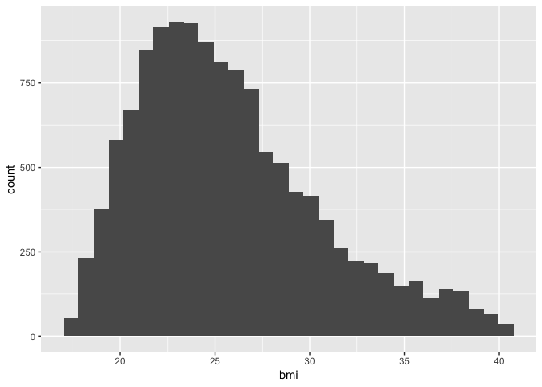

This Rmd file will be used as the file for my Thesis Analysis on causal mediation.


# Libraries

```r
library(tidyverse)
library(car)
library(foreign)
library(Hmisc)
```

# Selecting data


# Reading of Raw Survey Data

```r
ibiccs_readin <- read.csv("Database_recoded_2012-2014_weights_Walkscore_RTA.csv")
```

# Filtering Out USA Data

```r
Boston <- filter(ibiccs_readin, ville == "Boston")

Chicago <- filter(ibiccs_readin, ville == "Chicago")

Detroit <- filter(ibiccs_readin, ville == "Détroit")

NewYork <- filter(ibiccs_readin, ville == "New-York")

Philadelphia <- filter(ibiccs_readin, ville == "Philadelphie")

Montreal <- filter(ibiccs_readin, ville == "Montréal")

Toronto <- filter(ibiccs_readin, ville == "Toronto")

Vancouver <- filter(ibiccs_readin, ville == "Vancouver")
```

# Filtering Out Variables in USA Data

```r
ibiccs <- select(ibiccs_readin, RTA_zip, X, quest, lang, q54, ville, q1us, q1aut, q46b7, q46b9, q2, q13, q14, q15, q16, q17, q18, q19, q20, q21, q22b, q22c, q22d, q22e, q22f_m1, q23, q24, q25, q26, q27, q28, q40, q41, q42, q44, q45, q46b, q47, q48, q49, q50, q51, Q52_occupational_status_category, q53, bmi, bmi_category, WalkScore, WalkScoreLabel, TransitScore, TransitScoreLabel, BikeScore, BikeScoreLabel, DiningandDrinkingScore, GroceryScore)

Boston1 <- select(Boston, RTA_zip, X, quest, lang, q54, ville, q1us, q1aut, q46b7, q46b9, q2, q13, q14, q15, q16, q17, q18, q19, q20, q21, q22b, q22c, q22d, q22e, q22f_m1, q23, q24, q25, q26, q27, q28, q40, q41, q42, q44, q45, q46b, q47, q48, q49, q50, q51, Q52_occupational_status_category, q53, bmi, bmi_category, WalkScore, WalkScoreLabel, TransitScore, TransitScoreLabel, BikeScore, BikeScoreLabel, DiningandDrinkingScore, GroceryScore)

Chicago1 <- select(Chicago, RTA_zip, X, quest, lang, q54, ville, q1us, q1aut, q46b7, q46b9, q2, q13, q14, q15, q16, q17, q18, q19, q20, q21, q22b, q22c, q22d, q22e, q22f_m1, q23, q24, q25, q26, q27, q28, q40, q41, q42, q44, q45, q46b, q47, q48, q49, q50, q51, Q52_occupational_status_category, q53, bmi, bmi_category, WalkScore, WalkScoreLabel, TransitScore, TransitScoreLabel, BikeScore, BikeScoreLabel, DiningandDrinkingScore, GroceryScore)

Detroit1 <- select(Detroit, RTA_zip, X, quest, lang, q54, ville, q1us, q1aut, q46b7, q46b9, q2, q13, q14, q15, q16, q17, q18, q19, q20, q21, q22b, q22c, q22d, q22e, q22f_m1, q23, q24, q25, q26, q27, q28, q40, q41, q42, q44, q45, q46b, q47, q48, q49, q50, q51, Q52_occupational_status_category, q53, bmi, bmi_category, WalkScore, WalkScoreLabel, TransitScore, TransitScoreLabel, BikeScore, BikeScoreLabel, DiningandDrinkingScore, GroceryScore)

NewYork1 <- select(NewYork, RTA_zip, X, quest, lang, q54, ville, q1us, q1aut, q46b7, q46b9, q2, q13, q14, q15, q16, q17, q18, q19, q20, q21, q22b, q22c, q22d, q22e, q22f_m1, q23, q24, q25, q26, q27, q28, q40, q41, q42, q44, q45, q46b, q47, q48, q49, q50, q51, Q52_occupational_status_category, q53, bmi, bmi_category, WalkScore, WalkScoreLabel, TransitScore, TransitScoreLabel, BikeScore, BikeScoreLabel, DiningandDrinkingScore, GroceryScore)

Philadelphia1 <- select(Philadelphia, RTA_zip, X, quest, lang, q54, ville, q1us, q1aut, q46b7, q46b9, q2, q13, q14, q15, q16, q17, q18, q19, q20, q21, q22b, q22c, q22d, q22e, q22f_m1, q23, q24, q25, q26, q27, q28, q40, q41, q42, q44, q45, q46b, q47, q48, q49, q50, q51, Q52_occupational_status_category, q53, bmi, bmi_category, WalkScore, WalkScoreLabel, TransitScore, TransitScoreLabel, BikeScore, BikeScoreLabel, DiningandDrinkingScore, GroceryScore)

Montreal1 <- select(Montreal, RTA_zip, X, quest, lang, q54, ville, q1us, q1aut, q46b7, q46b9, q2, q13, q14, q15, q16, q17, q18, q19, q20, q21, q22b, q22c, q22d, q22e, q22f_m1, q23, q24, q25, q26, q27, q28, q40, q41, q42, q44, q45, q46b, q47, q48, q49, q50, q51, Q52_occupational_status_category, q53, bmi, bmi_category, WalkScore, WalkScoreLabel, TransitScore, TransitScoreLabel, BikeScore, BikeScoreLabel, DiningandDrinkingScore, GroceryScore)

Toronto1 <- select(Toronto, RTA_zip, X, quest, lang, q54, ville, q1us, q1aut, q46b7, q46b9, q2, q13, q14, q15, q16, q17, q18, q19, q20, q21, q22b, q22c, q22d, q22e, q22f_m1, q23, q24, q25, q26, q27, q28, q40, q41, q42, q44, q45, q46b, q47, q48, q49, q50, q51, Q52_occupational_status_category, q53, bmi, bmi_category, WalkScore, WalkScoreLabel, TransitScore, TransitScoreLabel, BikeScore, BikeScoreLabel, DiningandDrinkingScore, GroceryScore)

Vancouver1 <- select(Vancouver, RTA_zip, X, quest, lang, q54, ville, q1us, q1aut, q46b7, q46b9, q2, q13, q14, q15, q16, q17, q18, q19, q20, q21, q22b, q22c, q22d, q22e, q22f_m1, q23, q24, q25, q26, q27, q28, q40, q41, q42, q44, q45, q46b, q47, q48, q49, q50, q51, Q52_occupational_status_category, q53, bmi, bmi_category, WalkScore, WalkScoreLabel, TransitScore, TransitScoreLabel, BikeScore, BikeScoreLabel, DiningandDrinkingScore, GroceryScore)

city <- rbind(Philadelphia1, NewYork1, Detroit1, Chicago1, Boston1)
```


# Descriptive Stats for Each City

```r
Hmisc::describe(Boston1)
```

```
## Boston1 
## 
##  54  Variables      1977  Observations
## ---------------------------------------------------------------------------
## RTA_zip 
##        n  missing distinct 
##     1977        0      185 
## 
## lowest :   1420   1440   1453   1462   1463, highest:   3842   3865   3874  20116 N3C   
## ---------------------------------------------------------------------------
## X 
##        n  missing distinct     Info     Mean      Gmd      .05      .10 
##     1977        0     1977        1     1011    703.9     99.8    198.6 
##      .25      .50      .75      .90      .95 
##    495.0    989.0   1483.0   1779.4   1878.2 
##                                                                       
## Value          0   200   400   600   800  1000  1200  1400  1600  1800
## Frequency    100   199   201   199   201   199   201   199   201   199
## Proportion 0.051 0.101 0.102 0.101 0.102 0.101 0.102 0.101 0.102 0.101
##                             
## Value       2000  7200 21400
## Frequency     75     1     2
## Proportion 0.038 0.001 0.001
## ---------------------------------------------------------------------------
## quest 
##        n  missing distinct     Info     Mean      Gmd      .05      .10 
##     1977        0     1975        1    20811    16141    610.8    962.6 
##      .25      .50      .75      .90      .95 
##   7057.0  20211.0  30188.0  33256.4  34680.0 
## 
## lowest :    10    11    13    32    38, highest: 73667 73668 73670 73675 73677
## ---------------------------------------------------------------------------
## lang 
##        n  missing distinct 
##     1977        0        2 
##                             
## Value       Anglais Espagnol
## Frequency      1974        3
## Proportion    0.998    0.002
## ---------------------------------------------------------------------------
## q54 
##        n  missing distinct 
##     1977        0        2 
##                       
## Value      Femme Homme
## Frequency   1283   694
## Proportion 0.649 0.351
## ---------------------------------------------------------------------------
## ville 
##        n  missing distinct    value 
##     1977        0        1   Boston 
##                  
## Value      Boston
## Frequency    1977
## Proportion      1
## ---------------------------------------------------------------------------
## q1us 
##        n  missing distinct     Info     Mean      Gmd      .05      .10 
##     1970        7      183    0.999     2167    161.7     1910     2113 
##      .25      .50      .75      .90      .95 
##     2119     2134     2144     2445     2446 
##                                                                       
## Value       1400  1600  1800  2000  2200  2400  2600  3000  3200  3800
## Frequency      7    33    55    37  1600   210     2    15     6     4
## Proportion 0.004 0.017 0.028 0.019 0.812 0.107 0.001 0.008 0.003 0.002
##                 
## Value      20200
## Frequency      1
## Proportion 0.001
## ---------------------------------------------------------------------------
## q1aut 
##        n  missing distinct 
##     1977        0        9 
##                                                                          
## Value              01570  01581  01826  02138  02139  02446 N3C1G3 N3C3K9
## Frequency    1969      1      1      1      1      1      1      1      1
## Proportion  0.996  0.001  0.001  0.001  0.001  0.001  0.001  0.001  0.001
## ---------------------------------------------------------------------------
## q46b7 
##        n  missing distinct 
##     1969        8       17 
## 
## lowest : Allston-Brighton              Autre                         Back Bay/Beacon Hill/West End Cambridgeport                 Charlestown                  
## highest: Roxbury                       South Boston                  South Dorchester              South End/Chinatown           Wellington-Harrington        
## ---------------------------------------------------------------------------
## q46b9 
##        n  missing distinct 
##     1977        0       32 
## 
## lowest :    00 1A 1F 1M, highest: R1 R2 R3 S2 T7
## ---------------------------------------------------------------------------
## q2 
##        n  missing distinct 
##     1977        0        6 
## 
## Bon (521, 0.264), Excellent (467, 0.236), Mauvais (24, 0.012), Moyen (142,
## 0.072), Ne sais pas/Refuse de répondre (5, 0.003), Très bon (818, 0.414)
## ---------------------------------------------------------------------------
## q13 
##        n  missing distinct 
##     1977        0       10 
## 
## Autre (précisez:) (3, 0.002), Marche (500, 0.253), Ne s'applique pas (3,
## 0.002), Scooter (1, 0.001), Taxi (12, 0.006), Transport en commun (669,
## 0.338), Véhicule motorisé (loué, emprunté, covoiturage) (675, 0.341), Vélo
## en libre-service (15, 0.008), Vélo personnel (89, 0.045), Voiture
## personnelle (10, 0.005)
## ---------------------------------------------------------------------------
## q14 
##        n  missing distinct 
##     1977        0        4 
##                                                                       
## Value      Ne sais pas/Ne s'applique pas                           Non
## Frequency                             18                           255
## Proportion                         0.009                         0.129
##                                                                       
## Value                                Oui            Refuse de répondre
## Frequency                           1703                             1
## Proportion                         0.861                         0.001
## ---------------------------------------------------------------------------
## q15 
##        n  missing distinct     Info     Mean      Gmd      .05      .10 
##     1703      274       62    0.962    44.15    26.73        5        7 
##      .25      .50      .75      .90      .95 
##       20       57       64       66       68 
## 
## lowest :  1  2  3  4  5, highest: 70 71 96 98 99
## ---------------------------------------------------------------------------
## q18 
##        n  missing distinct     Info     Mean      Gmd      .05      .10 
##     1703      274       62    0.992    50.68    35.54      5.1      7.0 
##      .25      .50      .75      .90      .95 
##     19.0     61.0     68.0     97.0     97.0 
## 
## lowest :  1  2  3  4  5, highest: 71 96 97 98 99
## ---------------------------------------------------------------------------
## q21 
##        n  missing distinct     Info     Mean      Gmd      .05      .10 
##     1977        0       10    0.984    10.46    15.02        0        0 
##      .25      .50      .75      .90      .95 
##        2        4        7        7       98 
##                                                                       
## Value          0     1     2     3     4     5     6     7    98    99
## Frequency    231   261   222   163   133   277   186   362   130    12
## Proportion 0.117 0.132 0.112 0.082 0.067 0.140 0.094 0.183 0.066 0.006
## ---------------------------------------------------------------------------
## q22b 
##        n  missing distinct     Info     Mean      Gmd      .05      .10 
##      754     1223       14    0.862     2.09    1.577        1        1 
##      .25      .50      .75      .90      .95 
##        1        2        2        4        5 
##                                                                       
## Value          0     1     2     3     4     5     6     7     8    10
## Frequency      9   361   227    69    37    14    14     2     3     8
## Proportion 0.012 0.479 0.301 0.092 0.049 0.019 0.019 0.003 0.004 0.011
##                                   
## Value         12    14    15    16
## Frequency      5     2     2     1
## Proportion 0.007 0.003 0.003 0.001
## ---------------------------------------------------------------------------
## q22c 
##        n  missing distinct     Info     Mean      Gmd      .05      .10 
##      476     1501       27    0.964    30.61    19.42        7       10 
##      .25      .50      .75      .90      .95 
##       20       30       40       50       70 
## 
## lowest :   0   1   2   3   4, highest:  75  80  90 120 150
## ---------------------------------------------------------------------------
## q22d 
##        n  missing distinct     Info     Mean      Gmd      .05      .10 
##      250     1727       19    0.957    4.216    4.405     1.00     1.00 
##      .25      .50      .75      .90      .95 
##     1.00     2.00     4.75    10.00    14.55 
##                                                                       
## Value          0     1     2     3     4     5     6     7     8     9
## Frequency      1    73    62    33    18    13     9     5     3     2
## Proportion 0.004 0.292 0.248 0.132 0.072 0.052 0.036 0.020 0.012 0.008
##                                                                 
## Value         10    12    14    15    18    20    25    28    30
## Frequency     10     4     4     2     1     5     2     1     2
## Proportion 0.040 0.016 0.016 0.008 0.004 0.020 0.008 0.004 0.008
## ---------------------------------------------------------------------------
## q22e 
##        n  missing distinct     Info     Mean      Gmd      .05      .10 
##       90     1887       18    0.916    34.57    23.74     7.25    14.50 
##      .25      .50      .75      .90      .95 
##    20.00    30.00    38.75    60.00    90.00 
##                                                                       
## Value          0     1     5    10    15    20    25    30    35    40
## Frequency      3     1     1     4     8     8     1    39     2     5
## Proportion 0.033 0.011 0.011 0.044 0.089 0.089 0.011 0.433 0.022 0.056
##                                                           
## Value         45    60    70    90   100   120   150   160
## Frequency      8     3     1     2     1     1     1     1
## Proportion 0.089 0.033 0.011 0.022 0.011 0.011 0.011 0.011
## ---------------------------------------------------------------------------
## q22f_m1 
##        n  missing distinct 
##       53     1924        2 
##                                                   
## Value      Ne sais pas/Pas sûr  Refuse de répondre
## Frequency                   49                   4
## Proportion               0.925               0.075
## ---------------------------------------------------------------------------
## q23 
##        n  missing distinct     Info     Mean      Gmd      .05      .10 
##     1977        0       10    0.981    3.425    3.072        0        0 
##      .25      .50      .75      .90      .95 
##        1        3        5        7        8 
##                                                                       
## Value          0     1     2     3     4     5     6     7     8     9
## Frequency    344   354   210   130   120   336   134   165   167    17
## Proportion 0.174 0.179 0.106 0.066 0.061 0.170 0.068 0.083 0.084 0.009
## ---------------------------------------------------------------------------
## q25 
##        n  missing distinct     Info     Mean      Gmd      .05      .10 
##     1977        0       10    0.962    4.845     2.61        0        1 
##      .25      .50      .75      .90      .95 
##        3        5        7        7        8 
##                                                                       
## Value          0     1     2     3     4     5     6     7     8     9
## Frequency    103   127   185   158   163   365   141   609   112    14
## Proportion 0.052 0.064 0.094 0.080 0.082 0.185 0.071 0.308 0.057 0.007
## ---------------------------------------------------------------------------
## q27 
##        n  missing distinct     Info     Mean      Gmd      .05      .10 
##     1977        0       10    0.828    24.71    36.81        0        0 
##      .25      .50      .75      .90      .95 
##        0        0        7       98       98 
##                                                                       
## Value          0     1     2     3     4     5     6     7    98    99
## Frequency   1069   141    70    47    39    69    25    32   469    16
## Proportion 0.541 0.071 0.035 0.024 0.020 0.035 0.013 0.016 0.237 0.008
## ---------------------------------------------------------------------------
## q42 
##        n  missing distinct     Info     Mean      Gmd      .05      .10 
##     1977        0       67    0.999    37.21    15.17       21       23 
##      .25      .50      .75      .90      .95 
##       26       33       46       58       66 
## 
## lowest : 18 19 20 21 22, highest: 82 83 84 86 90
## ---------------------------------------------------------------------------
## q44 
##        n  missing distinct 
##     1977        0        7 
## 
## Célibatiare (1025, 0.518), Divorcé (e) (130, 0.066), En couple (8, 0.004),
## Marié(e)/Conjoint de fait (739, 0.374), Refuse de répondre (23, 0.012),
## Séparé (e) (28, 0.014), Veuf (ve) (24, 0.012)
## ---------------------------------------------------------------------------
## q45 
##        n  missing distinct     Info     Mean      Gmd 
##     1977        0        7    0.441    6.923     1.85 
##                                                     
## Value          1     2     3     4     5     8     9
## Frequency    209    88    23    10     1  1627    19
## Proportion 0.106 0.045 0.012 0.005 0.001 0.823 0.010
## ---------------------------------------------------------------------------
## q46b 
##        n  missing distinct     Info     Mean      Gmd      .05      .10 
##      892     1085       23    0.975    4.834    3.407        1        2 
##      .25      .50      .75      .90      .95 
##        3        4        6        9       11 
## 
## lowest :  0  1  2  3  4, highest: 28 30 32 39 42
## ---------------------------------------------------------------------------
## q47 
##        n  missing distinct 
##     1977        0       11 
## 
## lowest : Amérindien des États-Unis / Autochtone d'Amérique Arabe (Moyen-Orient, Afrique du Nord)             Asiatique / insulaire du Pacifique                Autre                                             Blanc(che) / Caucasien                           
## highest: Indien / Pakistanais                              Je préfère ne pas répondre                        Jewish                                            Mixed / Mixed race / Bi-racial                    Noir(e) / Africain(e) / Afro-Américain(e)        
## ---------------------------------------------------------------------------
## q48 
##        n  missing distinct     Info     Mean      Gmd      .05      .10 
##     1977        0       55    0.323    6.219    7.977        2        2 
##      .25      .50      .75      .90      .95 
##        2        2        2        3       35 
## 
## lowest :  1  2  3  4  5, highest: 73 74 80 96 99
## ---------------------------------------------------------------------------
## q49 
##        n  missing distinct 
##     1977        0        3 
##                                                                       
## Value      Ne sais pas/Ne s'applique pas                           Non
## Frequency                              5                           166
## Proportion                         0.003                         0.084
##                                         
## Value                                Oui
## Frequency                           1806
## Proportion                         0.914
## ---------------------------------------------------------------------------
## q50 
##        n  missing distinct 
##     1977        0        3 
##                                                                       
## Value      Ne sais pas/Ne s'applique pas                           Non
## Frequency                             16                           519
## Proportion                         0.008                         0.263
##                                         
## Value                                Oui
## Frequency                           1442
## Proportion                         0.729
## ---------------------------------------------------------------------------
## q51 
##        n  missing distinct 
##     1977        0        8 
## 
## lowest : Autre (précisez):                                   Baccalauréat                                        Cégep                                               Certificat d'école de métier, certificat ou diplôme Diplôme d'études secondaire ou l'équivalent        
## highest: Certificat d'école de métier, certificat ou diplôme Diplôme d'études secondaire ou l'équivalent         Diplôme universitaire supérieur au baccalauréat     École primaire                                      Refuse de répondre                                 
## ---------------------------------------------------------------------------
## Q52_occupational_status_category 
##        n  missing distinct 
##     1963       14        7 
## 
## Disability (17, 0.009), Full time or Self-employed (1307, 0.666),
## Homemaker or parental leave (55, 0.028), Part time (135, 0.069), Retired
## (112, 0.057), Student (272, 0.139), Unemployed seeking work (65, 0.033)
## ---------------------------------------------------------------------------
## q53 
##        n  missing distinct 
##     1977        0       10 
## 
## lowest : Entre 10000 $ and 19999 $ par année   Entre 100000 $ and 149999 $ par année Entre 150000 $ and 199999 $ par année Entre 20000 $ and 34999 $ par année   Entre 35000 $ and 49999 $ par année  
## highest: Entre 50000 $ and 74999 $ par année   Entre 75000 $ and 99999 $ par année   Moins de 10000 $ par année            Plus de 200000 $ par année            Refuse de répondre                   
## ---------------------------------------------------------------------------
## bmi 
##        n  missing distinct     Info     Mean      Gmd      .05      .10 
##     1785      192      617        1    25.06    5.006    19.37    20.12 
##      .25      .50      .75      .90      .95 
##    21.63    24.21    27.32    31.69    34.97 
## 
## lowest : 17.57 17.58 17.64 17.71 17.72, highest: 39.68 39.75 39.94 40.14 40.35
## ---------------------------------------------------------------------------
## bmi_category 
##        n  missing distinct 
##     1785      192        4 
##                                                           
## Value       embonpoint insuffisant      normal     obesite
## Frequency          511          44         982         248
## Proportion       0.286       0.025       0.550       0.139
## ---------------------------------------------------------------------------
## WalkScore 
##        n  missing distinct     Info     Mean      Gmd      .05      .10 
##     1939       38       76    0.993    86.19    14.02       53       71 
##      .25      .50      .75      .90      .95 
##       86       90       96       97       99 
## 
## lowest :  0  1  3  4  5, highest: 95 96 97 98 99
## ---------------------------------------------------------------------------
## WalkScoreLabel 
##        n  missing distinct 
##     1977        0        5 
##                                                                 
## Value                            Car-Dependent Somewhat Walkable
## Frequency                 38                96                85
## Proportion             0.019             0.049             0.043
##                                               
## Value          Very Walkable Walker's Paradise
## Frequency                598              1160
## Proportion             0.302             0.587
## ---------------------------------------------------------------------------
## TransitScore 
##        n  missing distinct 
##     1977        0        7 
##                                                                       
## Value                          100          40          50          71
## Frequency           38          16           2          64         106
## Proportion       0.019       0.008       0.001       0.032       0.054
##                                   
## Value               79 Unavailable
## Frequency           95        1656
## Proportion       0.048       0.838
## ---------------------------------------------------------------------------
## TransitScoreLabel 
##        n  missing distinct 
##     1977        0        5 
##                                                                 
## Value                        Excellent Transit      Good Transit
## Frequency               1694               201                64
## Proportion             0.857             0.102             0.032
##                                               
## Value       Rider's Paradise      Some Transit
## Frequency                 16                 2
## Proportion             0.008             0.001
## ---------------------------------------------------------------------------
## BikeScore 
##        n  missing distinct 
##     1977        0       31 
## 
## lowest :                        46                     54                     55                     58                    
## highest: 94                     97.741638389225798     98.650123169158107     99.406202578305795     Unavailable           
## ---------------------------------------------------------------------------
## BikeScoreLabel 
##        n  missing distinct 
##     1977        0        5 
##                                                                 
## Value                                 Bikeable  Biker's Paradise
## Frequency                598               475               323
## Proportion             0.302             0.240             0.163
##                                               
## Value      Somewhat Bikeable     Very Bikeable
## Frequency                 26               555
## Proportion             0.013             0.281
## ---------------------------------------------------------------------------
## DiningandDrinkingScore 
##        n  missing distinct     Info     Mean      Gmd      .05      .10 
##     1939       38      157    0.998    86.12    15.23    52.92    67.97 
##      .25      .50      .75      .90      .95 
##    83.20    89.31    96.09    99.31    99.44 
## 
## lowest :  0.0000  0.9592  0.9744  1.8424  2.2944
## highest: 99.4366 99.7016 99.8349 99.9047 99.9226
## ---------------------------------------------------------------------------
## GroceryScore 
##        n  missing distinct     Info     Mean      Gmd      .05      .10 
##     1939       38      139    0.996    88.94    16.42    46.68    66.03 
##      .25      .50      .75      .90      .95 
##    88.13    97.15    99.37   100.00   100.00 
## 
## lowest :   0.000   1.710   1.956   2.363   2.793
## highest:  99.456  99.625  99.752  99.924 100.000
## ---------------------------------------------------------------------------
## 
## Variables with all observations missing:
## 
## [1] q16 q17 q19 q20 q24 q26 q28 q40 q41
```

```r
Hmisc::describe(Chicago1)
```

```
## Chicago1 
## 
##  54  Variables      4085  Observations
## ---------------------------------------------------------------------------
## RTA_zip 
##        n  missing distinct 
##     4085        0      210 
## 
## lowest :   3276   7470   8075  46310  46327, highest:  60806  60827  61614  62895 N7L   
## ---------------------------------------------------------------------------
## X 
##        n  missing distinct     Info     Mean      Gmd      .05      .10 
##     4085        0     4085        1    12382     1386    10552    10756 
##      .25      .50      .75      .90      .95 
##    11369    12390    13412    14025    14229 
## 
## lowest :  1971  1994  2001  7279  7280, highest: 14430 14431 14432 14433 21384
## ---------------------------------------------------------------------------
## quest 
##        n  missing distinct     Info     Mean      Gmd      .05      .10 
##     4085        0     4073        1    19771    14090    706.2   5265.4 
##      .25      .50      .75      .90      .95 
##   7368.0  19994.0  30120.0  32824.2  33815.0 
## 
## lowest :    95   104   105   106   107, highest: 69561 69571 69578 69587 71678
## ---------------------------------------------------------------------------
## lang 
##        n  missing distinct 
##     4085        0        2 
##                             
## Value       Anglais Espagnol
## Frequency      4065       20
## Proportion    0.995    0.005
## ---------------------------------------------------------------------------
## q54 
##        n  missing distinct 
##     4085        0        2 
##                       
## Value      Femme Homme
## Frequency   2457  1628
## Proportion 0.601 0.399
## ---------------------------------------------------------------------------
## ville 
##        n  missing distinct    value 
##     4085        0        1  Chicago 
##                   
## Value      Chicago
## Frequency     4085
## Proportion       1
## ---------------------------------------------------------------------------
## q1us 
##        n  missing distinct     Info     Mean      Gmd      .05      .10 
##     4066       19      199    0.999    60589    103.5    60304    60546 
##      .25      .50      .75      .90      .95 
##    60611    60622    60645    60657    60660 
##                                                     
## Value      46400 60000 60200 60400 60600 60800 61600
## Frequency      3    63    80   201  3614   104     1
## Proportion 0.001 0.015 0.020 0.049 0.889 0.026 0.000
## ---------------------------------------------------------------------------
## q1aut 
##        n  missing distinct 
##     4085        0       26 
## 
## lowest :        03276  07470  08075  46310 , highest: 60564  60706  60805  62895  N7L 4T
## ---------------------------------------------------------------------------
## q46b9 
##        n  missing distinct 
##     4085        0       55 
## 
## lowest :    00 10 1E 1M, highest: N7 N9 Q1 S3 SS
## ---------------------------------------------------------------------------
## q2 
##        n  missing distinct 
##     4085        0        6 
## 
## Bon (1105, 0.271), Excellent (832, 0.204), Mauvais (67, 0.016), Moyen
## (345, 0.084), Ne sais pas/Refuse de répondre (9, 0.002), Très bon (1727,
## 0.423)
## ---------------------------------------------------------------------------
## q13 
##        n  missing distinct 
##     4085        0       11 
## 
## Autre (précisez:) (8, 0.002), Marche (576, 0.141), Ne s'applique pas (9,
## 0.002), Ne sais pas (6, 0.001), Scooter (1, 0.000), Taxi (39, 0.010),
## Transport en commun (1473, 0.361), Véhicule motorisé (loué, emprunté,
## covoiturage) (1780, 0.436), Vélo en libre-service (34, 0.008), Vélo
## personnel (136, 0.033), Voiture personnelle (23, 0.006)
## ---------------------------------------------------------------------------
## q14 
##        n  missing distinct 
##     4085        0        4 
##                                                                       
## Value      Ne sais pas/Ne s'applique pas                           Non
## Frequency                             35                           626
## Proportion                         0.009                         0.153
##                                                                       
## Value                                Oui            Refuse de répondre
## Frequency                           3418                             6
## Proportion                         0.837                         0.001
## ---------------------------------------------------------------------------
## q15 
##        n  missing distinct     Info     Mean      Gmd      .05      .10 
##     3418      667       63    0.962    44.11    27.03        5        7 
##      .25      .50      .75      .90      .95 
##       18       58       64       66       68 
## 
## lowest :  1  2  3  4  5, highest: 70 71 96 98 99
## ---------------------------------------------------------------------------
## q18 
##        n  missing distinct     Info     Mean      Gmd      .05      .10 
##     3418      667       67    0.991    49.95    36.41        5        7 
##      .25      .50      .75      .90      .95 
##       18       61       66       97       97 
## 
## lowest :  1  2  3  4  5, highest: 71 96 97 98 99
## ---------------------------------------------------------------------------
## q21 
##        n  missing distinct     Info     Mean      Gmd      .05      .10 
##     4085        0       10     0.98    9.994    13.43        0        1 
##      .25      .50      .75      .90      .95 
##        2        5        7        7       98 
##                                                                       
## Value          0     1     2     3     4     5     6     7    98    99
## Frequency    311   400   479   416   299   614   412   897   242    15
## Proportion 0.076 0.098 0.117 0.102 0.073 0.150 0.101 0.220 0.059 0.004
## ---------------------------------------------------------------------------
## q22b 
##        n  missing distinct     Info     Mean      Gmd      .05      .10 
##     1760     2325       16    0.888    2.049    1.391        1        1 
##      .25      .50      .75      .90      .95 
##        1        2        2        3        5 
##                                                                       
## Value          0     1     2     3     4     5     6     7     8     9
## Frequency     33   724   600   234    73    45    15     6    10     2
## Proportion 0.019 0.411 0.341 0.133 0.041 0.026 0.009 0.003 0.006 0.001
##                                               
## Value         10    11    12    14    15    16
## Frequency      4     1     4     2     5     2
## Proportion 0.002 0.001 0.002 0.001 0.003 0.001
## ---------------------------------------------------------------------------
## q22c 
##        n  missing distinct     Info     Mean      Gmd      .05      .10 
##      938     3147       35    0.953    30.66    20.26        3       10 
##      .25      .50      .75      .90      .95 
##       20       30       35       45       75 
## 
## lowest :   0   1   2   3   4, highest: 100 110 140 150 300
## ---------------------------------------------------------------------------
## q22d 
##        n  missing distinct     Info     Mean      Gmd      .05      .10 
##      555     3530       27    0.977    5.043    5.153      1.0      1.0 
##      .25      .50      .75      .90      .95 
##      2.0      3.0      6.0     10.0     14.3 
## 
## lowest :   0   1   2   3   4, highest:  30  35  40  80 100
## ---------------------------------------------------------------------------
## q22e 
##        n  missing distinct     Info     Mean      Gmd      .05      .10 
##      207     3878       30     0.97    55.33    65.53      0.0      4.2 
##      .25      .50      .75      .90      .95 
##     20.0     30.0     45.0     90.0    120.0 
## 
## lowest :    0    1    3    5    8, highest:  210  240  350  420 2800
## ---------------------------------------------------------------------------
## q22f_m1 
##        n  missing distinct 
##      137     3948        2 
##                                                   
## Value      Ne sais pas/Pas sûr  Refuse de répondre
## Frequency                  128                   9
## Proportion               0.934               0.066
## ---------------------------------------------------------------------------
## q23 
##        n  missing distinct     Info     Mean      Gmd      .05      .10 
##     4085        0       10    0.976    3.338    3.135        0        0 
##      .25      .50      .75      .90      .95 
##        1        3        5        8        8 
##                                                                       
## Value          0     1     2     3     4     5     6     7     8     9
## Frequency    936   564   380   286   224   751   276   235   397    36
## Proportion 0.229 0.138 0.093 0.070 0.055 0.184 0.068 0.058 0.097 0.009
## ---------------------------------------------------------------------------
## q25 
##        n  missing distinct     Info     Mean      Gmd      .05      .10 
##     4085        0       10     0.98    4.435    2.807        0        1 
##      .25      .50      .75      .90      .95 
##        2        5        7        7        8 
##                                                                       
## Value          0     1     2     3     4     5     6     7     8     9
## Frequency    295   360   430   434   325   731   302   864   315    29
## Proportion 0.072 0.088 0.105 0.106 0.080 0.179 0.074 0.212 0.077 0.007
## ---------------------------------------------------------------------------
## q27 
##        n  missing distinct     Info     Mean      Gmd      .05      .10 
##     4085        0       10    0.852    25.56    37.62        0        0 
##      .25      .50      .75      .90      .95 
##        0        0       98       98       98 
##                                                                       
## Value          0     1     2     3     4     5     6     7    98    99
## Frequency   2080   341   229   145    69    96    39    47  1016    23
## Proportion 0.509 0.083 0.056 0.035 0.017 0.024 0.010 0.012 0.249 0.006
## ---------------------------------------------------------------------------
## q42 
##        n  missing distinct     Info     Mean      Gmd      .05      .10 
##     4085        0       64    0.999    39.59    14.34       23       25 
##      .25      .50      .75      .90      .95 
##       29       37       49       57       64 
## 
## lowest : 18 19 20 21 22, highest: 77 78 80 81 83
## ---------------------------------------------------------------------------
## q44 
##        n  missing distinct 
##     4085        0        7 
## 
## Célibatiare (1844, 0.451), Divorcé (e) (307, 0.075), En couple (28,
## 0.007), Marié(e)/Conjoint de fait (1778, 0.435), Refuse de répondre (33,
## 0.008), Séparé (e) (46, 0.011), Veuf (ve) (49, 0.012)
## ---------------------------------------------------------------------------
## q45 
##        n  missing distinct     Info     Mean      Gmd 
##     4085        0        9     0.54    6.629    2.215 
##                                                                 
## Value          1     2     3     4     5     6     7     8     9
## Frequency    446   314   103    20     8     5     2  3150    37
## Proportion 0.109 0.077 0.025 0.005 0.002 0.001 0.000 0.771 0.009
## ---------------------------------------------------------------------------
## q46b 
##        n  missing distinct     Info     Mean      Gmd      .05      .10 
##     1707     2378       25    0.987    5.112    3.542        1        1 
##      .25      .50      .75      .90      .95 
##        3        5        7        9       11 
## 
## lowest :  0  1  2  3  4, highest: 23 26 30 32 38
## ---------------------------------------------------------------------------
## q47 
##        n  missing distinct 
##     4085        0       10 
## 
## lowest : Amérindien des États-Unis / Autochtone d'Amérique Arabe (Moyen-Orient, Afrique du Nord)             Asiatique / insulaire du Pacifique                Autre                                             Blanc(che) / Caucasien                           
## highest: Hispanique / Latino / Espagnol(e)                 Indien / Pakistanais                              Je préfère ne pas répondre                        Mixed / Mixed race / Bi-racial                    Noir(e) / Africain(e) / Afro-Américain(e)        
## ---------------------------------------------------------------------------
## q48 
##        n  missing distinct     Info     Mean      Gmd      .05      .10 
##     4085        0       62     0.25    5.547    6.773        2        2 
##      .25      .50      .75      .90      .95 
##        2        2        2        2       29 
## 
## lowest :  1  2  3  4  5, highest: 78 79 81 96 99
## ---------------------------------------------------------------------------
## q49 
##        n  missing distinct 
##     4085        0        3 
##                                                                       
## Value      Ne sais pas/Ne s'applique pas                           Non
## Frequency                             21                           356
## Proportion                         0.005                         0.087
##                                         
## Value                                Oui
## Frequency                           3708
## Proportion                         0.908
## ---------------------------------------------------------------------------
## q50 
##        n  missing distinct 
##     4085        0        3 
##                                                                       
## Value      Ne sais pas/Ne s'applique pas                           Non
## Frequency                             30                           789
## Proportion                         0.007                         0.193
##                                         
## Value                                Oui
## Frequency                           3266
## Proportion                         0.800
## ---------------------------------------------------------------------------
## q51 
##        n  missing distinct 
##     4085        0        9 
## 
## lowest : Aucun grade, certificat ou diplôme                  Autre (précisez):                                   Baccalauréat                                        Cégep                                               Certificat d'école de métier, certificat ou diplôme
## highest: Certificat d'école de métier, certificat ou diplôme Diplôme d'études secondaire ou l'équivalent         Diplôme universitaire supérieur au baccalauréat     École primaire                                      Refuse de répondre                                 
## ---------------------------------------------------------------------------
## Q52_occupational_status_category 
##        n  missing distinct 
##     4053       32        7 
## 
## Disability (62, 0.015), Full time or Self-employed (2832, 0.699),
## Homemaker or parental leave (147, 0.036), Part time (328, 0.081), Retired
## (229, 0.057), Student (271, 0.067), Unemployed seeking work (184, 0.045)
## ---------------------------------------------------------------------------
## q53 
##        n  missing distinct 
##     4085        0       10 
## 
## lowest : Entre 10000 $ and 19999 $ par année   Entre 100000 $ and 149999 $ par année Entre 150000 $ and 199999 $ par année Entre 20000 $ and 34999 $ par année   Entre 35000 $ and 49999 $ par année  
## highest: Entre 50000 $ and 74999 $ par année   Entre 75000 $ and 99999 $ par année   Moins de 10000 $ par année            Plus de 200000 $ par année            Refuse de répondre                   
## ---------------------------------------------------------------------------
## bmi 
##        n  missing distinct     Info     Mean      Gmd      .05      .10 
##     3647      438      864        1    25.89    5.399    19.31    20.37 
##      .25      .50      .75      .90      .95 
##    22.31    25.02    28.70    33.21    35.74 
## 
## lowest : 17.51 17.57 17.58 17.63 17.71, highest: 40.34 40.35 40.37 40.41 40.45
## ---------------------------------------------------------------------------
## bmi_category 
##        n  missing distinct 
##     3647      438        4 
##                                                           
## Value       embonpoint insuffisant      normal     obesite
## Frequency         1139          65        1745         698
## Proportion       0.312       0.018       0.478       0.191
## ---------------------------------------------------------------------------
## WalkScore 
##        n  missing distinct     Info     Mean      Gmd      .05      .10 
##     4034       51       81    0.996    80.36    17.82       46       55 
##      .25      .50      .75      .90      .95 
##       73       86       93       95       99 
## 
## lowest :  1  2  3  5  6, highest: 93 94 95 98 99
## ---------------------------------------------------------------------------
## WalkScoreLabel 
##        n  missing distinct 
##     4085        0        5 
##                                                                 
## Value                            Car-Dependent Somewhat Walkable
## Frequency                 51               274               510
## Proportion             0.012             0.067             0.125
##                                               
## Value          Very Walkable Walker's Paradise
## Frequency               1680              1570
## Proportion             0.411             0.384
## ---------------------------------------------------------------------------
## TransitScore 
##        n  missing distinct 
##     4085        0        6 
##                                                                       
## Value                          100          63          66          85
## Frequency           51          13          26          56         277
## Proportion       0.012       0.003       0.006       0.014       0.068
##                       
## Value      Unavailable
## Frequency         3662
## Proportion       0.896
## ---------------------------------------------------------------------------
## TransitScoreLabel 
##        n  missing distinct 
##     4085        0        4 
##                                                                 
## Value                        Excellent Transit      Good Transit
## Frequency               3713               277                82
## Proportion             0.909             0.068             0.020
##                             
## Value       Rider's Paradise
## Frequency                 13
## Proportion             0.003
## ---------------------------------------------------------------------------
## BikeScore 
##        n  missing distinct 
##     4085        0       36 
## 
## lowest :                        43                     45                     46                     47                    
## highest: 84                     86                     87                     88                     Unavailable           
## ---------------------------------------------------------------------------
## BikeScoreLabel 
##        n  missing distinct 
##     4085        0        4 
##                                                                 
## Value                                 Bikeable Somewhat Bikeable
## Frequency                558              1113               264
## Proportion             0.137             0.272             0.065
##                             
## Value          Very Bikeable
## Frequency               2150
## Proportion             0.526
## ---------------------------------------------------------------------------
## DiningandDrinkingScore 
##        n  missing distinct     Info     Mean      Gmd      .05      .10 
##     4034       51      195    0.999    82.41    18.98    45.69    59.13 
##      .25      .50      .75      .90      .95 
##    74.51    88.31    96.35    99.72    99.72 
## 
## lowest :  0.000  1.097  1.469  1.903  2.797, highest: 99.679 99.725 99.734 99.767 99.858
## ---------------------------------------------------------------------------
## GroceryScore 
##        n  missing distinct     Info     Mean      Gmd      .05      .10 
##     4034       51      176    0.999    78.71    28.04    12.43    28.76 
##      .25      .50      .75      .90      .95 
##    69.06    94.81    98.25    99.89   100.00 
## 
## lowest :   0.0000   0.3909   1.1221   1.4329   3.0518
## highest:  99.5302  99.6693  99.8932  99.9785 100.0000
## ---------------------------------------------------------------------------
## 
## Variables with all observations missing:
## 
##  [1] q46b7 q16   q17   q19   q20   q24   q26   q28   q40   q41
```

```r
Hmisc::describe(Detroit1)
```

```
## Detroit1 
## 
##  54  Variables      3077  Observations
## ---------------------------------------------------------------------------
## RTA_zip 
##        n  missing distinct 
##     3077        0      251 
## 
## lowest :   7003  23890  24277  25436  28211, highest:  49267  49270  49286  60806  89123
## ---------------------------------------------------------------------------
## X 
##        n  missing distinct     Info     Mean      Gmd      .05      .10 
##     3077        0     3077        1     8817     1035     7432     7586 
##      .25      .50      .75      .90      .95 
##     8047     8817     9586    10047    10201 
## 
## lowest :  1979  7272  7273  7274  7275, highest: 10354 10355 10356 14428 14435
## ---------------------------------------------------------------------------
## quest 
##        n  missing distinct     Info     Mean      Gmd      .05      .10 
##     3077        0     3073        1    17409    13115     4407     4805 
##      .25      .50      .75      .90      .95 
##     5709    17017    28400    32282    32929 
## 
## lowest :     1     2     4     5     6, highest: 71623 71668 71682 73618 73632
## ---------------------------------------------------------------------------
## lang 
##        n  missing distinct 
##     3077        0        2 
##                             
## Value       Anglais Espagnol
## Frequency      3074        3
## Proportion    0.999    0.001
## ---------------------------------------------------------------------------
## q54 
##        n  missing distinct 
##     3077        0        2 
##                       
## Value      Femme Homme
## Frequency   1943  1134
## Proportion 0.631 0.369
## ---------------------------------------------------------------------------
## ville 
##        n  missing distinct    value 
##     3077        0        1  Détroit 
##                   
## Value      Détroit
## Frequency     3077
## Proportion       1
## ---------------------------------------------------------------------------
## q1us 
##        n  missing distinct     Info     Mean      Gmd      .05      .10 
##     2731      346      241        1    48188    229.5    48035    48047 
##      .25      .50      .75      .90      .95 
##    48101    48186    48240    48336    48380 
##                                                                       
## Value      24000 24500 25500 43500 48000 48500 49000 49500 61000 89000
## Frequency      1     1     1     1  2047   642    31     5     1     1
## Proportion 0.000 0.000 0.000 0.000 0.750 0.235 0.011 0.002 0.000 0.000
## ---------------------------------------------------------------------------
## q1aut 
##        n  missing distinct 
##     3077        0      136 
## 
## lowest :        07003  28211  47065  48009 , highest: 48462  48836  48843  49228  49229 
## ---------------------------------------------------------------------------
## q46b9 
##        n  missing distinct 
##     3077        0      115 
## 
## lowest :    00 05 15 1M, highest: O6 O7 O8 S5 T4
## ---------------------------------------------------------------------------
## q2 
##        n  missing distinct 
##     3077        0        6 
## 
## Bon (928, 0.302), Excellent (566, 0.184), Mauvais (64, 0.021), Moyen (326,
## 0.106), Ne sais pas/Refuse de répondre (1, 0.000), Très bon (1192, 0.387)
## ---------------------------------------------------------------------------
## q13 
##        n  missing distinct 
##     3077        0       11 
## 
## Autre (précisez:) (1, 0.000), Marche (139, 0.045), Ne s'applique pas (18,
## 0.006), Ne sais pas (11, 0.004), Scooter (1, 0.000), Taxi (9, 0.003),
## Transport en commun (105, 0.034), Véhicule motorisé (loué, emprunté,
## covoiturage) (2681, 0.871), Vélo en libre-service (17, 0.006), Vélo
## personnel (58, 0.019), Voiture personnelle (37, 0.012)
## ---------------------------------------------------------------------------
## q14 
##        n  missing distinct 
##     3077        0        4 
##                                                                       
## Value      Ne sais pas/Ne s'applique pas                           Non
## Frequency                             38                           680
## Proportion                         0.012                         0.221
##                                                                       
## Value                                Oui            Refuse de répondre
## Frequency                           2355                             4
## Proportion                         0.765                         0.001
## ---------------------------------------------------------------------------
## q15 
##        n  missing distinct     Info     Mean      Gmd      .05      .10 
##     2355      722       64    0.961    43.08    27.42        5        7 
##      .25      .50      .75      .90      .95 
##       18       54       64       66       68 
## 
## lowest :  1  2  3  5  6, highest: 70 71 96 98 99
## ---------------------------------------------------------------------------
## q18 
##        n  missing distinct     Info     Mean      Gmd      .05      .10 
##     2355      722       66    0.991    50.63     37.4        2        7 
##      .25      .50      .75      .90      .95 
##       18       58       68       97       97 
## 
## lowest :  1  2  3  4  5, highest: 71 96 97 98 99
## ---------------------------------------------------------------------------
## q21 
##        n  missing distinct     Info     Mean      Gmd      .05      .10 
##     3077        0       10    0.872    11.43    12.16        2        3 
##      .25      .50      .75      .90      .95 
##        5        7        7        7       98 
##                                                                       
## Value          0     1     2     3     4     5     6     7    98    99
## Frequency     41    67   106   159   161   433   392  1529   170    19
## Proportion 0.013 0.022 0.034 0.052 0.052 0.141 0.127 0.497 0.055 0.006
## ---------------------------------------------------------------------------
## q22b 
##        n  missing distinct     Info     Mean      Gmd      .05      .10 
##     1680     1397       15    0.871    1.993    1.356        1        1 
##      .25      .50      .75      .90      .95 
##        1        2        2        3        5 
##                                                                       
## Value          0     1     2     3     4     5     6     7     8     9
## Frequency     26   744   579   178    57    44    11     7    12     3
## Proportion 0.015 0.443 0.345 0.106 0.034 0.026 0.007 0.004 0.007 0.002
##                                         
## Value         10    11    12    15    16
## Frequency      8     2     4     4     1
## Proportion 0.005 0.001 0.002 0.002 0.001
## ---------------------------------------------------------------------------
## q22c 
##        n  missing distinct     Info     Mean      Gmd      .05      .10 
##      781     2296       35    0.955    32.92    21.24        4       15 
##      .25      .50      .75      .90      .95 
##       20       30       40       60       90 
## 
## lowest :   0   1   2   3   4, highest:  85  90 100 210 320
## ---------------------------------------------------------------------------
## q22d 
##        n  missing distinct     Info     Mean      Gmd      .05      .10 
##      291     2786       28    0.995    8.921    8.886        1        1 
##      .25      .50      .75      .90      .95 
##        3        7       10       18       23 
## 
## lowest :   0   1   2   3   4, highest:  30  35  40  45 112
## ---------------------------------------------------------------------------
## q22e 
##        n  missing distinct     Info     Mean      Gmd      .05      .10 
##       57     3020       21    0.972    106.2    166.2        0        0 
##      .25      .50      .75      .90      .95 
##        0       30       59      270      552 
##                                                                       
## Value          0     6    12    16    20    30    40    44    50    60
## Frequency     15     1     1     2     4    12     2     4     1     3
## Proportion 0.263 0.018 0.018 0.035 0.070 0.211 0.035 0.070 0.018 0.053
##                                                                       
## Value         76    88   180   224   250   300   540   600  1080  1260
## Frequency      1     1     2     1     1     2     1     1     1     1
## Proportion 0.018 0.018 0.035 0.018 0.018 0.035 0.018 0.018 0.018 0.018
## ---------------------------------------------------------------------------
## q22f_m1 
##        n  missing distinct 
##      118     2959        2 
##                                                   
## Value      Ne sais pas/Pas sûr  Refuse de répondre
## Frequency                  113                   5
## Proportion               0.958               0.042
## ---------------------------------------------------------------------------
## q23 
##        n  missing distinct     Info     Mean      Gmd      .05      .10 
##     3077        0       10     0.72    2.233    3.201        0        0 
##      .25      .50      .75      .90      .95 
##        0        0        5        8        8 
##                                                                       
## Value          0     1     2     3     4     5     6     7     8     9
## Frequency   1988   102    77    45    33    77    26    48   658    23
## Proportion 0.646 0.033 0.025 0.015 0.011 0.025 0.008 0.016 0.214 0.007
## ---------------------------------------------------------------------------
## q25 
##        n  missing distinct     Info     Mean      Gmd      .05      .10 
##     3077        0       10    0.967    3.244    3.379        0        0 
##      .25      .50      .75      .90      .95 
##        0        2        6        8        8 
##                                                                       
## Value          0     1     2     3     4     5     6     7     8     9
## Frequency    903   328   334   238   165   294    81   238   474    22
## Proportion 0.293 0.107 0.109 0.077 0.054 0.096 0.026 0.077 0.154 0.007
## ---------------------------------------------------------------------------
## q27 
##        n  missing distinct     Info     Mean      Gmd      .05      .10 
##     3077        0       10    0.811    26.41     38.5        0        0 
##      .25      .50      .75      .90      .95 
##        0        0       98       98       98 
##                                                                       
## Value          0     1     2     3     4     5     6     7    98    99
## Frequency   1711   191   135    77    47    54    22    26   790    24
## Proportion 0.556 0.062 0.044 0.025 0.015 0.018 0.007 0.008 0.257 0.008
## ---------------------------------------------------------------------------
## q42 
##        n  missing distinct     Info     Mean      Gmd      .05      .10 
##     3077        0       64    0.999    41.11     14.5     22.0     24.0 
##      .25      .50      .75      .90      .95 
##     31.0     41.0     51.0     56.4     64.0 
## 
## lowest : 18 19 20 21 22, highest: 79 80 81 84 89
## ---------------------------------------------------------------------------
## q44 
##        n  missing distinct 
##     3077        0        7 
## 
## Célibatiare (988, 0.321), Divorcé (e) (268, 0.087), En couple (11, 0.004),
## Marié(e)/Conjoint de fait (1699, 0.552), Refuse de répondre (24, 0.008),
## Séparé (e) (46, 0.015), Veuf (ve) (41, 0.013)
## ---------------------------------------------------------------------------
## q45 
##        n  missing distinct     Info     Mean      Gmd 
##     3077        0        9    0.737    5.801    2.994 
##                                                                 
## Value          1     2     3     4     5     6     7     8     9
## Frequency    523   386   130    35     9     3     2  1954    35
## Proportion 0.170 0.125 0.042 0.011 0.003 0.001 0.001 0.635 0.011
## ---------------------------------------------------------------------------
## q46b 
##        n  missing distinct     Info     Mean      Gmd      .05      .10 
##     1183     1894       17    0.989     4.91    3.534        1        1 
##      .25      .50      .75      .90      .95 
##        2        4        7       10       11 
##                                                                       
## Value          0     1     2     3     4     5     6     7     8     9
## Frequency     50   106   148   164   131   111   161    59    76    56
## Proportion 0.042 0.090 0.125 0.139 0.111 0.094 0.136 0.050 0.064 0.047
##                                                     
## Value         10    11    12    14    15    16    18
## Frequency     48    60     1     2     4     2     4
## Proportion 0.041 0.051 0.001 0.002 0.003 0.002 0.003
## ---------------------------------------------------------------------------
## q47 
##        n  missing distinct 
##     3077        0       10 
## 
## lowest : Amérindien des États-Unis / Autochtone d'Amérique Arabe (Moyen-Orient, Afrique du Nord)             Asiatique / insulaire du Pacifique                Autre                                             Blanc(che) / Caucasien                           
## highest: Hispanique / Latino / Espagnol(e)                 Indien / Pakistanais                              Je préfère ne pas répondre                        Mixed / Mixed race / Bi-racial                    Noir(e) / Africain(e) / Afro-Américain(e)        
## ---------------------------------------------------------------------------
## q48 
##        n  missing distinct     Info     Mean      Gmd      .05      .10 
##     3077        0       45    0.191    4.506    4.892        2        2 
##      .25      .50      .75      .90      .95 
##        2        2        2        2       17 
## 
## lowest :  1  2  3  5  8, highest: 76 79 81 96 99
## ---------------------------------------------------------------------------
## q49 
##        n  missing distinct 
##     3077        0        3 
##                                                                       
## Value      Ne sais pas/Ne s'applique pas                           Non
## Frequency                             23                           149
## Proportion                         0.007                         0.048
##                                         
## Value                                Oui
## Frequency                           2905
## Proportion                         0.944
## ---------------------------------------------------------------------------
## q50 
##        n  missing distinct 
##     3077        0        3 
##                                                                       
## Value      Ne sais pas/Ne s'applique pas                           Non
## Frequency                             18                           123
## Proportion                         0.006                         0.040
##                                         
## Value                                Oui
## Frequency                           2936
## Proportion                         0.954
## ---------------------------------------------------------------------------
## q51 
##        n  missing distinct 
##     3077        0        9 
## 
## lowest : Aucun grade, certificat ou diplôme                  Autre (précisez):                                   Baccalauréat                                        Cégep                                               Certificat d'école de métier, certificat ou diplôme
## highest: Certificat d'école de métier, certificat ou diplôme Diplôme d'études secondaire ou l'équivalent         Diplôme universitaire supérieur au baccalauréat     École primaire                                      Refuse de répondre                                 
## ---------------------------------------------------------------------------
## Q52_occupational_status_category 
##        n  missing distinct 
##     3058       19        7 
## 
## Disability (64, 0.021), Full time or Self-employed (1842, 0.602),
## Homemaker or parental leave (249, 0.081), Part time (310, 0.101), Retired
## (217, 0.071), Student (243, 0.079), Unemployed seeking work (133, 0.043)
## ---------------------------------------------------------------------------
## q53 
##        n  missing distinct 
##     3077        0       10 
## 
## lowest : Entre 10000 $ and 19999 $ par année   Entre 100000 $ and 149999 $ par année Entre 150000 $ and 199999 $ par année Entre 20000 $ and 34999 $ par année   Entre 35000 $ and 49999 $ par année  
## highest: Entre 50000 $ and 74999 $ par année   Entre 75000 $ and 99999 $ par année   Moins de 10000 $ par année            Plus de 200000 $ par année            Refuse de répondre                   
## ---------------------------------------------------------------------------
## bmi 
##        n  missing distinct     Info     Mean      Gmd      .05      .10 
##     2638      439      761        1    26.75    5.755    19.58    20.80 
##      .25      .50      .75      .90      .95 
##    22.86    25.84    30.00    34.38    36.84 
## 
## lowest : 17.56 17.70 17.75 17.81 17.89, highest: 40.18 40.24 40.29 40.35 40.42
## ---------------------------------------------------------------------------
## bmi_category 
##        n  missing distinct 
##     2638      439        4 
##                                                           
## Value       embonpoint insuffisant      normal     obesite
## Frequency          864          40        1073         661
## Proportion       0.328       0.015       0.407       0.251
## ---------------------------------------------------------------------------
## WalkScore 
##        n  missing distinct     Info     Mean      Gmd      .05      .10 
##     3050       27       75        1    36.05    27.97        1        4 
##      .25      .50      .75      .90      .95 
##       15       34       56       67       73 
## 
## lowest :  0  1  2  3  4, highest: 84 88 89 93 98
## ---------------------------------------------------------------------------
## WalkScoreLabel 
##        n  missing distinct 
##     3077        0        5 
##                                                                 
## Value                            Car-Dependent Somewhat Walkable
## Frequency                 27              2094               733
## Proportion             0.009             0.681             0.238
##                                               
## Value          Very Walkable Walker's Paradise
## Frequency                175                48
## Proportion             0.057             0.016
## ---------------------------------------------------------------------------
## TransitScore 
##        n  missing distinct 
##     3077        0        2 
##                                   
## Value                  Unavailable
## Frequency           27        3050
## Proportion       0.009       0.991
## ---------------------------------------------------------------------------
## TransitScoreLabel 
##                 n           missing          distinct             value 
##              3077                 0                 1                   
##                
## Value          
## Frequency  3077
## Proportion    1
## ---------------------------------------------------------------------------
## BikeScore 
##        n  missing distinct 
##     3077        0        8 
## 
## (27, 0.009), 42.875717667172403 (1, 0.000), 58 (59, 0.019), 65 (31,
## 0.010), 71 (6, 0.002), 82 (42, 0.014), 90 (40, 0.013), Unavailable (2871,
## 0.933)
## ---------------------------------------------------------------------------
## BikeScoreLabel 
##        n  missing distinct 
##     3077        0        5 
##                                                                 
## Value                                 Bikeable  Biker's Paradise
## Frequency               2898                90                40
## Proportion             0.942             0.029             0.013
##                                               
## Value      Somewhat Bikeable     Very Bikeable
## Frequency                  1                48
## Proportion             0.000             0.016
## ---------------------------------------------------------------------------
## DiningandDrinkingScore 
##        n  missing distinct     Info     Mean      Gmd      .05      .10 
##     3050       27      194    0.999    40.56    30.87    0.000    1.636 
##      .25      .50      .75      .90      .95 
##   13.496   46.259   62.990   73.540   83.073 
## 
## lowest :  0.0000  0.5031  0.7687  1.0596  1.2522
## highest: 86.0558 92.5252 92.8347 93.2107 99.0843
## ---------------------------------------------------------------------------
## GroceryScore 
##        n  missing distinct     Info     Mean      Gmd      .05      .10 
##     3050       27      157     0.99    38.81    38.91    0.000    0.000 
##      .25      .50      .75      .90      .95 
##    3.228   34.702   72.768   87.739   95.820 
## 
## lowest :   0.0000   0.3909   0.7756   1.1221   1.7101
## highest:  96.7031  97.9939  98.7357  99.7117 100.0000
## ---------------------------------------------------------------------------
## 
## Variables with all observations missing:
## 
##  [1] q46b7 q16   q17   q19   q20   q24   q26   q28   q40   q41
```

```r
Hmisc::describe(NewYork1)
```

```
## NewYork1 
## 
##  54  Variables      3824  Observations
## ---------------------------------------------------------------------------
## RTA_zip 
##        n  missing distinct 
##     3824        0      274 
## 
## lowest :   7002   7006   7016   7020   7023, highest:  48843  67558  90023  92620 N0N   
## ---------------------------------------------------------------------------
## X 
##        n  missing distinct     Info     Mean      Gmd      .05      .10 
##     3824        0     3824        1     3910     1305     2175     2366 
##      .25      .50      .75      .90      .95 
##     2940     3896     4851     5425     5616 
## 
## lowest :  1976  1977  1978  1980  1981, highest: 10319 14434 14436 14437 21378
## ---------------------------------------------------------------------------
## quest 
##        n  missing distinct     Info     Mean      Gmd      .05      .10 
##     3824        0     3818        1    20539    14752    738.2   4585.3 
##      .25      .50      .75      .90      .95 
##   7848.8  20421.0  29449.0  32576.2  33834.6 
## 
## lowest :    12    14    18    21    25, highest: 73642 73644 73645 73646 73655
## ---------------------------------------------------------------------------
## lang 
##        n  missing distinct 
##     3824        0        3 
##                                      
## Value       Anglais Espagnol Français
## Frequency      3808       15        1
## Proportion    0.996    0.004    0.000
## ---------------------------------------------------------------------------
## q54 
##        n  missing distinct 
##     3824        0        2 
##                       
## Value      Femme Homme
## Frequency   2231  1593
## Proportion 0.583 0.417
## ---------------------------------------------------------------------------
## ville 
##        n  missing distinct    value 
##     3824        0        1 New-York 
##                    
## Value      New-York
## Frequency      3824
## Proportion        1
## ---------------------------------------------------------------------------
## q1us 
##        n  missing distinct     Info     Mean      Gmd      .05      .10 
##     3791       33      255    0.999    10566    757.5    10002    10006 
##      .25      .50      .75      .90      .95 
##    10016    10029    11211    11238    11379 
##                                                                       
## Value       7000 10000 11000 12000 14000 20000 49000 68000 90000 93000
## Frequency      4  2352  1340    89     1     1     1     1     1     1
## Proportion 0.001 0.620 0.353 0.023 0.000 0.000 0.000 0.000 0.000 0.000
## ---------------------------------------------------------------------------
## q1aut 
##        n  missing distinct 
##     3824        0       28 
## 
## lowest :        07002  07020  07023  07055 , highest: 11772  11778  11798  48843  N0N1K0
## ---------------------------------------------------------------------------
## q46b9 
##        n  missing distinct 
##     3824        0       51 
## 
## lowest :    01 02 03 04, highest: O5 Q2 Q7 SS T8
## ---------------------------------------------------------------------------
## q2 
##        n  missing distinct 
##     3824        0        6 
## 
## Bon (986, 0.258), Excellent (909, 0.238), Mauvais (47, 0.012), Moyen (248,
## 0.065), Ne sais pas/Refuse de répondre (6, 0.002), Très bon (1628, 0.426)
## ---------------------------------------------------------------------------
## q13 
##        n  missing distinct 
##     3824        0       11 
## 
## Autre (précisez:) (6, 0.002), Marche (978, 0.256), Ne s'applique pas (8,
## 0.002), Ne sais pas (4, 0.001), Scooter (3, 0.001), Taxi (74, 0.019),
## Transport en commun (2207, 0.577), Véhicule motorisé (loué, emprunté,
## covoiturage) (349, 0.091), Vélo en libre-service (67, 0.018), Vélo
## personnel (117, 0.031), Voiture personnelle (11, 0.003)
## ---------------------------------------------------------------------------
## q14 
##        n  missing distinct 
##     3824        0        4 
##                                                                       
## Value      Ne sais pas/Ne s'applique pas                           Non
## Frequency                             51                           680
## Proportion                         0.013                         0.178
##                                                                       
## Value                                Oui            Refuse de répondre
## Frequency                           3088                             5
## Proportion                         0.808                         0.001
## ---------------------------------------------------------------------------
## q15 
##        n  missing distinct     Info     Mean      Gmd      .05      .10 
##     3088      736       66    0.958    44.68    26.96        5        7 
##      .25      .50      .75      .90      .95 
##       18       62       64       66       68 
## 
## lowest :  1  2  3  4  5, highest: 70 71 96 98 99
## ---------------------------------------------------------------------------
## q18 
##        n  missing distinct     Info     Mean      Gmd      .05      .10 
##     3088      736       70    0.992    50.63    36.34        5        7 
##      .25      .50      .75      .90      .95 
##       16       62       68       97       97 
## 
## lowest :  1  2  3  4  5, highest: 71 96 97 98 99
## ---------------------------------------------------------------------------
## q21 
##        n  missing distinct     Info     Mean      Gmd      .05      .10 
##     3824        0       10    0.974    16.06    25.42        0        0 
##      .25      .50      .75      .90      .95 
##        0        2        5       98       98 
##                                                                       
## Value          0     1     2     3     4     5     6     7    98    99
## Frequency    968   594   487   323   237   306   135   223   522    29
## Proportion 0.253 0.155 0.127 0.084 0.062 0.080 0.035 0.058 0.137 0.008
## ---------------------------------------------------------------------------
## q22b 
##        n  missing distinct     Info     Mean      Gmd      .05      .10 
##      999     2825       14    0.894    2.115    1.601        1        1 
##      .25      .50      .75      .90      .95 
##        1        2        3        4        5 
##                                                                       
## Value          0     1     2     3     4     5     6     7     8     9
## Frequency     31   432   284   126    54    29    13     7     5     3
## Proportion 0.031 0.432 0.284 0.126 0.054 0.029 0.013 0.007 0.005 0.003
##                                   
## Value         10    11    12    15
## Frequency      7     1     2     5
## Proportion 0.007 0.001 0.002 0.005
## ---------------------------------------------------------------------------
## q22c 
##        n  missing distinct     Info     Mean      Gmd      .05      .10 
##      600     3224       28    0.962    24.99    16.36        1        5 
##      .25      .50      .75      .90      .95 
##       15       25       30       45       45 
## 
## lowest :  0  1  2  3  4, highest: 55 60 70 80 90
## ---------------------------------------------------------------------------
## q22d 
##        n  missing distinct     Info     Mean      Gmd      .05      .10 
##      389     3435       23    0.966    4.247    4.815      0.0      1.0 
##      .25      .50      .75      .90      .95 
##      1.0      2.0      4.0      8.0     13.6 
## 
## lowest :  0  1  2  3  4, highest: 25 30 40 60 90
## ---------------------------------------------------------------------------
## q22e 
##        n  missing distinct     Info     Mean      Gmd      .05      .10 
##      263     3561       23    0.965    27.14    23.05        0        1 
##      .25      .50      .75      .90      .95 
##       15       20       30       45       60 
## 
## lowest :   0   1   2   5   8, highest: 112 120 180 240 300
## ---------------------------------------------------------------------------
## q22f_m1 
##        n  missing distinct 
##      155     3669        2 
##                                                   
## Value      Ne sais pas/Pas sûr  Refuse de répondre
## Frequency                  145                  10
## Proportion               0.935               0.065
## ---------------------------------------------------------------------------
## q23 
##        n  missing distinct     Info     Mean      Gmd      .05      .10 
##     3824        0       10     0.98    4.519    2.675        0        1 
##      .25      .50      .75      .90      .95 
##        3        5        6        7        8 
##                                                                       
## Value          0     1     2     3     4     5     6     7     8     9
## Frequency    229   320   368   365   298   844   477   588   277    58
## Proportion 0.060 0.084 0.096 0.095 0.078 0.221 0.125 0.154 0.072 0.015
## ---------------------------------------------------------------------------
## q25 
##        n  missing distinct     Info     Mean      Gmd      .05      .10 
##     3824        0       10    0.945    5.423    2.279        1        2 
##      .25      .50      .75      .90      .95 
##        4        6        7        7        8 
##                                                                       
## Value          0     1     2     3     4     5     6     7     8     9
## Frequency     69   160   257   287   303   629   388  1386   291    54
## Proportion 0.018 0.042 0.067 0.075 0.079 0.164 0.101 0.362 0.076 0.014
## ---------------------------------------------------------------------------
## q27 
##        n  missing distinct     Info     Mean      Gmd      .05      .10 
##     3824        0       10    0.866    28.25    40.05        0        0 
##      .25      .50      .75      .90      .95 
##        0        1       98       98       98 
##                                                                       
## Value          0     1     2     3     4     5     6     7    98    99
## Frequency   1851   298   199   131    93   107    24    44  1038    39
## Proportion 0.484 0.078 0.052 0.034 0.024 0.028 0.006 0.012 0.271 0.010
## ---------------------------------------------------------------------------
## q42 
##        n  missing distinct     Info     Mean      Gmd      .05      .10 
##     3824        0       71    0.999    39.74    15.18       22       24 
##      .25      .50      .75      .90      .95 
##       29       37       49       59       66 
## 
## lowest : 18 19 20 21 22, highest: 85 86 87 88 91
## ---------------------------------------------------------------------------
## q44 
##        n  missing distinct 
##     3824        0        7 
## 
## Célibatiare (1879, 0.491), Divorcé (e) (205, 0.054), En couple (15,
## 0.004), Marié(e)/Conjoint de fait (1542, 0.403), Refuse de répondre (53,
## 0.014), Séparé (e) (70, 0.018), Veuf (ve) (60, 0.016)
## ---------------------------------------------------------------------------
## q45 
##        n  missing distinct     Info     Mean      Gmd 
##     3824        0        9    0.534    6.641    2.219 
##                                                                 
## Value          1     2     3     4     5     6     7     8     9
## Frequency    480   248    58    21     5     3     2  2959    48
## Proportion 0.126 0.065 0.015 0.005 0.001 0.001 0.001 0.774 0.013
## ---------------------------------------------------------------------------
## q46b 
##        n  missing distinct     Info     Mean      Gmd      .05      .10 
##     1383     2441       24    0.988     5.13    3.704        1        1 
##      .25      .50      .75      .90      .95 
##        3        5        7       10       11 
## 
## lowest :  0  1  2  3  4, highest: 21 24 27 30 39
## ---------------------------------------------------------------------------
## q47 
##        n  missing distinct 
##     3824        0       11 
## 
## lowest : Amérindien des États-Unis / Autochtone d'Amérique Arabe (Moyen-Orient, Afrique du Nord)             Asiatique / insulaire du Pacifique                Autre                                             Blanc(che) / Caucasien                           
## highest: Indien / Pakistanais                              Je préfère ne pas répondre                        Jewish                                            Mixed / Mixed race / Bi-racial                    Noir(e) / Africain(e) / Afro-Américain(e)        
## ---------------------------------------------------------------------------
## q48 
##        n  missing distinct     Info     Mean      Gmd      .05      .10 
##     3824        0       66    0.371    7.415    10.05        2        2 
##      .25      .50      .75      .90      .95 
##        2        2        2       18       44 
## 
## lowest :  1  2  3  5  7, highest: 79 80 81 96 99
## ---------------------------------------------------------------------------
## q49 
##        n  missing distinct 
##     3824        0        3 
##                                                                       
## Value      Ne sais pas/Ne s'applique pas                           Non
## Frequency                             27                           661
## Proportion                         0.007                         0.173
##                                         
## Value                                Oui
## Frequency                           3136
## Proportion                         0.820
## ---------------------------------------------------------------------------
## q50 
##        n  missing distinct 
##     3824        0        3 
##                                                                       
## Value      Ne sais pas/Ne s'applique pas                           Non
## Frequency                             47                          2106
## Proportion                         0.012                         0.551
##                                         
## Value                                Oui
## Frequency                           1671
## Proportion                         0.437
## ---------------------------------------------------------------------------
## q51 
##        n  missing distinct 
##     3824        0        9 
## 
## lowest : Aucun grade, certificat ou diplôme                  Autre (précisez):                                   Baccalauréat                                        Cégep                                               Certificat d'école de métier, certificat ou diplôme
## highest: Certificat d'école de métier, certificat ou diplôme Diplôme d'études secondaire ou l'équivalent         Diplôme universitaire supérieur au baccalauréat     École primaire                                      Refuse de répondre                                 
## ---------------------------------------------------------------------------
## Q52_occupational_status_category 
##        n  missing distinct 
##     3787       37        7 
## 
## Disability (47, 0.012), Full time or Self-employed (2659, 0.702),
## Homemaker or parental leave (125, 0.033), Part time (284, 0.075), Retired
## (236, 0.062), Student (270, 0.071), Unemployed seeking work (166, 0.044)
## ---------------------------------------------------------------------------
## q53 
##        n  missing distinct 
##     3824        0       10 
## 
## lowest : Entre 10000 $ and 19999 $ par année   Entre 100000 $ and 149999 $ par année Entre 150000 $ and 199999 $ par année Entre 20000 $ and 34999 $ par année   Entre 35000 $ and 49999 $ par année  
## highest: Entre 50000 $ and 74999 $ par année   Entre 75000 $ and 99999 $ par année   Moins de 10000 $ par année            Plus de 200000 $ par année            Refuse de répondre                   
## ---------------------------------------------------------------------------
## bmi 
##        n  missing distinct     Info     Mean      Gmd      .05      .10 
##     3374      450      823        1    25.05    4.963    19.14    19.94 
##      .25      .50      .75      .90      .95 
##    21.73    24.28    27.41    31.32    33.93 
## 
## lowest : 17.50 17.56 17.57 17.63 17.68, highest: 39.75 39.80 39.94 40.18 40.35
## ---------------------------------------------------------------------------
## bmi_category 
##        n  missing distinct 
##     3374      450        4 
##                                                           
## Value       embonpoint insuffisant      normal     obesite
## Frequency          971          72        1841         490
## Proportion       0.288       0.021       0.546       0.145
## ---------------------------------------------------------------------------
## WalkScore 
##        n  missing distinct     Info     Mean      Gmd      .05      .10 
##     3759       65       68    0.937    95.88    6.466       82       93 
##      .25      .50      .75      .90      .95 
##       96       99      100      100      100 
## 
## lowest :   1   3   5  10  12, highest:  96  97  98  99 100
## ---------------------------------------------------------------------------
## WalkScoreLabel 
##        n  missing distinct 
##     3824        0        5 
##                                                                 
## Value                            Car-Dependent Somewhat Walkable
## Frequency                 65                61                33
## Proportion             0.017             0.016             0.009
##                                               
## Value          Very Walkable Walker's Paradise
## Frequency                169              3496
## Proportion             0.044             0.914
## ---------------------------------------------------------------------------
## TransitScore 
##        n  missing distinct 
##     3824        0        8 
##                                                                       
## Value                          100          56          78          80
## Frequency           65         354           7           6          28
## Proportion       0.017       0.093       0.002       0.002       0.007
##                                               
## Value               91          94 Unavailable
## Frequency           32           3        3329
## Proportion       0.008       0.001       0.871
## ---------------------------------------------------------------------------
## TransitScoreLabel 
##        n  missing distinct 
##     3824        0        4 
##                                                                 
## Value                        Excellent Transit      Good Transit
## Frequency               3394                34                 7
## Proportion             0.888             0.009             0.002
##                             
## Value       Rider's Paradise
## Frequency                389
## Proportion             0.102
## ---------------------------------------------------------------------------
## BikeScore 
##        n  missing distinct 
##     3824        0       50 
## 
## lowest :                        32                     33                     38                     39                    
## highest: 86                     87                     89                     90                     Unavailable           
## ---------------------------------------------------------------------------
## BikeScoreLabel 
##        n  missing distinct 
##     3824        0        5 
##                                                                 
## Value                                 Bikeable  Biker's Paradise
## Frequency                178              1137               145
## Proportion             0.047             0.297             0.038
##                                               
## Value      Somewhat Bikeable     Very Bikeable
## Frequency                 71              2293
## Proportion             0.019             0.600
## ---------------------------------------------------------------------------
## DiningandDrinkingScore 
##        n  missing distinct     Info     Mean      Gmd      .05      .10 
##     3759       65      223    0.999    96.05    6.395    81.52    92.14 
##      .25      .50      .75      .90      .95 
##    97.36    99.35    99.77    99.97    99.97 
## 
## lowest :  0.1753  0.3478  2.6663  3.3146  4.0608
## highest: 99.9719 99.9723 99.9736 99.9767 99.9859
## ---------------------------------------------------------------------------
## GroceryScore 
##        n  missing distinct     Info     Mean      Gmd      .05      .10 
##     3759       65      126    0.587    97.91     4.04    96.39    99.47 
##      .25      .50      .75      .90      .95 
##    99.98   100.00   100.00   100.00   100.00 
## 
## lowest :   0.000   1.122   2.981   3.234   3.547
## highest:  99.893  99.924  99.952  99.979 100.000
## ---------------------------------------------------------------------------
## 
## Variables with all observations missing:
## 
##  [1] q46b7 q16   q17   q19   q20   q24   q26   q28   q40   q41
```

```r
Hmisc::describe(Philadelphia1)
```

```
## Philadelphia1 
## 
##  54  Variables      1478  Observations
## ---------------------------------------------------------------------------
## RTA_zip 
##        n  missing distinct 
##     1478        0      136 
## 
## lowest :   8028   8060   8096   8361  10001, highest:  19943  19962  29203  34135  60641
## ---------------------------------------------------------------------------
## X 
##        n  missing distinct     Info     Mean      Gmd      .05      .10 
##     1478        0     1478        1     6525    526.7     5869     5943 
##      .25      .50      .75      .90      .95 
##     6164     6534     6903     7124     7198 
##                                                                       
## Value       2000  2100  5800  5900  6000  6100  6200  6300  6400  6500
## Frequency      4     1    50   101    99   101    99   101    99   101
## Proportion 0.003 0.001 0.034 0.068 0.067 0.068 0.067 0.068 0.067 0.068
##                                                                 
## Value       6600  6700  6800  6900  7000  7100  7200  7300 13300
## Frequency     99   101    99   101    99   101    99    22     1
## Proportion 0.067 0.068 0.067 0.068 0.067 0.068 0.067 0.015 0.001
## ---------------------------------------------------------------------------
## quest 
##        n  missing distinct     Info     Mean      Gmd      .05      .10 
##     1478        0     1478        1    20736    15994    384.9    805.7 
##      .25      .50      .75      .90      .95 
##   7418.8  20158.0  28717.8  32989.1  37354.4 
## 
## lowest :    20    31    43    44    45, highest: 73673 73674 73678 73679 73681
## ---------------------------------------------------------------------------
## lang 
##        n  missing distinct 
##     1478        0        2 
##                             
## Value       Anglais Espagnol
## Frequency      1475        3
## Proportion    0.998    0.002
## ---------------------------------------------------------------------------
## q54 
##        n  missing distinct 
##     1478        0        2 
##                       
## Value      Femme Homme
## Frequency    942   536
## Proportion 0.637 0.363
## ---------------------------------------------------------------------------
## ville 
##            n      missing     distinct        value 
##         1478            0            1 Philadelphie 
##                        
## Value      Philadelphie
## Frequency          1478
## Proportion            1
## ---------------------------------------------------------------------------
## q1us 
##        n  missing distinct     Info     Mean      Gmd      .05      .10 
##     1456       22      124    0.997    19147    194.7    19066    19103 
##      .25      .50      .75      .90      .95 
##    19106    19130    19146    19148    19149 
##                                                                       
## Value       8000  8500 10000 18500 19000 19500 20000 29000 34000 60500
## Frequency      2     1     1     1  1411    35     2     1     1     1
## Proportion 0.001 0.001 0.001 0.001 0.969 0.024 0.001 0.001 0.001 0.001
## ---------------------------------------------------------------------------
## q1aut 
##        n  missing distinct 
##     1478        0       23 
## 
## lowest :        08060  19007  19020  19038 , highest: 19605  19606  19608  19707  19711 
## ---------------------------------------------------------------------------
## q46b9 
##        n  missing distinct 
##     1478        0       36 
## 
## lowest :    18 1B 1C 1D, highest: T3 T4 T5 T6 T7
## ---------------------------------------------------------------------------
## q2 
##        n  missing distinct 
##     1478        0        6 
## 
## Bon (404, 0.273), Excellent (297, 0.201), Mauvais (31, 0.021), Moyen (113,
## 0.076), Ne sais pas/Refuse de répondre (2, 0.001), Très bon (631, 0.427)
## ---------------------------------------------------------------------------
## q13 
##        n  missing distinct 
##     1478        0       11 
## 
## Autre (précisez:) (3, 0.002), Marche (443, 0.300), Ne s'applique pas (3,
## 0.002), Ne sais pas (1, 0.001), Scooter (2, 0.001), Taxi (12, 0.008),
## Transport en commun (321, 0.217), Véhicule motorisé (loué, emprunté,
## covoiturage) (600, 0.406), Vélo en libre-service (7, 0.005), Vélo
## personnel (80, 0.054), Voiture personnelle (6, 0.004)
## ---------------------------------------------------------------------------
## q14 
##        n  missing distinct 
##     1478        0        4 
##                                                                       
## Value      Ne sais pas/Ne s'applique pas                           Non
## Frequency                             14                           270
## Proportion                         0.009                         0.183
##                                                                       
## Value                                Oui            Refuse de répondre
## Frequency                           1193                             1
## Proportion                         0.807                         0.001
## ---------------------------------------------------------------------------
## q15 
##        n  missing distinct     Info     Mean      Gmd      .05      .10 
##     1193      285       60    0.957    43.58    27.38        2        7 
##      .25      .50      .75      .90      .95 
##       18       57       64       66       68 
## 
## lowest :  1  2  3  4  5, highest: 69 70 96 98 99
## ---------------------------------------------------------------------------
## q18 
##        n  missing distinct     Info     Mean      Gmd      .05      .10 
##     1193      285       53    0.991    50.69    36.96        3        7 
##      .25      .50      .75      .90      .95 
##       17       64       68       97       97 
## 
## lowest :  1  2  3  4  5, highest: 70 96 97 98 99
## ---------------------------------------------------------------------------
## q21 
##        n  missing distinct     Info     Mean      Gmd      .05      .10 
##     1478        0       10    0.982    11.43    16.28        0        1 
##      .25      .50      .75      .90      .95 
##        2        5        7        7       98 
##                                                                       
## Value          0     1     2     3     4     5     6     7    98    99
## Frequency    128   178   192   128   105   209   117   302   114     5
## Proportion 0.087 0.120 0.130 0.087 0.071 0.141 0.079 0.204 0.077 0.003
## ---------------------------------------------------------------------------
## q22b 
##        n  missing distinct     Info     Mean      Gmd      .05      .10 
##      593      885       13    0.869    2.012    1.395        1        1 
##      .25      .50      .75      .90      .95 
##        1        2        2        3        5 
##                                                                       
## Value          0     1     2     3     4     5     6     7     8    10
## Frequency      7   273   187    68    22    19     5     1     3     4
## Proportion 0.012 0.460 0.315 0.115 0.037 0.032 0.008 0.002 0.005 0.007
##                             
## Value         12    15    16
## Frequency      1     2     1
## Proportion 0.002 0.003 0.002
## ---------------------------------------------------------------------------
## q22c 
##        n  missing distinct     Info     Mean      Gmd      .05      .10 
##      332     1146       23    0.945    33.36    21.79      6.1     13.2 
##      .25      .50      .75      .90      .95 
##     20.0     30.0     40.0     59.5     90.0 
## 
## lowest :   0   1   3   5   7, highest:  80  90 110 140 180
## ---------------------------------------------------------------------------
## q22d 
##        n  missing distinct     Info     Mean      Gmd      .05      .10 
##      199     1279       23    0.977    5.412    6.099        1        1 
##      .25      .50      .75      .90      .95 
##        2        3        6       10       15 
## 
## lowest :   0   1   2   3   4, highest:  30  35  41  60 112
## ---------------------------------------------------------------------------
## q22e 
##        n  missing distinct     Info     Mean      Gmd      .05      .10 
##       80     1398       16    0.944    36.49    31.33     0.00    10.00 
##      .25      .50      .75      .90      .95 
##    20.00    30.00    40.00    60.00    85.25 
##                                                                       
## Value          0     2    10    12    15    20    25    30    40    45
## Frequency      6     1     4     1     4    10     2    30     7     5
## Proportion 0.075 0.012 0.050 0.012 0.050 0.125 0.025 0.375 0.088 0.062
##                                               
## Value         60    75    85    90   210   360
## Frequency      4     1     1     2     1     1
## Proportion 0.050 0.012 0.012 0.025 0.012 0.012
## ---------------------------------------------------------------------------
## q22f_m1 
##        n  missing distinct 
##       51     1427        2 
##                                                   
## Value      Ne sais pas/Pas sûr  Refuse de répondre
## Frequency                   47                   4
## Proportion               0.922               0.078
## ---------------------------------------------------------------------------
## q23 
##        n  missing distinct     Info     Mean      Gmd      .05      .10 
##     1478        0       10    0.971    3.048    3.149        0        0 
##      .25      .50      .75      .90      .95 
##        0        2        5        8        8 
##                                                                       
## Value          0     1     2     3     4     5     6     7     8     9
## Frequency    390   234   151    99    85   222    58    53   171    15
## Proportion 0.264 0.158 0.102 0.067 0.058 0.150 0.039 0.036 0.116 0.010
## ---------------------------------------------------------------------------
## q25 
##        n  missing distinct     Info     Mean      Gmd      .05      .10 
##     1478        0       10    0.974    4.668    2.776        0        1 
##      .25      .50      .75      .90      .95 
##        3        5        7        7        8 
##                                                                       
## Value          0     1     2     3     4     5     6     7     8     9
## Frequency    101   100   157   137    98   282   100   366   123    14
## Proportion 0.068 0.068 0.106 0.093 0.066 0.191 0.068 0.248 0.083 0.009
## ---------------------------------------------------------------------------
## q27 
##        n  missing distinct     Info     Mean      Gmd      .05      .10 
##     1478        0       10    0.866    26.52     38.5        0        0 
##      .25      .50      .75      .90      .95 
##        0        1       98       98       98 
##                                                                       
## Value          0     1     2     3     4     5     6     7    98    99
## Frequency    722   113    87    48    34    40    19    26   378    11
## Proportion 0.488 0.076 0.059 0.032 0.023 0.027 0.013 0.018 0.256 0.007
## ---------------------------------------------------------------------------
## q42 
##        n  missing distinct     Info     Mean      Gmd      .05      .10 
##     1478        0       66    0.999    39.19    15.17       22       24 
##      .25      .50      .75      .90      .95 
##       28       36       49       58       64 
## 
## lowest : 18 19 20 21 22, highest: 79 80 82 86 87
## ---------------------------------------------------------------------------
## q44 
##        n  missing distinct 
##     1478        0        7 
## 
## Célibatiare (729, 0.493), Divorcé (e) (102, 0.069), En couple (10, 0.007),
## Marié(e)/Conjoint de fait (572, 0.387), Refuse de répondre (13, 0.009),
## Séparé (e) (28, 0.019), Veuf (ve) (24, 0.016)
## ---------------------------------------------------------------------------
## q45 
##        n  missing distinct     Info     Mean      Gmd 
##     1478        0        9    0.563    6.554    2.308 
##                                                                 
## Value          1     2     3     4     5     6     7     8     9
## Frequency    177   119    27    10     5     4     1  1120    15
## Proportion 0.120 0.081 0.018 0.007 0.003 0.003 0.001 0.758 0.010
## ---------------------------------------------------------------------------
## q46b 
##        n  missing distinct     Info     Mean      Gmd      .05      .10 
##      649      829       20    0.986    5.168    3.526        1        2 
##      .25      .50      .75      .90      .95 
##        3        5        6        9       11 
##                                                                       
## Value          0     1     2     3     4     5     6     7     8     9
## Frequency     11    37    84   104    78    82    99    34    34    22
## Proportion 0.017 0.057 0.129 0.160 0.120 0.126 0.153 0.052 0.052 0.034
##                                                                       
## Value         10    11    12    15    16    18    21    24    28    30
## Frequency     21    26     1     4     1     7     1     1     1     1
## Proportion 0.032 0.040 0.002 0.006 0.002 0.011 0.002 0.002 0.002 0.002
## ---------------------------------------------------------------------------
## q47 
##        n  missing distinct 
##     1478        0        9 
## 
## lowest : Arabe (Moyen-Orient, Afrique du Nord)     Asiatique / insulaire du Pacifique        Autre                                     Blanc(che) / Caucasien                    Hispanique / Latino / Espagnol(e)        
## highest: Hispanique / Latino / Espagnol(e)         Indien / Pakistanais                      Je préfère ne pas répondre                Mixed / Mixed race / Bi-racial            Noir(e) / Africain(e) / Afro-Américain(e)
## ---------------------------------------------------------------------------
## q48 
##        n  missing distinct     Info     Mean      Gmd      .05      .10 
##     1478        0       38    0.191    4.503    4.853     2.00     2.00 
##      .25      .50      .75      .90      .95 
##     2.00     2.00     2.00     2.00    16.15 
## 
## lowest :  1  2  3  6  7, highest: 64 66 78 96 99
## ---------------------------------------------------------------------------
## q49 
##        n  missing distinct 
##     1478        0        3 
##                                                                       
## Value      Ne sais pas/Ne s'applique pas                           Non
## Frequency                              9                           190
## Proportion                         0.006                         0.129
##                                         
## Value                                Oui
## Frequency                           1279
## Proportion                         0.865
## ---------------------------------------------------------------------------
## q50 
##        n  missing distinct 
##     1478        0        3 
##                                                                       
## Value      Ne sais pas/Ne s'applique pas                           Non
## Frequency                             16                           353
## Proportion                         0.011                         0.239
##                                         
## Value                                Oui
## Frequency                           1109
## Proportion                         0.750
## ---------------------------------------------------------------------------
## q51 
##        n  missing distinct 
##     1478        0        9 
## 
## lowest : Aucun grade, certificat ou diplôme                  Autre (précisez):                                   Baccalauréat                                        Cégep                                               Certificat d'école de métier, certificat ou diplôme
## highest: Certificat d'école de métier, certificat ou diplôme Diplôme d'études secondaire ou l'équivalent         Diplôme universitaire supérieur au baccalauréat     École primaire                                      Refuse de répondre                                 
## ---------------------------------------------------------------------------
## Q52_occupational_status_category 
##        n  missing distinct 
##     1472        6        7 
## 
## Disability (27, 0.018), Full time or Self-employed (937, 0.637), Homemaker
## or parental leave (58, 0.039), Part time (112, 0.076), Retired (92,
## 0.062), Student (172, 0.117), Unemployed seeking work (74, 0.050)
## ---------------------------------------------------------------------------
## q53 
##        n  missing distinct 
##     1478        0       10 
## 
## lowest : Entre 10000 $ and 19999 $ par année   Entre 100000 $ and 149999 $ par année Entre 150000 $ and 199999 $ par année Entre 20000 $ and 34999 $ par année   Entre 35000 $ and 49999 $ par année  
## highest: Entre 50000 $ and 74999 $ par année   Entre 75000 $ and 99999 $ par année   Moins de 10000 $ par année            Plus de 200000 $ par année            Refuse de répondre                   
## ---------------------------------------------------------------------------
## bmi 
##        n  missing distinct     Info     Mean      Gmd      .05      .10 
##     1314      164      545        1    26.02      5.5    19.53    20.37 
##      .25      .50      .75      .90      .95 
##    22.31    25.09    28.89    33.23    36.11 
## 
## lowest : 17.54 17.56 17.75 17.85 17.94, highest: 39.84 39.87 40.34 40.35 40.39
## ---------------------------------------------------------------------------
## bmi_category 
##        n  missing distinct 
##     1314      164        4 
##                                                           
## Value       embonpoint insuffisant      normal     obesite
## Frequency          404          19         618         273
## Proportion       0.307       0.014       0.470       0.208
## ---------------------------------------------------------------------------
## WalkScore 
##        n  missing distinct     Info     Mean      Gmd      .05      .10 
##     1456       22       64    0.984    86.27    15.46    44.75    63.00 
##      .25      .50      .75      .90      .95 
##    86.00    91.00    97.00   100.00   100.00 
## 
## lowest :   0   2   3   4   5, highest:  92  93  97  99 100
## ---------------------------------------------------------------------------
## WalkScoreLabel 
##        n  missing distinct 
##     1478        0        5 
##                                                                 
## Value                            Car-Dependent Somewhat Walkable
## Frequency                 22                83                96
## Proportion             0.015             0.056             0.065
##                                               
## Value          Very Walkable Walker's Paradise
## Frequency                244              1033
## Proportion             0.165             0.699
## ---------------------------------------------------------------------------
## TransitScore 
##        n  missing distinct 
##     1478        0        4 
##                                                           
## Value                          100          67 Unavailable
## Frequency           22         105           2        1349
## Proportion       0.015       0.071       0.001       0.913
## ---------------------------------------------------------------------------
## TransitScoreLabel 
##        n  missing distinct 
##     1478        0        3 
##                                                              
## Value                           Good Transit Rider's Paradise
## Frequency              1371                2              105
## Proportion            0.928            0.001            0.071
## ---------------------------------------------------------------------------
## BikeScore 
##        n  missing distinct 
##     1478        0       47 
## 
## lowest :                        41.598081780226799     42.714359147126302     46.9755810475896       47.468088261258799    
## highest: 98.339695236844804     98.350441678537393     98.407160731660099     99.199675837444303     Unavailable           
## ---------------------------------------------------------------------------
## BikeScoreLabel 
##        n  missing distinct 
##     1478        0        5 
##                                                                 
## Value                                 Bikeable  Biker's Paradise
## Frequency                148               236               594
## Proportion             0.100             0.160             0.402
##                                               
## Value      Somewhat Bikeable     Very Bikeable
## Frequency                 38               462
## Proportion             0.026             0.313
## ---------------------------------------------------------------------------
## DiningandDrinkingScore 
##        n  missing distinct     Info     Mean      Gmd      .05      .10 
##     1456       22      115    0.997     87.7    14.49    55.42    67.12 
##      .25      .50      .75      .90      .95 
##    86.76    93.11    98.36    99.88    99.89 
## 
## lowest :  0.000  1.537  1.884  2.001  3.857, highest: 98.363 99.592 99.880 99.882 99.891
## ---------------------------------------------------------------------------
## GroceryScore 
##        n  missing distinct     Info     Mean      Gmd      .05      .10 
##     1456       22      102    0.924    90.43    16.12    35.13    71.94 
##      .25      .50      .75      .90      .95 
##    95.45    99.79   100.00   100.00   100.00 
## 
## lowest :   0.000   2.173   3.392   3.545   3.702
## highest:  99.790  99.861  99.924  99.952 100.000
## ---------------------------------------------------------------------------
## 
## Variables with all observations missing:
## 
##  [1] q46b7 q16   q17   q19   q20   q24   q26   q28   q40   q41
```

```r
describe(Montreal1)
```

```
## Montreal1 
## 
##  54  Variables      2678  Observations
## ---------------------------------------------------------------------------
## RTA_zip 
##        n  missing distinct 
##     2678        0      140 
## 
## lowest : H1A    H1B    H1E    H1G    H1H   , highest: J7R    J7T    J7V    J7Y    M2P   
## ---------------------------------------------------------------------------
## X 
##        n  missing distinct     Info     Mean      Gmd      .05      .10 
##     2678        0     2678        1    15779    893.6    14574    14708 
##      .25      .50      .75      .90      .95 
##    15109    15778    16448    16849    16983 
## 
## lowest : 14440 14441 14442 14443 14444, highest: 17113 17114 17115 17116 17978
## ---------------------------------------------------------------------------
## quest 
##        n  missing distinct     Info     Mean      Gmd      .05      .10 
##     2678        0     2634        1    10263    13397    610.1    884.7 
##      .25      .50      .75      .90      .95 
##   1790.5   4003.5   9136.8  16421.3  70008.1 
##                                                                       
## Value          0  1000  2000  3000  4000  5000  7000  9000 12000 13000
## Frequency     99   477   199   241   554   131    94   406    12    24
## Proportion 0.037 0.178 0.074 0.090 0.207 0.049 0.035 0.152 0.004 0.009
##                                                                       
## Value      14000 15000 16000 17000 18000 31000 60000 70000 80000 81000
## Frequency     68    34    80    26    21     1    72    82    53     4
## Proportion 0.025 0.013 0.030 0.010 0.008 0.000 0.027 0.031 0.020 0.001
## ---------------------------------------------------------------------------
## lang 
##        n  missing distinct 
##     2678        0        2 
##                             
## Value       Anglais Français
## Frequency      1061     1617
## Proportion    0.396    0.604
## ---------------------------------------------------------------------------
## q54 
##        n  missing distinct 
##     2678        0        2 
##                       
## Value      Femme Homme
## Frequency   1519  1159
## Proportion 0.567 0.433
## ---------------------------------------------------------------------------
## ville 
##        n  missing distinct    value 
##     2678        0        1 Montréal 
##                    
## Value      Montréal
## Frequency      2678
## Proportion        1
## ---------------------------------------------------------------------------
## q1aut 
##        n  missing distinct 
##     2678        0        7 
##                                                            
## Value             H1T4B6 H2H1E5    H3G H3H2P2 H3S1H3 H3X3S9
## Frequency    2672      1      1      1      1      1      1
## Proportion  0.998  0.000  0.000  0.000  0.000  0.000  0.000
## ---------------------------------------------------------------------------
## q46b9 
##        n  missing distinct 
##     2678        0       17 
##                                                                       
## Value               00    96    99    O9    P0    P1    P2    P3    P4
## Frequency   2242     3   138     5    66     4    13     5    12     2
## Proportion 0.837 0.001 0.052 0.002 0.025 0.001 0.005 0.002 0.004 0.001
##                                                     
## Value         P5    P6    P7    P8    P9    Q1    T8
## Frequency     91    12     5    14    10    55     1
## Proportion 0.034 0.004 0.002 0.005 0.004 0.021 0.000
## ---------------------------------------------------------------------------
## q2 
##        n  missing distinct 
##     2678        0        6 
## 
## Bon (791, 0.295), Excellent (454, 0.170), Mauvais (99, 0.037), Moyen (284,
## 0.106), Ne sais pas/Refuse de répondre (3, 0.001), Très bon (1047, 0.391)
## ---------------------------------------------------------------------------
## q13 
##        n  missing distinct 
##     2678        0       11 
## 
## Autre (précisez:) (5, 0.002), Marche (492, 0.184), Ne s'applique pas (11,
## 0.004), Ne sais pas (6, 0.002), Scooter (4, 0.001), Taxi (20, 0.007),
## Transport en commun (1019, 0.381), Véhicule motorisé (loué, emprunté,
## covoiturage) (803, 0.300), Vélo en libre-service (38, 0.014), Vélo
## personnel (169, 0.063), Voiture personnelle (111, 0.041)
## ---------------------------------------------------------------------------
## q14 
##        n  missing distinct 
##     2678        0        4 
##                                                                       
## Value      Ne sais pas/Ne s'applique pas                           Non
## Frequency                             40                           528
## Proportion                         0.015                         0.197
##                                                                       
## Value                                Oui            Refuse de répondre
## Frequency                           2107                             3
## Proportion                         0.787                         0.001
## ---------------------------------------------------------------------------
## q15 
##        n  missing distinct     Info     Mean      Gmd      .05      .10 
##     2107      571       64    0.939    45.08    27.48      4.0      7.0 
##      .25      .50      .75      .90      .95 
##     19.5     63.0     64.0     66.0     68.0 
## 
## lowest :  1  2  3  4  5, highest: 70 71 96 98 99
## ---------------------------------------------------------------------------
## q18 
##        n  missing distinct     Info     Mean      Gmd      .05      .10 
##     2107      571       66    0.986    53.22    37.97        6        7 
##      .25      .50      .75      .90      .95 
##       19       64       96       97       97 
## 
## lowest :  1  2  3  4  5, highest: 71 96 97 98 99
## ---------------------------------------------------------------------------
## q21 
##        n  missing distinct     Info     Mean      Gmd      .05      .10 
##     2678        0       10    0.985    13.83    21.04        0        0 
##      .25      .50      .75      .90      .95 
##        1        4        7       98       98 
##                                                                       
## Value          0     1     2     3     4     5     6     7    98    99
## Frequency    449   298   357   209   179   340   175   372   279    20
## Proportion 0.168 0.111 0.133 0.078 0.067 0.127 0.065 0.139 0.104 0.007
## ---------------------------------------------------------------------------
## q22b 
##        n  missing distinct     Info     Mean      Gmd      .05      .10 
##      829     1849       12    0.825    1.895    1.373        1        1 
##      .25      .50      .75      .90      .95 
##        1        1        2        3        4 
##                                                                       
## Value          0     1     2     3     4     5     6     7     8    10
## Frequency     14   439   245    65    25    15     4     4     4     5
## Proportion 0.017 0.530 0.296 0.078 0.030 0.018 0.005 0.005 0.005 0.006
##                       
## Value         15    16
## Frequency      6     3
## Proportion 0.007 0.004
## ---------------------------------------------------------------------------
## q22c 
##        n  missing distinct     Info     Mean      Gmd      .05      .10 
##      619     2059       29    0.953    31.14    19.85      5.9     10.0 
##      .25      .50      .75      .90      .95 
##     20.0     30.0     40.0     45.0     75.0 
## 
## lowest :   0   1   2   3   4, highest:  75  90 120 180 406
## ---------------------------------------------------------------------------
## q22d 
##        n  missing distinct     Info     Mean      Gmd      .05      .10 
##      301     2377       22    0.956    4.767    5.243        1        1 
##      .25      .50      .75      .90      .95 
##        2        2        5       10       16 
## 
## lowest :  0  1  2  3  4, highest: 28 30 40 45 80
## ---------------------------------------------------------------------------
## q22e 
##        n  missing distinct     Info     Mean      Gmd      .05      .10 
##      120     2558       21    0.977    51.17    57.27     0.95    10.00 
##      .25      .50      .75      .90      .95 
##    15.00    30.00    45.00    90.00    91.50 
##                                                                       
## Value          0     2     4    10    16    20    24    30    40    44
## Frequency      9     1     1     6    14     8     2    32     6    14
## Proportion 0.075 0.008 0.008 0.050 0.117 0.067 0.017 0.267 0.050 0.117
##                                                                       
## Value         50    60    70    80    90   120   150   300   420  1200
## Frequency      5     6     1     1     8     1     2     1     1     1
## Proportion 0.042 0.050 0.008 0.008 0.067 0.008 0.017 0.008 0.008 0.008
## ---------------------------------------------------------------------------
## q22f_m1 
##        n  missing distinct 
##       95     2583        2 
##                                                   
## Value      Ne sais pas/Pas sûr  Refuse de répondre
## Frequency                   93                   2
## Proportion               0.979               0.021
## ---------------------------------------------------------------------------
## q23 
##        n  missing distinct     Info     Mean      Gmd      .05      .10 
##     2678        0       10    0.972     3.16    3.145        0        0 
##      .25      .50      .75      .90      .95 
##        0        3        5        7        8 
##                                                                       
## Value          0     1     2     3     4     5     6     7     8     9
## Frequency    723   332   250   194   155   430   159   174   242    19
## Proportion 0.270 0.124 0.093 0.072 0.058 0.161 0.059 0.065 0.090 0.007
## ---------------------------------------------------------------------------
## q25 
##        n  missing distinct     Info     Mean      Gmd      .05      .10 
##     2678        0       10    0.982    4.386    2.889        0        1 
##      .25      .50      .75      .90      .95 
##        2        5        7        8        8 
##                                                                       
## Value          0     1     2     3     4     5     6     7     8     9
## Frequency    233   223   286   273   226   482   170   509   249    27
## Proportion 0.087 0.083 0.107 0.102 0.084 0.180 0.063 0.190 0.093 0.010
## ---------------------------------------------------------------------------
## q27 
##        n  missing distinct     Info     Mean      Gmd      .05      .10 
##     2678        0       10    0.817    20.19    31.86        0        0 
##      .25      .50      .75      .90      .95 
##        0        0        5       98       98 
##                                                                       
## Value          0     1     2     3     4     5     6     7    98    99
## Frequency   1500   183   141    96    72    99    21    34   509    23
## Proportion 0.560 0.068 0.053 0.036 0.027 0.037 0.008 0.013 0.190 0.009
## ---------------------------------------------------------------------------
## q42 
##        n  missing distinct     Info     Mean      Gmd      .05      .10 
##     2678        0       72        1    47.02    16.26     25.0     28.0 
##      .25      .50      .75      .90      .95 
##     35.0     47.5     58.0     66.0     69.0 
## 
## lowest : 18 19 20 21 22, highest: 85 87 88 89 90
## ---------------------------------------------------------------------------
## q44 
##        n  missing distinct 
##     2678        0        7 
## 
## Célibatiare (906, 0.338), Divorcé (e) (256, 0.096), En couple (2, 0.001),
## Marié(e)/Conjoint de fait (1331, 0.497), Refuse de répondre (29, 0.011),
## Séparé (e) (78, 0.029), Veuf (ve) (76, 0.028)
## ---------------------------------------------------------------------------
## q45 
##        n  missing distinct     Info     Mean      Gmd 
##     2678        0        8    0.514    6.676    2.163 
##                                                           
## Value          1     2     3     4     5     7     8     9
## Frequency    321   181    38     9     3     1  2103    22
## Proportion 0.120 0.068 0.014 0.003 0.001 0.000 0.785 0.008
## ---------------------------------------------------------------------------
## q46b 
##        n  missing distinct     Info     Mean      Gmd      .05      .10 
##      782     1896       25    0.982    5.376     3.66        1        2 
##      .25      .50      .75      .90      .95 
##        3        5        6        9       11 
## 
## lowest :  0  1  2  3  4, highest: 28 29 30 74 81
## ---------------------------------------------------------------------------
## q47 
##        n  missing distinct 
##     2678        0       11 
## 
## lowest : Amérindien des États-Unis / Autochtone d'Amérique Arabe (Moyen-Orient, Afrique du Nord)             Asiatique / insulaire du Pacifique                Autre                                             Blanc(che) / Caucasien                           
## highest: Indien / Pakistanais                              Je préfère ne pas répondre                        Jewish                                            Mixed / Mixed race / Bi-racial                    Noir(e) / Africain(e) / Afro-Américain(e)        
## ---------------------------------------------------------------------------
## q48 
##        n  missing distinct     Info     Mean      Gmd      .05      .10 
##     2678        0       65    0.487    8.109    12.74      1.0      1.0 
##      .25      .50      .75      .90      .95 
##      1.0      1.0      1.0     23.0     50.3 
## 
## lowest :  1  2  3  4  5, highest: 77 80 81 96 99
## ---------------------------------------------------------------------------
## q49 
##        n  missing distinct 
##     2678        0        3 
##                                                                       
## Value      Ne sais pas/Ne s'applique pas                           Non
## Frequency                             14                           522
## Proportion                         0.005                         0.195
##                                         
## Value                                Oui
## Frequency                           2142
## Proportion                         0.800
## ---------------------------------------------------------------------------
## q50 
##        n  missing distinct 
##     2678        0        3 
##                                                                       
## Value      Ne sais pas/Ne s'applique pas                           Non
## Frequency                             20                           837
## Proportion                         0.007                         0.313
##                                         
## Value                                Oui
## Frequency                           1821
## Proportion                         0.680
## ---------------------------------------------------------------------------
## q51 
##        n  missing distinct 
##     2678        0        9 
## 
## lowest : Aucun grade, certificat ou diplôme                  Autre (précisez):                                   Baccalauréat                                        Cégep                                               Certificat d'école de métier, certificat ou diplôme
## highest: Certificat d'école de métier, certificat ou diplôme Diplôme d'études secondaire ou l'équivalent         Diplôme universitaire supérieur au baccalauréat     École primaire                                      Refuse de répondre                                 
## ---------------------------------------------------------------------------
## Q52_occupational_status_category 
##        n  missing distinct 
##     2660       18        7 
## 
## Disability (67, 0.025), Full time or Self-employed (1525, 0.573),
## Homemaker or parental leave (113, 0.042), Part time (225, 0.085), Retired
## (454, 0.171), Student (141, 0.053), Unemployed seeking work (135, 0.051)
## ---------------------------------------------------------------------------
## q53 
##        n  missing distinct 
##     2678        0       10 
## 
## lowest : Entre 10000 $ and 19999 $ par année   Entre 100000 $ and 149999 $ par année Entre 150000 $ and 199999 $ par année Entre 20000 $ and 34999 $ par année   Entre 35000 $ and 49999 $ par année  
## highest: Entre 50000 $ and 74999 $ par année   Entre 75000 $ and 99999 $ par année   Moins de 10000 $ par année            Plus de 200000 $ par année            Refuse de répondre                   
## ---------------------------------------------------------------------------
## bmi 
##        n  missing distinct     Info     Mean      Gmd      .05      .10 
##     2357      321      834        1    25.88    5.187    19.49    20.47 
##      .25      .50      .75      .90      .95 
##    22.40    25.06    28.75    32.49    35.15 
## 
## lowest : 17.50 17.57 17.58 17.59 17.63, highest: 40.24 40.25 40.31 40.41 40.49
## ---------------------------------------------------------------------------
## bmi_category 
##        n  missing distinct 
##     2357      321        4 
##                                                           
## Value       embonpoint insuffisant      normal     obesite
## Frequency          746          35        1122         454
## Proportion       0.317       0.015       0.476       0.193
## ---------------------------------------------------------------------------
## WalkScore 
##        n  missing distinct     Info     Mean      Gmd      .05      .10 
##     2650       28       90    0.999    81.88    16.35     49.0     59.9 
##      .25      .50      .75      .90      .95 
##     75.0     86.0     93.0     97.0     98.0 
## 
## lowest :   0   1   3   5   7, highest:  96  97  98  99 100
## ---------------------------------------------------------------------------
## WalkScoreLabel 
##        n  missing distinct 
##     2678        0        5 
##                                                                 
## Value                            Car-Dependent Somewhat Walkable
## Frequency                 28               135               303
## Proportion             0.010             0.050             0.113
##                                               
## Value          Very Walkable Walker's Paradise
## Frequency               1117              1095
## Proportion             0.417             0.409
## ---------------------------------------------------------------------------
## TransitScore 
##        n  missing distinct 
##     2678        0       65 
## 
## lowest :                        0                      100                    36                     37                    
## highest: 96                     97                     98                     99                     Unavailable           
## ---------------------------------------------------------------------------
## TransitScoreLabel 
##        n  missing distinct 
##     2678        0        6 
##                                                                 
## Value                        Excellent Transit      Good Transit
## Frequency                 45                71               485
## Proportion             0.017             0.027             0.181
##                                                                 
## Value        Minimal Transit  Rider's Paradise      Some Transit
## Frequency                 43              1911               123
## Proportion             0.016             0.714             0.046
## ---------------------------------------------------------------------------
## BikeScore 
##        n  missing distinct 
##     2678        0       67 
## 
## lowest :                        100                    22                     26                     31                    
## highest: 96                     97                     98                     99                     Unavailable           
## ---------------------------------------------------------------------------
## BikeScoreLabel 
##        n  missing distinct 
##     2678        0        5 
##                                                                 
## Value                                 Bikeable  Biker's Paradise
## Frequency                624               719               496
## Proportion             0.233             0.268             0.185
##                                               
## Value      Somewhat Bikeable     Very Bikeable
## Frequency                 83               756
## Proportion             0.031             0.282
## ---------------------------------------------------------------------------
## DiningandDrinkingScore 
##        n  missing distinct     Info     Mean      Gmd      .05      .10 
##     2650       28     1609        1    82.34    17.96    46.18    59.13 
##      .25      .50      .75      .90      .95 
##    74.63    88.12    95.14    98.95    99.52 
## 
## lowest :   0.000   1.060   1.660   2.311   2.527
## highest:  99.996  99.998  99.998  99.999 100.000
## ---------------------------------------------------------------------------
## GroceryScore 
##        n  missing distinct     Info     Mean      Gmd      .05      .10 
##     2650       28     1128    0.998    89.47    14.71    51.71    69.54 
##      .25      .50      .75      .90      .95 
##    88.01    96.41    99.42   100.00   100.00 
## 
## lowest :   0.0000   0.3909   2.3633   3.1087   3.2338
## highest:  99.9236  99.9356  99.9520  99.9785 100.0000
## ---------------------------------------------------------------------------
## 
## Variables with all observations missing:
## 
##  [1] q1us  q46b7 q16   q17   q19   q20   q24   q26   q28   q40   q41
```

```r
describe(Toronto1)
```

```
## Toronto1 
## 
##  54  Variables      4264  Observations
## ---------------------------------------------------------------------------
## RTA_zip 
##        n  missing distinct 
##     4264        0      154 
## 
## lowest : B9B    K8N    L0R    L1C    L1G   , highest: M9V    M9W    N1R    N2M    T1M   
## ---------------------------------------------------------------------------
## X 
##        n  missing distinct     Info     Mean      Gmd      .05      .10 
##     4264        0     4264        1    19248     1424    17329    17542 
##      .25      .50      .75      .90      .95 
##    18183    19250    20315    20955    21168 
## 
## lowest : 14439 17117 17118 17119 17120, highest: 21377 21379 21380 21381 21385
## ---------------------------------------------------------------------------
## quest 
##        n  missing distinct     Info     Mean      Gmd      .05      .10 
##     4264        0     3888        1    10867    13414    749.2   1160.3 
##      .25      .50      .75      .90      .95 
##   1938.0   3096.5  14750.2  16936.4  60176.4 
##                                                                       
## Value          0  1000  2000  3000  4000  7000  9000 12000 13000 14000
## Frequency    134   559   856   864   129     2     2    28   143   365
## Proportion 0.031 0.131 0.201 0.203 0.030 0.000 0.000 0.007 0.034 0.086
##                                                                       
## Value      15000 16000 17000 18000 20000 33000 37000 60000 80000 81000
## Frequency    230   332   216   136     2     1     1   124    92    48
## Proportion 0.054 0.078 0.051 0.032 0.000 0.000 0.000 0.029 0.022 0.011
## ---------------------------------------------------------------------------
## lang 
##        n  missing distinct 
##     4264        0        2 
##                             
## Value       Anglais Français
## Frequency      4261        3
## Proportion    0.999    0.001
## ---------------------------------------------------------------------------
## q54 
##        n  missing distinct 
##     4264        0        2 
##                       
## Value      Femme Homme
## Frequency   2280  1984
## Proportion 0.535 0.465
## ---------------------------------------------------------------------------
## ville 
##        n  missing distinct    value 
##     4264        0        1  Toronto 
##                   
## Value      Toronto
## Frequency     4264
## Proportion       1
## ---------------------------------------------------------------------------
## q1aut 
##        n  missing distinct 
##     4264        0       10 
##                                                                          
## Value             K8N1P3 L6Y2N2 M2N2K2 M2N6Z5 M3C 3N M3M1C1 M4W3Y3 M5M4B8
## Frequency    4255      1      1      1      1      1      1      1      1
## Proportion  0.998  0.000  0.000  0.000  0.000  0.000  0.000  0.000  0.000
##                  
## Value      M5R3P7
## Frequency       1
## Proportion  0.000
## ---------------------------------------------------------------------------
## q46b9 
##        n  missing distinct 
##     4264        0       84 
## 
## lowest :    00 18 2M 3M, highest: VV WW XX YY ZZ
## ---------------------------------------------------------------------------
## q2 
##        n  missing distinct 
##     4264        0        6 
## 
## Bon (1220, 0.286), Excellent (811, 0.190), Mauvais (85, 0.020), Moyen
## (379, 0.089), Ne sais pas/Refuse de répondre (8, 0.002), Très bon (1761,
## 0.413)
## ---------------------------------------------------------------------------
## q13 
##        n  missing distinct 
##     4264        0       11 
## 
## Autre (précisez:) (6, 0.001), Marche (853, 0.200), Ne s'applique pas (7,
## 0.002), Ne sais pas (7, 0.002), Scooter (4, 0.001), Taxi (32, 0.008),
## Transport en commun (1459, 0.342), Véhicule motorisé (loué, emprunté,
## covoiturage) (1645, 0.386), Vélo en libre-service (53, 0.012), Vélo
## personnel (178, 0.042), Voiture personnelle (20, 0.005)
## ---------------------------------------------------------------------------
## q14 
##        n  missing distinct 
##     4264        0        4 
##                                                                       
## Value      Ne sais pas/Ne s'applique pas                           Non
## Frequency                             52                           713
## Proportion                         0.012                         0.167
##                                                                       
## Value                                Oui            Refuse de répondre
## Frequency                           3493                             6
## Proportion                         0.819                         0.001
## ---------------------------------------------------------------------------
## q15 
##        n  missing distinct     Info     Mean      Gmd      .05      .10 
##     3493      771       65     0.93    47.29    25.94        5        7 
##      .25      .50      .75      .90      .95 
##       23       64       64       66       68 
## 
## lowest :  1  2  3  4  5, highest: 70 71 96 98 99
## ---------------------------------------------------------------------------
## q18 
##        n  missing distinct     Info     Mean      Gmd      .05      .10 
##     3493      771       71    0.987    54.97    36.33        6        7 
##      .25      .50      .75      .90      .95 
##       23       64       96       97       97 
## 
## lowest :  1  2  3  4  5, highest: 71 96 97 98 99
## ---------------------------------------------------------------------------
## q21 
##        n  missing distinct     Info     Mean      Gmd      .05      .10 
##     4264        0       10    0.985    12.82     18.8        0        0 
##      .25      .50      .75      .90      .95 
##        2        4        7        7       98 
##                                                                       
## Value          0     1     2     3     4     5     6     7    98    99
## Frequency    470   484   504   430   311   571   349   731   400    14
## Proportion 0.110 0.114 0.118 0.101 0.073 0.134 0.082 0.171 0.094 0.003
## ---------------------------------------------------------------------------
## q22b 
##        n  missing distinct     Info     Mean      Gmd      .05      .10 
##     1641     2623       15    0.837    1.817    1.175        1        1 
##      .25      .50      .75      .90      .95 
##        1        1        2        3        4 
##                                                                       
## Value          0     1     2     3     4     5     6     7     8     9
## Frequency     27   824   542   127    55    30    13     4     3     1
## Proportion 0.016 0.502 0.330 0.077 0.034 0.018 0.008 0.002 0.002 0.001
##                                         
## Value         10    11    12    14    15
## Frequency      6     1     2     1     5
## Proportion 0.004 0.001 0.001 0.001 0.003
## ---------------------------------------------------------------------------
## q22c 
##        n  missing distinct     Info     Mean      Gmd      .05      .10 
##      967     3297       34    0.963    30.72    20.74        2        7 
##      .25      .50      .75      .90      .95 
##       20       30       40       50       80 
## 
## lowest :   0   1   2   3   4, highest:  90  95 100 105 150
## ---------------------------------------------------------------------------
## q22d 
##        n  missing distinct     Info     Mean      Gmd      .05      .10 
##      538     3726       26    0.977     5.34    5.862        1        1 
##      .25      .50      .75      .90      .95 
##        2        3        6       10       20 
## 
## lowest :   0   1   2   3   4, highest:  40  50  60  80 112
## ---------------------------------------------------------------------------
## q22e 
##        n  missing distinct     Info     Mean      Gmd      .05      .10 
##      177     4087       24    0.978    39.05    36.07        0        0 
##      .25      .50      .75      .90      .95 
##       20       30       45       77       90 
## 
## lowest :   0   1   2   5  10, highest: 100 120 150 210 600
## ---------------------------------------------------------------------------
## q22f_m1 
##        n  missing distinct 
##      138     4126        2 
##                                                   
## Value      Ne sais pas/Pas sûr  Refuse de répondre
## Frequency                  130                   8
## Proportion               0.942               0.058
## ---------------------------------------------------------------------------
## q23 
##        n  missing distinct     Info     Mean      Gmd      .05      .10 
##     4264        0       10    0.981    3.367    3.149        0        0 
##      .25      .50      .75      .90      .95 
##        1        3        5        8        8 
##                                                                       
## Value          0     1     2     3     4     5     6     7     8     9
## Frequency    857   674   467   325   296   634   245   223   500    43
## Proportion 0.201 0.158 0.110 0.076 0.069 0.149 0.057 0.052 0.117 0.010
## ---------------------------------------------------------------------------
## q25 
##        n  missing distinct     Info     Mean      Gmd      .05      .10 
##     4264        0       10     0.98    4.574    2.773        0        1 
##      .25      .50      .75      .90      .95 
##        3        5        7        7        8 
##                                                                       
## Value          0     1     2     3     4     5     6     7     8     9
## Frequency    248   348   464   449   341   756   328   911   380    39
## Proportion 0.058 0.082 0.109 0.105 0.080 0.177 0.077 0.214 0.089 0.009
## ---------------------------------------------------------------------------
## q27 
##        n  missing distinct     Info     Mean      Gmd      .05      .10 
##     4264        0       10     0.88    34.46    44.54        0        0 
##      .25      .50      .75      .90      .95 
##        0        1       98       98       98 
##                                                                       
## Value          0     1     2     3     4     5     6     7    98    99
## Frequency   1844   341   200   110    77   114    45    61  1444    28
## Proportion 0.432 0.080 0.047 0.026 0.018 0.027 0.011 0.014 0.339 0.007
## ---------------------------------------------------------------------------
## q42 
##        n  missing distinct     Info     Mean      Gmd      .05      .10 
##     4264        0       74        1    46.98    16.62       25       28 
##      .25      .50      .75      .90      .95 
##       35       46       57       67       71 
## 
## lowest : 18 19 20 21 22, highest: 87 88 90 91 94
## ---------------------------------------------------------------------------
## q44 
##        n  missing distinct 
##     4264        0        7 
## 
## Célibatiare (1345, 0.315), Divorcé (e) (364, 0.085), En couple (4, 0.001),
## Marié(e)/Conjoint de fait (2224, 0.522), Refuse de répondre (73, 0.017),
## Séparé (e) (107, 0.025), Veuf (ve) (147, 0.034)
## ---------------------------------------------------------------------------
## q45 
##        n  missing distinct     Info     Mean      Gmd 
##     4264        0        9    0.503    6.753    2.077 
##                                                                 
## Value          1     2     3     4     5     6     7     8     9
## Frequency    454   312    49    13     5     3     1  3375    52
## Proportion 0.106 0.073 0.011 0.003 0.001 0.001 0.000 0.792 0.012
## ---------------------------------------------------------------------------
## q46b 
##        n  missing distinct     Info     Mean      Gmd      .05      .10 
##     1235     3029       25    0.988    5.238    3.641        1        2 
##      .25      .50      .75      .90      .95 
##        3        5        7       10       11 
## 
## lowest :  0  1  2  3  4, highest: 21 22 40 46 64
## ---------------------------------------------------------------------------
## q47 
##        n  missing distinct 
##     4264        0       11 
## 
## lowest : Amérindien des États-Unis / Autochtone d'Amérique Arabe (Moyen-Orient, Afrique du Nord)             Asiatique / insulaire du Pacifique                Autre                                             Blanc(che) / Caucasien                           
## highest: Indien / Pakistanais                              Je préfère ne pas répondre                        Jewish                                            Mixed / Mixed race / Bi-racial                    Noir(e) / Africain(e) / Afro-Américain(e)        
## ---------------------------------------------------------------------------
## q48 
##        n  missing distinct     Info     Mean      Gmd      .05      .10 
##     4264        0       74    0.631    12.16    18.91        1        1 
##      .25      .50      .75      .90      .95 
##        1        1        3       41       96 
## 
## lowest :  1  2  3  4  5, highest: 78 80 81 96 99
## ---------------------------------------------------------------------------
## q49 
##        n  missing distinct 
##     4264        0        3 
##                                                                       
## Value      Ne sais pas/Ne s'applique pas                           Non
## Frequency                             20                           618
## Proportion                         0.005                         0.145
##                                         
## Value                                Oui
## Frequency                           3626
## Proportion                         0.850
## ---------------------------------------------------------------------------
## q50 
##        n  missing distinct 
##     4264        0        3 
##                                                                       
## Value      Ne sais pas/Ne s'applique pas                           Non
## Frequency                             60                          1147
## Proportion                         0.014                         0.269
##                                         
## Value                                Oui
## Frequency                           3057
## Proportion                         0.717
## ---------------------------------------------------------------------------
## q51 
##        n  missing distinct 
##     4264        0        9 
## 
## lowest : Aucun grade, certificat ou diplôme                  Autre (précisez):                                   Baccalauréat                                        Cégep                                               Certificat d'école de métier, certificat ou diplôme
## highest: Certificat d'école de métier, certificat ou diplôme Diplôme d'études secondaire ou l'équivalent         Diplôme universitaire supérieur au baccalauréat     École primaire                                      Refuse de répondre                                 
## ---------------------------------------------------------------------------
## Q52_occupational_status_category 
##        n  missing distinct 
##     4225       39        7 
## 
## Disability (103, 0.024), Full time or Self-employed (2753, 0.652),
## Homemaker or parental leave (140, 0.033), Part time (298, 0.071), Retired
## (643, 0.152), Student (134, 0.032), Unemployed seeking work (154, 0.036)
## ---------------------------------------------------------------------------
## q53 
##        n  missing distinct 
##     4264        0       10 
## 
## lowest : Entre 10000 $ and 19999 $ par année   Entre 100000 $ and 149999 $ par année Entre 150000 $ and 199999 $ par année Entre 20000 $ and 34999 $ par année   Entre 35000 $ and 49999 $ par année  
## highest: Entre 50000 $ and 74999 $ par année   Entre 75000 $ and 99999 $ par année   Moins de 10000 $ par année            Plus de 200000 $ par année            Refuse de répondre                   
## ---------------------------------------------------------------------------
## bmi 
##        n  missing distinct     Info     Mean      Gmd      .05      .10 
##     3766      498      952        1     25.6    4.933    19.49    20.48 
##      .25      .50      .75      .90      .95 
##    22.31    24.96    28.19    31.74    34.44 
## 
## lowest : 17.54 17.57 17.58 17.63 17.65, highest: 40.09 40.14 40.18 40.34 40.35
## ---------------------------------------------------------------------------
## bmi_category 
##        n  missing distinct 
##     3766      498        4 
##                                                           
## Value       embonpoint insuffisant      normal     obesite
## Frequency         1276          61        1843         586
## Proportion       0.339       0.016       0.489       0.156
## ---------------------------------------------------------------------------
## WalkScore 
##        n  missing distinct     Info     Mean      Gmd      .05      .10 
##     4238       26       92    0.999    79.56    19.96       41       52 
##      .25      .50      .75      .90      .95 
##       70       86       94       98       99 
## 
## lowest :   0   3   6  10  12, highest:  96  97  98  99 100
## ---------------------------------------------------------------------------
## WalkScoreLabel 
##        n  missing distinct 
##     4264        0        5 
##                                                                 
## Value                            Car-Dependent Somewhat Walkable
## Frequency                 26               351               700
## Proportion             0.006             0.082             0.164
##                                               
## Value          Very Walkable Walker's Paradise
## Frequency               1467              1720
## Proportion             0.344             0.403
## ---------------------------------------------------------------------------
## TransitScore 
##        n  missing distinct 
##     4264        0       69 
## 
## lowest :                        0                      100                    21                     22                    
## highest: 96                     97                     98                     99                     Unavailable           
## ---------------------------------------------------------------------------
## TransitScoreLabel 
##        n  missing distinct 
##     4264        0        6 
##                                                                 
## Value                        Excellent Transit      Good Transit
## Frequency                 33              1547               939
## Proportion             0.008             0.363             0.220
##                                                                 
## Value        Minimal Transit  Rider's Paradise      Some Transit
## Frequency                 34              1671                40
## Proportion             0.008             0.392             0.009
## ---------------------------------------------------------------------------
## BikeScore 
##        n  missing distinct 
##     4264        0       81 
## 
## lowest :                        100                    18                     20                     24                    
## highest: 96                     97                     98                     99                     Unavailable           
## ---------------------------------------------------------------------------
## BikeScoreLabel 
##        n  missing distinct 
##     4264        0        5 
##                                                                 
## Value                                 Bikeable  Biker's Paradise
## Frequency                120              2214               431
## Proportion             0.028             0.519             0.101
##                                               
## Value      Somewhat Bikeable     Very Bikeable
## Frequency                500               999
## Proportion             0.117             0.234
## ---------------------------------------------------------------------------
## DiningandDrinkingScore 
##        n  missing distinct     Info     Mean      Gmd      .05      .10 
##     4238       26     2379        1    81.64    19.87    42.48    55.32 
##      .25      .50      .75      .90      .95 
##    72.41    86.75    96.98    99.51    99.83 
## 
## lowest :   0.000   2.257   2.650   2.705   3.657
## highest:  99.998  99.999  99.999 100.000 100.000
## ---------------------------------------------------------------------------
## GroceryScore 
##        n  missing distinct     Info     Mean      Gmd      .05      .10 
##     4238       26     1845    0.999    82.99     22.7    24.97    45.28 
##      .25      .50      .75      .90      .95 
##    76.80    94.12    99.14   100.00   100.00 
## 
## lowest :   0.000   1.710   2.758   2.793   2.815
## highest:  99.924  99.936  99.952  99.979 100.000
## ---------------------------------------------------------------------------
## 
## Variables with all observations missing:
## 
##  [1] q1us  q46b7 q16   q17   q19   q20   q24   q26   q28   q40   q41
```

```r
describe(Vancouver1)
```

```
## Vancouver1 
## 
##  54  Variables      2518  Observations
## ---------------------------------------------------------------------------
## RTA_zip 
##        n  missing distinct 
##     2518        0      105 
## 
## lowest : 66     M4L    V0N    V1M    V2N   , highest: V9A    V9B    V9C    V9S    V9W   
## ---------------------------------------------------------------------------
## X 
##        n  missing distinct     Info     Mean      Gmd      .05      .10 
##     2518        0     2518        1    22639    847.2    21510    21636 
##      .25      .50      .75      .90      .95 
##    22013    22642    23272    23649    23775 
## 
## lowest : 14438 18896 21386 21387 21388, highest: 23897 23898 23899 23900 23901
## ---------------------------------------------------------------------------
## quest 
##        n  missing distinct     Info     Mean      Gmd      .05      .10 
##     2518        0     2380        1    10686    13446    363.1    880.8 
##      .25      .50      .75      .90      .95 
##   1721.5   2806.5  14713.2  16906.6  60156.9 
##                                                                       
## Value          0  1000  2000  3000  4000 12000 13000 14000 15000 16000
## Frequency    154   371   555   376    46    21   105   219   121   214
## Proportion 0.061 0.147 0.220 0.149 0.018 0.008 0.042 0.087 0.048 0.085
##                                               
## Value      17000 18000 60000 66000 80000 81000
## Frequency     98    66   122     1    39    10
## Proportion 0.039 0.026 0.048 0.000 0.015 0.004
## ---------------------------------------------------------------------------
## lang 
##        n  missing distinct    value 
##     2518        0        1  Anglais 
##                   
## Value      Anglais
## Frequency     2518
## Proportion       1
## ---------------------------------------------------------------------------
## q54 
##        n  missing distinct 
##     2518        0        2 
##                       
## Value      Femme Homme
## Frequency   1387  1131
## Proportion 0.551 0.449
## ---------------------------------------------------------------------------
## ville 
##         n   missing  distinct     value 
##      2518         0         1 Vancouver 
##                     
## Value      Vancouver
## Frequency       2518
## Proportion         1
## ---------------------------------------------------------------------------
## q1aut 
##        n  missing distinct 
##     2518        0       58 
## 
## lowest :        66     V0N3A0 V2P7M3 V2R1W2, highest: V9A6B4 V9A6K1 V9B3P6 V9C0G9 V9W2Y8
## ---------------------------------------------------------------------------
## q46b9 
##        n  missing distinct 
##     2518        0       49 
## 
## lowest :    00 5M 6M 73, highest: F2 F3 F4 N9 R3
## ---------------------------------------------------------------------------
## q2 
##        n  missing distinct 
##     2518        0        6 
## 
## Bon (770, 0.306), Excellent (467, 0.185), Mauvais (72, 0.029), Moyen (267,
## 0.106), Ne sais pas/Refuse de répondre (5, 0.002), Très bon (937, 0.372)
## ---------------------------------------------------------------------------
## q13 
##        n  missing distinct 
##     2518        0       11 
## 
## Autre (précisez:) (3, 0.001), Marche (503, 0.200), Ne s'applique pas (2,
## 0.001), Ne sais pas (1, 0.000), Scooter (5, 0.002), Taxi (7, 0.003),
## Transport en commun (633, 0.251), Véhicule motorisé (loué, emprunté,
## covoiturage) (1235, 0.490), Vélo en libre-service (12, 0.005), Vélo
## personnel (107, 0.042), Voiture personnelle (10, 0.004)
## ---------------------------------------------------------------------------
## q14 
##        n  missing distinct 
##     2518        0        4 
##                                                                       
## Value      Ne sais pas/Ne s'applique pas                           Non
## Frequency                             28                           372
## Proportion                         0.011                         0.148
##                                                                       
## Value                                Oui            Refuse de répondre
## Frequency                           2114                             4
## Proportion                         0.840                         0.002
## ---------------------------------------------------------------------------
## q15 
##        n  missing distinct     Info     Mean      Gmd      .05      .10 
##     2114      404       64    0.927    47.65    25.56        6        7 
##      .25      .50      .75      .90      .95 
##       23       64       64       66       68 
## 
## lowest :  1  2  3  4  5, highest: 70 71 96 98 99
## ---------------------------------------------------------------------------
## q18 
##        n  missing distinct     Info     Mean      Gmd      .05      .10 
##     2114      404       67     0.99    52.92    36.52        6        7 
##      .25      .50      .75      .90      .95 
##       20       64       68       97       97 
## 
## lowest :  1  2  3  4  5, highest: 71 96 97 98 99
## ---------------------------------------------------------------------------
## q21 
##        n  missing distinct     Info     Mean      Gmd      .05      .10 
##     2518        0       10    0.982    11.11    15.32        0        1 
##      .25      .50      .75      .90      .95 
##        2        5        7        7       98 
##                                                                       
## Value          0     1     2     3     4     5     6     7    98    99
## Frequency    187   245   284   242   223   386   253   509   180     9
## Proportion 0.074 0.097 0.113 0.096 0.089 0.153 0.100 0.202 0.071 0.004
## ---------------------------------------------------------------------------
## q22b 
##        n  missing distinct     Info     Mean      Gmd      .05      .10 
##      993     1525       13    0.806    1.853    1.332        1        1 
##      .25      .50      .75      .90      .95 
##        1        1        2        3        4 
##                                                                       
## Value          0     1     2     3     4     5     6     7     8    10
## Frequency     15   551   279    80    20    14     9     4     4     4
## Proportion 0.015 0.555 0.281 0.081 0.020 0.014 0.009 0.004 0.004 0.004
##                             
## Value         12    15    16
## Frequency      4     5     4
## Proportion 0.004 0.005 0.004
## ---------------------------------------------------------------------------
## q22c 
##        n  missing distinct     Info     Mean      Gmd      .05      .10 
##      699     1819       29    0.945    30.25    18.32        3       10 
##      .25      .50      .75      .90      .95 
##       20       30       40       45       61 
## 
## lowest :  0  1  2  3  4, highest: 60 70 75 80 90
## ---------------------------------------------------------------------------
## q22d 
##        n  missing distinct     Info     Mean      Gmd      .05      .10 
##      309     2209       21    0.967    4.689    5.372      1.0      1.0 
##      .25      .50      .75      .90      .95 
##      1.0      2.0      5.0      9.0     11.2 
## 
## lowest :   0   1   2   3   4, highest:  40  45  60  70 112
## ---------------------------------------------------------------------------
## q22e 
##        n  missing distinct     Info     Mean      Gmd      .05      .10 
##      105     2413       21     0.96    35.78    32.34      0.0      3.2 
##      .25      .50      .75      .90      .95 
##     20.0     30.0     40.0     60.0     90.0 
## 
## lowest :   0   1   2   5  10, highest:  90 120 150 160 350
## ---------------------------------------------------------------------------
## q22f_m1 
##        n  missing distinct 
##       80     2438        2 
##                                                   
## Value      Ne sais pas/Pas sûr  Refuse de répondre
## Frequency                   74                   6
## Proportion               0.925               0.075
## ---------------------------------------------------------------------------
## q23 
##        n  missing distinct     Info     Mean      Gmd      .05      .10 
##     2518        0       10    0.968    2.981    3.174        0        0 
##      .25      .50      .75      .90      .95 
##        0        2        5        8        8 
##                                                                       
## Value          0     1     2     3     4     5     6     7     8     9
## Frequency    702   413   264   154   128   323   107    97   314    16
## Proportion 0.279 0.164 0.105 0.061 0.051 0.128 0.042 0.039 0.125 0.006
## ---------------------------------------------------------------------------
## q25 
##        n  missing distinct     Info     Mean      Gmd      .05      .10 
##     2518        0       10    0.979    4.568    2.754        0        1 
##      .25      .50      .75      .90      .95 
##        3        5        7        7        8 
##                                                                       
## Value          0     1     2     3     4     5     6     7     8     9
## Frequency    163   195   248   269   210   455   201   553   205    19
## Proportion 0.065 0.077 0.098 0.107 0.083 0.181 0.080 0.220 0.081 0.008
## ---------------------------------------------------------------------------
## q27 
##        n  missing distinct     Info     Mean      Gmd      .05      .10 
##     2518        0       10    0.855    30.17    41.64        0        0 
##      .25      .50      .75      .90      .95 
##        0        1       98       98       98 
##                                                                       
## Value          0     1     2     3     4     5     6     7    98    99
## Frequency   1233   185   124    87    31    53    20    24   751    10
## Proportion 0.490 0.073 0.049 0.035 0.012 0.021 0.008 0.010 0.298 0.004
## ---------------------------------------------------------------------------
## q42 
##        n  missing distinct     Info     Mean      Gmd      .05      .10 
##     2518        0       70        1    47.49    16.66    24.85    28.00 
##      .25      .50      .75      .90      .95 
##    36.00    48.00    59.00    66.00    71.00 
## 
## lowest : 18 19 20 21 22, highest: 83 85 86 87 88
## ---------------------------------------------------------------------------
## q44 
##        n  missing distinct 
##     2518        0        7 
## 
## Célibatiare (736, 0.292), Divorcé (e) (222, 0.088), En couple (1, 0.000),
## Marié(e)/Conjoint de fait (1402, 0.557), Refuse de répondre (43, 0.017),
## Séparé (e) (57, 0.023), Veuf (ve) (57, 0.023)
## ---------------------------------------------------------------------------
## q45 
##        n  missing distinct     Info     Mean      Gmd 
##     2518        0        7    0.566    6.567    2.321 
##                                                     
## Value          1     2     3     4     5     8     9
## Frequency    305   215    43     1     4  1903    47
## Proportion 0.121 0.085 0.017 0.000 0.002 0.756 0.019
## ---------------------------------------------------------------------------
## q46b 
##        n  missing distinct     Info     Mean      Gmd      .05      .10 
##      712     1806       20    0.984    5.222    3.528        1        2 
##      .25      .50      .75      .90      .95 
##        3        5        7       10       11 
##                                                                       
## Value          0     1     2     3     4     5     6     7     8     9
## Frequency     21    49    79   103    77    52   146    30    44    29
## Proportion 0.029 0.069 0.111 0.145 0.108 0.073 0.205 0.042 0.062 0.041
##                                                                       
## Value         10    11    12    13    14    15    16    18    29    32
## Frequency     36    35     1     2     3     1     1     1     1     1
## Proportion 0.051 0.049 0.001 0.003 0.004 0.001 0.001 0.001 0.001 0.001
## ---------------------------------------------------------------------------
## q47 
##        n  missing distinct 
##     2518        0       10 
## 
## lowest : Amérindien des États-Unis / Autochtone d'Amérique Arabe (Moyen-Orient, Afrique du Nord)             Asiatique / insulaire du Pacifique                Autre                                             Blanc(che) / Caucasien                           
## highest: Hispanique / Latino / Espagnol(e)                 Indien / Pakistanais                              Je préfère ne pas répondre                        Mixed / Mixed race / Bi-racial                    Noir(e) / Africain(e) / Afro-Américain(e)        
## ---------------------------------------------------------------------------
## q48 
##        n  missing distinct     Info     Mean      Gmd      .05      .10 
##     2518        0       66    0.621    10.41    16.18     1.00     1.00 
##      .25      .50      .75      .90      .95 
##     1.00     1.00     2.75    36.00    64.00 
## 
## lowest :  1  2  3  4  7, highest: 78 80 81 96 99
## ---------------------------------------------------------------------------
## q49 
##        n  missing distinct 
##     2518        0        3 
##                                                                       
## Value      Ne sais pas/Ne s'applique pas                           Non
## Frequency                             13                           229
## Proportion                         0.005                         0.091
##                                         
## Value                                Oui
## Frequency                           2276
## Proportion                         0.904
## ---------------------------------------------------------------------------
## q50 
##        n  missing distinct 
##     2518        0        3 
##                                                                       
## Value      Ne sais pas/Ne s'applique pas                           Non
## Frequency                             23                           421
## Proportion                         0.009                         0.167
##                                         
## Value                                Oui
## Frequency                           2074
## Proportion                         0.824
## ---------------------------------------------------------------------------
## q51 
##        n  missing distinct 
##     2518        0        9 
## 
## lowest : Aucun grade, certificat ou diplôme                  Autre (précisez):                                   Baccalauréat                                        Cégep                                               Certificat d'école de métier, certificat ou diplôme
## highest: Certificat d'école de métier, certificat ou diplôme Diplôme d'études secondaire ou l'équivalent         Diplôme universitaire supérieur au baccalauréat     École primaire                                      Refuse de répondre                                 
## ---------------------------------------------------------------------------
## Q52_occupational_status_category 
##        n  missing distinct 
##     2487       31        7 
## 
## Disability (66, 0.027), Full time or Self-employed (1518, 0.610),
## Homemaker or parental leave (96, 0.039), Part time (207, 0.083), Retired
## (451, 0.181), Student (83, 0.033), Unemployed seeking work (66, 0.027)
## ---------------------------------------------------------------------------
## q53 
##        n  missing distinct 
##     2518        0       10 
## 
## lowest : Entre 10000 $ and 19999 $ par année   Entre 100000 $ and 149999 $ par année Entre 150000 $ and 199999 $ par année Entre 20000 $ and 34999 $ par année   Entre 35000 $ and 49999 $ par année  
## highest: Entre 50000 $ and 74999 $ par année   Entre 75000 $ and 99999 $ par année   Moins de 10000 $ par année            Plus de 200000 $ par année            Refuse de répondre                   
## ---------------------------------------------------------------------------
## bmi 
##        n  missing distinct     Info     Mean      Gmd      .05      .10 
##     2279      239      706        1    24.87    4.693    19.01    19.96 
##      .25      .50      .75      .90      .95 
##    21.73    24.33    27.34    30.41    32.89 
## 
## lowest : 17.51 17.54 17.58 17.64 17.70, highest: 39.87 39.94 40.18 40.35 40.44
## ---------------------------------------------------------------------------
## bmi_category 
##        n  missing distinct 
##     2279      239        4 
##                                                           
## Value       embonpoint insuffisant      normal     obesite
## Frequency          747          57        1213         262
## Proportion       0.328       0.025       0.532       0.115
## ---------------------------------------------------------------------------
## WalkScore 
##        n  missing distinct     Info     Mean      Gmd      .05      .10 
##     2491       27       94    0.999    78.79    20.75     39.5     50.0 
##      .25      .50      .75      .90      .95 
##     69.0     84.0     95.0     98.0     99.0 
## 
## lowest :   2   4   5   7  10, highest:  96  97  98  99 100
## ---------------------------------------------------------------------------
## WalkScoreLabel 
##        n  missing distinct 
##     2518        0        5 
##                                                                 
## Value                            Car-Dependent Somewhat Walkable
## Frequency                 27               243               403
## Proportion             0.011             0.097             0.160
##                                               
## Value          Very Walkable Walker's Paradise
## Frequency                869               976
## Proportion             0.345             0.388
## ---------------------------------------------------------------------------
## TransitScore 
##        n  missing distinct 
##     2518        0       76 
## 
## lowest :                        0                      100                    24                     25                    
## highest: 96                     97                     98                     99                     Unavailable           
## ---------------------------------------------------------------------------
## TransitScoreLabel 
##        n  missing distinct 
##     2518        0        6 
##                                                                 
## Value                        Excellent Transit      Good Transit
## Frequency                 88              1035               865
## Proportion             0.035             0.411             0.344
##                                                                 
## Value        Minimal Transit  Rider's Paradise      Some Transit
## Frequency                  5               371               154
## Proportion             0.002             0.147             0.061
## ---------------------------------------------------------------------------
## BikeScore 
##        n  missing distinct 
##     2518        0       81 
## 
## lowest :                        100                    12                     13                     19                    
## highest: 96                     97                     98                     99                     Unavailable           
## ---------------------------------------------------------------------------
## BikeScoreLabel 
##        n  missing distinct 
##     2518        0        5 
##                                                                 
## Value                                 Bikeable  Biker's Paradise
## Frequency                512               745               422
## Proportion             0.203             0.296             0.168
##                                               
## Value      Somewhat Bikeable     Very Bikeable
## Frequency                179               660
## Proportion             0.071             0.262
## ---------------------------------------------------------------------------
## DiningandDrinkingScore 
##        n  missing distinct     Info     Mean      Gmd      .05      .10 
##     2491       27     1524        1    81.17    20.54    42.48    54.14 
##      .25      .50      .75      .90      .95 
##    71.03    87.49    97.04    99.46    99.86 
## 
## lowest :   0.000   1.463   1.590   1.933   2.030
## highest:  99.994  99.994  99.997  99.999 100.000
## ---------------------------------------------------------------------------
## GroceryScore 
##        n  missing distinct     Info     Mean      Gmd      .05      .10 
##     2491       27     1130    0.996    84.45    21.02    31.41    52.20 
##      .25      .50      .75      .90      .95 
##    77.83    94.34    99.58   100.00   100.00 
## 
## lowest :   0.000   2.975   3.224   3.233   3.277
## highest:  99.924  99.936  99.952  99.979 100.000
## ---------------------------------------------------------------------------
## 
## Variables with all observations missing:
## 
##  [1] q1us  q46b7 q16   q17   q19   q20   q24   q26   q28   q40   q41
```


# Descriptive Stats for Merged Cities

```r
Hmisc::describe(city)
```

```
## city 
## 
##  54  Variables      14441  Observations
## ---------------------------------------------------------------------------
## RTA_zip 
##        n  missing distinct 
##    14441        0     1051 
## 
## lowest :   1420   1440   1453   1462   1463, highest:  90023  92620 N0N    N3C    N7L   
## ---------------------------------------------------------------------------
## X 
##        n  missing distinct     Info     Mean      Gmd      .05      .10 
##    14441        0    14441        1     7223     4818      723     1445 
##      .25      .50      .75      .90      .95 
##     3611     7221    10831    12997    13719 
## 
## lowest :     1     2     3     4     5, highest: 14437 21378 21382 21383 21384
## ---------------------------------------------------------------------------
## quest 
##        n  missing distinct     Info     Mean      Gmd      .05      .10 
##    14441        0    14347        1    19712    14645      746     4647 
##      .25      .50      .75      .90      .95 
##     6912    19859    29825    32662    33772 
## 
## lowest :     1     2     4     5     6, highest: 73675 73677 73678 73679 73681
## ---------------------------------------------------------------------------
## lang 
##        n  missing distinct 
##    14441        0        3 
##                                      
## Value       Anglais Espagnol Français
## Frequency     14396       44        1
## Proportion    0.997    0.003    0.000
## ---------------------------------------------------------------------------
## q54 
##        n  missing distinct 
##    14441        0        2 
##                       
## Value      Femme Homme
## Frequency   8856  5585
## Proportion 0.613 0.387
## ---------------------------------------------------------------------------
## ville 
##        n  missing distinct 
##    14441        0        5 
##                                                               
## Value            Boston      Chicago      Détroit     New-York
## Frequency          1977         4085         3077         3824
## Proportion        0.137        0.283        0.213        0.265
##                        
## Value      Philadelphie
## Frequency          1478
## Proportion        0.102
## ---------------------------------------------------------------------------
## q1us 
##        n  missing distinct     Info     Mean      Gmd      .05      .10 
##    14014      427      998        1    32122    25903     2127     2141 
##      .25      .50      .75      .90      .95 
##    10024    19147    60605    60638    60654 
## 
## lowest :  1420  1440  1453  1462  1463, highest: 61614 67558 89123 90023 92620
## ---------------------------------------------------------------------------
## q1aut 
##        n  missing distinct 
##    14441        0      217 
## 
## lowest :        01570  01581  01826  02138 , highest: 62895  N0N1K0 N3C1G3 N3C3K9 N7L 4T
## ---------------------------------------------------------------------------
## q46b7 
##        n  missing distinct 
##     1969    12472       17 
## 
## lowest : Allston-Brighton              Autre                         Back Bay/Beacon Hill/West End Cambridgeport                 Charlestown                  
## highest: Roxbury                       South Boston                  South Dorchester              South End/Chinatown           Wellington-Harrington        
## ---------------------------------------------------------------------------
## q46b9 
##        n  missing distinct 
##    14441        0      225 
## 
## lowest :    00 01 02 03, highest: T4 T5 T6 T7 T8
## ---------------------------------------------------------------------------
## q2 
##        n  missing distinct 
##    14441        0        6 
## 
## Bon (3944, 0.273), Excellent (3071, 0.213), Mauvais (233, 0.016), Moyen
## (1174, 0.081), Ne sais pas/Refuse de répondre (23, 0.002), Très bon (5996,
## 0.415)
## ---------------------------------------------------------------------------
## q13 
##        n  missing distinct 
##    14441        0       11 
## 
## Autre (précisez:) (21, 0.001), Marche (2636, 0.183), Ne s'applique pas
## (41, 0.003), Ne sais pas (22, 0.002), Scooter (8, 0.001), Taxi (146,
## 0.010), Transport en commun (4775, 0.331), Véhicule motorisé (loué,
## emprunté, covoiturage) (6085, 0.421), Vélo en libre-service (140, 0.010),
## Vélo personnel (480, 0.033), Voiture personnelle (87, 0.006)
## ---------------------------------------------------------------------------
## q14 
##        n  missing distinct 
##    14441        0        4 
##                                                                       
## Value      Ne sais pas/Ne s'applique pas                           Non
## Frequency                            156                          2511
## Proportion                         0.011                         0.174
##                                                                       
## Value                                Oui            Refuse de répondre
## Frequency                          11757                            17
## Proportion                         0.814                         0.001
## ---------------------------------------------------------------------------
## q15 
##        n  missing distinct     Info     Mean      Gmd      .05      .10 
##    11757     2684       72     0.96    44.01    27.09        5        7 
##      .25      .50      .75      .90      .95 
##       18       58       64       66       68 
## 
## lowest :  1  2  3  4  5, highest: 70 71 96 98 99
## ---------------------------------------------------------------------------
## q18 
##        n  missing distinct     Info     Mean      Gmd      .05      .10 
##    11757     2684       74    0.992    50.44    36.53        5        7 
##      .25      .50      .75      .90      .95 
##       18       61       68       97       97 
## 
## lowest :  1  2  3  4  5, highest: 71 96 97 98 99
## ---------------------------------------------------------------------------
## q21 
##        n  missing distinct     Info     Mean      Gmd      .05      .10 
##    14441        0       10     0.98    12.12    17.37        0        0 
##      .25      .50      .75      .90      .95 
##        2        5        7        7       98 
##                                                                       
## Value          0     1     2     3     4     5     6     7    98    99
## Frequency   1679  1500  1486  1189   935  1839  1242  3313  1178    80
## Proportion 0.116 0.104 0.103 0.082 0.065 0.127 0.086 0.229 0.082 0.006
## ---------------------------------------------------------------------------
## q22b 
##        n  missing distinct     Info     Mean      Gmd      .05      .10 
##     5786     8655       16     0.88    2.046    1.443        1        1 
##      .25      .50      .75      .90      .95 
##        1        2        2        4        5 
##                                                                       
## Value          0     1     2     3     4     5     6     7     8     9
## Frequency    106  2534  1877   675   243   151    58    23    33     8
## Proportion 0.018 0.438 0.324 0.117 0.042 0.026 0.010 0.004 0.006 0.001
##                                               
## Value         10    11    12    14    15    16
## Frequency     31     4    16     4    18     5
## Proportion 0.005 0.001 0.003 0.001 0.003 0.001
## ---------------------------------------------------------------------------
## q22c 
##        n  missing distinct     Info     Mean      Gmd      .05      .10 
##     3127    11314       51    0.957    30.42    19.97        3       10 
##      .25      .50      .75      .90      .95 
##       20       30       35       45       75 
## 
## lowest :   0   1   2   3   4, highest: 150 180 210 300 320
## ---------------------------------------------------------------------------
## q22d 
##        n  missing distinct     Info     Mean      Gmd      .05      .10 
##     1684    12757       36     0.98     5.45    5.971     1.00     1.00 
##      .25      .50      .75      .90      .95 
##     2.00     3.00     6.00    12.00    17.85 
## 
## lowest :   0   1   2   3   4, highest:  60  80  90 100 112
## ---------------------------------------------------------------------------
## q22e 
##        n  missing distinct     Info     Mean      Gmd      .05      .10 
##      697    13744       48    0.965    44.02    49.82        0        1 
##      .25      .50      .75      .90      .95 
##       15       30       40       60      100 
## 
## lowest :    0    1    2    3    5, highest:  540  600 1080 1260 2800
## ---------------------------------------------------------------------------
## q22f_m1 
##        n  missing distinct 
##      514    13927        2 
##                                                   
## Value      Ne sais pas/Pas sûr  Refuse de répondre
## Frequency                  482                  32
## Proportion               0.938               0.062
## ---------------------------------------------------------------------------
## q23 
##        n  missing distinct     Info     Mean      Gmd      .05      .10 
##    14441        0       10    0.972    3.397    3.303        0        0 
##      .25      .50      .75      .90      .95 
##        0        3        6        8        8 
##                                                                       
## Value          0     1     2     3     4     5     6     7     8     9
## Frequency   3887  1574  1186   925   760  2230   971  1089  1670   149
## Proportion 0.269 0.109 0.082 0.064 0.053 0.154 0.067 0.075 0.116 0.010
## ---------------------------------------------------------------------------
## q25 
##        n  missing distinct     Info     Mean      Gmd      .05      .10 
##    14441        0       10    0.978    4.523     2.95        0        0 
##      .25      .50      .75      .90      .95 
##        2        5        7        8        8 
##                                                                       
## Value          0     1     2     3     4     5     6     7     8     9
## Frequency   1471  1075  1363  1254  1054  2301  1012  3463  1315   133
## Proportion 0.102 0.074 0.094 0.087 0.073 0.159 0.070 0.240 0.091 0.009
## ---------------------------------------------------------------------------
## q27 
##        n  missing distinct     Info     Mean      Gmd      .05      .10 
##    14441        0       10    0.846    26.43    38.45        0        0 
##      .25      .50      .75      .90      .95 
##        0        0       98       98       98 
##                                                                       
## Value          0     1     2     3     4     5     6     7    98    99
## Frequency   7433  1084   720   448   282   366   129   175  3691   113
## Proportion 0.515 0.075 0.050 0.031 0.020 0.025 0.009 0.012 0.256 0.008
## ---------------------------------------------------------------------------
## q42 
##        n  missing distinct     Info     Mean      Gmd      .05      .10 
##    14441        0       74    0.999    39.59    14.91       22       24 
##      .25      .50      .75      .90      .95 
##       29       37       49       58       65 
## 
## lowest : 18 19 20 21 22, highest: 87 88 89 90 91
## ---------------------------------------------------------------------------
## q44 
##        n  missing distinct 
##    14441        0        7 
## 
## Célibatiare (6465, 0.448), Divorcé (e) (1012, 0.070), En couple (72,
## 0.005), Marié(e)/Conjoint de fait (6330, 0.438), Refuse de répondre (146,
## 0.010), Séparé (e) (218, 0.015), Veuf (ve) (198, 0.014)
## ---------------------------------------------------------------------------
## q45 
##        n  missing distinct     Info     Mean      Gmd 
##    14441        0        9    0.578    6.488    2.383 
##                                                                 
## Value          1     2     3     4     5     6     7     8     9
## Frequency   1835  1155   341    96    28    15     7 10810   154
## Proportion 0.127 0.080 0.024 0.007 0.002 0.001 0.000 0.749 0.011
## ---------------------------------------------------------------------------
## q46b 
##        n  missing distinct     Info     Mean      Gmd      .05      .10 
##     5814     8627       32    0.987    5.039    3.567        1        1 
##      .25      .50      .75      .90      .95 
##        3        4        6        9       11 
## 
## lowest :  0  1  2  3  4, highest: 30 32 38 39 42
## ---------------------------------------------------------------------------
## q47 
##        n  missing distinct 
##    14441        0       11 
## 
## lowest : Amérindien des États-Unis / Autochtone d'Amérique Arabe (Moyen-Orient, Afrique du Nord)             Asiatique / insulaire du Pacifique                Autre                                             Blanc(che) / Caucasien                           
## highest: Indien / Pakistanais                              Je préfère ne pas répondre                        Jewish                                            Mixed / Mixed race / Bi-racial                    Noir(e) / Africain(e) / Afro-Américain(e)        
## ---------------------------------------------------------------------------
## q48 
##        n  missing distinct     Info     Mean      Gmd      .05      .10 
##    14441        0       79    0.276    5.805    7.244        2        2 
##      .25      .50      .75      .90      .95 
##        2        2        2        2       31 
## 
## lowest :  1  2  3  4  5, highest: 79 80 81 96 99
## ---------------------------------------------------------------------------
## q49 
##        n  missing distinct 
##    14441        0        3 
##                                                                       
## Value      Ne sais pas/Ne s'applique pas                           Non
## Frequency                             85                          1522
## Proportion                         0.006                         0.105
##                                         
## Value                                Oui
## Frequency                          12834
## Proportion                         0.889
## ---------------------------------------------------------------------------
## q50 
##        n  missing distinct 
##    14441        0        3 
##                                                                       
## Value      Ne sais pas/Ne s'applique pas                           Non
## Frequency                            127                          3890
## Proportion                         0.009                         0.269
##                                         
## Value                                Oui
## Frequency                          10424
## Proportion                         0.722
## ---------------------------------------------------------------------------
## q51 
##        n  missing distinct 
##    14441        0        9 
## 
## lowest : Aucun grade, certificat ou diplôme                  Autre (précisez):                                   Baccalauréat                                        Cégep                                               Certificat d'école de métier, certificat ou diplôme
## highest: Certificat d'école de métier, certificat ou diplôme Diplôme d'études secondaire ou l'équivalent         Diplôme universitaire supérieur au baccalauréat     École primaire                                      Refuse de répondre                                 
## ---------------------------------------------------------------------------
## Q52_occupational_status_category 
##        n  missing distinct 
##    14333      108        7 
## 
## Disability (217, 0.015), Full time or Self-employed (9577, 0.668),
## Homemaker or parental leave (634, 0.044), Part time (1169, 0.082), Retired
## (886, 0.062), Student (1228, 0.086), Unemployed seeking work (622, 0.043)
## ---------------------------------------------------------------------------
## q53 
##        n  missing distinct 
##    14441        0       10 
## 
## lowest : Entre 10000 $ and 19999 $ par année   Entre 100000 $ and 149999 $ par année Entre 150000 $ and 199999 $ par année Entre 20000 $ and 34999 $ par année   Entre 35000 $ and 49999 $ par année  
## highest: Entre 50000 $ and 74999 $ par année   Entre 75000 $ and 99999 $ par année   Moins de 10000 $ par année            Plus de 200000 $ par année            Refuse de répondre                   
## ---------------------------------------------------------------------------
## bmi 
##        n  missing distinct     Info     Mean      Gmd      .05      .10 
##    12758     1683     1330        1    25.74    5.365    19.37    20.25 
##      .25      .50      .75      .90      .95 
##    22.14    24.89    28.35    32.89    35.67 
## 
## lowest : 17.50 17.51 17.54 17.56 17.57, highest: 40.37 40.39 40.41 40.42 40.45
## ---------------------------------------------------------------------------
## bmi_category 
##        n  missing distinct 
##    12758     1683        4 
##                                                           
## Value       embonpoint insuffisant      normal     obesite
## Frequency         3889         240        6259        2370
## Proportion       0.305       0.019       0.491       0.186
## ---------------------------------------------------------------------------
## WalkScore 
##        n  missing distinct     Info     Mean      Gmd      .05      .10 
##    14238      203      101    0.997    76.36    28.75       11       27 
##      .25      .50      .75      .90      .95 
##       63       90       97      100      100 
## 
## lowest :   0   1   2   3   4, highest:  96  97  98  99 100
## ---------------------------------------------------------------------------
## WalkScoreLabel 
##        n  missing distinct 
##    14441        0        5 
##                                                                 
## Value                            Car-Dependent Somewhat Walkable
## Frequency                203              2608              1457
## Proportion             0.014             0.181             0.101
##                                               
## Value          Very Walkable Walker's Paradise
## Frequency               2866              7307
## Proportion             0.198             0.506
## ---------------------------------------------------------------------------
## TransitScore 
##        n  missing distinct 
##    14441        0       16 
## 
## (203, 0.014), 100 (488, 0.034), 40 (2, 0.000), 50 (64, 0.004), 56 (7,
## 0.000), 63 (26, 0.002), 66 (56, 0.004), 67 (2, 0.000), 71 (106, 0.007), 78
## (6, 0.000), 79 (95, 0.007), 80 (28, 0.002), 85 (277, 0.019), 91 (32,
## 0.002), 94 (3, 0.000), Unavailable (13046, 0.903)
## ---------------------------------------------------------------------------
## TransitScoreLabel 
##        n  missing distinct 
##    14441        0        5 
##                                                                 
## Value                        Excellent Transit      Good Transit
## Frequency              13249               512               155
## Proportion             0.917             0.035             0.011
##                                               
## Value       Rider's Paradise      Some Transit
## Frequency                523                 2
## Proportion             0.036             0.000
## ---------------------------------------------------------------------------
## BikeScore 
##        n  missing distinct 
##    14441        0      104 
## 
## lowest :                        32                     33                     38                     39                    
## highest: 98.407160731660099     98.650123169158107     99.199675837444303     99.406202578305795     Unavailable           
## ---------------------------------------------------------------------------
## BikeScoreLabel 
##        n  missing distinct 
##    14441        0        5 
##                                                                 
## Value                                 Bikeable  Biker's Paradise
## Frequency               4380              3051              1102
## Proportion             0.303             0.211             0.076
##                                               
## Value      Somewhat Bikeable     Very Bikeable
## Frequency                400              5508
## Proportion             0.028             0.381
## ---------------------------------------------------------------------------
## DiningandDrinkingScore 
##        n  missing distinct     Info     Mean      Gmd      .05      .10 
##    14238      203      881        1    78.09    27.77    9.747   31.223 
##      .25      .50      .75      .90      .95 
##   66.880   90.911   98.625   99.750   99.905 
## 
## lowest :  0.0000  0.1753  0.3478  0.5031  0.7687
## highest: 99.9719 99.9723 99.9736 99.9767 99.9859
## ---------------------------------------------------------------------------
## GroceryScore 
##        n  missing distinct     Info     Mean      Gmd      .05      .10 
##    14238      203      652    0.979    77.82    31.79     0.00    10.82 
##      .25      .50      .75      .90      .95 
##    68.61    96.81   100.00   100.00   100.00 
## 
## lowest :   0.0000   0.3909   0.7756   1.1221   1.4329
## highest:  99.8932  99.9236  99.9520  99.9785 100.0000
## ---------------------------------------------------------------------------
## 
## Variables with all observations missing:
## 
## [1] q16 q17 q19 q20 q24 q26 q28 q40 q41
```

# Histogram of BMI

```r
hist_bmi <- ggplot(city, aes(bmi)) + 
  geom_histogram()
plot(hist_bmi)
```

```
## `stat_bin()` using `bins = 30`. Pick better value with `binwidth`.
```

<!-- -->


### JUNK CODE
## Join Data
```
usda_zip <- dplyr::full_join(USDA, USA_ZIP, by = "CensusTract")

usda_zip_food <- usda_zip %>%
                    group_by(zip) %>%
                        summarize(
                          food = mean(foodvariable)
                        )
```

## Rename Variables
```
library(plyr)
city$zip <- as.numeric(city$RTA_zip)
USA_ZIP$CensusTract <- as.numeric(USA_ZIP$tract)
```

```
library(plyr)
city$CensusTract <- as.numeric(city$zip)
```


```
city_zip <- dplyr::left_join(city, usda_zip, by = "zip")
table(city_zip$ville)

summary(city$WalkScore)
summary(city$DiningandDrinkingScore)
summary(city$GroceryScore)
summary(city$TransitScore)

ibiccs$TransitScore <- as.numeric(ibiccs$TransitScore)

lm1 <- lm(bmi ~ WalkScore + DiningandDrinkingScore + TransitScore + GroceryScore + factor(ville), data = ibiccs)
summary(lm1)
confint(lm1)

lm2 <- lm(bmi ~ WalkScore + DiningandDrinkingScore + + TransitScore + GroceryScore + factor(ville) + lang + q44 + q47 + q51 + Q52_occupational_status_category + q54, data = ibiccs)
summary(lm2)
confint(lm2)
```
