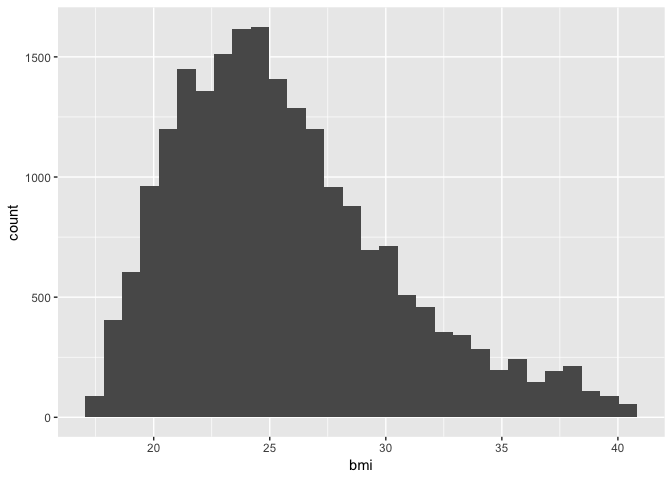

This Rmd file will be used as the file for my Thesis Analysis on causal mediation.

# Libraries

```r
library(tidyverse)
library(car)
library(foreign)
library(Hmisc)
library(survival)
library(tableone)
```

# Reading of Raw Survey Data

```r
ibiccs_readin <- read.csv("Database_recoded_2012-2014_weights_Walkscore_RTA.csv")
ibiccs_readin$TransitScore <- as.numeric(ibiccs_readin$TransitScore)
ibiccs_readin$BikeScore <- as.numeric(ibiccs_readin$BikeScore)
```

# Recode Variables

```r
## BMI
ibiccs_clean <- ibiccs_readin %>%
	mutate(bmi_category = case_when(
		bmi < 18.5 ~ "underweight",
		bmi >=30 & bmi <999 ~ "obese",
		bmi >=25 & bmi <30 ~ "overweight",
		bmi >=18.5 & bmi <25 ~ "normal weight",
		TRUE ~ "other"
	))
```

# Filtering Out Cities

```r
Boston <- filter(ibiccs_clean, ville == "Boston")

Chicago <- filter(ibiccs_readin, ville == "Chicago")

Detroit <- filter(ibiccs_readin, ville == "Détroit")

NewYork <- filter(ibiccs_readin, ville == "New-York")

Philadelphia <- filter(ibiccs_readin, ville == "Philadelphie")

Montreal <- filter(ibiccs_readin, ville == "Montréal")

Toronto <- filter(ibiccs_readin, ville == "Toronto")

Vancouver <- filter(ibiccs_readin, ville == "Vancouver")
```

# Filtering Out Variables in USA Data

```r
ibiccs <- select(ibiccs_clean, lang, q54, ville, q1us, q2, q13, q14, q15, q18, q21, q22b, q22c, q22d, q22e, q22f_m1, q23, q25, q27, q42, q44, q45, q46b, q47, q48, q49, q50, q51, Q52_occupational_status_category, q53, bmi, bmi_category, WalkScore, WalkScoreLabel, TransitScore, TransitScoreLabel, BikeScore, BikeScoreLabel, DiningandDrinkingScore, GroceryScore)

Boston1 <- select(Boston, lang, q54, ville, q1us, q2, q13, q14, q15, q18, q21, q22b, q22c, q22d, q22e, q22f_m1, q23, q25, q27, q42, q44, q45, q46b, q47, q48, q49, q50, q51, Q52_occupational_status_category, q53, bmi, bmi_category, WalkScore, WalkScoreLabel, TransitScore, TransitScoreLabel, BikeScore, BikeScoreLabel, DiningandDrinkingScore, GroceryScore)

Chicago1 <- select(Chicago, lang, q54, ville, q1us, q2, q13, q14, q15, q18, q21, q22b, q22c, q22d, q22e, q22f_m1, q23, q25, q27, q42, q44, q45, q46b, q47, q48, q49, q50, q51, Q52_occupational_status_category, q53, bmi, bmi_category, WalkScore, WalkScoreLabel, TransitScore, TransitScoreLabel, BikeScore, BikeScoreLabel, DiningandDrinkingScore, GroceryScore)

Detroit1 <- select(Detroit, lang, q54, ville, q1us, q2, q13, q14, q15, q18, q21, q22b, q22c, q22d, q22e, q22f_m1, q23, q25, q27, q42, q44, q45, q46b, q47, q48, q49, q50, q51, Q52_occupational_status_category, q53, bmi, bmi_category, WalkScore, WalkScoreLabel, TransitScore, TransitScoreLabel, BikeScore, BikeScoreLabel, DiningandDrinkingScore, GroceryScore)

NewYork1 <- select(NewYork, lang, q54, ville, q1us, q2, q13, q14, q15, q18, q21, q22b, q22c, q22d, q22e, q22f_m1, q23, q25, q27, q42, q44, q45, q46b, q47, q48, q49, q50, q51, Q52_occupational_status_category, q53, bmi, bmi_category, WalkScore, WalkScoreLabel, TransitScore, TransitScoreLabel, BikeScore, BikeScoreLabel, DiningandDrinkingScore, GroceryScore)

Philadelphia1 <- select(Philadelphia, lang, q54, ville, q1us, q2, q13, q14, q15, q18, q21, q22b, q22c, q22d, q22e, q22f_m1, q23, q25, q27, q42, q44, q45, q46b, q47, q48, q49, q50, q51, Q52_occupational_status_category, q53, bmi, bmi_category, WalkScore, WalkScoreLabel, TransitScore, TransitScoreLabel, BikeScore, BikeScoreLabel, DiningandDrinkingScore, GroceryScore)

Montreal1 <- select(Montreal, lang, q54, ville, q1us, q2, q13, q14, q15, q18, q21, q22b, q22c, q22d, q22e, q22f_m1, q23, q25, q27, q42, q44, q45, q46b, q47, q48, q49, q50, q51, Q52_occupational_status_category, q53, bmi, bmi_category, WalkScore, WalkScoreLabel, TransitScore, TransitScoreLabel, BikeScore, BikeScoreLabel, DiningandDrinkingScore, GroceryScore)

Toronto1 <- select(Toronto, lang, q54, ville, q1us, q2, q13, q14, q15, q18, q21, q22b, q22c, q22d, q22e, q22f_m1, q23, q25, q27, q42, q44, q45, q46b, q47, q48, q49, q50, q51, Q52_occupational_status_category, q53, bmi, bmi_category, WalkScore, WalkScoreLabel, TransitScore, TransitScoreLabel, BikeScore, BikeScoreLabel, DiningandDrinkingScore, GroceryScore)

Vancouver1 <- select(Vancouver, lang, q54, ville, q1us, q2, q13, q14, q15, q18, q21, q22b, q22c, q22d, q22e, q22f_m1, q23, q25, q27, q42, q44, q45, q46b, q47, q48, q49, q50, q51, Q52_occupational_status_category, q53, bmi, bmi_category, WalkScore, WalkScoreLabel, TransitScore, TransitScoreLabel, BikeScore, BikeScoreLabel, DiningandDrinkingScore, GroceryScore)

city <- rbind(Philadelphia1, NewYork1, Detroit1, Chicago1, Boston1, Montreal1, Toronto1, Vancouver1)
```

# Binding by Country

```r
city_USA <- rbind(Philadelphia1, NewYork1, Detroit1, Chicago1, Boston1)
city_CAN <- rbind(Montreal1, Toronto1, Vancouver1)
```


# Descriptive Stats for Each City

```
## Boston1 
## 
##  39  Variables      1977  Observations
## ---------------------------------------------------------------------------
## lang 
##        n  missing distinct 
##     1977        0        2 
##                             
## Value       Anglais Espagnol
## Frequency      1974        3
## Proportion    0.998    0.002
## ---------------------------------------------------------------------------
## q54 
##        n  missing distinct 
##     1977        0        2 
##                       
## Value      Femme Homme
## Frequency   1283   694
## Proportion 0.649 0.351
## ---------------------------------------------------------------------------
## ville 
##        n  missing distinct    value 
##     1977        0        1   Boston 
##                  
## Value      Boston
## Frequency    1977
## Proportion      1
## ---------------------------------------------------------------------------
## q1us 
##        n  missing distinct     Info     Mean      Gmd      .05      .10 
##     1970        7      183    0.999     2167    161.7     1910     2113 
##      .25      .50      .75      .90      .95 
##     2119     2134     2144     2445     2446 
##                                                                       
## Value       1400  1600  1800  2000  2200  2400  2600  3000  3200  3800
## Frequency      7    33    55    37  1600   210     2    15     6     4
## Proportion 0.004 0.017 0.028 0.019 0.812 0.107 0.001 0.008 0.003 0.002
##                 
## Value      20200
## Frequency      1
## Proportion 0.001
## ---------------------------------------------------------------------------
## q2 
##        n  missing distinct 
##     1977        0        6 
## 
## Bon (521, 0.264), Excellent (467, 0.236), Mauvais (24, 0.012), Moyen (142,
## 0.072), Ne sais pas/Refuse de répondre (5, 0.003), Très bon (818, 0.414)
## ---------------------------------------------------------------------------
## q13 
##        n  missing distinct 
##     1977        0       10 
## 
## Autre (précisez:) (3, 0.002), Marche (500, 0.253), Ne s'applique pas (3,
## 0.002), Scooter (1, 0.001), Taxi (12, 0.006), Transport en commun (669,
## 0.338), Véhicule motorisé (loué, emprunté, covoiturage) (675, 0.341), Vélo
## en libre-service (15, 0.008), Vélo personnel (89, 0.045), Voiture
## personnelle (10, 0.005)
## ---------------------------------------------------------------------------
## q14 
##        n  missing distinct 
##     1977        0        4 
##                                                                       
## Value      Ne sais pas/Ne s'applique pas                           Non
## Frequency                             18                           255
## Proportion                         0.009                         0.129
##                                                                       
## Value                                Oui            Refuse de répondre
## Frequency                           1703                             1
## Proportion                         0.861                         0.001
## ---------------------------------------------------------------------------
## q15 
##        n  missing distinct     Info     Mean      Gmd      .05      .10 
##     1703      274       62    0.962    44.15    26.73        5        7 
##      .25      .50      .75      .90      .95 
##       20       57       64       66       68 
## 
## lowest :  1  2  3  4  5, highest: 70 71 96 98 99
## ---------------------------------------------------------------------------
## q18 
##        n  missing distinct     Info     Mean      Gmd      .05      .10 
##     1703      274       62    0.992    50.68    35.54      5.1      7.0 
##      .25      .50      .75      .90      .95 
##     19.0     61.0     68.0     97.0     97.0 
## 
## lowest :  1  2  3  4  5, highest: 71 96 97 98 99
## ---------------------------------------------------------------------------
## q21 
##        n  missing distinct     Info     Mean      Gmd      .05      .10 
##     1977        0       10    0.984    10.46    15.02        0        0 
##      .25      .50      .75      .90      .95 
##        2        4        7        7       98 
##                                                                       
## Value          0     1     2     3     4     5     6     7    98    99
## Frequency    231   261   222   163   133   277   186   362   130    12
## Proportion 0.117 0.132 0.112 0.082 0.067 0.140 0.094 0.183 0.066 0.006
## ---------------------------------------------------------------------------
## q22b 
##        n  missing distinct     Info     Mean      Gmd      .05      .10 
##      754     1223       14    0.862     2.09    1.577        1        1 
##      .25      .50      .75      .90      .95 
##        1        2        2        4        5 
##                                                                       
## Value          0     1     2     3     4     5     6     7     8    10
## Frequency      9   361   227    69    37    14    14     2     3     8
## Proportion 0.012 0.479 0.301 0.092 0.049 0.019 0.019 0.003 0.004 0.011
##                                   
## Value         12    14    15    16
## Frequency      5     2     2     1
## Proportion 0.007 0.003 0.003 0.001
## ---------------------------------------------------------------------------
## q22c 
##        n  missing distinct     Info     Mean      Gmd      .05      .10 
##      476     1501       27    0.964    30.61    19.42        7       10 
##      .25      .50      .75      .90      .95 
##       20       30       40       50       70 
## 
## lowest :   0   1   2   3   4, highest:  75  80  90 120 150
## ---------------------------------------------------------------------------
## q22d 
##        n  missing distinct     Info     Mean      Gmd      .05      .10 
##      250     1727       19    0.957    4.216    4.405     1.00     1.00 
##      .25      .50      .75      .90      .95 
##     1.00     2.00     4.75    10.00    14.55 
##                                                                       
## Value          0     1     2     3     4     5     6     7     8     9
## Frequency      1    73    62    33    18    13     9     5     3     2
## Proportion 0.004 0.292 0.248 0.132 0.072 0.052 0.036 0.020 0.012 0.008
##                                                                 
## Value         10    12    14    15    18    20    25    28    30
## Frequency     10     4     4     2     1     5     2     1     2
## Proportion 0.040 0.016 0.016 0.008 0.004 0.020 0.008 0.004 0.008
## ---------------------------------------------------------------------------
## q22e 
##        n  missing distinct     Info     Mean      Gmd      .05      .10 
##       90     1887       18    0.916    34.57    23.74     7.25    14.50 
##      .25      .50      .75      .90      .95 
##    20.00    30.00    38.75    60.00    90.00 
##                                                                       
## Value          0     1     5    10    15    20    25    30    35    40
## Frequency      3     1     1     4     8     8     1    39     2     5
## Proportion 0.033 0.011 0.011 0.044 0.089 0.089 0.011 0.433 0.022 0.056
##                                                           
## Value         45    60    70    90   100   120   150   160
## Frequency      8     3     1     2     1     1     1     1
## Proportion 0.089 0.033 0.011 0.022 0.011 0.011 0.011 0.011
## ---------------------------------------------------------------------------
## q22f_m1 
##        n  missing distinct 
##       53     1924        2 
##                                                   
## Value      Ne sais pas/Pas sûr  Refuse de répondre
## Frequency                   49                   4
## Proportion               0.925               0.075
## ---------------------------------------------------------------------------
## q23 
##        n  missing distinct     Info     Mean      Gmd      .05      .10 
##     1977        0       10    0.981    3.425    3.072        0        0 
##      .25      .50      .75      .90      .95 
##        1        3        5        7        8 
##                                                                       
## Value          0     1     2     3     4     5     6     7     8     9
## Frequency    344   354   210   130   120   336   134   165   167    17
## Proportion 0.174 0.179 0.106 0.066 0.061 0.170 0.068 0.083 0.084 0.009
## ---------------------------------------------------------------------------
## q25 
##        n  missing distinct     Info     Mean      Gmd      .05      .10 
##     1977        0       10    0.962    4.845     2.61        0        1 
##      .25      .50      .75      .90      .95 
##        3        5        7        7        8 
##                                                                       
## Value          0     1     2     3     4     5     6     7     8     9
## Frequency    103   127   185   158   163   365   141   609   112    14
## Proportion 0.052 0.064 0.094 0.080 0.082 0.185 0.071 0.308 0.057 0.007
## ---------------------------------------------------------------------------
## q27 
##        n  missing distinct     Info     Mean      Gmd      .05      .10 
##     1977        0       10    0.828    24.71    36.81        0        0 
##      .25      .50      .75      .90      .95 
##        0        0        7       98       98 
##                                                                       
## Value          0     1     2     3     4     5     6     7    98    99
## Frequency   1069   141    70    47    39    69    25    32   469    16
## Proportion 0.541 0.071 0.035 0.024 0.020 0.035 0.013 0.016 0.237 0.008
## ---------------------------------------------------------------------------
## q42 
##        n  missing distinct     Info     Mean      Gmd      .05      .10 
##     1977        0       67    0.999    37.21    15.17       21       23 
##      .25      .50      .75      .90      .95 
##       26       33       46       58       66 
## 
## lowest : 18 19 20 21 22, highest: 82 83 84 86 90
## ---------------------------------------------------------------------------
## q44 
##        n  missing distinct 
##     1977        0        7 
## 
## Célibatiare (1025, 0.518), Divorcé (e) (130, 0.066), En couple (8, 0.004),
## Marié(e)/Conjoint de fait (739, 0.374), Refuse de répondre (23, 0.012),
## Séparé (e) (28, 0.014), Veuf (ve) (24, 0.012)
## ---------------------------------------------------------------------------
## q45 
##        n  missing distinct     Info     Mean      Gmd 
##     1977        0        7    0.441    6.923     1.85 
##                                                     
## Value          1     2     3     4     5     8     9
## Frequency    209    88    23    10     1  1627    19
## Proportion 0.106 0.045 0.012 0.005 0.001 0.823 0.010
## ---------------------------------------------------------------------------
## q46b 
##        n  missing distinct     Info     Mean      Gmd      .05      .10 
##      892     1085       23    0.975    4.834    3.407        1        2 
##      .25      .50      .75      .90      .95 
##        3        4        6        9       11 
## 
## lowest :  0  1  2  3  4, highest: 28 30 32 39 42
## ---------------------------------------------------------------------------
## q47 
##        n  missing distinct 
##     1977        0       11 
## 
## lowest : Amérindien des États-Unis / Autochtone d'Amérique Arabe (Moyen-Orient, Afrique du Nord)             Asiatique / insulaire du Pacifique                Autre                                             Blanc(che) / Caucasien                           
## highest: Indien / Pakistanais                              Je préfère ne pas répondre                        Jewish                                            Mixed / Mixed race / Bi-racial                    Noir(e) / Africain(e) / Afro-Américain(e)        
## ---------------------------------------------------------------------------
## q48 
##        n  missing distinct     Info     Mean      Gmd      .05      .10 
##     1977        0       55    0.323    6.219    7.977        2        2 
##      .25      .50      .75      .90      .95 
##        2        2        2        3       35 
## 
## lowest :  1  2  3  4  5, highest: 73 74 80 96 99
## ---------------------------------------------------------------------------
## q49 
##        n  missing distinct 
##     1977        0        3 
##                                                                       
## Value      Ne sais pas/Ne s'applique pas                           Non
## Frequency                              5                           166
## Proportion                         0.003                         0.084
##                                         
## Value                                Oui
## Frequency                           1806
## Proportion                         0.914
## ---------------------------------------------------------------------------
## q50 
##        n  missing distinct 
##     1977        0        3 
##                                                                       
## Value      Ne sais pas/Ne s'applique pas                           Non
## Frequency                             16                           519
## Proportion                         0.008                         0.263
##                                         
## Value                                Oui
## Frequency                           1442
## Proportion                         0.729
## ---------------------------------------------------------------------------
## q51 
##        n  missing distinct 
##     1977        0        8 
## 
## lowest : Autre (précisez):                                   Baccalauréat                                        Cégep                                               Certificat d'école de métier, certificat ou diplôme Diplôme d'études secondaire ou l'équivalent        
## highest: Certificat d'école de métier, certificat ou diplôme Diplôme d'études secondaire ou l'équivalent         Diplôme universitaire supérieur au baccalauréat     École primaire                                      Refuse de répondre                                 
## ---------------------------------------------------------------------------
## Q52_occupational_status_category 
##        n  missing distinct 
##     1963       14        7 
## 
## Disability (17, 0.009), Full time or Self-employed (1307, 0.666),
## Homemaker or parental leave (55, 0.028), Part time (135, 0.069), Retired
## (112, 0.057), Student (272, 0.139), Unemployed seeking work (65, 0.033)
## ---------------------------------------------------------------------------
## q53 
##        n  missing distinct 
##     1977        0       10 
## 
## lowest : Entre 10000 $ and 19999 $ par année   Entre 100000 $ and 149999 $ par année Entre 150000 $ and 199999 $ par année Entre 20000 $ and 34999 $ par année   Entre 35000 $ and 49999 $ par année  
## highest: Entre 50000 $ and 74999 $ par année   Entre 75000 $ and 99999 $ par année   Moins de 10000 $ par année            Plus de 200000 $ par année            Refuse de répondre                   
## ---------------------------------------------------------------------------
## bmi 
##        n  missing distinct     Info     Mean      Gmd      .05      .10 
##     1785      192      617        1    25.06    5.006    19.37    20.12 
##      .25      .50      .75      .90      .95 
##    21.63    24.21    27.32    31.69    34.97 
## 
## lowest : 17.57 17.58 17.64 17.71 17.72, highest: 39.68 39.75 39.94 40.14 40.35
## ---------------------------------------------------------------------------
## bmi_category 
##        n  missing distinct 
##     1977        0        5 
##                                                                   
## Value      normal weight         obese         other    overweight
## Frequency            982           248           192           511
## Proportion         0.497         0.125         0.097         0.258
##                         
## Value        underweight
## Frequency             44
## Proportion         0.022
## ---------------------------------------------------------------------------
## WalkScore 
##        n  missing distinct     Info     Mean      Gmd      .05      .10 
##     1939       38       76    0.993    86.19    14.02       53       71 
##      .25      .50      .75      .90      .95 
##       86       90       96       97       99 
## 
## lowest :  0  1  3  4  5, highest: 95 96 97 98 99
## ---------------------------------------------------------------------------
## WalkScoreLabel 
##        n  missing distinct 
##     1977        0        5 
##                                                                 
## Value                            Car-Dependent Somewhat Walkable
## Frequency                 38                96                85
## Proportion             0.019             0.049             0.043
##                                               
## Value          Very Walkable Walker's Paradise
## Frequency                598              1160
## Proportion             0.302             0.587
## ---------------------------------------------------------------------------
## TransitScore 
##        n  missing distinct     Info     Mean      Gmd 
##     1977        0        7    0.412    73.62    11.26 
##                                                     
## Value          1     3    20    30    51    59    80
## Frequency     38    16     2    64   106    95  1656
## Proportion 0.019 0.008 0.001 0.032 0.054 0.048 0.838
## ---------------------------------------------------------------------------
## TransitScoreLabel 
##        n  missing distinct 
##     1977        0        5 
##                                                                 
## Value                        Excellent Transit      Good Transit
## Frequency               1694               201                64
## Proportion             0.857             0.102             0.032
##                                               
## Value       Rider's Paradise      Some Transit
## Frequency                 16                 2
## Proportion             0.008             0.001
## ---------------------------------------------------------------------------
## BikeScore 
##        n  missing distinct     Info     Mean      Gmd      .05      .10 
##     1977        0       31    0.976    106.5    34.68       55       66 
##      .25      .50      .75      .90      .95 
##       80      111      138      138      138 
## 
## lowest :   1  36  52  55  60, highest: 121 129 134 137 138
## ---------------------------------------------------------------------------
## BikeScoreLabel 
##        n  missing distinct 
##     1977        0        5 
##                                                                 
## Value                                 Bikeable  Biker's Paradise
## Frequency                598               475               323
## Proportion             0.302             0.240             0.163
##                                               
## Value      Somewhat Bikeable     Very Bikeable
## Frequency                 26               555
## Proportion             0.013             0.281
## ---------------------------------------------------------------------------
## DiningandDrinkingScore 
##        n  missing distinct     Info     Mean      Gmd      .05      .10 
##     1939       38      157    0.998    86.12    15.23    52.92    67.97 
##      .25      .50      .75      .90      .95 
##    83.20    89.31    96.09    99.31    99.44 
## 
## lowest :  0.0000  0.9592  0.9744  1.8424  2.2944
## highest: 99.4366 99.7016 99.8349 99.9047 99.9226
## ---------------------------------------------------------------------------
## GroceryScore 
##        n  missing distinct     Info     Mean      Gmd      .05      .10 
##     1939       38      139    0.996    88.94    16.42    46.68    66.03 
##      .25      .50      .75      .90      .95 
##    88.13    97.15    99.37   100.00   100.00 
## 
## lowest :   0.000   1.710   1.956   2.363   2.793
## highest:  99.456  99.625  99.752  99.924 100.000
## ---------------------------------------------------------------------------
```

```
## Chicago1 
## 
##  39  Variables      4085  Observations
## ---------------------------------------------------------------------------
## lang 
##        n  missing distinct 
##     4085        0        2 
##                             
## Value       Anglais Espagnol
## Frequency      4065       20
## Proportion    0.995    0.005
## ---------------------------------------------------------------------------
## q54 
##        n  missing distinct 
##     4085        0        2 
##                       
## Value      Femme Homme
## Frequency   2457  1628
## Proportion 0.601 0.399
## ---------------------------------------------------------------------------
## ville 
##        n  missing distinct    value 
##     4085        0        1  Chicago 
##                   
## Value      Chicago
## Frequency     4085
## Proportion       1
## ---------------------------------------------------------------------------
## q1us 
##        n  missing distinct     Info     Mean      Gmd      .05      .10 
##     4066       19      199    0.999    60589    103.5    60304    60546 
##      .25      .50      .75      .90      .95 
##    60611    60622    60645    60657    60660 
##                                                     
## Value      46400 60000 60200 60400 60600 60800 61600
## Frequency      3    63    80   201  3614   104     1
## Proportion 0.001 0.015 0.020 0.049 0.889 0.026 0.000
## ---------------------------------------------------------------------------
## q2 
##        n  missing distinct 
##     4085        0        6 
## 
## Bon (1105, 0.271), Excellent (832, 0.204), Mauvais (67, 0.016), Moyen
## (345, 0.084), Ne sais pas/Refuse de répondre (9, 0.002), Très bon (1727,
## 0.423)
## ---------------------------------------------------------------------------
## q13 
##        n  missing distinct 
##     4085        0       11 
## 
## Autre (précisez:) (8, 0.002), Marche (576, 0.141), Ne s'applique pas (9,
## 0.002), Ne sais pas (6, 0.001), Scooter (1, 0.000), Taxi (39, 0.010),
## Transport en commun (1473, 0.361), Véhicule motorisé (loué, emprunté,
## covoiturage) (1780, 0.436), Vélo en libre-service (34, 0.008), Vélo
## personnel (136, 0.033), Voiture personnelle (23, 0.006)
## ---------------------------------------------------------------------------
## q14 
##        n  missing distinct 
##     4085        0        4 
##                                                                       
## Value      Ne sais pas/Ne s'applique pas                           Non
## Frequency                             35                           626
## Proportion                         0.009                         0.153
##                                                                       
## Value                                Oui            Refuse de répondre
## Frequency                           3418                             6
## Proportion                         0.837                         0.001
## ---------------------------------------------------------------------------
## q15 
##        n  missing distinct     Info     Mean      Gmd      .05      .10 
##     3418      667       63    0.962    44.11    27.03        5        7 
##      .25      .50      .75      .90      .95 
##       18       58       64       66       68 
## 
## lowest :  1  2  3  4  5, highest: 70 71 96 98 99
## ---------------------------------------------------------------------------
## q18 
##        n  missing distinct     Info     Mean      Gmd      .05      .10 
##     3418      667       67    0.991    49.95    36.41        5        7 
##      .25      .50      .75      .90      .95 
##       18       61       66       97       97 
## 
## lowest :  1  2  3  4  5, highest: 71 96 97 98 99
## ---------------------------------------------------------------------------
## q21 
##        n  missing distinct     Info     Mean      Gmd      .05      .10 
##     4085        0       10     0.98    9.994    13.43        0        1 
##      .25      .50      .75      .90      .95 
##        2        5        7        7       98 
##                                                                       
## Value          0     1     2     3     4     5     6     7    98    99
## Frequency    311   400   479   416   299   614   412   897   242    15
## Proportion 0.076 0.098 0.117 0.102 0.073 0.150 0.101 0.220 0.059 0.004
## ---------------------------------------------------------------------------
## q22b 
##        n  missing distinct     Info     Mean      Gmd      .05      .10 
##     1760     2325       16    0.888    2.049    1.391        1        1 
##      .25      .50      .75      .90      .95 
##        1        2        2        3        5 
##                                                                       
## Value          0     1     2     3     4     5     6     7     8     9
## Frequency     33   724   600   234    73    45    15     6    10     2
## Proportion 0.019 0.411 0.341 0.133 0.041 0.026 0.009 0.003 0.006 0.001
##                                               
## Value         10    11    12    14    15    16
## Frequency      4     1     4     2     5     2
## Proportion 0.002 0.001 0.002 0.001 0.003 0.001
## ---------------------------------------------------------------------------
## q22c 
##        n  missing distinct     Info     Mean      Gmd      .05      .10 
##      938     3147       35    0.953    30.66    20.26        3       10 
##      .25      .50      .75      .90      .95 
##       20       30       35       45       75 
## 
## lowest :   0   1   2   3   4, highest: 100 110 140 150 300
## ---------------------------------------------------------------------------
## q22d 
##        n  missing distinct     Info     Mean      Gmd      .05      .10 
##      555     3530       27    0.977    5.043    5.153      1.0      1.0 
##      .25      .50      .75      .90      .95 
##      2.0      3.0      6.0     10.0     14.3 
## 
## lowest :   0   1   2   3   4, highest:  30  35  40  80 100
## ---------------------------------------------------------------------------
## q22e 
##        n  missing distinct     Info     Mean      Gmd      .05      .10 
##      207     3878       30     0.97    55.33    65.53      0.0      4.2 
##      .25      .50      .75      .90      .95 
##     20.0     30.0     45.0     90.0    120.0 
## 
## lowest :    0    1    3    5    8, highest:  210  240  350  420 2800
## ---------------------------------------------------------------------------
## q22f_m1 
##        n  missing distinct 
##      137     3948        2 
##                                                   
## Value      Ne sais pas/Pas sûr  Refuse de répondre
## Frequency                  128                   9
## Proportion               0.934               0.066
## ---------------------------------------------------------------------------
## q23 
##        n  missing distinct     Info     Mean      Gmd      .05      .10 
##     4085        0       10    0.976    3.338    3.135        0        0 
##      .25      .50      .75      .90      .95 
##        1        3        5        8        8 
##                                                                       
## Value          0     1     2     3     4     5     6     7     8     9
## Frequency    936   564   380   286   224   751   276   235   397    36
## Proportion 0.229 0.138 0.093 0.070 0.055 0.184 0.068 0.058 0.097 0.009
## ---------------------------------------------------------------------------
## q25 
##        n  missing distinct     Info     Mean      Gmd      .05      .10 
##     4085        0       10     0.98    4.435    2.807        0        1 
##      .25      .50      .75      .90      .95 
##        2        5        7        7        8 
##                                                                       
## Value          0     1     2     3     4     5     6     7     8     9
## Frequency    295   360   430   434   325   731   302   864   315    29
## Proportion 0.072 0.088 0.105 0.106 0.080 0.179 0.074 0.212 0.077 0.007
## ---------------------------------------------------------------------------
## q27 
##        n  missing distinct     Info     Mean      Gmd      .05      .10 
##     4085        0       10    0.852    25.56    37.62        0        0 
##      .25      .50      .75      .90      .95 
##        0        0       98       98       98 
##                                                                       
## Value          0     1     2     3     4     5     6     7    98    99
## Frequency   2080   341   229   145    69    96    39    47  1016    23
## Proportion 0.509 0.083 0.056 0.035 0.017 0.024 0.010 0.012 0.249 0.006
## ---------------------------------------------------------------------------
## q42 
##        n  missing distinct     Info     Mean      Gmd      .05      .10 
##     4085        0       64    0.999    39.59    14.34       23       25 
##      .25      .50      .75      .90      .95 
##       29       37       49       57       64 
## 
## lowest : 18 19 20 21 22, highest: 77 78 80 81 83
## ---------------------------------------------------------------------------
## q44 
##        n  missing distinct 
##     4085        0        7 
## 
## Célibatiare (1844, 0.451), Divorcé (e) (307, 0.075), En couple (28,
## 0.007), Marié(e)/Conjoint de fait (1778, 0.435), Refuse de répondre (33,
## 0.008), Séparé (e) (46, 0.011), Veuf (ve) (49, 0.012)
## ---------------------------------------------------------------------------
## q45 
##        n  missing distinct     Info     Mean      Gmd 
##     4085        0        9     0.54    6.629    2.215 
##                                                                 
## Value          1     2     3     4     5     6     7     8     9
## Frequency    446   314   103    20     8     5     2  3150    37
## Proportion 0.109 0.077 0.025 0.005 0.002 0.001 0.000 0.771 0.009
## ---------------------------------------------------------------------------
## q46b 
##        n  missing distinct     Info     Mean      Gmd      .05      .10 
##     1707     2378       25    0.987    5.112    3.542        1        1 
##      .25      .50      .75      .90      .95 
##        3        5        7        9       11 
## 
## lowest :  0  1  2  3  4, highest: 23 26 30 32 38
## ---------------------------------------------------------------------------
## q47 
##        n  missing distinct 
##     4085        0       10 
## 
## lowest : Amérindien des États-Unis / Autochtone d'Amérique Arabe (Moyen-Orient, Afrique du Nord)             Asiatique / insulaire du Pacifique                Autre                                             Blanc(che) / Caucasien                           
## highest: Hispanique / Latino / Espagnol(e)                 Indien / Pakistanais                              Je préfère ne pas répondre                        Mixed / Mixed race / Bi-racial                    Noir(e) / Africain(e) / Afro-Américain(e)        
## ---------------------------------------------------------------------------
## q48 
##        n  missing distinct     Info     Mean      Gmd      .05      .10 
##     4085        0       62     0.25    5.547    6.773        2        2 
##      .25      .50      .75      .90      .95 
##        2        2        2        2       29 
## 
## lowest :  1  2  3  4  5, highest: 78 79 81 96 99
## ---------------------------------------------------------------------------
## q49 
##        n  missing distinct 
##     4085        0        3 
##                                                                       
## Value      Ne sais pas/Ne s'applique pas                           Non
## Frequency                             21                           356
## Proportion                         0.005                         0.087
##                                         
## Value                                Oui
## Frequency                           3708
## Proportion                         0.908
## ---------------------------------------------------------------------------
## q50 
##        n  missing distinct 
##     4085        0        3 
##                                                                       
## Value      Ne sais pas/Ne s'applique pas                           Non
## Frequency                             30                           789
## Proportion                         0.007                         0.193
##                                         
## Value                                Oui
## Frequency                           3266
## Proportion                         0.800
## ---------------------------------------------------------------------------
## q51 
##        n  missing distinct 
##     4085        0        9 
## 
## lowest : Aucun grade, certificat ou diplôme                  Autre (précisez):                                   Baccalauréat                                        Cégep                                               Certificat d'école de métier, certificat ou diplôme
## highest: Certificat d'école de métier, certificat ou diplôme Diplôme d'études secondaire ou l'équivalent         Diplôme universitaire supérieur au baccalauréat     École primaire                                      Refuse de répondre                                 
## ---------------------------------------------------------------------------
## Q52_occupational_status_category 
##        n  missing distinct 
##     4053       32        7 
## 
## Disability (62, 0.015), Full time or Self-employed (2832, 0.699),
## Homemaker or parental leave (147, 0.036), Part time (328, 0.081), Retired
## (229, 0.057), Student (271, 0.067), Unemployed seeking work (184, 0.045)
## ---------------------------------------------------------------------------
## q53 
##        n  missing distinct 
##     4085        0       10 
## 
## lowest : Entre 10000 $ and 19999 $ par année   Entre 100000 $ and 149999 $ par année Entre 150000 $ and 199999 $ par année Entre 20000 $ and 34999 $ par année   Entre 35000 $ and 49999 $ par année  
## highest: Entre 50000 $ and 74999 $ par année   Entre 75000 $ and 99999 $ par année   Moins de 10000 $ par année            Plus de 200000 $ par année            Refuse de répondre                   
## ---------------------------------------------------------------------------
## bmi 
##        n  missing distinct     Info     Mean      Gmd      .05      .10 
##     3647      438      864        1    25.89    5.399    19.31    20.37 
##      .25      .50      .75      .90      .95 
##    22.31    25.02    28.70    33.21    35.74 
## 
## lowest : 17.51 17.57 17.58 17.63 17.71, highest: 40.34 40.35 40.37 40.41 40.45
## ---------------------------------------------------------------------------
## bmi_category 
##        n  missing distinct 
##     3647      438        4 
##                                                           
## Value       embonpoint insuffisant      normal     obesite
## Frequency         1139          65        1745         698
## Proportion       0.312       0.018       0.478       0.191
## ---------------------------------------------------------------------------
## WalkScore 
##        n  missing distinct     Info     Mean      Gmd      .05      .10 
##     4034       51       81    0.996    80.36    17.82       46       55 
##      .25      .50      .75      .90      .95 
##       73       86       93       95       99 
## 
## lowest :  1  2  3  5  6, highest: 93 94 95 98 99
## ---------------------------------------------------------------------------
## WalkScoreLabel 
##        n  missing distinct 
##     4085        0        5 
##                                                                 
## Value                            Car-Dependent Somewhat Walkable
## Frequency                 51               274               510
## Proportion             0.012             0.067             0.125
##                                               
## Value          Very Walkable Walker's Paradise
## Frequency               1680              1570
## Proportion             0.411             0.384
## ---------------------------------------------------------------------------
## TransitScore 
##        n  missing distinct     Info     Mean      Gmd 
##     4085        0        6    0.279    77.05    5.508 
##                                               
## Value          1     3    43    46    65    80
## Frequency     51    13    26    56   277  3662
## Proportion 0.012 0.003 0.006 0.014 0.068 0.896
## ---------------------------------------------------------------------------
## TransitScoreLabel 
##        n  missing distinct 
##     4085        0        4 
##                                                                 
## Value                        Excellent Transit      Good Transit
## Frequency               3713               277                82
## Proportion             0.909             0.068             0.020
##                             
## Value       Rider's Paradise
## Frequency                 13
## Proportion             0.003
## ---------------------------------------------------------------------------
## BikeScore 
##        n  missing distinct     Info     Mean      Gmd      .05      .10 
##     4085        0       36    0.996    87.29    33.57       36       44 
##      .25      .50      .75      .90      .95 
##       71       88      107      138      138 
## 
## lowest :   1  33  35  36  38, highest: 108 111 112 113 138
## ---------------------------------------------------------------------------
## BikeScoreLabel 
##        n  missing distinct 
##     4085        0        4 
##                                                                 
## Value                                 Bikeable Somewhat Bikeable
## Frequency                558              1113               264
## Proportion             0.137             0.272             0.065
##                             
## Value          Very Bikeable
## Frequency               2150
## Proportion             0.526
## ---------------------------------------------------------------------------
## DiningandDrinkingScore 
##        n  missing distinct     Info     Mean      Gmd      .05      .10 
##     4034       51      195    0.999    82.41    18.98    45.69    59.13 
##      .25      .50      .75      .90      .95 
##    74.51    88.31    96.35    99.72    99.72 
## 
## lowest :  0.000  1.097  1.469  1.903  2.797, highest: 99.679 99.725 99.734 99.767 99.858
## ---------------------------------------------------------------------------
## GroceryScore 
##        n  missing distinct     Info     Mean      Gmd      .05      .10 
##     4034       51      176    0.999    78.71    28.04    12.43    28.76 
##      .25      .50      .75      .90      .95 
##    69.06    94.81    98.25    99.89   100.00 
## 
## lowest :   0.0000   0.3909   1.1221   1.4329   3.0518
## highest:  99.5302  99.6693  99.8932  99.9785 100.0000
## ---------------------------------------------------------------------------
```

```
## Detroit1 
## 
##  39  Variables      3077  Observations
## ---------------------------------------------------------------------------
## lang 
##        n  missing distinct 
##     3077        0        2 
##                             
## Value       Anglais Espagnol
## Frequency      3074        3
## Proportion    0.999    0.001
## ---------------------------------------------------------------------------
## q54 
##        n  missing distinct 
##     3077        0        2 
##                       
## Value      Femme Homme
## Frequency   1943  1134
## Proportion 0.631 0.369
## ---------------------------------------------------------------------------
## ville 
##        n  missing distinct    value 
##     3077        0        1  Détroit 
##                   
## Value      Détroit
## Frequency     3077
## Proportion       1
## ---------------------------------------------------------------------------
## q1us 
##        n  missing distinct     Info     Mean      Gmd      .05      .10 
##     2731      346      241        1    48188    229.5    48035    48047 
##      .25      .50      .75      .90      .95 
##    48101    48186    48240    48336    48380 
##                                                                       
## Value      24000 24500 25500 43500 48000 48500 49000 49500 61000 89000
## Frequency      1     1     1     1  2047   642    31     5     1     1
## Proportion 0.000 0.000 0.000 0.000 0.750 0.235 0.011 0.002 0.000 0.000
## ---------------------------------------------------------------------------
## q2 
##        n  missing distinct 
##     3077        0        6 
## 
## Bon (928, 0.302), Excellent (566, 0.184), Mauvais (64, 0.021), Moyen (326,
## 0.106), Ne sais pas/Refuse de répondre (1, 0.000), Très bon (1192, 0.387)
## ---------------------------------------------------------------------------
## q13 
##        n  missing distinct 
##     3077        0       11 
## 
## Autre (précisez:) (1, 0.000), Marche (139, 0.045), Ne s'applique pas (18,
## 0.006), Ne sais pas (11, 0.004), Scooter (1, 0.000), Taxi (9, 0.003),
## Transport en commun (105, 0.034), Véhicule motorisé (loué, emprunté,
## covoiturage) (2681, 0.871), Vélo en libre-service (17, 0.006), Vélo
## personnel (58, 0.019), Voiture personnelle (37, 0.012)
## ---------------------------------------------------------------------------
## q14 
##        n  missing distinct 
##     3077        0        4 
##                                                                       
## Value      Ne sais pas/Ne s'applique pas                           Non
## Frequency                             38                           680
## Proportion                         0.012                         0.221
##                                                                       
## Value                                Oui            Refuse de répondre
## Frequency                           2355                             4
## Proportion                         0.765                         0.001
## ---------------------------------------------------------------------------
## q15 
##        n  missing distinct     Info     Mean      Gmd      .05      .10 
##     2355      722       64    0.961    43.08    27.42        5        7 
##      .25      .50      .75      .90      .95 
##       18       54       64       66       68 
## 
## lowest :  1  2  3  5  6, highest: 70 71 96 98 99
## ---------------------------------------------------------------------------
## q18 
##        n  missing distinct     Info     Mean      Gmd      .05      .10 
##     2355      722       66    0.991    50.63     37.4        2        7 
##      .25      .50      .75      .90      .95 
##       18       58       68       97       97 
## 
## lowest :  1  2  3  4  5, highest: 71 96 97 98 99
## ---------------------------------------------------------------------------
## q21 
##        n  missing distinct     Info     Mean      Gmd      .05      .10 
##     3077        0       10    0.872    11.43    12.16        2        3 
##      .25      .50      .75      .90      .95 
##        5        7        7        7       98 
##                                                                       
## Value          0     1     2     3     4     5     6     7    98    99
## Frequency     41    67   106   159   161   433   392  1529   170    19
## Proportion 0.013 0.022 0.034 0.052 0.052 0.141 0.127 0.497 0.055 0.006
## ---------------------------------------------------------------------------
## q22b 
##        n  missing distinct     Info     Mean      Gmd      .05      .10 
##     1680     1397       15    0.871    1.993    1.356        1        1 
##      .25      .50      .75      .90      .95 
##        1        2        2        3        5 
##                                                                       
## Value          0     1     2     3     4     5     6     7     8     9
## Frequency     26   744   579   178    57    44    11     7    12     3
## Proportion 0.015 0.443 0.345 0.106 0.034 0.026 0.007 0.004 0.007 0.002
##                                         
## Value         10    11    12    15    16
## Frequency      8     2     4     4     1
## Proportion 0.005 0.001 0.002 0.002 0.001
## ---------------------------------------------------------------------------
## q22c 
##        n  missing distinct     Info     Mean      Gmd      .05      .10 
##      781     2296       35    0.955    32.92    21.24        4       15 
##      .25      .50      .75      .90      .95 
##       20       30       40       60       90 
## 
## lowest :   0   1   2   3   4, highest:  85  90 100 210 320
## ---------------------------------------------------------------------------
## q22d 
##        n  missing distinct     Info     Mean      Gmd      .05      .10 
##      291     2786       28    0.995    8.921    8.886        1        1 
##      .25      .50      .75      .90      .95 
##        3        7       10       18       23 
## 
## lowest :   0   1   2   3   4, highest:  30  35  40  45 112
## ---------------------------------------------------------------------------
## q22e 
##        n  missing distinct     Info     Mean      Gmd      .05      .10 
##       57     3020       21    0.972    106.2    166.2        0        0 
##      .25      .50      .75      .90      .95 
##        0       30       59      270      552 
##                                                                       
## Value          0     6    12    16    20    30    40    44    50    60
## Frequency     15     1     1     2     4    12     2     4     1     3
## Proportion 0.263 0.018 0.018 0.035 0.070 0.211 0.035 0.070 0.018 0.053
##                                                                       
## Value         76    88   180   224   250   300   540   600  1080  1260
## Frequency      1     1     2     1     1     2     1     1     1     1
## Proportion 0.018 0.018 0.035 0.018 0.018 0.035 0.018 0.018 0.018 0.018
## ---------------------------------------------------------------------------
## q22f_m1 
##        n  missing distinct 
##      118     2959        2 
##                                                   
## Value      Ne sais pas/Pas sûr  Refuse de répondre
## Frequency                  113                   5
## Proportion               0.958               0.042
## ---------------------------------------------------------------------------
## q23 
##        n  missing distinct     Info     Mean      Gmd      .05      .10 
##     3077        0       10     0.72    2.233    3.201        0        0 
##      .25      .50      .75      .90      .95 
##        0        0        5        8        8 
##                                                                       
## Value          0     1     2     3     4     5     6     7     8     9
## Frequency   1988   102    77    45    33    77    26    48   658    23
## Proportion 0.646 0.033 0.025 0.015 0.011 0.025 0.008 0.016 0.214 0.007
## ---------------------------------------------------------------------------
## q25 
##        n  missing distinct     Info     Mean      Gmd      .05      .10 
##     3077        0       10    0.967    3.244    3.379        0        0 
##      .25      .50      .75      .90      .95 
##        0        2        6        8        8 
##                                                                       
## Value          0     1     2     3     4     5     6     7     8     9
## Frequency    903   328   334   238   165   294    81   238   474    22
## Proportion 0.293 0.107 0.109 0.077 0.054 0.096 0.026 0.077 0.154 0.007
## ---------------------------------------------------------------------------
## q27 
##        n  missing distinct     Info     Mean      Gmd      .05      .10 
##     3077        0       10    0.811    26.41     38.5        0        0 
##      .25      .50      .75      .90      .95 
##        0        0       98       98       98 
##                                                                       
## Value          0     1     2     3     4     5     6     7    98    99
## Frequency   1711   191   135    77    47    54    22    26   790    24
## Proportion 0.556 0.062 0.044 0.025 0.015 0.018 0.007 0.008 0.257 0.008
## ---------------------------------------------------------------------------
## q42 
##        n  missing distinct     Info     Mean      Gmd      .05      .10 
##     3077        0       64    0.999    41.11     14.5     22.0     24.0 
##      .25      .50      .75      .90      .95 
##     31.0     41.0     51.0     56.4     64.0 
## 
## lowest : 18 19 20 21 22, highest: 79 80 81 84 89
## ---------------------------------------------------------------------------
## q44 
##        n  missing distinct 
##     3077        0        7 
## 
## Célibatiare (988, 0.321), Divorcé (e) (268, 0.087), En couple (11, 0.004),
## Marié(e)/Conjoint de fait (1699, 0.552), Refuse de répondre (24, 0.008),
## Séparé (e) (46, 0.015), Veuf (ve) (41, 0.013)
## ---------------------------------------------------------------------------
## q45 
##        n  missing distinct     Info     Mean      Gmd 
##     3077        0        9    0.737    5.801    2.994 
##                                                                 
## Value          1     2     3     4     5     6     7     8     9
## Frequency    523   386   130    35     9     3     2  1954    35
## Proportion 0.170 0.125 0.042 0.011 0.003 0.001 0.001 0.635 0.011
## ---------------------------------------------------------------------------
## q46b 
##        n  missing distinct     Info     Mean      Gmd      .05      .10 
##     1183     1894       17    0.989     4.91    3.534        1        1 
##      .25      .50      .75      .90      .95 
##        2        4        7       10       11 
##                                                                       
## Value          0     1     2     3     4     5     6     7     8     9
## Frequency     50   106   148   164   131   111   161    59    76    56
## Proportion 0.042 0.090 0.125 0.139 0.111 0.094 0.136 0.050 0.064 0.047
##                                                     
## Value         10    11    12    14    15    16    18
## Frequency     48    60     1     2     4     2     4
## Proportion 0.041 0.051 0.001 0.002 0.003 0.002 0.003
## ---------------------------------------------------------------------------
## q47 
##        n  missing distinct 
##     3077        0       10 
## 
## lowest : Amérindien des États-Unis / Autochtone d'Amérique Arabe (Moyen-Orient, Afrique du Nord)             Asiatique / insulaire du Pacifique                Autre                                             Blanc(che) / Caucasien                           
## highest: Hispanique / Latino / Espagnol(e)                 Indien / Pakistanais                              Je préfère ne pas répondre                        Mixed / Mixed race / Bi-racial                    Noir(e) / Africain(e) / Afro-Américain(e)        
## ---------------------------------------------------------------------------
## q48 
##        n  missing distinct     Info     Mean      Gmd      .05      .10 
##     3077        0       45    0.191    4.506    4.892        2        2 
##      .25      .50      .75      .90      .95 
##        2        2        2        2       17 
## 
## lowest :  1  2  3  5  8, highest: 76 79 81 96 99
## ---------------------------------------------------------------------------
## q49 
##        n  missing distinct 
##     3077        0        3 
##                                                                       
## Value      Ne sais pas/Ne s'applique pas                           Non
## Frequency                             23                           149
## Proportion                         0.007                         0.048
##                                         
## Value                                Oui
## Frequency                           2905
## Proportion                         0.944
## ---------------------------------------------------------------------------
## q50 
##        n  missing distinct 
##     3077        0        3 
##                                                                       
## Value      Ne sais pas/Ne s'applique pas                           Non
## Frequency                             18                           123
## Proportion                         0.006                         0.040
##                                         
## Value                                Oui
## Frequency                           2936
## Proportion                         0.954
## ---------------------------------------------------------------------------
## q51 
##        n  missing distinct 
##     3077        0        9 
## 
## lowest : Aucun grade, certificat ou diplôme                  Autre (précisez):                                   Baccalauréat                                        Cégep                                               Certificat d'école de métier, certificat ou diplôme
## highest: Certificat d'école de métier, certificat ou diplôme Diplôme d'études secondaire ou l'équivalent         Diplôme universitaire supérieur au baccalauréat     École primaire                                      Refuse de répondre                                 
## ---------------------------------------------------------------------------
## Q52_occupational_status_category 
##        n  missing distinct 
##     3058       19        7 
## 
## Disability (64, 0.021), Full time or Self-employed (1842, 0.602),
## Homemaker or parental leave (249, 0.081), Part time (310, 0.101), Retired
## (217, 0.071), Student (243, 0.079), Unemployed seeking work (133, 0.043)
## ---------------------------------------------------------------------------
## q53 
##        n  missing distinct 
##     3077        0       10 
## 
## lowest : Entre 10000 $ and 19999 $ par année   Entre 100000 $ and 149999 $ par année Entre 150000 $ and 199999 $ par année Entre 20000 $ and 34999 $ par année   Entre 35000 $ and 49999 $ par année  
## highest: Entre 50000 $ and 74999 $ par année   Entre 75000 $ and 99999 $ par année   Moins de 10000 $ par année            Plus de 200000 $ par année            Refuse de répondre                   
## ---------------------------------------------------------------------------
## bmi 
##        n  missing distinct     Info     Mean      Gmd      .05      .10 
##     2638      439      761        1    26.75    5.755    19.58    20.80 
##      .25      .50      .75      .90      .95 
##    22.86    25.84    30.00    34.38    36.84 
## 
## lowest : 17.56 17.70 17.75 17.81 17.89, highest: 40.18 40.24 40.29 40.35 40.42
## ---------------------------------------------------------------------------
## bmi_category 
##        n  missing distinct 
##     2638      439        4 
##                                                           
## Value       embonpoint insuffisant      normal     obesite
## Frequency          864          40        1073         661
## Proportion       0.328       0.015       0.407       0.251
## ---------------------------------------------------------------------------
## WalkScore 
##        n  missing distinct     Info     Mean      Gmd      .05      .10 
##     3050       27       75        1    36.05    27.97        1        4 
##      .25      .50      .75      .90      .95 
##       15       34       56       67       73 
## 
## lowest :  0  1  2  3  4, highest: 84 88 89 93 98
## ---------------------------------------------------------------------------
## WalkScoreLabel 
##        n  missing distinct 
##     3077        0        5 
##                                                                 
## Value                            Car-Dependent Somewhat Walkable
## Frequency                 27              2094               733
## Proportion             0.009             0.681             0.238
##                                               
## Value          Very Walkable Walker's Paradise
## Frequency                175                48
## Proportion             0.057             0.016
## ---------------------------------------------------------------------------
## TransitScore 
##        n  missing distinct     Info     Mean      Gmd 
##     3077        0        2    0.026    79.31    1.375 
##                       
## Value          1    80
## Frequency     27  3050
## Proportion 0.009 0.991
## ---------------------------------------------------------------------------
## TransitScoreLabel 
##                 n           missing          distinct             value 
##              3077                 0                 1                   
##                
## Value          
## Frequency  3077
## Proportion    1
## ---------------------------------------------------------------------------
## BikeScore 
##        n  missing distinct     Info     Mean      Gmd 
##     3077        0        8    0.188    133.7    8.119 
##                                                           
## Value          1    32    60    73    83   104   115   138
## Frequency     27     1    59    31     6    42    40  2871
## Proportion 0.009 0.000 0.019 0.010 0.002 0.014 0.013 0.933
## ---------------------------------------------------------------------------
## BikeScoreLabel 
##        n  missing distinct 
##     3077        0        5 
##                                                                 
## Value                                 Bikeable  Biker's Paradise
## Frequency               2898                90                40
## Proportion             0.942             0.029             0.013
##                                               
## Value      Somewhat Bikeable     Very Bikeable
## Frequency                  1                48
## Proportion             0.000             0.016
## ---------------------------------------------------------------------------
## DiningandDrinkingScore 
##        n  missing distinct     Info     Mean      Gmd      .05      .10 
##     3050       27      194    0.999    40.56    30.87    0.000    1.636 
##      .25      .50      .75      .90      .95 
##   13.496   46.259   62.990   73.540   83.073 
## 
## lowest :  0.0000  0.5031  0.7687  1.0596  1.2522
## highest: 86.0558 92.5252 92.8347 93.2107 99.0843
## ---------------------------------------------------------------------------
## GroceryScore 
##        n  missing distinct     Info     Mean      Gmd      .05      .10 
##     3050       27      157     0.99    38.81    38.91    0.000    0.000 
##      .25      .50      .75      .90      .95 
##    3.228   34.702   72.768   87.739   95.820 
## 
## lowest :   0.0000   0.3909   0.7756   1.1221   1.7101
## highest:  96.7031  97.9939  98.7357  99.7117 100.0000
## ---------------------------------------------------------------------------
```

```
## NewYork1 
## 
##  39  Variables      3824  Observations
## ---------------------------------------------------------------------------
## lang 
##        n  missing distinct 
##     3824        0        3 
##                                      
## Value       Anglais Espagnol Français
## Frequency      3808       15        1
## Proportion    0.996    0.004    0.000
## ---------------------------------------------------------------------------
## q54 
##        n  missing distinct 
##     3824        0        2 
##                       
## Value      Femme Homme
## Frequency   2231  1593
## Proportion 0.583 0.417
## ---------------------------------------------------------------------------
## ville 
##        n  missing distinct    value 
##     3824        0        1 New-York 
##                    
## Value      New-York
## Frequency      3824
## Proportion        1
## ---------------------------------------------------------------------------
## q1us 
##        n  missing distinct     Info     Mean      Gmd      .05      .10 
##     3791       33      255    0.999    10566    757.5    10002    10006 
##      .25      .50      .75      .90      .95 
##    10016    10029    11211    11238    11379 
##                                                                       
## Value       7000 10000 11000 12000 14000 20000 49000 68000 90000 93000
## Frequency      4  2352  1340    89     1     1     1     1     1     1
## Proportion 0.001 0.620 0.353 0.023 0.000 0.000 0.000 0.000 0.000 0.000
## ---------------------------------------------------------------------------
## q2 
##        n  missing distinct 
##     3824        0        6 
## 
## Bon (986, 0.258), Excellent (909, 0.238), Mauvais (47, 0.012), Moyen (248,
## 0.065), Ne sais pas/Refuse de répondre (6, 0.002), Très bon (1628, 0.426)
## ---------------------------------------------------------------------------
## q13 
##        n  missing distinct 
##     3824        0       11 
## 
## Autre (précisez:) (6, 0.002), Marche (978, 0.256), Ne s'applique pas (8,
## 0.002), Ne sais pas (4, 0.001), Scooter (3, 0.001), Taxi (74, 0.019),
## Transport en commun (2207, 0.577), Véhicule motorisé (loué, emprunté,
## covoiturage) (349, 0.091), Vélo en libre-service (67, 0.018), Vélo
## personnel (117, 0.031), Voiture personnelle (11, 0.003)
## ---------------------------------------------------------------------------
## q14 
##        n  missing distinct 
##     3824        0        4 
##                                                                       
## Value      Ne sais pas/Ne s'applique pas                           Non
## Frequency                             51                           680
## Proportion                         0.013                         0.178
##                                                                       
## Value                                Oui            Refuse de répondre
## Frequency                           3088                             5
## Proportion                         0.808                         0.001
## ---------------------------------------------------------------------------
## q15 
##        n  missing distinct     Info     Mean      Gmd      .05      .10 
##     3088      736       66    0.958    44.68    26.96        5        7 
##      .25      .50      .75      .90      .95 
##       18       62       64       66       68 
## 
## lowest :  1  2  3  4  5, highest: 70 71 96 98 99
## ---------------------------------------------------------------------------
## q18 
##        n  missing distinct     Info     Mean      Gmd      .05      .10 
##     3088      736       70    0.992    50.63    36.34        5        7 
##      .25      .50      .75      .90      .95 
##       16       62       68       97       97 
## 
## lowest :  1  2  3  4  5, highest: 71 96 97 98 99
## ---------------------------------------------------------------------------
## q21 
##        n  missing distinct     Info     Mean      Gmd      .05      .10 
##     3824        0       10    0.974    16.06    25.42        0        0 
##      .25      .50      .75      .90      .95 
##        0        2        5       98       98 
##                                                                       
## Value          0     1     2     3     4     5     6     7    98    99
## Frequency    968   594   487   323   237   306   135   223   522    29
## Proportion 0.253 0.155 0.127 0.084 0.062 0.080 0.035 0.058 0.137 0.008
## ---------------------------------------------------------------------------
## q22b 
##        n  missing distinct     Info     Mean      Gmd      .05      .10 
##      999     2825       14    0.894    2.115    1.601        1        1 
##      .25      .50      .75      .90      .95 
##        1        2        3        4        5 
##                                                                       
## Value          0     1     2     3     4     5     6     7     8     9
## Frequency     31   432   284   126    54    29    13     7     5     3
## Proportion 0.031 0.432 0.284 0.126 0.054 0.029 0.013 0.007 0.005 0.003
##                                   
## Value         10    11    12    15
## Frequency      7     1     2     5
## Proportion 0.007 0.001 0.002 0.005
## ---------------------------------------------------------------------------
## q22c 
##        n  missing distinct     Info     Mean      Gmd      .05      .10 
##      600     3224       28    0.962    24.99    16.36        1        5 
##      .25      .50      .75      .90      .95 
##       15       25       30       45       45 
## 
## lowest :  0  1  2  3  4, highest: 55 60 70 80 90
## ---------------------------------------------------------------------------
## q22d 
##        n  missing distinct     Info     Mean      Gmd      .05      .10 
##      389     3435       23    0.966    4.247    4.815      0.0      1.0 
##      .25      .50      .75      .90      .95 
##      1.0      2.0      4.0      8.0     13.6 
## 
## lowest :  0  1  2  3  4, highest: 25 30 40 60 90
## ---------------------------------------------------------------------------
## q22e 
##        n  missing distinct     Info     Mean      Gmd      .05      .10 
##      263     3561       23    0.965    27.14    23.05        0        1 
##      .25      .50      .75      .90      .95 
##       15       20       30       45       60 
## 
## lowest :   0   1   2   5   8, highest: 112 120 180 240 300
## ---------------------------------------------------------------------------
## q22f_m1 
##        n  missing distinct 
##      155     3669        2 
##                                                   
## Value      Ne sais pas/Pas sûr  Refuse de répondre
## Frequency                  145                  10
## Proportion               0.935               0.065
## ---------------------------------------------------------------------------
## q23 
##        n  missing distinct     Info     Mean      Gmd      .05      .10 
##     3824        0       10     0.98    4.519    2.675        0        1 
##      .25      .50      .75      .90      .95 
##        3        5        6        7        8 
##                                                                       
## Value          0     1     2     3     4     5     6     7     8     9
## Frequency    229   320   368   365   298   844   477   588   277    58
## Proportion 0.060 0.084 0.096 0.095 0.078 0.221 0.125 0.154 0.072 0.015
## ---------------------------------------------------------------------------
## q25 
##        n  missing distinct     Info     Mean      Gmd      .05      .10 
##     3824        0       10    0.945    5.423    2.279        1        2 
##      .25      .50      .75      .90      .95 
##        4        6        7        7        8 
##                                                                       
## Value          0     1     2     3     4     5     6     7     8     9
## Frequency     69   160   257   287   303   629   388  1386   291    54
## Proportion 0.018 0.042 0.067 0.075 0.079 0.164 0.101 0.362 0.076 0.014
## ---------------------------------------------------------------------------
## q27 
##        n  missing distinct     Info     Mean      Gmd      .05      .10 
##     3824        0       10    0.866    28.25    40.05        0        0 
##      .25      .50      .75      .90      .95 
##        0        1       98       98       98 
##                                                                       
## Value          0     1     2     3     4     5     6     7    98    99
## Frequency   1851   298   199   131    93   107    24    44  1038    39
## Proportion 0.484 0.078 0.052 0.034 0.024 0.028 0.006 0.012 0.271 0.010
## ---------------------------------------------------------------------------
## q42 
##        n  missing distinct     Info     Mean      Gmd      .05      .10 
##     3824        0       71    0.999    39.74    15.18       22       24 
##      .25      .50      .75      .90      .95 
##       29       37       49       59       66 
## 
## lowest : 18 19 20 21 22, highest: 85 86 87 88 91
## ---------------------------------------------------------------------------
## q44 
##        n  missing distinct 
##     3824        0        7 
## 
## Célibatiare (1879, 0.491), Divorcé (e) (205, 0.054), En couple (15,
## 0.004), Marié(e)/Conjoint de fait (1542, 0.403), Refuse de répondre (53,
## 0.014), Séparé (e) (70, 0.018), Veuf (ve) (60, 0.016)
## ---------------------------------------------------------------------------
## q45 
##        n  missing distinct     Info     Mean      Gmd 
##     3824        0        9    0.534    6.641    2.219 
##                                                                 
## Value          1     2     3     4     5     6     7     8     9
## Frequency    480   248    58    21     5     3     2  2959    48
## Proportion 0.126 0.065 0.015 0.005 0.001 0.001 0.001 0.774 0.013
## ---------------------------------------------------------------------------
## q46b 
##        n  missing distinct     Info     Mean      Gmd      .05      .10 
##     1383     2441       24    0.988     5.13    3.704        1        1 
##      .25      .50      .75      .90      .95 
##        3        5        7       10       11 
## 
## lowest :  0  1  2  3  4, highest: 21 24 27 30 39
## ---------------------------------------------------------------------------
## q47 
##        n  missing distinct 
##     3824        0       11 
## 
## lowest : Amérindien des États-Unis / Autochtone d'Amérique Arabe (Moyen-Orient, Afrique du Nord)             Asiatique / insulaire du Pacifique                Autre                                             Blanc(che) / Caucasien                           
## highest: Indien / Pakistanais                              Je préfère ne pas répondre                        Jewish                                            Mixed / Mixed race / Bi-racial                    Noir(e) / Africain(e) / Afro-Américain(e)        
## ---------------------------------------------------------------------------
## q48 
##        n  missing distinct     Info     Mean      Gmd      .05      .10 
##     3824        0       66    0.371    7.415    10.05        2        2 
##      .25      .50      .75      .90      .95 
##        2        2        2       18       44 
## 
## lowest :  1  2  3  5  7, highest: 79 80 81 96 99
## ---------------------------------------------------------------------------
## q49 
##        n  missing distinct 
##     3824        0        3 
##                                                                       
## Value      Ne sais pas/Ne s'applique pas                           Non
## Frequency                             27                           661
## Proportion                         0.007                         0.173
##                                         
## Value                                Oui
## Frequency                           3136
## Proportion                         0.820
## ---------------------------------------------------------------------------
## q50 
##        n  missing distinct 
##     3824        0        3 
##                                                                       
## Value      Ne sais pas/Ne s'applique pas                           Non
## Frequency                             47                          2106
## Proportion                         0.012                         0.551
##                                         
## Value                                Oui
## Frequency                           1671
## Proportion                         0.437
## ---------------------------------------------------------------------------
## q51 
##        n  missing distinct 
##     3824        0        9 
## 
## lowest : Aucun grade, certificat ou diplôme                  Autre (précisez):                                   Baccalauréat                                        Cégep                                               Certificat d'école de métier, certificat ou diplôme
## highest: Certificat d'école de métier, certificat ou diplôme Diplôme d'études secondaire ou l'équivalent         Diplôme universitaire supérieur au baccalauréat     École primaire                                      Refuse de répondre                                 
## ---------------------------------------------------------------------------
## Q52_occupational_status_category 
##        n  missing distinct 
##     3787       37        7 
## 
## Disability (47, 0.012), Full time or Self-employed (2659, 0.702),
## Homemaker or parental leave (125, 0.033), Part time (284, 0.075), Retired
## (236, 0.062), Student (270, 0.071), Unemployed seeking work (166, 0.044)
## ---------------------------------------------------------------------------
## q53 
##        n  missing distinct 
##     3824        0       10 
## 
## lowest : Entre 10000 $ and 19999 $ par année   Entre 100000 $ and 149999 $ par année Entre 150000 $ and 199999 $ par année Entre 20000 $ and 34999 $ par année   Entre 35000 $ and 49999 $ par année  
## highest: Entre 50000 $ and 74999 $ par année   Entre 75000 $ and 99999 $ par année   Moins de 10000 $ par année            Plus de 200000 $ par année            Refuse de répondre                   
## ---------------------------------------------------------------------------
## bmi 
##        n  missing distinct     Info     Mean      Gmd      .05      .10 
##     3374      450      823        1    25.05    4.963    19.14    19.94 
##      .25      .50      .75      .90      .95 
##    21.73    24.28    27.41    31.32    33.93 
## 
## lowest : 17.50 17.56 17.57 17.63 17.68, highest: 39.75 39.80 39.94 40.18 40.35
## ---------------------------------------------------------------------------
## bmi_category 
##        n  missing distinct 
##     3374      450        4 
##                                                           
## Value       embonpoint insuffisant      normal     obesite
## Frequency          971          72        1841         490
## Proportion       0.288       0.021       0.546       0.145
## ---------------------------------------------------------------------------
## WalkScore 
##        n  missing distinct     Info     Mean      Gmd      .05      .10 
##     3759       65       68    0.937    95.88    6.466       82       93 
##      .25      .50      .75      .90      .95 
##       96       99      100      100      100 
## 
## lowest :   1   3   5  10  12, highest:  96  97  98  99 100
## ---------------------------------------------------------------------------
## WalkScoreLabel 
##        n  missing distinct 
##     3824        0        5 
##                                                                 
## Value                            Car-Dependent Somewhat Walkable
## Frequency                 65                61                33
## Proportion             0.017             0.016             0.009
##                                               
## Value          Very Walkable Walker's Paradise
## Frequency                169              3496
## Proportion             0.044             0.914
## ---------------------------------------------------------------------------
## TransitScore 
##        n  missing distinct     Info     Mean      Gmd 
##     3824        0        8    0.339    71.19    15.62 
##                                                           
## Value          1     3    36    58    60    71    74    80
## Frequency     65   354     7     6    28    32     3  3329
## Proportion 0.017 0.093 0.002 0.002 0.007 0.008 0.001 0.871
## ---------------------------------------------------------------------------
## TransitScoreLabel 
##        n  missing distinct 
##     3824        0        4 
##                                                                 
## Value                        Excellent Transit      Good Transit
## Frequency               3394                34                 7
## Proportion             0.888             0.009             0.002
##                             
## Value       Rider's Paradise
## Frequency                389
## Proportion             0.102
## ---------------------------------------------------------------------------
## BikeScore 
##        n  missing distinct     Info     Mean      Gmd      .05      .10 
##     3824        0       50    0.997    90.15    26.93       44       58 
##      .25      .50      .75      .90      .95 
##       75       95      111      114      115 
## 
## lowest :   1  19  20  25  26, highest: 111 112 114 115 138
## ---------------------------------------------------------------------------
## BikeScoreLabel 
##        n  missing distinct 
##     3824        0        5 
##                                                                 
## Value                                 Bikeable  Biker's Paradise
## Frequency                178              1137               145
## Proportion             0.047             0.297             0.038
##                                               
## Value      Somewhat Bikeable     Very Bikeable
## Frequency                 71              2293
## Proportion             0.019             0.600
## ---------------------------------------------------------------------------
## DiningandDrinkingScore 
##        n  missing distinct     Info     Mean      Gmd      .05      .10 
##     3759       65      223    0.999    96.05    6.395    81.52    92.14 
##      .25      .50      .75      .90      .95 
##    97.36    99.35    99.77    99.97    99.97 
## 
## lowest :  0.1753  0.3478  2.6663  3.3146  4.0608
## highest: 99.9719 99.9723 99.9736 99.9767 99.9859
## ---------------------------------------------------------------------------
## GroceryScore 
##        n  missing distinct     Info     Mean      Gmd      .05      .10 
##     3759       65      126    0.587    97.91     4.04    96.39    99.47 
##      .25      .50      .75      .90      .95 
##    99.98   100.00   100.00   100.00   100.00 
## 
## lowest :   0.000   1.122   2.981   3.234   3.547
## highest:  99.893  99.924  99.952  99.979 100.000
## ---------------------------------------------------------------------------
```

```
## Philadelphia1 
## 
##  39  Variables      1478  Observations
## ---------------------------------------------------------------------------
## lang 
##        n  missing distinct 
##     1478        0        2 
##                             
## Value       Anglais Espagnol
## Frequency      1475        3
## Proportion    0.998    0.002
## ---------------------------------------------------------------------------
## q54 
##        n  missing distinct 
##     1478        0        2 
##                       
## Value      Femme Homme
## Frequency    942   536
## Proportion 0.637 0.363
## ---------------------------------------------------------------------------
## ville 
##            n      missing     distinct        value 
##         1478            0            1 Philadelphie 
##                        
## Value      Philadelphie
## Frequency          1478
## Proportion            1
## ---------------------------------------------------------------------------
## q1us 
##        n  missing distinct     Info     Mean      Gmd      .05      .10 
##     1456       22      124    0.997    19147    194.7    19066    19103 
##      .25      .50      .75      .90      .95 
##    19106    19130    19146    19148    19149 
##                                                                       
## Value       8000  8500 10000 18500 19000 19500 20000 29000 34000 60500
## Frequency      2     1     1     1  1411    35     2     1     1     1
## Proportion 0.001 0.001 0.001 0.001 0.969 0.024 0.001 0.001 0.001 0.001
## ---------------------------------------------------------------------------
## q2 
##        n  missing distinct 
##     1478        0        6 
## 
## Bon (404, 0.273), Excellent (297, 0.201), Mauvais (31, 0.021), Moyen (113,
## 0.076), Ne sais pas/Refuse de répondre (2, 0.001), Très bon (631, 0.427)
## ---------------------------------------------------------------------------
## q13 
##        n  missing distinct 
##     1478        0       11 
## 
## Autre (précisez:) (3, 0.002), Marche (443, 0.300), Ne s'applique pas (3,
## 0.002), Ne sais pas (1, 0.001), Scooter (2, 0.001), Taxi (12, 0.008),
## Transport en commun (321, 0.217), Véhicule motorisé (loué, emprunté,
## covoiturage) (600, 0.406), Vélo en libre-service (7, 0.005), Vélo
## personnel (80, 0.054), Voiture personnelle (6, 0.004)
## ---------------------------------------------------------------------------
## q14 
##        n  missing distinct 
##     1478        0        4 
##                                                                       
## Value      Ne sais pas/Ne s'applique pas                           Non
## Frequency                             14                           270
## Proportion                         0.009                         0.183
##                                                                       
## Value                                Oui            Refuse de répondre
## Frequency                           1193                             1
## Proportion                         0.807                         0.001
## ---------------------------------------------------------------------------
## q15 
##        n  missing distinct     Info     Mean      Gmd      .05      .10 
##     1193      285       60    0.957    43.58    27.38        2        7 
##      .25      .50      .75      .90      .95 
##       18       57       64       66       68 
## 
## lowest :  1  2  3  4  5, highest: 69 70 96 98 99
## ---------------------------------------------------------------------------
## q18 
##        n  missing distinct     Info     Mean      Gmd      .05      .10 
##     1193      285       53    0.991    50.69    36.96        3        7 
##      .25      .50      .75      .90      .95 
##       17       64       68       97       97 
## 
## lowest :  1  2  3  4  5, highest: 70 96 97 98 99
## ---------------------------------------------------------------------------
## q21 
##        n  missing distinct     Info     Mean      Gmd      .05      .10 
##     1478        0       10    0.982    11.43    16.28        0        1 
##      .25      .50      .75      .90      .95 
##        2        5        7        7       98 
##                                                                       
## Value          0     1     2     3     4     5     6     7    98    99
## Frequency    128   178   192   128   105   209   117   302   114     5
## Proportion 0.087 0.120 0.130 0.087 0.071 0.141 0.079 0.204 0.077 0.003
## ---------------------------------------------------------------------------
## q22b 
##        n  missing distinct     Info     Mean      Gmd      .05      .10 
##      593      885       13    0.869    2.012    1.395        1        1 
##      .25      .50      .75      .90      .95 
##        1        2        2        3        5 
##                                                                       
## Value          0     1     2     3     4     5     6     7     8    10
## Frequency      7   273   187    68    22    19     5     1     3     4
## Proportion 0.012 0.460 0.315 0.115 0.037 0.032 0.008 0.002 0.005 0.007
##                             
## Value         12    15    16
## Frequency      1     2     1
## Proportion 0.002 0.003 0.002
## ---------------------------------------------------------------------------
## q22c 
##        n  missing distinct     Info     Mean      Gmd      .05      .10 
##      332     1146       23    0.945    33.36    21.79      6.1     13.2 
##      .25      .50      .75      .90      .95 
##     20.0     30.0     40.0     59.5     90.0 
## 
## lowest :   0   1   3   5   7, highest:  80  90 110 140 180
## ---------------------------------------------------------------------------
## q22d 
##        n  missing distinct     Info     Mean      Gmd      .05      .10 
##      199     1279       23    0.977    5.412    6.099        1        1 
##      .25      .50      .75      .90      .95 
##        2        3        6       10       15 
## 
## lowest :   0   1   2   3   4, highest:  30  35  41  60 112
## ---------------------------------------------------------------------------
## q22e 
##        n  missing distinct     Info     Mean      Gmd      .05      .10 
##       80     1398       16    0.944    36.49    31.33     0.00    10.00 
##      .25      .50      .75      .90      .95 
##    20.00    30.00    40.00    60.00    85.25 
##                                                                       
## Value          0     2    10    12    15    20    25    30    40    45
## Frequency      6     1     4     1     4    10     2    30     7     5
## Proportion 0.075 0.012 0.050 0.012 0.050 0.125 0.025 0.375 0.088 0.062
##                                               
## Value         60    75    85    90   210   360
## Frequency      4     1     1     2     1     1
## Proportion 0.050 0.012 0.012 0.025 0.012 0.012
## ---------------------------------------------------------------------------
## q22f_m1 
##        n  missing distinct 
##       51     1427        2 
##                                                   
## Value      Ne sais pas/Pas sûr  Refuse de répondre
## Frequency                   47                   4
## Proportion               0.922               0.078
## ---------------------------------------------------------------------------
## q23 
##        n  missing distinct     Info     Mean      Gmd      .05      .10 
##     1478        0       10    0.971    3.048    3.149        0        0 
##      .25      .50      .75      .90      .95 
##        0        2        5        8        8 
##                                                                       
## Value          0     1     2     3     4     5     6     7     8     9
## Frequency    390   234   151    99    85   222    58    53   171    15
## Proportion 0.264 0.158 0.102 0.067 0.058 0.150 0.039 0.036 0.116 0.010
## ---------------------------------------------------------------------------
## q25 
##        n  missing distinct     Info     Mean      Gmd      .05      .10 
##     1478        0       10    0.974    4.668    2.776        0        1 
##      .25      .50      .75      .90      .95 
##        3        5        7        7        8 
##                                                                       
## Value          0     1     2     3     4     5     6     7     8     9
## Frequency    101   100   157   137    98   282   100   366   123    14
## Proportion 0.068 0.068 0.106 0.093 0.066 0.191 0.068 0.248 0.083 0.009
## ---------------------------------------------------------------------------
## q27 
##        n  missing distinct     Info     Mean      Gmd      .05      .10 
##     1478        0       10    0.866    26.52     38.5        0        0 
##      .25      .50      .75      .90      .95 
##        0        1       98       98       98 
##                                                                       
## Value          0     1     2     3     4     5     6     7    98    99
## Frequency    722   113    87    48    34    40    19    26   378    11
## Proportion 0.488 0.076 0.059 0.032 0.023 0.027 0.013 0.018 0.256 0.007
## ---------------------------------------------------------------------------
## q42 
##        n  missing distinct     Info     Mean      Gmd      .05      .10 
##     1478        0       66    0.999    39.19    15.17       22       24 
##      .25      .50      .75      .90      .95 
##       28       36       49       58       64 
## 
## lowest : 18 19 20 21 22, highest: 79 80 82 86 87
## ---------------------------------------------------------------------------
## q44 
##        n  missing distinct 
##     1478        0        7 
## 
## Célibatiare (729, 0.493), Divorcé (e) (102, 0.069), En couple (10, 0.007),
## Marié(e)/Conjoint de fait (572, 0.387), Refuse de répondre (13, 0.009),
## Séparé (e) (28, 0.019), Veuf (ve) (24, 0.016)
## ---------------------------------------------------------------------------
## q45 
##        n  missing distinct     Info     Mean      Gmd 
##     1478        0        9    0.563    6.554    2.308 
##                                                                 
## Value          1     2     3     4     5     6     7     8     9
## Frequency    177   119    27    10     5     4     1  1120    15
## Proportion 0.120 0.081 0.018 0.007 0.003 0.003 0.001 0.758 0.010
## ---------------------------------------------------------------------------
## q46b 
##        n  missing distinct     Info     Mean      Gmd      .05      .10 
##      649      829       20    0.986    5.168    3.526        1        2 
##      .25      .50      .75      .90      .95 
##        3        5        6        9       11 
##                                                                       
## Value          0     1     2     3     4     5     6     7     8     9
## Frequency     11    37    84   104    78    82    99    34    34    22
## Proportion 0.017 0.057 0.129 0.160 0.120 0.126 0.153 0.052 0.052 0.034
##                                                                       
## Value         10    11    12    15    16    18    21    24    28    30
## Frequency     21    26     1     4     1     7     1     1     1     1
## Proportion 0.032 0.040 0.002 0.006 0.002 0.011 0.002 0.002 0.002 0.002
## ---------------------------------------------------------------------------
## q47 
##        n  missing distinct 
##     1478        0        9 
## 
## lowest : Arabe (Moyen-Orient, Afrique du Nord)     Asiatique / insulaire du Pacifique        Autre                                     Blanc(che) / Caucasien                    Hispanique / Latino / Espagnol(e)        
## highest: Hispanique / Latino / Espagnol(e)         Indien / Pakistanais                      Je préfère ne pas répondre                Mixed / Mixed race / Bi-racial            Noir(e) / Africain(e) / Afro-Américain(e)
## ---------------------------------------------------------------------------
## q48 
##        n  missing distinct     Info     Mean      Gmd      .05      .10 
##     1478        0       38    0.191    4.503    4.853     2.00     2.00 
##      .25      .50      .75      .90      .95 
##     2.00     2.00     2.00     2.00    16.15 
## 
## lowest :  1  2  3  6  7, highest: 64 66 78 96 99
## ---------------------------------------------------------------------------
## q49 
##        n  missing distinct 
##     1478        0        3 
##                                                                       
## Value      Ne sais pas/Ne s'applique pas                           Non
## Frequency                              9                           190
## Proportion                         0.006                         0.129
##                                         
## Value                                Oui
## Frequency                           1279
## Proportion                         0.865
## ---------------------------------------------------------------------------
## q50 
##        n  missing distinct 
##     1478        0        3 
##                                                                       
## Value      Ne sais pas/Ne s'applique pas                           Non
## Frequency                             16                           353
## Proportion                         0.011                         0.239
##                                         
## Value                                Oui
## Frequency                           1109
## Proportion                         0.750
## ---------------------------------------------------------------------------
## q51 
##        n  missing distinct 
##     1478        0        9 
## 
## lowest : Aucun grade, certificat ou diplôme                  Autre (précisez):                                   Baccalauréat                                        Cégep                                               Certificat d'école de métier, certificat ou diplôme
## highest: Certificat d'école de métier, certificat ou diplôme Diplôme d'études secondaire ou l'équivalent         Diplôme universitaire supérieur au baccalauréat     École primaire                                      Refuse de répondre                                 
## ---------------------------------------------------------------------------
## Q52_occupational_status_category 
##        n  missing distinct 
##     1472        6        7 
## 
## Disability (27, 0.018), Full time or Self-employed (937, 0.637), Homemaker
## or parental leave (58, 0.039), Part time (112, 0.076), Retired (92,
## 0.062), Student (172, 0.117), Unemployed seeking work (74, 0.050)
## ---------------------------------------------------------------------------
## q53 
##        n  missing distinct 
##     1478        0       10 
## 
## lowest : Entre 10000 $ and 19999 $ par année   Entre 100000 $ and 149999 $ par année Entre 150000 $ and 199999 $ par année Entre 20000 $ and 34999 $ par année   Entre 35000 $ and 49999 $ par année  
## highest: Entre 50000 $ and 74999 $ par année   Entre 75000 $ and 99999 $ par année   Moins de 10000 $ par année            Plus de 200000 $ par année            Refuse de répondre                   
## ---------------------------------------------------------------------------
## bmi 
##        n  missing distinct     Info     Mean      Gmd      .05      .10 
##     1314      164      545        1    26.02      5.5    19.53    20.37 
##      .25      .50      .75      .90      .95 
##    22.31    25.09    28.89    33.23    36.11 
## 
## lowest : 17.54 17.56 17.75 17.85 17.94, highest: 39.84 39.87 40.34 40.35 40.39
## ---------------------------------------------------------------------------
## bmi_category 
##        n  missing distinct 
##     1314      164        4 
##                                                           
## Value       embonpoint insuffisant      normal     obesite
## Frequency          404          19         618         273
## Proportion       0.307       0.014       0.470       0.208
## ---------------------------------------------------------------------------
## WalkScore 
##        n  missing distinct     Info     Mean      Gmd      .05      .10 
##     1456       22       64    0.984    86.27    15.46    44.75    63.00 
##      .25      .50      .75      .90      .95 
##    86.00    91.00    97.00   100.00   100.00 
## 
## lowest :   0   2   3   4   5, highest:  92  93  97  99 100
## ---------------------------------------------------------------------------
## WalkScoreLabel 
##        n  missing distinct 
##     1478        0        5 
##                                                                 
## Value                            Car-Dependent Somewhat Walkable
## Frequency                 22                83                96
## Proportion             0.015             0.056             0.065
##                                               
## Value          Very Walkable Walker's Paradise
## Frequency                244              1033
## Proportion             0.165             0.699
## ---------------------------------------------------------------------------
## TransitScore 
##        n  missing distinct     Info     Mean      Gmd 
##     1478        0        4    0.239    73.31    12.24 
##                                   
## Value          1     3    47    80
## Frequency     22   105     2  1349
## Proportion 0.015 0.071 0.001 0.913
## ---------------------------------------------------------------------------
## TransitScoreLabel 
##        n  missing distinct 
##     1478        0        3 
##                                                              
## Value                           Good Transit Rider's Paradise
## Frequency              1371                2              105
## Proportion            0.928            0.001            0.071
## ---------------------------------------------------------------------------
## BikeScore 
##        n  missing distinct     Info     Mean      Gmd      .05      .10 
##     1478        0       47    0.997    106.3    32.66       46       59 
##      .25      .50      .75      .90      .95 
##       92      109      131      136      138 
## 
## lowest :   1  29  31  37  39, highest: 131 132 133 136 138
## ---------------------------------------------------------------------------
## BikeScoreLabel 
##        n  missing distinct 
##     1478        0        5 
##                                                                 
## Value                                 Bikeable  Biker's Paradise
## Frequency                148               236               594
## Proportion             0.100             0.160             0.402
##                                               
## Value      Somewhat Bikeable     Very Bikeable
## Frequency                 38               462
## Proportion             0.026             0.313
## ---------------------------------------------------------------------------
## DiningandDrinkingScore 
##        n  missing distinct     Info     Mean      Gmd      .05      .10 
##     1456       22      115    0.997     87.7    14.49    55.42    67.12 
##      .25      .50      .75      .90      .95 
##    86.76    93.11    98.36    99.88    99.89 
## 
## lowest :  0.000  1.537  1.884  2.001  3.857, highest: 98.363 99.592 99.880 99.882 99.891
## ---------------------------------------------------------------------------
## GroceryScore 
##        n  missing distinct     Info     Mean      Gmd      .05      .10 
##     1456       22      102    0.924    90.43    16.12    35.13    71.94 
##      .25      .50      .75      .90      .95 
##    95.45    99.79   100.00   100.00   100.00 
## 
## lowest :   0.000   2.173   3.392   3.545   3.702
## highest:  99.790  99.861  99.924  99.952 100.000
## ---------------------------------------------------------------------------
```

```
## Montreal1 
## 
##  39  Variables      2678  Observations
## ---------------------------------------------------------------------------
## lang 
##        n  missing distinct 
##     2678        0        2 
##                             
## Value       Anglais Français
## Frequency      1061     1617
## Proportion    0.396    0.604
## ---------------------------------------------------------------------------
## q54 
##        n  missing distinct 
##     2678        0        2 
##                       
## Value      Femme Homme
## Frequency   1519  1159
## Proportion 0.567 0.433
## ---------------------------------------------------------------------------
## ville 
##        n  missing distinct    value 
##     2678        0        1 Montréal 
##                    
## Value      Montréal
## Frequency      2678
## Proportion        1
## ---------------------------------------------------------------------------
## q2 
##        n  missing distinct 
##     2678        0        6 
## 
## Bon (791, 0.295), Excellent (454, 0.170), Mauvais (99, 0.037), Moyen (284,
## 0.106), Ne sais pas/Refuse de répondre (3, 0.001), Très bon (1047, 0.391)
## ---------------------------------------------------------------------------
## q13 
##        n  missing distinct 
##     2678        0       11 
## 
## Autre (précisez:) (5, 0.002), Marche (492, 0.184), Ne s'applique pas (11,
## 0.004), Ne sais pas (6, 0.002), Scooter (4, 0.001), Taxi (20, 0.007),
## Transport en commun (1019, 0.381), Véhicule motorisé (loué, emprunté,
## covoiturage) (803, 0.300), Vélo en libre-service (38, 0.014), Vélo
## personnel (169, 0.063), Voiture personnelle (111, 0.041)
## ---------------------------------------------------------------------------
## q14 
##        n  missing distinct 
##     2678        0        4 
##                                                                       
## Value      Ne sais pas/Ne s'applique pas                           Non
## Frequency                             40                           528
## Proportion                         0.015                         0.197
##                                                                       
## Value                                Oui            Refuse de répondre
## Frequency                           2107                             3
## Proportion                         0.787                         0.001
## ---------------------------------------------------------------------------
## q15 
##        n  missing distinct     Info     Mean      Gmd      .05      .10 
##     2107      571       64    0.939    45.08    27.48      4.0      7.0 
##      .25      .50      .75      .90      .95 
##     19.5     63.0     64.0     66.0     68.0 
## 
## lowest :  1  2  3  4  5, highest: 70 71 96 98 99
## ---------------------------------------------------------------------------
## q18 
##        n  missing distinct     Info     Mean      Gmd      .05      .10 
##     2107      571       66    0.986    53.22    37.97        6        7 
##      .25      .50      .75      .90      .95 
##       19       64       96       97       97 
## 
## lowest :  1  2  3  4  5, highest: 71 96 97 98 99
## ---------------------------------------------------------------------------
## q21 
##        n  missing distinct     Info     Mean      Gmd      .05      .10 
##     2678        0       10    0.985    13.83    21.04        0        0 
##      .25      .50      .75      .90      .95 
##        1        4        7       98       98 
##                                                                       
## Value          0     1     2     3     4     5     6     7    98    99
## Frequency    449   298   357   209   179   340   175   372   279    20
## Proportion 0.168 0.111 0.133 0.078 0.067 0.127 0.065 0.139 0.104 0.007
## ---------------------------------------------------------------------------
## q22b 
##        n  missing distinct     Info     Mean      Gmd      .05      .10 
##      829     1849       12    0.825    1.895    1.373        1        1 
##      .25      .50      .75      .90      .95 
##        1        1        2        3        4 
##                                                                       
## Value          0     1     2     3     4     5     6     7     8    10
## Frequency     14   439   245    65    25    15     4     4     4     5
## Proportion 0.017 0.530 0.296 0.078 0.030 0.018 0.005 0.005 0.005 0.006
##                       
## Value         15    16
## Frequency      6     3
## Proportion 0.007 0.004
## ---------------------------------------------------------------------------
## q22c 
##        n  missing distinct     Info     Mean      Gmd      .05      .10 
##      619     2059       29    0.953    31.14    19.85      5.9     10.0 
##      .25      .50      .75      .90      .95 
##     20.0     30.0     40.0     45.0     75.0 
## 
## lowest :   0   1   2   3   4, highest:  75  90 120 180 406
## ---------------------------------------------------------------------------
## q22d 
##        n  missing distinct     Info     Mean      Gmd      .05      .10 
##      301     2377       22    0.956    4.767    5.243        1        1 
##      .25      .50      .75      .90      .95 
##        2        2        5       10       16 
## 
## lowest :  0  1  2  3  4, highest: 28 30 40 45 80
## ---------------------------------------------------------------------------
## q22e 
##        n  missing distinct     Info     Mean      Gmd      .05      .10 
##      120     2558       21    0.977    51.17    57.27     0.95    10.00 
##      .25      .50      .75      .90      .95 
##    15.00    30.00    45.00    90.00    91.50 
##                                                                       
## Value          0     2     4    10    16    20    24    30    40    44
## Frequency      9     1     1     6    14     8     2    32     6    14
## Proportion 0.075 0.008 0.008 0.050 0.117 0.067 0.017 0.267 0.050 0.117
##                                                                       
## Value         50    60    70    80    90   120   150   300   420  1200
## Frequency      5     6     1     1     8     1     2     1     1     1
## Proportion 0.042 0.050 0.008 0.008 0.067 0.008 0.017 0.008 0.008 0.008
## ---------------------------------------------------------------------------
## q22f_m1 
##        n  missing distinct 
##       95     2583        2 
##                                                   
## Value      Ne sais pas/Pas sûr  Refuse de répondre
## Frequency                   93                   2
## Proportion               0.979               0.021
## ---------------------------------------------------------------------------
## q23 
##        n  missing distinct     Info     Mean      Gmd      .05      .10 
##     2678        0       10    0.972     3.16    3.145        0        0 
##      .25      .50      .75      .90      .95 
##        0        3        5        7        8 
##                                                                       
## Value          0     1     2     3     4     5     6     7     8     9
## Frequency    723   332   250   194   155   430   159   174   242    19
## Proportion 0.270 0.124 0.093 0.072 0.058 0.161 0.059 0.065 0.090 0.007
## ---------------------------------------------------------------------------
## q25 
##        n  missing distinct     Info     Mean      Gmd      .05      .10 
##     2678        0       10    0.982    4.386    2.889        0        1 
##      .25      .50      .75      .90      .95 
##        2        5        7        8        8 
##                                                                       
## Value          0     1     2     3     4     5     6     7     8     9
## Frequency    233   223   286   273   226   482   170   509   249    27
## Proportion 0.087 0.083 0.107 0.102 0.084 0.180 0.063 0.190 0.093 0.010
## ---------------------------------------------------------------------------
## q27 
##        n  missing distinct     Info     Mean      Gmd      .05      .10 
##     2678        0       10    0.817    20.19    31.86        0        0 
##      .25      .50      .75      .90      .95 
##        0        0        5       98       98 
##                                                                       
## Value          0     1     2     3     4     5     6     7    98    99
## Frequency   1500   183   141    96    72    99    21    34   509    23
## Proportion 0.560 0.068 0.053 0.036 0.027 0.037 0.008 0.013 0.190 0.009
## ---------------------------------------------------------------------------
## q42 
##        n  missing distinct     Info     Mean      Gmd      .05      .10 
##     2678        0       72        1    47.02    16.26     25.0     28.0 
##      .25      .50      .75      .90      .95 
##     35.0     47.5     58.0     66.0     69.0 
## 
## lowest : 18 19 20 21 22, highest: 85 87 88 89 90
## ---------------------------------------------------------------------------
## q44 
##        n  missing distinct 
##     2678        0        7 
## 
## Célibatiare (906, 0.338), Divorcé (e) (256, 0.096), En couple (2, 0.001),
## Marié(e)/Conjoint de fait (1331, 0.497), Refuse de répondre (29, 0.011),
## Séparé (e) (78, 0.029), Veuf (ve) (76, 0.028)
## ---------------------------------------------------------------------------
## q45 
##        n  missing distinct     Info     Mean      Gmd 
##     2678        0        8    0.514    6.676    2.163 
##                                                           
## Value          1     2     3     4     5     7     8     9
## Frequency    321   181    38     9     3     1  2103    22
## Proportion 0.120 0.068 0.014 0.003 0.001 0.000 0.785 0.008
## ---------------------------------------------------------------------------
## q46b 
##        n  missing distinct     Info     Mean      Gmd      .05      .10 
##      782     1896       25    0.982    5.376     3.66        1        2 
##      .25      .50      .75      .90      .95 
##        3        5        6        9       11 
## 
## lowest :  0  1  2  3  4, highest: 28 29 30 74 81
## ---------------------------------------------------------------------------
## q47 
##        n  missing distinct 
##     2678        0       11 
## 
## lowest : Amérindien des États-Unis / Autochtone d'Amérique Arabe (Moyen-Orient, Afrique du Nord)             Asiatique / insulaire du Pacifique                Autre                                             Blanc(che) / Caucasien                           
## highest: Indien / Pakistanais                              Je préfère ne pas répondre                        Jewish                                            Mixed / Mixed race / Bi-racial                    Noir(e) / Africain(e) / Afro-Américain(e)        
## ---------------------------------------------------------------------------
## q48 
##        n  missing distinct     Info     Mean      Gmd      .05      .10 
##     2678        0       65    0.487    8.109    12.74      1.0      1.0 
##      .25      .50      .75      .90      .95 
##      1.0      1.0      1.0     23.0     50.3 
## 
## lowest :  1  2  3  4  5, highest: 77 80 81 96 99
## ---------------------------------------------------------------------------
## q49 
##        n  missing distinct 
##     2678        0        3 
##                                                                       
## Value      Ne sais pas/Ne s'applique pas                           Non
## Frequency                             14                           522
## Proportion                         0.005                         0.195
##                                         
## Value                                Oui
## Frequency                           2142
## Proportion                         0.800
## ---------------------------------------------------------------------------
## q50 
##        n  missing distinct 
##     2678        0        3 
##                                                                       
## Value      Ne sais pas/Ne s'applique pas                           Non
## Frequency                             20                           837
## Proportion                         0.007                         0.313
##                                         
## Value                                Oui
## Frequency                           1821
## Proportion                         0.680
## ---------------------------------------------------------------------------
## q51 
##        n  missing distinct 
##     2678        0        9 
## 
## lowest : Aucun grade, certificat ou diplôme                  Autre (précisez):                                   Baccalauréat                                        Cégep                                               Certificat d'école de métier, certificat ou diplôme
## highest: Certificat d'école de métier, certificat ou diplôme Diplôme d'études secondaire ou l'équivalent         Diplôme universitaire supérieur au baccalauréat     École primaire                                      Refuse de répondre                                 
## ---------------------------------------------------------------------------
## Q52_occupational_status_category 
##        n  missing distinct 
##     2660       18        7 
## 
## Disability (67, 0.025), Full time or Self-employed (1525, 0.573),
## Homemaker or parental leave (113, 0.042), Part time (225, 0.085), Retired
## (454, 0.171), Student (141, 0.053), Unemployed seeking work (135, 0.051)
## ---------------------------------------------------------------------------
## q53 
##        n  missing distinct 
##     2678        0       10 
## 
## lowest : Entre 10000 $ and 19999 $ par année   Entre 100000 $ and 149999 $ par année Entre 150000 $ and 199999 $ par année Entre 20000 $ and 34999 $ par année   Entre 35000 $ and 49999 $ par année  
## highest: Entre 50000 $ and 74999 $ par année   Entre 75000 $ and 99999 $ par année   Moins de 10000 $ par année            Plus de 200000 $ par année            Refuse de répondre                   
## ---------------------------------------------------------------------------
## bmi 
##        n  missing distinct     Info     Mean      Gmd      .05      .10 
##     2357      321      834        1    25.88    5.187    19.49    20.47 
##      .25      .50      .75      .90      .95 
##    22.40    25.06    28.75    32.49    35.15 
## 
## lowest : 17.50 17.57 17.58 17.59 17.63, highest: 40.24 40.25 40.31 40.41 40.49
## ---------------------------------------------------------------------------
## bmi_category 
##        n  missing distinct 
##     2357      321        4 
##                                                           
## Value       embonpoint insuffisant      normal     obesite
## Frequency          746          35        1122         454
## Proportion       0.317       0.015       0.476       0.193
## ---------------------------------------------------------------------------
## WalkScore 
##        n  missing distinct     Info     Mean      Gmd      .05      .10 
##     2650       28       90    0.999    81.88    16.35     49.0     59.9 
##      .25      .50      .75      .90      .95 
##     75.0     86.0     93.0     97.0     98.0 
## 
## lowest :   0   1   3   5   7, highest:  96  97  98  99 100
## ---------------------------------------------------------------------------
## WalkScoreLabel 
##        n  missing distinct 
##     2678        0        5 
##                                                                 
## Value                            Car-Dependent Somewhat Walkable
## Frequency                 28               135               303
## Proportion             0.010             0.050             0.113
##                                               
## Value          Very Walkable Walker's Paradise
## Frequency               1117              1095
## Proportion             0.417             0.409
## ---------------------------------------------------------------------------
## TransitScore 
##        n  missing distinct     Info     Mean      Gmd      .05      .10 
##     2678        0       65    0.656    13.38    16.34     3.00     3.00 
##      .25      .50      .75      .90      .95 
##     3.00     3.00    23.00    43.00    47.15 
## 
## lowest :  1  2  3 16 17, highest: 76 77 78 79 80
## ---------------------------------------------------------------------------
## TransitScoreLabel 
##        n  missing distinct 
##     2678        0        6 
##                                                                 
## Value                        Excellent Transit      Good Transit
## Frequency                 45                71               485
## Proportion             0.017             0.027             0.181
##                                                                 
## Value        Minimal Transit  Rider's Paradise      Some Transit
## Frequency                 43              1911               123
## Proportion             0.016             0.714             0.046
## ---------------------------------------------------------------------------
## BikeScore 
##        n  missing distinct     Info     Mean      Gmd      .05      .10 
##     2678        0       67    0.988    86.99     48.4      2.0      2.0 
##      .25      .50      .75      .90      .95 
##     60.0     91.0    129.2    138.0    138.0 
## 
## lowest :   1   2   9  13  18, highest: 125 127 130 135 138
## ---------------------------------------------------------------------------
## BikeScoreLabel 
##        n  missing distinct 
##     2678        0        5 
##                                                                 
## Value                                 Bikeable  Biker's Paradise
## Frequency                624               719               496
## Proportion             0.233             0.268             0.185
##                                               
## Value      Somewhat Bikeable     Very Bikeable
## Frequency                 83               756
## Proportion             0.031             0.282
## ---------------------------------------------------------------------------
## DiningandDrinkingScore 
##        n  missing distinct     Info     Mean      Gmd      .05      .10 
##     2650       28     1609        1    82.34    17.96    46.18    59.13 
##      .25      .50      .75      .90      .95 
##    74.63    88.12    95.14    98.95    99.52 
## 
## lowest :   0.000   1.060   1.660   2.311   2.527
## highest:  99.996  99.998  99.998  99.999 100.000
## ---------------------------------------------------------------------------
## GroceryScore 
##        n  missing distinct     Info     Mean      Gmd      .05      .10 
##     2650       28     1128    0.998    89.47    14.71    51.71    69.54 
##      .25      .50      .75      .90      .95 
##    88.01    96.41    99.42   100.00   100.00 
## 
## lowest :   0.0000   0.3909   2.3633   3.1087   3.2338
## highest:  99.9236  99.9356  99.9520  99.9785 100.0000
## ---------------------------------------------------------------------------
## 
## Variables with all observations missing:
## 
## [1] q1us
```

```
## Toronto1 
## 
##  39  Variables      4264  Observations
## ---------------------------------------------------------------------------
## lang 
##        n  missing distinct 
##     4264        0        2 
##                             
## Value       Anglais Français
## Frequency      4261        3
## Proportion    0.999    0.001
## ---------------------------------------------------------------------------
## q54 
##        n  missing distinct 
##     4264        0        2 
##                       
## Value      Femme Homme
## Frequency   2280  1984
## Proportion 0.535 0.465
## ---------------------------------------------------------------------------
## ville 
##        n  missing distinct    value 
##     4264        0        1  Toronto 
##                   
## Value      Toronto
## Frequency     4264
## Proportion       1
## ---------------------------------------------------------------------------
## q2 
##        n  missing distinct 
##     4264        0        6 
## 
## Bon (1220, 0.286), Excellent (811, 0.190), Mauvais (85, 0.020), Moyen
## (379, 0.089), Ne sais pas/Refuse de répondre (8, 0.002), Très bon (1761,
## 0.413)
## ---------------------------------------------------------------------------
## q13 
##        n  missing distinct 
##     4264        0       11 
## 
## Autre (précisez:) (6, 0.001), Marche (853, 0.200), Ne s'applique pas (7,
## 0.002), Ne sais pas (7, 0.002), Scooter (4, 0.001), Taxi (32, 0.008),
## Transport en commun (1459, 0.342), Véhicule motorisé (loué, emprunté,
## covoiturage) (1645, 0.386), Vélo en libre-service (53, 0.012), Vélo
## personnel (178, 0.042), Voiture personnelle (20, 0.005)
## ---------------------------------------------------------------------------
## q14 
##        n  missing distinct 
##     4264        0        4 
##                                                                       
## Value      Ne sais pas/Ne s'applique pas                           Non
## Frequency                             52                           713
## Proportion                         0.012                         0.167
##                                                                       
## Value                                Oui            Refuse de répondre
## Frequency                           3493                             6
## Proportion                         0.819                         0.001
## ---------------------------------------------------------------------------
## q15 
##        n  missing distinct     Info     Mean      Gmd      .05      .10 
##     3493      771       65     0.93    47.29    25.94        5        7 
##      .25      .50      .75      .90      .95 
##       23       64       64       66       68 
## 
## lowest :  1  2  3  4  5, highest: 70 71 96 98 99
## ---------------------------------------------------------------------------
## q18 
##        n  missing distinct     Info     Mean      Gmd      .05      .10 
##     3493      771       71    0.987    54.97    36.33        6        7 
##      .25      .50      .75      .90      .95 
##       23       64       96       97       97 
## 
## lowest :  1  2  3  4  5, highest: 71 96 97 98 99
## ---------------------------------------------------------------------------
## q21 
##        n  missing distinct     Info     Mean      Gmd      .05      .10 
##     4264        0       10    0.985    12.82     18.8        0        0 
##      .25      .50      .75      .90      .95 
##        2        4        7        7       98 
##                                                                       
## Value          0     1     2     3     4     5     6     7    98    99
## Frequency    470   484   504   430   311   571   349   731   400    14
## Proportion 0.110 0.114 0.118 0.101 0.073 0.134 0.082 0.171 0.094 0.003
## ---------------------------------------------------------------------------
## q22b 
##        n  missing distinct     Info     Mean      Gmd      .05      .10 
##     1641     2623       15    0.837    1.817    1.175        1        1 
##      .25      .50      .75      .90      .95 
##        1        1        2        3        4 
##                                                                       
## Value          0     1     2     3     4     5     6     7     8     9
## Frequency     27   824   542   127    55    30    13     4     3     1
## Proportion 0.016 0.502 0.330 0.077 0.034 0.018 0.008 0.002 0.002 0.001
##                                         
## Value         10    11    12    14    15
## Frequency      6     1     2     1     5
## Proportion 0.004 0.001 0.001 0.001 0.003
## ---------------------------------------------------------------------------
## q22c 
##        n  missing distinct     Info     Mean      Gmd      .05      .10 
##      967     3297       34    0.963    30.72    20.74        2        7 
##      .25      .50      .75      .90      .95 
##       20       30       40       50       80 
## 
## lowest :   0   1   2   3   4, highest:  90  95 100 105 150
## ---------------------------------------------------------------------------
## q22d 
##        n  missing distinct     Info     Mean      Gmd      .05      .10 
##      538     3726       26    0.977     5.34    5.862        1        1 
##      .25      .50      .75      .90      .95 
##        2        3        6       10       20 
## 
## lowest :   0   1   2   3   4, highest:  40  50  60  80 112
## ---------------------------------------------------------------------------
## q22e 
##        n  missing distinct     Info     Mean      Gmd      .05      .10 
##      177     4087       24    0.978    39.05    36.07        0        0 
##      .25      .50      .75      .90      .95 
##       20       30       45       77       90 
## 
## lowest :   0   1   2   5  10, highest: 100 120 150 210 600
## ---------------------------------------------------------------------------
## q22f_m1 
##        n  missing distinct 
##      138     4126        2 
##                                                   
## Value      Ne sais pas/Pas sûr  Refuse de répondre
## Frequency                  130                   8
## Proportion               0.942               0.058
## ---------------------------------------------------------------------------
## q23 
##        n  missing distinct     Info     Mean      Gmd      .05      .10 
##     4264        0       10    0.981    3.367    3.149        0        0 
##      .25      .50      .75      .90      .95 
##        1        3        5        8        8 
##                                                                       
## Value          0     1     2     3     4     5     6     7     8     9
## Frequency    857   674   467   325   296   634   245   223   500    43
## Proportion 0.201 0.158 0.110 0.076 0.069 0.149 0.057 0.052 0.117 0.010
## ---------------------------------------------------------------------------
## q25 
##        n  missing distinct     Info     Mean      Gmd      .05      .10 
##     4264        0       10     0.98    4.574    2.773        0        1 
##      .25      .50      .75      .90      .95 
##        3        5        7        7        8 
##                                                                       
## Value          0     1     2     3     4     5     6     7     8     9
## Frequency    248   348   464   449   341   756   328   911   380    39
## Proportion 0.058 0.082 0.109 0.105 0.080 0.177 0.077 0.214 0.089 0.009
## ---------------------------------------------------------------------------
## q27 
##        n  missing distinct     Info     Mean      Gmd      .05      .10 
##     4264        0       10     0.88    34.46    44.54        0        0 
##      .25      .50      .75      .90      .95 
##        0        1       98       98       98 
##                                                                       
## Value          0     1     2     3     4     5     6     7    98    99
## Frequency   1844   341   200   110    77   114    45    61  1444    28
## Proportion 0.432 0.080 0.047 0.026 0.018 0.027 0.011 0.014 0.339 0.007
## ---------------------------------------------------------------------------
## q42 
##        n  missing distinct     Info     Mean      Gmd      .05      .10 
##     4264        0       74        1    46.98    16.62       25       28 
##      .25      .50      .75      .90      .95 
##       35       46       57       67       71 
## 
## lowest : 18 19 20 21 22, highest: 87 88 90 91 94
## ---------------------------------------------------------------------------
## q44 
##        n  missing distinct 
##     4264        0        7 
## 
## Célibatiare (1345, 0.315), Divorcé (e) (364, 0.085), En couple (4, 0.001),
## Marié(e)/Conjoint de fait (2224, 0.522), Refuse de répondre (73, 0.017),
## Séparé (e) (107, 0.025), Veuf (ve) (147, 0.034)
## ---------------------------------------------------------------------------
## q45 
##        n  missing distinct     Info     Mean      Gmd 
##     4264        0        9    0.503    6.753    2.077 
##                                                                 
## Value          1     2     3     4     5     6     7     8     9
## Frequency    454   312    49    13     5     3     1  3375    52
## Proportion 0.106 0.073 0.011 0.003 0.001 0.001 0.000 0.792 0.012
## ---------------------------------------------------------------------------
## q46b 
##        n  missing distinct     Info     Mean      Gmd      .05      .10 
##     1235     3029       25    0.988    5.238    3.641        1        2 
##      .25      .50      .75      .90      .95 
##        3        5        7       10       11 
## 
## lowest :  0  1  2  3  4, highest: 21 22 40 46 64
## ---------------------------------------------------------------------------
## q47 
##        n  missing distinct 
##     4264        0       11 
## 
## lowest : Amérindien des États-Unis / Autochtone d'Amérique Arabe (Moyen-Orient, Afrique du Nord)             Asiatique / insulaire du Pacifique                Autre                                             Blanc(che) / Caucasien                           
## highest: Indien / Pakistanais                              Je préfère ne pas répondre                        Jewish                                            Mixed / Mixed race / Bi-racial                    Noir(e) / Africain(e) / Afro-Américain(e)        
## ---------------------------------------------------------------------------
## q48 
##        n  missing distinct     Info     Mean      Gmd      .05      .10 
##     4264        0       74    0.631    12.16    18.91        1        1 
##      .25      .50      .75      .90      .95 
##        1        1        3       41       96 
## 
## lowest :  1  2  3  4  5, highest: 78 80 81 96 99
## ---------------------------------------------------------------------------
## q49 
##        n  missing distinct 
##     4264        0        3 
##                                                                       
## Value      Ne sais pas/Ne s'applique pas                           Non
## Frequency                             20                           618
## Proportion                         0.005                         0.145
##                                         
## Value                                Oui
## Frequency                           3626
## Proportion                         0.850
## ---------------------------------------------------------------------------
## q50 
##        n  missing distinct 
##     4264        0        3 
##                                                                       
## Value      Ne sais pas/Ne s'applique pas                           Non
## Frequency                             60                          1147
## Proportion                         0.014                         0.269
##                                         
## Value                                Oui
## Frequency                           3057
## Proportion                         0.717
## ---------------------------------------------------------------------------
## q51 
##        n  missing distinct 
##     4264        0        9 
## 
## lowest : Aucun grade, certificat ou diplôme                  Autre (précisez):                                   Baccalauréat                                        Cégep                                               Certificat d'école de métier, certificat ou diplôme
## highest: Certificat d'école de métier, certificat ou diplôme Diplôme d'études secondaire ou l'équivalent         Diplôme universitaire supérieur au baccalauréat     École primaire                                      Refuse de répondre                                 
## ---------------------------------------------------------------------------
## Q52_occupational_status_category 
##        n  missing distinct 
##     4225       39        7 
## 
## Disability (103, 0.024), Full time or Self-employed (2753, 0.652),
## Homemaker or parental leave (140, 0.033), Part time (298, 0.071), Retired
## (643, 0.152), Student (134, 0.032), Unemployed seeking work (154, 0.036)
## ---------------------------------------------------------------------------
## q53 
##        n  missing distinct 
##     4264        0       10 
## 
## lowest : Entre 10000 $ and 19999 $ par année   Entre 100000 $ and 149999 $ par année Entre 150000 $ and 199999 $ par année Entre 20000 $ and 34999 $ par année   Entre 35000 $ and 49999 $ par année  
## highest: Entre 50000 $ and 74999 $ par année   Entre 75000 $ and 99999 $ par année   Moins de 10000 $ par année            Plus de 200000 $ par année            Refuse de répondre                   
## ---------------------------------------------------------------------------
## bmi 
##        n  missing distinct     Info     Mean      Gmd      .05      .10 
##     3766      498      952        1     25.6    4.933    19.49    20.48 
##      .25      .50      .75      .90      .95 
##    22.31    24.96    28.19    31.74    34.44 
## 
## lowest : 17.54 17.57 17.58 17.63 17.65, highest: 40.09 40.14 40.18 40.34 40.35
## ---------------------------------------------------------------------------
## bmi_category 
##        n  missing distinct 
##     3766      498        4 
##                                                           
## Value       embonpoint insuffisant      normal     obesite
## Frequency         1276          61        1843         586
## Proportion       0.339       0.016       0.489       0.156
## ---------------------------------------------------------------------------
## WalkScore 
##        n  missing distinct     Info     Mean      Gmd      .05      .10 
##     4238       26       92    0.999    79.56    19.96       41       52 
##      .25      .50      .75      .90      .95 
##       70       86       94       98       99 
## 
## lowest :   0   3   6  10  12, highest:  96  97  98  99 100
## ---------------------------------------------------------------------------
## WalkScoreLabel 
##        n  missing distinct 
##     4264        0        5 
##                                                                 
## Value                            Car-Dependent Somewhat Walkable
## Frequency                 26               351               700
## Proportion             0.006             0.082             0.164
##                                               
## Value          Very Walkable Walker's Paradise
## Frequency               1467              1720
## Proportion             0.344             0.403
## ---------------------------------------------------------------------------
## TransitScore 
##        n  missing distinct     Info     Mean      Gmd      .05      .10 
##     4264        0       69    0.994    48.42    27.01        3        3 
##      .25      .50      .75      .90      .95 
##       42       54       68       75       76 
## 
## lowest :  1  2  3  4  5, highest: 76 77 78 79 80
## ---------------------------------------------------------------------------
## TransitScoreLabel 
##        n  missing distinct 
##     4264        0        6 
##                                                                 
## Value                        Excellent Transit      Good Transit
## Frequency                 33              1547               939
## Proportion             0.008             0.363             0.220
##                                                                 
## Value        Minimal Transit  Rider's Paradise      Some Transit
## Frequency                 34              1671                40
## Proportion             0.008             0.392             0.009
## ---------------------------------------------------------------------------
## BikeScore 
##        n  missing distinct     Info     Mean      Gmd      .05      .10 
##     4264        0       81    0.999     70.9    34.72       25       35 
##      .25      .50      .75      .90      .95 
##       47       69       90      115      121 
## 
## lowest :   1   2   5   7  11, highest: 125 127 130 135 138
## ---------------------------------------------------------------------------
## BikeScoreLabel 
##        n  missing distinct 
##     4264        0        5 
##                                                                 
## Value                                 Bikeable  Biker's Paradise
## Frequency                120              2214               431
## Proportion             0.028             0.519             0.101
##                                               
## Value      Somewhat Bikeable     Very Bikeable
## Frequency                500               999
## Proportion             0.117             0.234
## ---------------------------------------------------------------------------
## DiningandDrinkingScore 
##        n  missing distinct     Info     Mean      Gmd      .05      .10 
##     4238       26     2379        1    81.64    19.87    42.48    55.32 
##      .25      .50      .75      .90      .95 
##    72.41    86.75    96.98    99.51    99.83 
## 
## lowest :   0.000   2.257   2.650   2.705   3.657
## highest:  99.998  99.999  99.999 100.000 100.000
## ---------------------------------------------------------------------------
## GroceryScore 
##        n  missing distinct     Info     Mean      Gmd      .05      .10 
##     4238       26     1845    0.999    82.99     22.7    24.97    45.28 
##      .25      .50      .75      .90      .95 
##    76.80    94.12    99.14   100.00   100.00 
## 
## lowest :   0.000   1.710   2.758   2.793   2.815
## highest:  99.924  99.936  99.952  99.979 100.000
## ---------------------------------------------------------------------------
## 
## Variables with all observations missing:
## 
## [1] q1us
```

```
## Vancouver1 
## 
##  39  Variables      2518  Observations
## ---------------------------------------------------------------------------
## lang 
##        n  missing distinct    value 
##     2518        0        1  Anglais 
##                   
## Value      Anglais
## Frequency     2518
## Proportion       1
## ---------------------------------------------------------------------------
## q54 
##        n  missing distinct 
##     2518        0        2 
##                       
## Value      Femme Homme
## Frequency   1387  1131
## Proportion 0.551 0.449
## ---------------------------------------------------------------------------
## ville 
##         n   missing  distinct     value 
##      2518         0         1 Vancouver 
##                     
## Value      Vancouver
## Frequency       2518
## Proportion         1
## ---------------------------------------------------------------------------
## q2 
##        n  missing distinct 
##     2518        0        6 
## 
## Bon (770, 0.306), Excellent (467, 0.185), Mauvais (72, 0.029), Moyen (267,
## 0.106), Ne sais pas/Refuse de répondre (5, 0.002), Très bon (937, 0.372)
## ---------------------------------------------------------------------------
## q13 
##        n  missing distinct 
##     2518        0       11 
## 
## Autre (précisez:) (3, 0.001), Marche (503, 0.200), Ne s'applique pas (2,
## 0.001), Ne sais pas (1, 0.000), Scooter (5, 0.002), Taxi (7, 0.003),
## Transport en commun (633, 0.251), Véhicule motorisé (loué, emprunté,
## covoiturage) (1235, 0.490), Vélo en libre-service (12, 0.005), Vélo
## personnel (107, 0.042), Voiture personnelle (10, 0.004)
## ---------------------------------------------------------------------------
## q14 
##        n  missing distinct 
##     2518        0        4 
##                                                                       
## Value      Ne sais pas/Ne s'applique pas                           Non
## Frequency                             28                           372
## Proportion                         0.011                         0.148
##                                                                       
## Value                                Oui            Refuse de répondre
## Frequency                           2114                             4
## Proportion                         0.840                         0.002
## ---------------------------------------------------------------------------
## q15 
##        n  missing distinct     Info     Mean      Gmd      .05      .10 
##     2114      404       64    0.927    47.65    25.56        6        7 
##      .25      .50      .75      .90      .95 
##       23       64       64       66       68 
## 
## lowest :  1  2  3  4  5, highest: 70 71 96 98 99
## ---------------------------------------------------------------------------
## q18 
##        n  missing distinct     Info     Mean      Gmd      .05      .10 
##     2114      404       67     0.99    52.92    36.52        6        7 
##      .25      .50      .75      .90      .95 
##       20       64       68       97       97 
## 
## lowest :  1  2  3  4  5, highest: 71 96 97 98 99
## ---------------------------------------------------------------------------
## q21 
##        n  missing distinct     Info     Mean      Gmd      .05      .10 
##     2518        0       10    0.982    11.11    15.32        0        1 
##      .25      .50      .75      .90      .95 
##        2        5        7        7       98 
##                                                                       
## Value          0     1     2     3     4     5     6     7    98    99
## Frequency    187   245   284   242   223   386   253   509   180     9
## Proportion 0.074 0.097 0.113 0.096 0.089 0.153 0.100 0.202 0.071 0.004
## ---------------------------------------------------------------------------
## q22b 
##        n  missing distinct     Info     Mean      Gmd      .05      .10 
##      993     1525       13    0.806    1.853    1.332        1        1 
##      .25      .50      .75      .90      .95 
##        1        1        2        3        4 
##                                                                       
## Value          0     1     2     3     4     5     6     7     8    10
## Frequency     15   551   279    80    20    14     9     4     4     4
## Proportion 0.015 0.555 0.281 0.081 0.020 0.014 0.009 0.004 0.004 0.004
##                             
## Value         12    15    16
## Frequency      4     5     4
## Proportion 0.004 0.005 0.004
## ---------------------------------------------------------------------------
## q22c 
##        n  missing distinct     Info     Mean      Gmd      .05      .10 
##      699     1819       29    0.945    30.25    18.32        3       10 
##      .25      .50      .75      .90      .95 
##       20       30       40       45       61 
## 
## lowest :  0  1  2  3  4, highest: 60 70 75 80 90
## ---------------------------------------------------------------------------
## q22d 
##        n  missing distinct     Info     Mean      Gmd      .05      .10 
##      309     2209       21    0.967    4.689    5.372      1.0      1.0 
##      .25      .50      .75      .90      .95 
##      1.0      2.0      5.0      9.0     11.2 
## 
## lowest :   0   1   2   3   4, highest:  40  45  60  70 112
## ---------------------------------------------------------------------------
## q22e 
##        n  missing distinct     Info     Mean      Gmd      .05      .10 
##      105     2413       21     0.96    35.78    32.34      0.0      3.2 
##      .25      .50      .75      .90      .95 
##     20.0     30.0     40.0     60.0     90.0 
## 
## lowest :   0   1   2   5  10, highest:  90 120 150 160 350
## ---------------------------------------------------------------------------
## q22f_m1 
##        n  missing distinct 
##       80     2438        2 
##                                                   
## Value      Ne sais pas/Pas sûr  Refuse de répondre
## Frequency                   74                   6
## Proportion               0.925               0.075
## ---------------------------------------------------------------------------
## q23 
##        n  missing distinct     Info     Mean      Gmd      .05      .10 
##     2518        0       10    0.968    2.981    3.174        0        0 
##      .25      .50      .75      .90      .95 
##        0        2        5        8        8 
##                                                                       
## Value          0     1     2     3     4     5     6     7     8     9
## Frequency    702   413   264   154   128   323   107    97   314    16
## Proportion 0.279 0.164 0.105 0.061 0.051 0.128 0.042 0.039 0.125 0.006
## ---------------------------------------------------------------------------
## q25 
##        n  missing distinct     Info     Mean      Gmd      .05      .10 
##     2518        0       10    0.979    4.568    2.754        0        1 
##      .25      .50      .75      .90      .95 
##        3        5        7        7        8 
##                                                                       
## Value          0     1     2     3     4     5     6     7     8     9
## Frequency    163   195   248   269   210   455   201   553   205    19
## Proportion 0.065 0.077 0.098 0.107 0.083 0.181 0.080 0.220 0.081 0.008
## ---------------------------------------------------------------------------
## q27 
##        n  missing distinct     Info     Mean      Gmd      .05      .10 
##     2518        0       10    0.855    30.17    41.64        0        0 
##      .25      .50      .75      .90      .95 
##        0        1       98       98       98 
##                                                                       
## Value          0     1     2     3     4     5     6     7    98    99
## Frequency   1233   185   124    87    31    53    20    24   751    10
## Proportion 0.490 0.073 0.049 0.035 0.012 0.021 0.008 0.010 0.298 0.004
## ---------------------------------------------------------------------------
## q42 
##        n  missing distinct     Info     Mean      Gmd      .05      .10 
##     2518        0       70        1    47.49    16.66    24.85    28.00 
##      .25      .50      .75      .90      .95 
##    36.00    48.00    59.00    66.00    71.00 
## 
## lowest : 18 19 20 21 22, highest: 83 85 86 87 88
## ---------------------------------------------------------------------------
## q44 
##        n  missing distinct 
##     2518        0        7 
## 
## Célibatiare (736, 0.292), Divorcé (e) (222, 0.088), En couple (1, 0.000),
## Marié(e)/Conjoint de fait (1402, 0.557), Refuse de répondre (43, 0.017),
## Séparé (e) (57, 0.023), Veuf (ve) (57, 0.023)
## ---------------------------------------------------------------------------
## q45 
##        n  missing distinct     Info     Mean      Gmd 
##     2518        0        7    0.566    6.567    2.321 
##                                                     
## Value          1     2     3     4     5     8     9
## Frequency    305   215    43     1     4  1903    47
## Proportion 0.121 0.085 0.017 0.000 0.002 0.756 0.019
## ---------------------------------------------------------------------------
## q46b 
##        n  missing distinct     Info     Mean      Gmd      .05      .10 
##      712     1806       20    0.984    5.222    3.528        1        2 
##      .25      .50      .75      .90      .95 
##        3        5        7       10       11 
##                                                                       
## Value          0     1     2     3     4     5     6     7     8     9
## Frequency     21    49    79   103    77    52   146    30    44    29
## Proportion 0.029 0.069 0.111 0.145 0.108 0.073 0.205 0.042 0.062 0.041
##                                                                       
## Value         10    11    12    13    14    15    16    18    29    32
## Frequency     36    35     1     2     3     1     1     1     1     1
## Proportion 0.051 0.049 0.001 0.003 0.004 0.001 0.001 0.001 0.001 0.001
## ---------------------------------------------------------------------------
## q47 
##        n  missing distinct 
##     2518        0       10 
## 
## lowest : Amérindien des États-Unis / Autochtone d'Amérique Arabe (Moyen-Orient, Afrique du Nord)             Asiatique / insulaire du Pacifique                Autre                                             Blanc(che) / Caucasien                           
## highest: Hispanique / Latino / Espagnol(e)                 Indien / Pakistanais                              Je préfère ne pas répondre                        Mixed / Mixed race / Bi-racial                    Noir(e) / Africain(e) / Afro-Américain(e)        
## ---------------------------------------------------------------------------
## q48 
##        n  missing distinct     Info     Mean      Gmd      .05      .10 
##     2518        0       66    0.621    10.41    16.18     1.00     1.00 
##      .25      .50      .75      .90      .95 
##     1.00     1.00     2.75    36.00    64.00 
## 
## lowest :  1  2  3  4  7, highest: 78 80 81 96 99
## ---------------------------------------------------------------------------
## q49 
##        n  missing distinct 
##     2518        0        3 
##                                                                       
## Value      Ne sais pas/Ne s'applique pas                           Non
## Frequency                             13                           229
## Proportion                         0.005                         0.091
##                                         
## Value                                Oui
## Frequency                           2276
## Proportion                         0.904
## ---------------------------------------------------------------------------
## q50 
##        n  missing distinct 
##     2518        0        3 
##                                                                       
## Value      Ne sais pas/Ne s'applique pas                           Non
## Frequency                             23                           421
## Proportion                         0.009                         0.167
##                                         
## Value                                Oui
## Frequency                           2074
## Proportion                         0.824
## ---------------------------------------------------------------------------
## q51 
##        n  missing distinct 
##     2518        0        9 
## 
## lowest : Aucun grade, certificat ou diplôme                  Autre (précisez):                                   Baccalauréat                                        Cégep                                               Certificat d'école de métier, certificat ou diplôme
## highest: Certificat d'école de métier, certificat ou diplôme Diplôme d'études secondaire ou l'équivalent         Diplôme universitaire supérieur au baccalauréat     École primaire                                      Refuse de répondre                                 
## ---------------------------------------------------------------------------
## Q52_occupational_status_category 
##        n  missing distinct 
##     2487       31        7 
## 
## Disability (66, 0.027), Full time or Self-employed (1518, 0.610),
## Homemaker or parental leave (96, 0.039), Part time (207, 0.083), Retired
## (451, 0.181), Student (83, 0.033), Unemployed seeking work (66, 0.027)
## ---------------------------------------------------------------------------
## q53 
##        n  missing distinct 
##     2518        0       10 
## 
## lowest : Entre 10000 $ and 19999 $ par année   Entre 100000 $ and 149999 $ par année Entre 150000 $ and 199999 $ par année Entre 20000 $ and 34999 $ par année   Entre 35000 $ and 49999 $ par année  
## highest: Entre 50000 $ and 74999 $ par année   Entre 75000 $ and 99999 $ par année   Moins de 10000 $ par année            Plus de 200000 $ par année            Refuse de répondre                   
## ---------------------------------------------------------------------------
## bmi 
##        n  missing distinct     Info     Mean      Gmd      .05      .10 
##     2279      239      706        1    24.87    4.693    19.01    19.96 
##      .25      .50      .75      .90      .95 
##    21.73    24.33    27.34    30.41    32.89 
## 
## lowest : 17.51 17.54 17.58 17.64 17.70, highest: 39.87 39.94 40.18 40.35 40.44
## ---------------------------------------------------------------------------
## bmi_category 
##        n  missing distinct 
##     2279      239        4 
##                                                           
## Value       embonpoint insuffisant      normal     obesite
## Frequency          747          57        1213         262
## Proportion       0.328       0.025       0.532       0.115
## ---------------------------------------------------------------------------
## WalkScore 
##        n  missing distinct     Info     Mean      Gmd      .05      .10 
##     2491       27       94    0.999    78.79    20.75     39.5     50.0 
##      .25      .50      .75      .90      .95 
##     69.0     84.0     95.0     98.0     99.0 
## 
## lowest :   2   4   5   7  10, highest:  96  97  98  99 100
## ---------------------------------------------------------------------------
## WalkScoreLabel 
##        n  missing distinct 
##     2518        0        5 
##                                                                 
## Value                            Car-Dependent Somewhat Walkable
## Frequency                 27               243               403
## Proportion             0.011             0.097             0.160
##                                               
## Value          Very Walkable Walker's Paradise
## Frequency                869               976
## Proportion             0.345             0.388
## ---------------------------------------------------------------------------
## TransitScore 
##        n  missing distinct     Info     Mean      Gmd      .05      .10 
##     2518        0       76    0.999    45.29     21.9        3        3 
##      .25      .50      .75      .90      .95 
##       37       49       59       67       74 
## 
## lowest :  1  2  3  6  7, highest: 76 77 78 79 80
## ---------------------------------------------------------------------------
## TransitScoreLabel 
##        n  missing distinct 
##     2518        0        6 
##                                                                 
## Value                        Excellent Transit      Good Transit
## Frequency                 88              1035               865
## Proportion             0.035             0.411             0.344
##                                                                 
## Value        Minimal Transit  Rider's Paradise      Some Transit
## Frequency                  5               371               154
## Proportion             0.002             0.147             0.061
## ---------------------------------------------------------------------------
## BikeScore 
##        n  missing distinct     Info     Mean      Gmd      .05      .10 
##     2518        0       81    0.993    92.61    41.27       27       43 
##      .25      .50      .75      .90      .95 
##       65      100      122      138      138 
## 
## lowest :   1   2   3   4   6, highest: 125 127 130 135 138
## ---------------------------------------------------------------------------
## BikeScoreLabel 
##        n  missing distinct 
##     2518        0        5 
##                                                                 
## Value                                 Bikeable  Biker's Paradise
## Frequency                512               745               422
## Proportion             0.203             0.296             0.168
##                                               
## Value      Somewhat Bikeable     Very Bikeable
## Frequency                179               660
## Proportion             0.071             0.262
## ---------------------------------------------------------------------------
## DiningandDrinkingScore 
##        n  missing distinct     Info     Mean      Gmd      .05      .10 
##     2491       27     1524        1    81.17    20.54    42.48    54.14 
##      .25      .50      .75      .90      .95 
##    71.03    87.49    97.04    99.46    99.86 
## 
## lowest :   0.000   1.463   1.590   1.933   2.030
## highest:  99.994  99.994  99.997  99.999 100.000
## ---------------------------------------------------------------------------
## GroceryScore 
##        n  missing distinct     Info     Mean      Gmd      .05      .10 
##     2491       27     1130    0.996    84.45    21.02    31.41    52.20 
##      .25      .50      .75      .90      .95 
##    77.83    94.34    99.58   100.00   100.00 
## 
## lowest :   0.000   2.975   3.224   3.233   3.277
## highest:  99.924  99.936  99.952  99.979 100.000
## ---------------------------------------------------------------------------
## 
## Variables with all observations missing:
## 
## [1] q1us
```


# Descriptive Stats for Merged Cities

```
## city 
## 
##  39  Variables      23901  Observations
## ---------------------------------------------------------------------------
## lang 
##        n  missing distinct 
##    23901        0        3 
##                                      
## Value       Anglais Espagnol Français
## Frequency     22236       44     1621
## Proportion    0.930    0.002    0.068
## ---------------------------------------------------------------------------
## q54 
##        n  missing distinct 
##    23901        0        2 
##                       
## Value      Femme Homme
## Frequency  14042  9859
## Proportion 0.588 0.412
## ---------------------------------------------------------------------------
## ville 
##        n  missing distinct 
##    23901        0        8 
##                                                               
## Value            Boston      Chicago      Détroit     Montréal
## Frequency          1977         4085         3077         2678
## Proportion        0.083        0.171        0.129        0.112
##                                                               
## Value          New-York Philadelphie      Toronto    Vancouver
## Frequency          3824         1478         4264         2518
## Proportion        0.160        0.062        0.178        0.105
## ---------------------------------------------------------------------------
## q1us 
##        n  missing distinct     Info     Mean      Gmd      .05      .10 
##    14014     9887      998        1    32122    25903     2127     2141 
##      .25      .50      .75      .90      .95 
##    10024    19147    60605    60638    60654 
## 
## lowest :  1420  1440  1453  1462  1463, highest: 61614 67558 89123 90023 92620
## ---------------------------------------------------------------------------
## q2 
##        n  missing distinct 
##    23901        0        6 
## 
## Bon (6725, 0.281), Excellent (4803, 0.201), Mauvais (489, 0.020), Moyen
## (2104, 0.088), Ne sais pas/Refuse de répondre (39, 0.002), Très bon (9741,
## 0.408)
## ---------------------------------------------------------------------------
## q13 
##        n  missing distinct 
##    23901        0       11 
## 
## Autre (précisez:) (35, 0.001), Marche (4484, 0.188), Ne s'applique pas
## (61, 0.003), Ne sais pas (36, 0.002), Scooter (21, 0.001), Taxi (205,
## 0.009), Transport en commun (7886, 0.330), Véhicule motorisé (loué,
## emprunté, covoiturage) (9768, 0.409), Vélo en libre-service (243, 0.010),
## Vélo personnel (934, 0.039), Voiture personnelle (228, 0.010)
## ---------------------------------------------------------------------------
## q14 
##        n  missing distinct 
##    23901        0        4 
##                                                                       
## Value      Ne sais pas/Ne s'applique pas                           Non
## Frequency                            276                          4124
## Proportion                         0.012                         0.173
##                                                                       
## Value                                Oui            Refuse de répondre
## Frequency                          19471                            30
## Proportion                         0.815                         0.001
## ---------------------------------------------------------------------------
## q15 
##        n  missing distinct     Info     Mean      Gmd      .05      .10 
##    19471     4430       73    0.951    45.11    26.85        5        7 
##      .25      .50      .75      .90      .95 
##       20       63       64       66       68 
## 
## lowest :  1  2  3  4  5, highest: 70 71 96 98 99
## ---------------------------------------------------------------------------
## q18 
##        n  missing distinct     Info     Mean      Gmd      .05      .10 
##    19471     4430       75     0.99    51.83    36.73        5        7 
##      .25      .50      .75      .90      .95 
##       18       64       68       97       97 
## 
## lowest :  1  2  3  4  5, highest: 71 96 97 98 99
## ---------------------------------------------------------------------------
## q21 
##        n  missing distinct     Info     Mean      Gmd      .05      .10 
##    23901        0       10    0.983    12.33    17.84        0        0 
##      .25      .50      .75      .90      .95 
##        2        5        7        7       98 
##                                                                       
## Value          0     1     2     3     4     5     6     7    98    99
## Frequency   2785  2527  2631  2070  1648  3136  2019  4925  2037   123
## Proportion 0.117 0.106 0.110 0.087 0.069 0.131 0.084 0.206 0.085 0.005
## ---------------------------------------------------------------------------
## q22b 
##        n  missing distinct     Info     Mean      Gmd      .05      .10 
##     9249    14652       16    0.863    1.971    1.383        1        1 
##      .25      .50      .75      .90      .95 
##        1        2        2        3        5 
##                                                                       
## Value          0     1     2     3     4     5     6     7     8     9
## Frequency    162  4348  2943   947   343   210    84    35    44     9
## Proportion 0.018 0.470 0.318 0.102 0.037 0.023 0.009 0.004 0.005 0.001
##                                               
## Value         10    11    12    14    15    16
## Frequency     46     5    22     5    34    12
## Proportion 0.005 0.001 0.002 0.001 0.004 0.001
## ---------------------------------------------------------------------------
## q22c 
##        n  missing distinct     Info     Mean      Gmd      .05      .10 
##     5412    18489       60    0.956    30.53    19.89        3       10 
##      .25      .50      .75      .90      .95 
##       20       30       40       45       75 
## 
## lowest :   0   1   2   3   4, highest: 180 210 300 320 406
## ---------------------------------------------------------------------------
## q22d 
##        n  missing distinct     Info     Mean      Gmd      .05      .10 
##     2832    21069       38    0.976    5.274    5.822        1        1 
##      .25      .50      .75      .90      .95 
##        2        3        6       10       17 
## 
## lowest :   0   1   2   3   4, highest:  70  80  90 100 112
## ---------------------------------------------------------------------------
## q22e 
##        n  missing distinct     Info     Mean      Gmd      .05      .10 
##     1099    22802       50    0.969    43.21    46.81        0        1 
##      .25      .50      .75      .90      .95 
##       15       30       40       60      100 
## 
## lowest :    0    1    2    3    5, highest:  600 1080 1200 1260 2800
## ---------------------------------------------------------------------------
## q22f_m1 
##        n  missing distinct 
##      827    23074        2 
##                                                   
## Value      Ne sais pas/Pas sûr  Refuse de répondre
## Frequency                  779                  48
## Proportion               0.942               0.058
## ---------------------------------------------------------------------------
## q23 
##        n  missing distinct     Info     Mean      Gmd      .05      .10 
##    23901        0       10    0.974    3.321    3.252        0        0 
##      .25      .50      .75      .90      .95 
##        0        3        6        8        8 
##                                                                       
## Value          0     1     2     3     4     5     6     7     8     9
## Frequency   6169  2993  2167  1598  1339  3617  1482  1583  2726   227
## Proportion 0.258 0.125 0.091 0.067 0.056 0.151 0.062 0.066 0.114 0.009
## ---------------------------------------------------------------------------
## q25 
##        n  missing distinct     Info     Mean      Gmd      .05      .10 
##    23901        0       10    0.979    4.521    2.893        0        1 
##      .25      .50      .75      .90      .95 
##        2        5        7        7        8 
##                                                                       
## Value          0     1     2     3     4     5     6     7     8     9
## Frequency   2115  1841  2361  2245  1831  3994  1711  5436  2149   218
## Proportion 0.088 0.077 0.099 0.094 0.077 0.167 0.072 0.227 0.090 0.009
## ---------------------------------------------------------------------------
## q27 
##        n  missing distinct     Info     Mean      Gmd      .05      .10 
##    23901        0       10    0.853    27.56    39.46        0        0 
##      .25      .50      .75      .90      .95 
##        0        0       98       98       98 
##                                                                       
## Value          0     1     2     3     4     5     6     7    98    99
## Frequency  12010  1793  1185   741   462   632   215   294  6395   174
## Proportion 0.502 0.075 0.050 0.031 0.019 0.026 0.009 0.012 0.268 0.007
## ---------------------------------------------------------------------------
## q42 
##        n  missing distinct     Info     Mean      Gmd      .05      .10 
##    23901        0       75        1    42.57    16.17       23       25 
##      .25      .50      .75      .90      .95 
##       31       41       53       63       68 
## 
## lowest : 18 19 20 21 22, highest: 88 89 90 91 94
## ---------------------------------------------------------------------------
## q44 
##        n  missing distinct 
##    23901        0        7 
## 
## Célibatiare (9452, 0.395), Divorcé (e) (1854, 0.078), En couple (79,
## 0.003), Marié(e)/Conjoint de fait (11287, 0.472), Refuse de répondre (291,
## 0.012), Séparé (e) (460, 0.019), Veuf (ve) (478, 0.020)
## ---------------------------------------------------------------------------
## q45 
##        n  missing distinct     Info     Mean      Gmd 
##    23901        0        9    0.557    6.565      2.3 
##                                                                 
## Value          1     2     3     4     5     6     7     8     9
## Frequency   2915  1863   471   119    40    18     9 18191   275
## Proportion 0.122 0.078 0.020 0.005 0.002 0.001 0.000 0.761 0.012
## ---------------------------------------------------------------------------
## q46b 
##        n  missing distinct     Info     Mean      Gmd      .05      .10 
##     8543    15358       39    0.987    5.114    3.588        1        2 
##      .25      .50      .75      .90      .95 
##        3        5        6        9       11 
## 
## lowest :  0  1  2  3  4, highest: 42 46 64 74 81
## ---------------------------------------------------------------------------
## q47 
##        n  missing distinct 
##    23901        0       11 
## 
## lowest : Amérindien des États-Unis / Autochtone d'Amérique Arabe (Moyen-Orient, Afrique du Nord)             Asiatique / insulaire du Pacifique                Autre                                             Blanc(che) / Caucasien                           
## highest: Indien / Pakistanais                              Je préfère ne pas répondre                        Jewish                                            Mixed / Mixed race / Bi-racial                    Noir(e) / Africain(e) / Afro-Américain(e)        
## ---------------------------------------------------------------------------
## q48 
##        n  missing distinct     Info     Mean      Gmd      .05      .10 
##    23901        0       83    0.805    7.681    11.37        1        1 
##      .25      .50      .75      .90      .95 
##        1        2        2       19       44 
## 
## lowest :  1  2  3  4  5, highest: 79 80 81 96 99
## ---------------------------------------------------------------------------
## q49 
##        n  missing distinct 
##    23901        0        3 
##                                                                       
## Value      Ne sais pas/Ne s'applique pas                           Non
## Frequency                            132                          2891
## Proportion                         0.006                         0.121
##                                         
## Value                                Oui
## Frequency                          20878
## Proportion                         0.874
## ---------------------------------------------------------------------------
## q50 
##        n  missing distinct 
##    23901        0        3 
##                                                                       
## Value      Ne sais pas/Ne s'applique pas                           Non
## Frequency                            230                          6295
## Proportion                         0.010                         0.263
##                                         
## Value                                Oui
## Frequency                          17376
## Proportion                         0.727
## ---------------------------------------------------------------------------
## q51 
##        n  missing distinct 
##    23901        0        9 
## 
## lowest : Aucun grade, certificat ou diplôme                  Autre (précisez):                                   Baccalauréat                                        Cégep                                               Certificat d'école de métier, certificat ou diplôme
## highest: Certificat d'école de métier, certificat ou diplôme Diplôme d'études secondaire ou l'équivalent         Diplôme universitaire supérieur au baccalauréat     École primaire                                      Refuse de répondre                                 
## ---------------------------------------------------------------------------
## Q52_occupational_status_category 
##        n  missing distinct 
##    23705      196        7 
## 
## Disability (453, 0.019), Full time or Self-employed (15373, 0.649),
## Homemaker or parental leave (983, 0.041), Part time (1899, 0.080), Retired
## (2434, 0.103), Student (1586, 0.067), Unemployed seeking work (977, 0.041)
## ---------------------------------------------------------------------------
## q53 
##        n  missing distinct 
##    23901        0       10 
## 
## lowest : Entre 10000 $ and 19999 $ par année   Entre 100000 $ and 149999 $ par année Entre 150000 $ and 199999 $ par année Entre 20000 $ and 34999 $ par année   Entre 35000 $ and 49999 $ par année  
## highest: Entre 50000 $ and 74999 $ par année   Entre 75000 $ and 99999 $ par année   Moins de 10000 $ par année            Plus de 200000 $ par année            Refuse de répondre                   
## ---------------------------------------------------------------------------
## bmi 
##        n  missing distinct     Info     Mean      Gmd      .05      .10 
##    21160     2741     1594        1    25.64    5.207    19.37    20.28 
##      .25      .50      .75      .90      .95 
##    22.14    24.89    28.25    32.28    35.26 
## 
## lowest : 17.50 17.51 17.54 17.56 17.57, highest: 40.41 40.42 40.44 40.45 40.49
## ---------------------------------------------------------------------------
## bmi_category 
##        n  missing distinct 
##    21352     2549        9 
## 
## embonpoint (6147, 0.288), insuffisant (349, 0.016), normal (9455, 0.443),
## obesite (3424, 0.160), overweight (511, 0.024), other (192, 0.009), normal
## weight (982, 0.046), obese (248, 0.012), underweight (44, 0.002)
## ---------------------------------------------------------------------------
## WalkScore 
##        n  missing distinct     Info     Mean      Gmd      .05      .10 
##    23617      284      101    0.999    77.81    25.27       19       39 
##      .25      .50      .75      .90      .95 
##       68       88       96       99      100 
## 
## lowest :   0   1   2   3   4, highest:  96  97  98  99 100
## ---------------------------------------------------------------------------
## WalkScoreLabel 
##        n  missing distinct 
##    23901        0        5 
##                                                                 
## Value                            Car-Dependent Somewhat Walkable
## Frequency                284              3337              2863
## Proportion             0.012             0.140             0.120
##                                               
## Value          Very Walkable Walker's Paradise
## Frequency               6319             11098
## Proportion             0.264             0.464
## ---------------------------------------------------------------------------
## TransitScore 
##        n  missing distinct     Info     Mean      Gmd      .05      .10 
##    23901        0       80    0.831     60.3    27.78        3        3 
##      .25      .50      .75      .90      .95 
##       46       80       80       80       80 
## 
## lowest :  1  2  3  4  5, highest: 76 77 78 79 80
## ---------------------------------------------------------------------------
## TransitScoreLabel 
##        n  missing distinct 
##    23901        0        6 
##                                                                 
## Value                        Excellent Transit      Good Transit
## Frequency              13415              3165              2444
## Proportion             0.561             0.132             0.102
##                                                                 
## Value        Minimal Transit  Rider's Paradise      Some Transit
## Frequency                 82              4476               319
## Proportion             0.003             0.187             0.013
## ---------------------------------------------------------------------------
## BikeScore 
##        n  missing distinct     Info     Mean      Gmd      .05      .10 
##    23901        0      138    0.989     94.1    40.48       35       44 
##      .25      .50      .75      .90      .95 
##       69       99      130      138      138 
## 
## lowest :   1   2   3   4   5, highest: 134 135 136 137 138
## ---------------------------------------------------------------------------
## BikeScoreLabel 
##        n  missing distinct 
##    23901        0        5 
##                                                                 
## Value                                 Bikeable  Biker's Paradise
## Frequency               5636              6729              2451
## Proportion             0.236             0.282             0.103
##                                               
## Value      Somewhat Bikeable     Very Bikeable
## Frequency               1162              7923
## Proportion             0.049             0.331
## ---------------------------------------------------------------------------
## DiningandDrinkingScore 
##        n  missing distinct     Info     Mean      Gmd      .05      .10 
##    23617      284     6383        1    79.53    24.71    20.30    44.47 
##      .25      .50      .75      .90      .95 
##    70.11    89.13    98.14    99.72    99.89 
## 
## lowest :   0.0000   0.1753   0.3478   0.5031   0.7687
## highest:  99.9986  99.9989  99.9992  99.9997 100.0000
## ---------------------------------------------------------------------------
## GroceryScore 
##        n  missing distinct     Info     Mean      Gmd      .05      .10 
##    23617      284     4256     0.99    80.76    27.58    5.289   27.652 
##      .25      .50      .75      .90      .95 
##   74.695   96.316   99.893  100.000  100.000 
## 
## lowest :   0.0000   0.3909   0.7756   1.1221   1.4329
## highest:  99.9236  99.9356  99.9520  99.9785 100.0000
## ---------------------------------------------------------------------------
```


#Tables for Each City and Combined

```r
vars <- c('lang', 'q54', 'ville', 'q1us', 'q2', 'q13', 'q14', 'q15', 'q18', 'q21', 'q22b', 'q22c', 'q22d', 'q22e', 'q22f_m1', 'q23', 'q25', 'q27', 'q42', 'q44', 'q45', 'q46b', 'q47', 'q48', 'q49', 'q50', 'q51', 'Q52_occupational_status_category', 'q53', 'bmi', 'bmi_category', 'WalkScore', 'WalkScoreLabel', 'TransitScore', 'TransitScoreLabel', 'BikeScore', 'BikeScoreLabel', 'DiningandDrinkingScore', 'GroceryScore')
CreateTableOne(vars = vars, data = Boston1)
```

```
##                                                         
##                                                          Overall         
##   n                                                         1977         
##   lang (%)                                                               
##      Anglais                                                1974 ( 99.8) 
##      Espagnol                                                  3 (  0.2) 
##      Français                                                  0 (  0.0) 
##   q54 = Homme (%)                                            694 ( 35.1) 
##   ville (%)                                                              
##      Boston                                                 1977 (100.0) 
##      Chicago                                                   0 (  0.0) 
##      Détroit                                                   0 (  0.0) 
##      Montréal                                                  0 (  0.0) 
##      New-York                                                  0 (  0.0) 
##      Philadelphie                                              0 (  0.0) 
##      Toronto                                                   0 (  0.0) 
##      Vancouver                                                 0 (  0.0) 
##   q1us (mean (SD))                                       2167.15 (447.08)
##   q2 (%)                                                                 
##      Bon                                                     521 ( 26.4) 
##      Excellent                                               467 ( 23.6) 
##      Mauvais                                                  24 (  1.2) 
##      Moyen                                                   142 (  7.2) 
##      Ne sais pas/Refuse de répondre                            5 (  0.3) 
##      Très bon                                                818 ( 41.4) 
##   q13 (%)                                                                
##      Autre (précisez:)                                         3 (  0.2) 
##      Marche                                                  500 ( 25.3) 
##      Ne s'applique pas                                         3 (  0.2) 
##      Ne sais pas                                               0 (  0.0) 
##      Scooter                                                   1 (  0.1) 
##      Taxi                                                     12 (  0.6) 
##      Transport en commun                                     669 ( 33.8) 
##      Véhicule motorisé (loué, emprunté, covoiturage)         675 ( 34.1) 
##      Vélo en libre-service                                    15 (  0.8) 
##      Vélo personnel                                           89 (  4.5) 
##      Voiture personnelle                                      10 (  0.5) 
##   q14 (%)                                                                
##      Ne sais pas/Ne s'applique pas                            18 (  0.9) 
##      Non                                                     255 ( 12.9) 
##      Oui                                                    1703 ( 86.1) 
##      Refuse de répondre                                        1 (  0.1) 
##   q15 (mean (SD))                                          44.15 (24.35) 
##   q18 (mean (SD))                                          50.68 (31.37) 
##   q21 (mean (SD))                                          10.46 (24.50) 
##   q22b (mean (SD))                                          2.09 (1.98)  
##   q22c (mean (SD))                                         30.61 (19.21) 
##   q22d (mean (SD))                                          4.22 (5.18)  
##   q22e (mean (SD))                                         34.57 (26.95) 
##   q22f_m1 = Refuse de répondre (%)                             4 (  7.5) 
##   q23 (mean (SD))                                           3.43 (2.71)  
##   q25 (mean (SD))                                           4.85 (2.34)  
##   q27 (mean (SD))                                          24.71 (41.85) 
##   q42 (mean (SD))                                          37.21 (13.86) 
##   q44 (%)                                                                
##      Célibatiare                                            1025 ( 51.8) 
##      Divorcé (e)                                             130 (  6.6) 
##      En couple                                                 8 (  0.4) 
##      Marié(e)/Conjoint de fait                               739 ( 37.4) 
##      Refuse de répondre                                       23 (  1.2) 
##      Séparé (e)                                               28 (  1.4) 
##      Veuf (ve)                                                24 (  1.2) 
##   q45 (mean (SD))                                           6.92 (2.45)  
##   q46b (mean (SD))                                          4.83 (3.93)  
##   q47 (%)                                                                
##      Amérindien des États-Unis / Autochtone d'Amérique         7 (  0.4) 
##      Arabe (Moyen-Orient, Afrique du Nord)                     5 (  0.3) 
##      Asiatique / insulaire du Pacifique                      218 ( 11.0) 
##      Autre                                                     5 (  0.3) 
##      Blanc(che) / Caucasien                                 1480 ( 74.9) 
##      Hispanique / Latino / Espagnol(e)                        67 (  3.4) 
##      Indien / Pakistanais                                     20 (  1.0) 
##      Je préfère ne pas répondre                               46 (  2.3) 
##      Jewish                                                    1 (  0.1) 
##      Mixed / Mixed race / Bi-racial                           18 (  0.9) 
##      Noir(e) / Africain(e) / Afro-Américain(e)               110 (  5.6) 
##   q48 (mean (SD))                                           6.22 (16.05) 
##   q49 (%)                                                                
##      Ne sais pas/Ne s'applique pas                             5 (  0.3) 
##      Non                                                     166 (  8.4) 
##      Oui                                                    1806 ( 91.4) 
##   q50 (%)                                                                
##      Ne sais pas/Ne s'applique pas                            16 (  0.8) 
##      Non                                                     519 ( 26.3) 
##      Oui                                                    1442 ( 72.9) 
##   q51 (%)                                                                
##      Aucun grade, certificat ou diplôme                        0 (  0.0) 
##      Autre (précisez):                                         2 (  0.1) 
##      Baccalauréat                                            757 ( 38.3) 
##      Cégep                                                   231 ( 11.7) 
##      Certificat d'école de métier, certificat ou diplôme      65 (  3.3) 
##      Diplôme d'études secondaire ou l'équivalent             131 (  6.6) 
##      Diplôme universitaire supérieur au baccalauréat         774 ( 39.2) 
##      École primaire                                            1 (  0.1) 
##      Refuse de répondre                                       16 (  0.8) 
##   Q52_occupational_status_category (%)                                   
##      Disability                                               17 (  0.9) 
##      Full time or Self-employed                             1307 ( 66.6) 
##      Homemaker or parental leave                              55 (  2.8) 
##      Part time                                               135 (  6.9) 
##      Retired                                                 112 (  5.7) 
##      Student                                                 272 ( 13.9) 
##      Unemployed seeking work                                  65 (  3.3) 
##   q53 (%)                                                                
##      Entre 10000 $ and 19999 $ par année                      88 (  4.5) 
##      Entre 100000 $ and 149999 $ par année                   304 ( 15.4) 
##      Entre 150000 $ and 199999 $ par année                   141 (  7.1) 
##      Entre 20000 $ and 34999 $ par année                     168 (  8.5) 
##      Entre 35000 $ and 49999 $ par année                     221 ( 11.2) 
##      Entre 50000 $ and 74999 $ par année                     342 ( 17.3) 
##      Entre 75000 $ and 99999 $ par année                     275 ( 13.9) 
##      Moins de 10000 $ par année                              122 (  6.2) 
##      Plus de 200000 $ par année                               91 (  4.6) 
##      Refuse de répondre                                      225 ( 11.4) 
##   bmi (mean (SD))                                          25.06 (4.59)  
##   bmi_category (%)                                                       
##      normal weight                                           982 ( 49.7) 
##      obese                                                   248 ( 12.5) 
##      other                                                   192 (  9.7) 
##      overweight                                              511 ( 25.8) 
##      underweight                                              44 (  2.2) 
##   WalkScore (mean (SD))                                    86.19 (17.12) 
##   WalkScoreLabel (%)                                                     
##                                                               38 (  1.9) 
##      Car-Dependent                                            96 (  4.9) 
##      Somewhat Walkable                                        85 (  4.3) 
##      Very Walkable                                           598 ( 30.2) 
##      Walker's Paradise                                      1160 ( 58.7) 
##   TransitScore (mean (SD))                                 73.62 (16.68) 
##   TransitScoreLabel (%)                                                  
##                                                             1694 ( 85.7) 
##      Excellent Transit                                       201 ( 10.2) 
##      Good Transit                                             64 (  3.2) 
##      Minimal Transit                                           0 (  0.0) 
##      Rider's Paradise                                         16 (  0.8) 
##      Some Transit                                              2 (  0.1) 
##   BikeScore (mean (SD))                                   106.50 (32.02) 
##   BikeScoreLabel (%)                                                     
##                                                              598 ( 30.2) 
##      Bikeable                                                475 ( 24.0) 
##      Biker's Paradise                                        323 ( 16.3) 
##      Somewhat Bikeable                                        26 (  1.3) 
##      Very Bikeable                                           555 ( 28.1) 
##   DiningandDrinkingScore (mean (SD))                       86.12 (17.23) 
##   GroceryScore (mean (SD))                                 88.94 (21.26)
```

```r
CreateTableOne(vars = vars, data = Chicago1)
```

```
##                                                         
##                                                          Overall          
##   n                                                          4085         
##   lang (%)                                                                
##      Anglais                                                 4065 ( 99.5) 
##      Espagnol                                                  20 (  0.5) 
##      Français                                                   0 (  0.0) 
##   q54 = Homme (%)                                            1628 ( 39.9) 
##   ville (%)                                                               
##      Boston                                                     0 (  0.0) 
##      Chicago                                                 4085 (100.0) 
##      Détroit                                                    0 (  0.0) 
##      Montréal                                                   0 (  0.0) 
##      New-York                                                   0 (  0.0) 
##      Philadelphie                                               0 (  0.0) 
##      Toronto                                                    0 (  0.0) 
##      Vancouver                                                  0 (  0.0) 
##   q1us (mean (SD))                                       60589.33 (403.36)
##   q2 (%)                                                                  
##      Bon                                                     1105 ( 27.1) 
##      Excellent                                                832 ( 20.4) 
##      Mauvais                                                   67 (  1.6) 
##      Moyen                                                    345 (  8.4) 
##      Ne sais pas/Refuse de répondre                             9 (  0.2) 
##      Très bon                                                1727 ( 42.3) 
##   q13 (%)                                                                 
##      Autre (précisez:)                                          8 (  0.2) 
##      Marche                                                   576 ( 14.1) 
##      Ne s'applique pas                                          9 (  0.2) 
##      Ne sais pas                                                6 (  0.1) 
##      Scooter                                                    1 (  0.0) 
##      Taxi                                                      39 (  1.0) 
##      Transport en commun                                     1473 ( 36.1) 
##      Véhicule motorisé (loué, emprunté, covoiturage)         1780 ( 43.6) 
##      Vélo en libre-service                                     34 (  0.8) 
##      Vélo personnel                                           136 (  3.3) 
##      Voiture personnelle                                       23 (  0.6) 
##   q14 (%)                                                                 
##      Ne sais pas/Ne s'applique pas                             35 (  0.9) 
##      Non                                                      626 ( 15.3) 
##      Oui                                                     3418 ( 83.7) 
##      Refuse de répondre                                         6 (  0.1) 
##   q15 (mean (SD))                                           44.11 (24.72) 
##   q18 (mean (SD))                                           49.95 (32.12) 
##   q21 (mean (SD))                                            9.99 (22.93) 
##   q22b (mean (SD))                                           2.05 (1.67)  
##   q22c (mean (SD))                                          30.66 (22.13) 
##   q22d (mean (SD))                                           5.04 (7.81)  
##   q22e (mean (SD))                                          55.33 (197.99)
##   q22f_m1 = Refuse de répondre (%)                              9 (  6.6) 
##   q23 (mean (SD))                                            3.34 (2.77)  
##   q25 (mean (SD))                                            4.44 (2.47)  
##   q27 (mean (SD))                                           25.56 (42.35) 
##   q42 (mean (SD))                                           39.59 (12.73) 
##   q44 (%)                                                                 
##      Célibatiare                                             1844 ( 45.1) 
##      Divorcé (e)                                              307 (  7.5) 
##      En couple                                                 28 (  0.7) 
##      Marié(e)/Conjoint de fait                               1778 ( 43.5) 
##      Refuse de répondre                                        33 (  0.8) 
##      Séparé (e)                                                46 (  1.1) 
##      Veuf (ve)                                                 49 (  1.2) 
##   q45 (mean (SD))                                            6.63 (2.64)  
##   q46b (mean (SD))                                           5.11 (3.44)  
##   q47 (%)                                                                 
##      Amérindien des États-Unis / Autochtone d'Amérique          8 (  0.2) 
##      Arabe (Moyen-Orient, Afrique du Nord)                      8 (  0.2) 
##      Asiatique / insulaire du Pacifique                       313 (  7.7) 
##      Autre                                                      8 (  0.2) 
##      Blanc(che) / Caucasien                                  2863 ( 70.1) 
##      Hispanique / Latino / Espagnol(e)                        300 (  7.3) 
##      Indien / Pakistanais                                      32 (  0.8) 
##      Je préfère ne pas répondre                                80 (  2.0) 
##      Jewish                                                     0 (  0.0) 
##      Mixed / Mixed race / Bi-racial                            24 (  0.6) 
##      Noir(e) / Africain(e) / Afro-Américain(e)                449 ( 11.0) 
##   q48 (mean (SD))                                            5.55 (14.90) 
##   q49 (%)                                                                 
##      Ne sais pas/Ne s'applique pas                             21 (  0.5) 
##      Non                                                      356 (  8.7) 
##      Oui                                                     3708 ( 90.8) 
##   q50 (%)                                                                 
##      Ne sais pas/Ne s'applique pas                             30 (  0.7) 
##      Non                                                      789 ( 19.3) 
##      Oui                                                     3266 ( 80.0) 
##   q51 (%)                                                                 
##      Aucun grade, certificat ou diplôme                         2 (  0.0) 
##      Autre (précisez):                                         15 (  0.4) 
##      Baccalauréat                                            1624 ( 39.8) 
##      Cégep                                                    495 ( 12.1) 
##      Certificat d'école de métier, certificat ou diplôme      293 (  7.2) 
##      Diplôme d'études secondaire ou l'équivalent              306 (  7.5) 
##      Diplôme universitaire supérieur au baccalauréat         1320 ( 32.3) 
##      École primaire                                             9 (  0.2) 
##      Refuse de répondre                                        21 (  0.5) 
##   Q52_occupational_status_category (%)                                    
##      Disability                                                62 (  1.5) 
##      Full time or Self-employed                              2832 ( 69.9) 
##      Homemaker or parental leave                              147 (  3.6) 
##      Part time                                                328 (  8.1) 
##      Retired                                                  229 (  5.7) 
##      Student                                                  271 (  6.7) 
##      Unemployed seeking work                                  184 (  4.5) 
##   q53 (%)                                                                 
##      Entre 10000 $ and 19999 $ par année                      180 (  4.4) 
##      Entre 100000 $ and 149999 $ par année                    617 ( 15.1) 
##      Entre 150000 $ and 199999 $ par année                    217 (  5.3) 
##      Entre 20000 $ and 34999 $ par année                      338 (  8.3) 
##      Entre 35000 $ and 49999 $ par année                      474 ( 11.6) 
##      Entre 50000 $ and 74999 $ par année                      799 ( 19.6) 
##      Entre 75000 $ and 99999 $ par année                      604 ( 14.8) 
##      Moins de 10000 $ par année                               256 (  6.3) 
##      Plus de 200000 $ par année                               221 (  5.4) 
##      Refuse de répondre                                       379 (  9.3) 
##   bmi (mean (SD))                                           25.89 (4.86)  
##   bmi_category (%)                                                        
##      embonpoint                                              1139 ( 31.2) 
##      insuffisant                                               65 (  1.8) 
##      normal                                                  1745 ( 47.8) 
##      obesite                                                  698 ( 19.1) 
##   WalkScore (mean (SD))                                     80.36 (17.45) 
##   WalkScoreLabel (%)                                                      
##                                                                51 (  1.2) 
##      Car-Dependent                                            274 (  6.7) 
##      Somewhat Walkable                                        510 ( 12.5) 
##      Very Walkable                                           1680 ( 41.1) 
##      Walker's Paradise                                       1570 ( 38.4) 
##   TransitScore (mean (SD))                                  77.05 (11.31) 
##   TransitScoreLabel (%)                                                   
##                                                              3713 ( 90.9) 
##      Excellent Transit                                        277 (  6.8) 
##      Good Transit                                              82 (  2.0) 
##      Minimal Transit                                            0 (  0.0) 
##      Rider's Paradise                                          13 (  0.3) 
##      Some Transit                                               0 (  0.0) 
##   BikeScore (mean (SD))                                     87.29 (29.96) 
##   BikeScoreLabel (%)                                                      
##                                                               558 ( 13.7) 
##      Bikeable                                                1113 ( 27.2) 
##      Biker's Paradise                                           0 (  0.0) 
##      Somewhat Bikeable                                        264 (  6.5) 
##      Very Bikeable                                           2150 ( 52.6) 
##   DiningandDrinkingScore (mean (SD))                        82.41 (18.59) 
##   GroceryScore (mean (SD))                                  78.71 (28.21)
```

```r
CreateTableOne(vars = vars, data = Detroit1)
```

```
##                                                         
##                                                          Overall           
##   n                                                          3077          
##   lang (%)                                                                 
##      Anglais                                                 3074 ( 99.9)  
##      Espagnol                                                   3 (  0.1)  
##      Français                                                   0 (  0.0)  
##   q54 = Homme (%)                                            1134 ( 36.9)  
##   ville (%)                                                                
##      Boston                                                     0 (  0.0)  
##      Chicago                                                    0 (  0.0)  
##      Détroit                                                 3077 (100.0)  
##      Montréal                                                   0 (  0.0)  
##      New-York                                                   0 (  0.0)  
##      Philadelphie                                               0 (  0.0)  
##      Toronto                                                    0 (  0.0)  
##      Vancouver                                                  0 (  0.0)  
##   q1us (mean (SD))                                       48188.25 (1145.98)
##   q2 (%)                                                                   
##      Bon                                                      928 ( 30.2)  
##      Excellent                                                566 ( 18.4)  
##      Mauvais                                                   64 (  2.1)  
##      Moyen                                                    326 ( 10.6)  
##      Ne sais pas/Refuse de répondre                             1 (  0.0)  
##      Très bon                                                1192 ( 38.7)  
##   q13 (%)                                                                  
##      Autre (précisez:)                                          1 (  0.0)  
##      Marche                                                   139 (  4.5)  
##      Ne s'applique pas                                         18 (  0.6)  
##      Ne sais pas                                               11 (  0.4)  
##      Scooter                                                    1 (  0.0)  
##      Taxi                                                       9 (  0.3)  
##      Transport en commun                                      105 (  3.4)  
##      Véhicule motorisé (loué, emprunté, covoiturage)         2681 ( 87.1)  
##      Vélo en libre-service                                     17 (  0.6)  
##      Vélo personnel                                            58 (  1.9)  
##      Voiture personnelle                                       37 (  1.2)  
##   q14 (%)                                                                  
##      Ne sais pas/Ne s'applique pas                             38 (  1.2)  
##      Non                                                      680 ( 22.1)  
##      Oui                                                     2355 ( 76.5)  
##      Refuse de répondre                                         4 (  0.1)  
##   q15 (mean (SD))                                           43.08 (24.93)  
##   q18 (mean (SD))                                           50.63 (32.94)  
##   q21 (mean (SD))                                           11.43 (22.24)  
##   q22b (mean (SD))                                           1.99 (1.64)   
##   q22c (mean (SD))                                          32.92 (23.26)  
##   q22d (mean (SD))                                           8.92 (11.55)  
##   q22e (mean (SD))                                         106.25 (237.97) 
##   q22f_m1 = Refuse de répondre (%)                              5 (  4.2)  
##   q23 (mean (SD))                                            2.23 (3.38)   
##   q25 (mean (SD))                                            3.24 (3.02)   
##   q27 (mean (SD))                                           26.41 (42.98)  
##   q42 (mean (SD))                                           41.11 (12.74)  
##   q44 (%)                                                                  
##      Célibatiare                                              988 ( 32.1)  
##      Divorcé (e)                                              268 (  8.7)  
##      En couple                                                 11 (  0.4)  
##      Marié(e)/Conjoint de fait                               1699 ( 55.2)  
##      Refuse de répondre                                        24 (  0.8)  
##      Séparé (e)                                                46 (  1.5)  
##      Veuf (ve)                                                 41 (  1.3)  
##   q45 (mean (SD))                                            5.80 (3.05)   
##   q46b (mean (SD))                                           4.91 (3.18)   
##   q47 (%)                                                                  
##      Amérindien des États-Unis / Autochtone d'Amérique         15 (  0.5)  
##      Arabe (Moyen-Orient, Afrique du Nord)                     18 (  0.6)  
##      Asiatique / insulaire du Pacifique                       123 (  4.0)  
##      Autre                                                      5 (  0.2)  
##      Blanc(che) / Caucasien                                  2422 ( 78.7)  
##      Hispanique / Latino / Espagnol(e)                         44 (  1.4)  
##      Indien / Pakistanais                                      20 (  0.6)  
##      Je préfère ne pas répondre                                51 (  1.7)  
##      Jewish                                                     0 (  0.0)  
##      Mixed / Mixed race / Bi-racial                            18 (  0.6)  
##      Noir(e) / Africain(e) / Afro-Américain(e)                361 ( 11.7)  
##   q48 (mean (SD))                                            4.51 (12.93)  
##   q49 (%)                                                                  
##      Ne sais pas/Ne s'applique pas                             23 (  0.7)  
##      Non                                                      149 (  4.8)  
##      Oui                                                     2905 ( 94.4)  
##   q50 (%)                                                                  
##      Ne sais pas/Ne s'applique pas                             18 (  0.6)  
##      Non                                                      123 (  4.0)  
##      Oui                                                     2936 ( 95.4)  
##   q51 (%)                                                                  
##      Aucun grade, certificat ou diplôme                         1 (  0.0)  
##      Autre (précisez):                                         12 (  0.4)  
##      Baccalauréat                                             951 ( 30.9)  
##      Cégep                                                    506 ( 16.4)  
##      Certificat d'école de métier, certificat ou diplôme      444 ( 14.4)  
##      Diplôme d'études secondaire ou l'équivalent              404 ( 13.1)  
##      Diplôme universitaire supérieur au baccalauréat          736 ( 23.9)  
##      École primaire                                             6 (  0.2)  
##      Refuse de répondre                                        17 (  0.6)  
##   Q52_occupational_status_category (%)                                     
##      Disability                                                64 (  2.1)  
##      Full time or Self-employed                              1842 ( 60.2)  
##      Homemaker or parental leave                              249 (  8.1)  
##      Part time                                                310 ( 10.1)  
##      Retired                                                  217 (  7.1)  
##      Student                                                  243 (  7.9)  
##      Unemployed seeking work                                  133 (  4.3)  
##   q53 (%)                                                                  
##      Entre 10000 $ and 19999 $ par année                      168 (  5.5)  
##      Entre 100000 $ and 149999 $ par année                    443 ( 14.4)  
##      Entre 150000 $ and 199999 $ par année                    123 (  4.0)  
##      Entre 20000 $ and 34999 $ par année                      315 ( 10.2)  
##      Entre 35000 $ and 49999 $ par année                      351 ( 11.4)  
##      Entre 50000 $ and 74999 $ par année                      536 ( 17.4)  
##      Entre 75000 $ and 99999 $ par année                      461 ( 15.0)  
##      Moins de 10000 $ par année                               244 (  7.9)  
##      Plus de 200000 $ par année                                70 (  2.3)  
##      Refuse de répondre                                       366 ( 11.9)  
##   bmi (mean (SD))                                           26.75 (5.11)   
##   bmi_category (%)                                                         
##      embonpoint                                               864 ( 32.8)  
##      insuffisant                                               40 (  1.5)  
##      normal                                                  1073 ( 40.7)  
##      obesite                                                  661 ( 25.1)  
##   WalkScore (mean (SD))                                     36.05 (24.44)  
##   WalkScoreLabel (%)                                                       
##                                                                27 (  0.9)  
##      Car-Dependent                                           2094 ( 68.1)  
##      Somewhat Walkable                                        733 ( 23.8)  
##      Very Walkable                                            175 (  5.7)  
##      Walker's Paradise                                         48 (  1.6)  
##   TransitScore (mean (SD))                                  79.31 (7.37)   
##   TransitScoreLabel (%)                                                    
##                                                              3077 (100.0)  
##      Excellent Transit                                          0 (  0.0)  
##      Good Transit                                               0 (  0.0)  
##      Minimal Transit                                            0 (  0.0)  
##      Rider's Paradise                                           0 (  0.0)  
##      Some Transit                                               0 (  0.0)  
##   BikeScore (mean (SD))                                    133.74 (18.39)  
##   BikeScoreLabel (%)                                                       
##                                                              2898 ( 94.2)  
##      Bikeable                                                  90 (  2.9)  
##      Biker's Paradise                                          40 (  1.3)  
##      Somewhat Bikeable                                          1 (  0.0)  
##      Very Bikeable                                             48 (  1.6)  
##   DiningandDrinkingScore (mean (SD))                        40.56 (26.92)  
##   GroceryScore (mean (SD))                                  38.81 (34.49)
```

```r
CreateTableOne(vars = vars, data = NewYork1)
```

```
##                                                         
##                                                          Overall           
##   n                                                          3824          
##   lang (%)                                                                 
##      Anglais                                                 3808 ( 99.6)  
##      Espagnol                                                  15 (  0.4)  
##      Français                                                   1 (  0.0)  
##   q54 = Homme (%)                                            1593 ( 41.7)  
##   ville (%)                                                                
##      Boston                                                     0 (  0.0)  
##      Chicago                                                    0 (  0.0)  
##      Détroit                                                    0 (  0.0)  
##      Montréal                                                   0 (  0.0)  
##      New-York                                                3824 (100.0)  
##      Philadelphie                                               0 (  0.0)  
##      Toronto                                                    0 (  0.0)  
##      Vancouver                                                  0 (  0.0)  
##   q1us (mean (SD))                                       10565.52 (2256.07)
##   q2 (%)                                                                   
##      Bon                                                      986 ( 25.8)  
##      Excellent                                                909 ( 23.8)  
##      Mauvais                                                   47 (  1.2)  
##      Moyen                                                    248 (  6.5)  
##      Ne sais pas/Refuse de répondre                             6 (  0.2)  
##      Très bon                                                1628 ( 42.6)  
##   q13 (%)                                                                  
##      Autre (précisez:)                                          6 (  0.2)  
##      Marche                                                   978 ( 25.6)  
##      Ne s'applique pas                                          8 (  0.2)  
##      Ne sais pas                                                4 (  0.1)  
##      Scooter                                                    3 (  0.1)  
##      Taxi                                                      74 (  1.9)  
##      Transport en commun                                     2207 ( 57.7)  
##      Véhicule motorisé (loué, emprunté, covoiturage)          349 (  9.1)  
##      Vélo en libre-service                                     67 (  1.8)  
##      Vélo personnel                                           117 (  3.1)  
##      Voiture personnelle                                       11 (  0.3)  
##   q14 (%)                                                                  
##      Ne sais pas/Ne s'applique pas                             51 (  1.3)  
##      Non                                                      680 ( 17.8)  
##      Oui                                                     3088 ( 80.8)  
##      Refuse de répondre                                         5 (  0.1)  
##   q15 (mean (SD))                                           44.68 (24.91)  
##   q18 (mean (SD))                                           50.63 (32.11)  
##   q21 (mean (SD))                                           16.06 (33.71)  
##   q22b (mean (SD))                                           2.12 (1.85)   
##   q22c (mean (SD))                                          24.99 (15.70)  
##   q22d (mean (SD))                                           4.25 (7.34)   
##   q22e (mean (SD))                                          27.14 (30.15)  
##   q22f_m1 = Refuse de répondre (%)                             10 (  6.5)  
##   q23 (mean (SD))                                            4.52 (2.36)   
##   q25 (mean (SD))                                            5.42 (2.10)   
##   q27 (mean (SD))                                           28.25 (43.72)  
##   q42 (mean (SD))                                           39.74 (13.55)  
##   q44 (%)                                                                  
##      Célibatiare                                             1879 ( 49.1)  
##      Divorcé (e)                                              205 (  5.4)  
##      En couple                                                 15 (  0.4)  
##      Marié(e)/Conjoint de fait                               1542 ( 40.3)  
##      Refuse de répondre                                        53 (  1.4)  
##      Séparé (e)                                                70 (  1.8)  
##      Veuf (ve)                                                 60 (  1.6)  
##   q45 (mean (SD))                                            6.64 (2.67)   
##   q46b (mean (SD))                                           5.13 (3.58)   
##   q47 (%)                                                                  
##      Amérindien des États-Unis / Autochtone d'Amérique          9 (  0.2)  
##      Arabe (Moyen-Orient, Afrique du Nord)                      9 (  0.2)  
##      Asiatique / insulaire du Pacifique                       483 ( 12.6)  
##      Autre                                                     14 (  0.4)  
##      Blanc(che) / Caucasien                                  2493 ( 65.2)  
##      Hispanique / Latino / Espagnol(e)                        317 (  8.3)  
##      Indien / Pakistanais                                      30 (  0.8)  
##      Je préfère ne pas répondre                                96 (  2.5)  
##      Jewish                                                     1 (  0.0)  
##      Mixed / Mixed race / Bi-racial                            36 (  0.9)  
##      Noir(e) / Africain(e) / Afro-Américain(e)                336 (  8.8)  
##   q48 (mean (SD))                                            7.41 (17.89)  
##   q49 (%)                                                                  
##      Ne sais pas/Ne s'applique pas                             27 (  0.7)  
##      Non                                                      661 ( 17.3)  
##      Oui                                                     3136 ( 82.0)  
##   q50 (%)                                                                  
##      Ne sais pas/Ne s'applique pas                             47 (  1.2)  
##      Non                                                     2106 ( 55.1)  
##      Oui                                                     1671 ( 43.7)  
##   q51 (%)                                                                  
##      Aucun grade, certificat ou diplôme                         3 (  0.1)  
##      Autre (précisez):                                          4 (  0.1)  
##      Baccalauréat                                            1589 ( 41.6)  
##      Cégep                                                    466 ( 12.2)  
##      Certificat d'école de métier, certificat ou diplôme      168 (  4.4)  
##      Diplôme d'études secondaire ou l'équivalent              284 (  7.4)  
##      Diplôme universitaire supérieur au baccalauréat         1284 ( 33.6)  
##      École primaire                                             7 (  0.2)  
##      Refuse de répondre                                        19 (  0.5)  
##   Q52_occupational_status_category (%)                                     
##      Disability                                                47 (  1.2)  
##      Full time or Self-employed                              2659 ( 70.2)  
##      Homemaker or parental leave                              125 (  3.3)  
##      Part time                                                284 (  7.5)  
##      Retired                                                  236 (  6.2)  
##      Student                                                  270 (  7.1)  
##      Unemployed seeking work                                  166 (  4.4)  
##   q53 (%)                                                                  
##      Entre 10000 $ and 19999 $ par année                      156 (  4.1)  
##      Entre 100000 $ and 149999 $ par année                    631 ( 16.5)  
##      Entre 150000 $ and 199999 $ par année                    267 (  7.0)  
##      Entre 20000 $ and 34999 $ par année                      262 (  6.9)  
##      Entre 35000 $ and 49999 $ par année                      343 (  9.0)  
##      Entre 50000 $ and 74999 $ par année                      611 ( 16.0)  
##      Entre 75000 $ and 99999 $ par année                      545 ( 14.3)  
##      Moins de 10000 $ par année                               241 (  6.3)  
##      Plus de 200000 $ par année                               331 (  8.7)  
##      Refuse de répondre                                       437 ( 11.4)  
##   bmi (mean (SD))                                           25.05 (4.52)   
##   bmi_category (%)                                                         
##      embonpoint                                               971 ( 28.8)  
##      insuffisant                                               72 (  2.1)  
##      normal                                                  1841 ( 54.6)  
##      obesite                                                  490 ( 14.5)  
##   WalkScore (mean (SD))                                     95.88 (11.04)  
##   WalkScoreLabel (%)                                                       
##                                                                65 (  1.7)  
##      Car-Dependent                                             61 (  1.6)  
##      Somewhat Walkable                                         33 (  0.9)  
##      Very Walkable                                            169 (  4.4)  
##      Walker's Paradise                                       3496 ( 91.4)  
##   TransitScore (mean (SD))                                  71.19 (24.19)  
##   TransitScoreLabel (%)                                                    
##                                                              3394 ( 88.8)  
##      Excellent Transit                                         34 (  0.9)  
##      Good Transit                                               7 (  0.2)  
##      Minimal Transit                                            0 (  0.0)  
##      Rider's Paradise                                         389 ( 10.2)  
##      Some Transit                                               0 (  0.0)  
##   BikeScore (mean (SD))                                     90.15 (24.92)  
##   BikeScoreLabel (%)                                                       
##                                                               178 (  4.7)  
##      Bikeable                                                1137 ( 29.7)  
##      Biker's Paradise                                         145 (  3.8)  
##      Somewhat Bikeable                                         71 (  1.9)  
##      Very Bikeable                                           2293 ( 60.0)  
##   DiningandDrinkingScore (mean (SD))                        96.05 (11.20)  
##   GroceryScore (mean (SD))                                  97.91 (11.21)
```

```r
CreateTableOne(vars = vars, data = Philadelphia1)
```

```
##                                                         
##                                                          Overall           
##   n                                                          1478          
##   lang (%)                                                                 
##      Anglais                                                 1475 ( 99.8)  
##      Espagnol                                                   3 (  0.2)  
##      Français                                                   0 (  0.0)  
##   q54 = Homme (%)                                             536 ( 36.3)  
##   ville (%)                                                                
##      Boston                                                     0 (  0.0)  
##      Chicago                                                    0 (  0.0)  
##      Détroit                                                    0 (  0.0)  
##      Montréal                                                   0 (  0.0)  
##      New-York                                                   0 (  0.0)  
##      Philadelphie                                            1478 (100.0)  
##      Toronto                                                    0 (  0.0)  
##      Vancouver                                                  0 (  0.0)  
##   q1us (mean (SD))                                       19147.23 (1311.01)
##   q2 (%)                                                                   
##      Bon                                                      404 ( 27.3)  
##      Excellent                                                297 ( 20.1)  
##      Mauvais                                                   31 (  2.1)  
##      Moyen                                                    113 (  7.6)  
##      Ne sais pas/Refuse de répondre                             2 (  0.1)  
##      Très bon                                                 631 ( 42.7)  
##   q13 (%)                                                                  
##      Autre (précisez:)                                          3 (  0.2)  
##      Marche                                                   443 ( 30.0)  
##      Ne s'applique pas                                          3 (  0.2)  
##      Ne sais pas                                                1 (  0.1)  
##      Scooter                                                    2 (  0.1)  
##      Taxi                                                      12 (  0.8)  
##      Transport en commun                                      321 ( 21.7)  
##      Véhicule motorisé (loué, emprunté, covoiturage)          600 ( 40.6)  
##      Vélo en libre-service                                      7 (  0.5)  
##      Vélo personnel                                            80 (  5.4)  
##      Voiture personnelle                                        6 (  0.4)  
##   q14 (%)                                                                  
##      Ne sais pas/Ne s'applique pas                             14 (  0.9)  
##      Non                                                      270 ( 18.3)  
##      Oui                                                     1193 ( 80.7)  
##      Refuse de répondre                                         1 (  0.1)  
##   q15 (mean (SD))                                           43.58 (25.02)  
##   q18 (mean (SD))                                           50.69 (32.63)  
##   q21 (mean (SD))                                           11.43 (25.74)  
##   q22b (mean (SD))                                           2.01 (1.71)   
##   q22c (mean (SD))                                          33.36 (23.45)  
##   q22d (mean (SD))                                           5.41 (10.09)  
##   q22e (mean (SD))                                          36.49 (45.79)  
##   q22f_m1 = Refuse de répondre (%)                              4 (  7.8)  
##   q23 (mean (SD))                                            3.05 (2.82)   
##   q25 (mean (SD))                                            4.67 (2.46)   
##   q27 (mean (SD))                                           26.52 (42.78)  
##   q42 (mean (SD))                                           39.19 (13.51)  
##   q44 (%)                                                                  
##      Célibatiare                                              729 ( 49.3)  
##      Divorcé (e)                                              102 (  6.9)  
##      En couple                                                 10 (  0.7)  
##      Marié(e)/Conjoint de fait                                572 ( 38.7)  
##      Refuse de répondre                                        13 (  0.9)  
##      Séparé (e)                                                28 (  1.9)  
##      Veuf (ve)                                                 24 (  1.6)  
##   q45 (mean (SD))                                            6.55 (2.70)   
##   q46b (mean (SD))                                           5.17 (3.51)   
##   q47 (%)                                                                  
##      Amérindien des États-Unis / Autochtone d'Amérique          0 (  0.0)  
##      Arabe (Moyen-Orient, Afrique du Nord)                      4 (  0.3)  
##      Asiatique / insulaire du Pacifique                       128 (  8.7)  
##      Autre                                                      6 (  0.4)  
##      Blanc(che) / Caucasien                                   999 ( 67.6)  
##      Hispanique / Latino / Espagnol(e)                         60 (  4.1)  
##      Indien / Pakistanais                                      13 (  0.9)  
##      Je préfère ne pas répondre                                22 (  1.5)  
##      Jewish                                                     0 (  0.0)  
##      Mixed / Mixed race / Bi-racial                            15 (  1.0)  
##      Noir(e) / Africain(e) / Afro-Américain(e)                231 ( 15.6)  
##   q48 (mean (SD))                                            4.50 (12.55)  
##   q49 (%)                                                                  
##      Ne sais pas/Ne s'applique pas                              9 (  0.6)  
##      Non                                                      190 ( 12.9)  
##      Oui                                                     1279 ( 86.5)  
##   q50 (%)                                                                  
##      Ne sais pas/Ne s'applique pas                             16 (  1.1)  
##      Non                                                      353 ( 23.9)  
##      Oui                                                     1109 ( 75.0)  
##   q51 (%)                                                                  
##      Aucun grade, certificat ou diplôme                         2 (  0.1)  
##      Autre (précisez):                                         11 (  0.7)  
##      Baccalauréat                                             509 ( 34.4)  
##      Cégep                                                    206 ( 13.9)  
##      Certificat d'école de métier, certificat ou diplôme       86 (  5.8)  
##      Diplôme d'études secondaire ou l'équivalent              209 ( 14.1)  
##      Diplôme universitaire supérieur au baccalauréat          447 ( 30.2)  
##      École primaire                                             1 (  0.1)  
##      Refuse de répondre                                         7 (  0.5)  
##   Q52_occupational_status_category (%)                                     
##      Disability                                                27 (  1.8)  
##      Full time or Self-employed                               937 ( 63.7)  
##      Homemaker or parental leave                               58 (  3.9)  
##      Part time                                                112 (  7.6)  
##      Retired                                                   92 (  6.2)  
##      Student                                                  172 ( 11.7)  
##      Unemployed seeking work                                   74 (  5.0)  
##   q53 (%)                                                                  
##      Entre 10000 $ and 19999 $ par année                       77 (  5.2)  
##      Entre 100000 $ and 149999 $ par année                    182 ( 12.3)  
##      Entre 150000 $ and 199999 $ par année                     74 (  5.0)  
##      Entre 20000 $ and 34999 $ par année                      154 ( 10.4)  
##      Entre 35000 $ and 49999 $ par année                      181 ( 12.2)  
##      Entre 50000 $ and 74999 $ par année                      301 ( 20.4)  
##      Entre 75000 $ and 99999 $ par année                      182 ( 12.3)  
##      Moins de 10000 $ par année                               150 ( 10.1)  
##      Plus de 200000 $ par année                                50 (  3.4)  
##      Refuse de répondre                                       127 (  8.6)  
##   bmi (mean (SD))                                           26.02 (4.97)   
##   bmi_category (%)                                                         
##      embonpoint                                               404 ( 30.7)  
##      insuffisant                                               19 (  1.4)  
##      normal                                                   618 ( 47.0)  
##      obesite                                                  273 ( 20.8)  
##   WalkScore (mean (SD))                                     86.27 (17.72)  
##   WalkScoreLabel (%)                                                       
##                                                                22 (  1.5)  
##      Car-Dependent                                             83 (  5.6)  
##      Somewhat Walkable                                         96 (  6.5)  
##      Very Walkable                                            244 ( 16.5)  
##      Walker's Paradise                                       1033 ( 69.9)  
##   TransitScore (mean (SD))                                  73.31 (21.71)  
##   TransitScoreLabel (%)                                                    
##                                                              1371 ( 92.8)  
##      Excellent Transit                                          0 (  0.0)  
##      Good Transit                                               2 (  0.1)  
##      Minimal Transit                                            0 (  0.0)  
##      Rider's Paradise                                         105 (  7.1)  
##      Some Transit                                               0 (  0.0)  
##   BikeScore (mean (SD))                                    106.32 (30.52)  
##   BikeScoreLabel (%)                                                       
##                                                               148 ( 10.0)  
##      Bikeable                                                 236 ( 16.0)  
##      Biker's Paradise                                         594 ( 40.2)  
##      Somewhat Bikeable                                         38 (  2.6)  
##      Very Bikeable                                            462 ( 31.3)  
##   DiningandDrinkingScore (mean (SD))                        87.70 (16.44)  
##   GroceryScore (mean (SD))                                  90.43 (22.07)
```

```r
CreateTableOne(vars = vars, data = Montreal1)
```

```
##                                                         
##                                                          Overall       
##   n                                                       2678         
##   lang (%)                                                             
##      Anglais                                              1061 ( 39.6) 
##      Espagnol                                                0 (  0.0) 
##      Français                                             1617 ( 60.4) 
##   q54 = Homme (%)                                         1159 ( 43.3) 
##   ville (%)                                                            
##      Boston                                                  0 (  0.0) 
##      Chicago                                                 0 (  0.0) 
##      Détroit                                                 0 (  0.0) 
##      Montréal                                             2678 (100.0) 
##      New-York                                                0 (  0.0) 
##      Philadelphie                                            0 (  0.0) 
##      Toronto                                                 0 (  0.0) 
##      Vancouver                                               0 (  0.0) 
##   q2 (%)                                                               
##      Bon                                                   791 ( 29.5) 
##      Excellent                                             454 ( 17.0) 
##      Mauvais                                                99 (  3.7) 
##      Moyen                                                 284 ( 10.6) 
##      Ne sais pas/Refuse de répondre                          3 (  0.1) 
##      Très bon                                             1047 ( 39.1) 
##   q13 (%)                                                              
##      Autre (précisez:)                                       5 (  0.2) 
##      Marche                                                492 ( 18.4) 
##      Ne s'applique pas                                      11 (  0.4) 
##      Ne sais pas                                             6 (  0.2) 
##      Scooter                                                 4 (  0.1) 
##      Taxi                                                   20 (  0.7) 
##      Transport en commun                                  1019 ( 38.1) 
##      Véhicule motorisé (loué, emprunté, covoiturage)       803 ( 30.0) 
##      Vélo en libre-service                                  38 (  1.4) 
##      Vélo personnel                                        169 (  6.3) 
##      Voiture personnelle                                   111 (  4.1) 
##   q14 (%)                                                              
##      Ne sais pas/Ne s'applique pas                          40 (  1.5) 
##      Non                                                   528 ( 19.7) 
##      Oui                                                  2107 ( 78.7) 
##      Refuse de répondre                                      3 (  0.1) 
##   q15 (mean (SD))                                        45.08 (25.46) 
##   q18 (mean (SD))                                        53.22 (33.53) 
##   q21 (mean (SD))                                        13.83 (29.96) 
##   q22b (mean (SD))                                        1.90 (1.91)  
##   q22c (mean (SD))                                       31.14 (24.26) 
##   q22d (mean (SD))                                        4.77 (7.69)  
##   q22e (mean (SD))                                       51.17 (117.28)
##   q22f_m1 = Refuse de répondre (%)                           2 (  2.1) 
##   q23 (mean (SD))                                         3.16 (2.79)  
##   q25 (mean (SD))                                         4.39 (2.53)  
##   q27 (mean (SD))                                        20.19 (38.80) 
##   q42 (mean (SD))                                        47.02 (14.17) 
##   q44 (%)                                                              
##      Célibatiare                                           906 ( 33.8) 
##      Divorcé (e)                                           256 (  9.6) 
##      En couple                                               2 (  0.1) 
##      Marié(e)/Conjoint de fait                            1331 ( 49.7) 
##      Refuse de répondre                                     29 (  1.1) 
##      Séparé (e)                                             78 (  2.9) 
##      Veuf (ve)                                              76 (  2.8) 
##   q45 (mean (SD))                                         6.68 (2.64)  
##   q46b (mean (SD))                                        5.38 (5.02)  
##   q47 (%)                                                              
##      Amérindien des États-Unis / Autochtone d'Amérique       8 (  0.3) 
##      Arabe (Moyen-Orient, Afrique du Nord)                  36 (  1.3) 
##      Asiatique / insulaire du Pacifique                    104 (  3.9) 
##      Autre                                                  15 (  0.6) 
##      Blanc(che) / Caucasien                               2301 ( 85.9) 
##      Hispanique / Latino / Espagnol(e)                      50 (  1.9) 
##      Indien / Pakistanais                                   30 (  1.1) 
##      Je préfère ne pas répondre                             66 (  2.5) 
##      Jewish                                                  2 (  0.1) 
##      Mixed / Mixed race / Bi-racial                         14 (  0.5) 
##      Noir(e) / Africain(e) / Afro-Américain(e)              52 (  1.9) 
##   q48 (mean (SD))                                         8.11 (20.21) 
##   q49 (%)                                                              
##      Ne sais pas/Ne s'applique pas                          14 (  0.5) 
##      Non                                                   522 ( 19.5) 
##      Oui                                                  2142 ( 80.0) 
##   q50 (%)                                                              
##      Ne sais pas/Ne s'applique pas                          20 (  0.7) 
##      Non                                                   837 ( 31.3) 
##      Oui                                                  1821 ( 68.0) 
##   q51 (%)                                                              
##      Aucun grade, certificat ou diplôme                     20 (  0.7) 
##      Autre (précisez):                                       8 (  0.3) 
##      Baccalauréat                                          788 ( 29.4) 
##      Cégep                                                 528 ( 19.7) 
##      Certificat d'école de métier, certificat ou diplôme   330 ( 12.3) 
##      Diplôme d'études secondaire ou l'équivalent           378 ( 14.1) 
##      Diplôme universitaire supérieur au baccalauréat       581 ( 21.7) 
##      École primaire                                         23 (  0.9) 
##      Refuse de répondre                                     22 (  0.8) 
##   Q52_occupational_status_category (%)                                 
##      Disability                                             67 (  2.5) 
##      Full time or Self-employed                           1525 ( 57.3) 
##      Homemaker or parental leave                           113 (  4.2) 
##      Part time                                             225 (  8.5) 
##      Retired                                               454 ( 17.1) 
##      Student                                               141 (  5.3) 
##      Unemployed seeking work                               135 (  5.1) 
##   q53 (%)                                                              
##      Entre 10000 $ and 19999 $ par année                   163 (  6.1) 
##      Entre 100000 $ and 149999 $ par année                 271 ( 10.1) 
##      Entre 150000 $ and 199999 $ par année                  80 (  3.0) 
##      Entre 20000 $ and 34999 $ par année                   312 ( 11.7) 
##      Entre 35000 $ and 49999 $ par année                   419 ( 15.6) 
##      Entre 50000 $ and 74999 $ par année                   523 ( 19.5) 
##      Entre 75000 $ and 99999 $ par année                   365 ( 13.6) 
##      Moins de 10000 $ par année                            123 (  4.6) 
##      Plus de 200000 $ par année                             68 (  2.5) 
##      Refuse de répondre                                    354 ( 13.2) 
##   bmi (mean (SD))                                        25.88 (4.65)  
##   bmi_category (%)                                                     
##      embonpoint                                            746 ( 31.7) 
##      insuffisant                                            35 (  1.5) 
##      normal                                               1122 ( 47.6) 
##      obesite                                               454 ( 19.3) 
##   WalkScore (mean (SD))                                  81.88 (16.05) 
##   WalkScoreLabel (%)                                                   
##                                                             28 (  1.0) 
##      Car-Dependent                                         135 (  5.0) 
##      Somewhat Walkable                                     303 ( 11.3) 
##      Very Walkable                                        1117 ( 41.7) 
##      Walker's Paradise                                    1095 ( 40.9) 
##   TransitScore (mean (SD))                               13.38 (18.57) 
##   TransitScoreLabel (%)                                                
##                                                             45 (  1.7) 
##      Excellent Transit                                      71 (  2.7) 
##      Good Transit                                          485 ( 18.1) 
##      Minimal Transit                                        43 (  1.6) 
##      Rider's Paradise                                     1911 ( 71.4) 
##      Some Transit                                          123 (  4.6) 
##   BikeScore (mean (SD))                                  86.99 (43.07) 
##   BikeScoreLabel (%)                                                   
##                                                            624 ( 23.3) 
##      Bikeable                                              719 ( 26.8) 
##      Biker's Paradise                                      496 ( 18.5) 
##      Somewhat Bikeable                                      83 (  3.1) 
##      Very Bikeable                                         756 ( 28.2) 
##   DiningandDrinkingScore (mean (SD))                     82.34 (17.58) 
##   GroceryScore (mean (SD))                               89.47 (17.42)
```

```r
CreateTableOne(vars = vars, data = Toronto1)
```

```
##                                                         
##                                                          Overall       
##   n                                                       4264         
##   lang (%)                                                             
##      Anglais                                              4261 ( 99.9) 
##      Espagnol                                                0 (  0.0) 
##      Français                                                3 (  0.1) 
##   q54 = Homme (%)                                         1984 ( 46.5) 
##   ville (%)                                                            
##      Boston                                                  0 (  0.0) 
##      Chicago                                                 0 (  0.0) 
##      Détroit                                                 0 (  0.0) 
##      Montréal                                                0 (  0.0) 
##      New-York                                                0 (  0.0) 
##      Philadelphie                                            0 (  0.0) 
##      Toronto                                              4264 (100.0) 
##      Vancouver                                               0 (  0.0) 
##   q2 (%)                                                               
##      Bon                                                  1220 ( 28.6) 
##      Excellent                                             811 ( 19.0) 
##      Mauvais                                                85 (  2.0) 
##      Moyen                                                 379 (  8.9) 
##      Ne sais pas/Refuse de répondre                          8 (  0.2) 
##      Très bon                                             1761 ( 41.3) 
##   q13 (%)                                                              
##      Autre (précisez:)                                       6 (  0.1) 
##      Marche                                                853 ( 20.0) 
##      Ne s'applique pas                                       7 (  0.2) 
##      Ne sais pas                                             7 (  0.2) 
##      Scooter                                                 4 (  0.1) 
##      Taxi                                                   32 (  0.8) 
##      Transport en commun                                  1459 ( 34.2) 
##      Véhicule motorisé (loué, emprunté, covoiturage)      1645 ( 38.6) 
##      Vélo en libre-service                                  53 (  1.2) 
##      Vélo personnel                                        178 (  4.2) 
##      Voiture personnelle                                    20 (  0.5) 
##   q14 (%)                                                              
##      Ne sais pas/Ne s'applique pas                          52 (  1.2) 
##      Non                                                   713 ( 16.7) 
##      Oui                                                  3493 ( 81.9) 
##      Refuse de répondre                                      6 (  0.1) 
##   q15 (mean (SD))                                        47.29 (24.67) 
##   q18 (mean (SD))                                        54.97 (32.20) 
##   q21 (mean (SD))                                        12.82 (28.04) 
##   q22b (mean (SD))                                        1.82 (1.48)  
##   q22c (mean (SD))                                       30.72 (20.32) 
##   q22d (mean (SD))                                        5.34 (8.62)  
##   q22e (mean (SD))                                       39.05 (51.71) 
##   q22f_m1 = Refuse de répondre (%)                           8 (  5.8) 
##   q23 (mean (SD))                                         3.37 (2.78)  
##   q25 (mean (SD))                                         4.57 (2.44)  
##   q27 (mean (SD))                                        34.46 (46.18) 
##   q42 (mean (SD))                                        46.98 (14.52) 
##   q44 (%)                                                              
##      Célibatiare                                          1345 ( 31.5) 
##      Divorcé (e)                                           364 (  8.5) 
##      En couple                                               4 (  0.1) 
##      Marié(e)/Conjoint de fait                            2224 ( 52.2) 
##      Refuse de répondre                                     73 (  1.7) 
##      Séparé (e)                                            107 (  2.5) 
##      Veuf (ve)                                             147 (  3.4) 
##   q45 (mean (SD))                                         6.75 (2.58)  
##   q46b (mean (SD))                                        5.24 (3.88)  
##   q47 (%)                                                              
##      Amérindien des États-Unis / Autochtone d'Amérique      14 (  0.3) 
##      Arabe (Moyen-Orient, Afrique du Nord)                  44 (  1.0) 
##      Asiatique / insulaire du Pacifique                    572 ( 13.4) 
##      Autre                                                  63 (  1.5) 
##      Blanc(che) / Caucasien                               3065 ( 71.9) 
##      Hispanique / Latino / Espagnol(e)                      71 (  1.7) 
##      Indien / Pakistanais                                  137 (  3.2) 
##      Je préfère ne pas répondre                            167 (  3.9) 
##      Jewish                                                 12 (  0.3) 
##      Mixed / Mixed race / Bi-racial                         23 (  0.5) 
##      Noir(e) / Africain(e) / Afro-Américain(e)              96 (  2.3) 
##   q48 (mean (SD))                                        12.16 (24.93) 
##   q49 (%)                                                              
##      Ne sais pas/Ne s'applique pas                          20 (  0.5) 
##      Non                                                   618 ( 14.5) 
##      Oui                                                  3626 ( 85.0) 
##   q50 (%)                                                              
##      Ne sais pas/Ne s'applique pas                          60 (  1.4) 
##      Non                                                  1147 ( 26.9) 
##      Oui                                                  3057 ( 71.7) 
##   q51 (%)                                                              
##      Aucun grade, certificat ou diplôme                      3 (  0.1) 
##      Autre (précisez):                                       9 (  0.2) 
##      Baccalauréat                                         1543 ( 36.2) 
##      Cégep                                                 451 ( 10.6) 
##      Certificat d'école de métier, certificat ou diplôme   746 ( 17.5) 
##      Diplôme d'études secondaire ou l'équivalent           449 ( 10.5) 
##      Diplôme universitaire supérieur au baccalauréat       995 ( 23.3) 
##      École primaire                                         29 (  0.7) 
##      Refuse de répondre                                     39 (  0.9) 
##   Q52_occupational_status_category (%)                                 
##      Disability                                            103 (  2.4) 
##      Full time or Self-employed                           2753 ( 65.2) 
##      Homemaker or parental leave                           140 (  3.3) 
##      Part time                                             298 (  7.1) 
##      Retired                                               643 ( 15.2) 
##      Student                                               134 (  3.2) 
##      Unemployed seeking work                               154 (  3.6) 
##   q53 (%)                                                              
##      Entre 10000 $ and 19999 $ par année                   159 (  3.7) 
##      Entre 100000 $ and 149999 $ par année                 673 ( 15.8) 
##      Entre 150000 $ and 199999 $ par année                 259 (  6.1) 
##      Entre 20000 $ and 34999 $ par année                   322 (  7.6) 
##      Entre 35000 $ and 49999 $ par année                   446 ( 10.5) 
##      Entre 50000 $ and 74999 $ par année                   780 ( 18.3) 
##      Entre 75000 $ and 99999 $ par année                   619 ( 14.5) 
##      Moins de 10000 $ par année                            142 (  3.3) 
##      Plus de 200000 $ par année                            204 (  4.8) 
##      Refuse de répondre                                    660 ( 15.5) 
##   bmi (mean (SD))                                        25.60 (4.46)  
##   bmi_category (%)                                                     
##      embonpoint                                           1276 ( 33.9) 
##      insuffisant                                            61 (  1.6) 
##      normal                                               1843 ( 48.9) 
##      obesite                                               586 ( 15.6) 
##   WalkScore (mean (SD))                                  79.56 (18.77) 
##   WalkScoreLabel (%)                                                   
##                                                             26 (  0.6) 
##      Car-Dependent                                         351 (  8.2) 
##      Somewhat Walkable                                     700 ( 16.4) 
##      Very Walkable                                        1467 ( 34.4) 
##      Walker's Paradise                                    1720 ( 40.3) 
##   TransitScore (mean (SD))                               48.42 (25.00) 
##   TransitScoreLabel (%)                                                
##                                                             33 (  0.8) 
##      Excellent Transit                                    1547 ( 36.3) 
##      Good Transit                                          939 ( 22.0) 
##      Minimal Transit                                        34 (  0.8) 
##      Rider's Paradise                                     1671 ( 39.2) 
##      Some Transit                                           40 (  0.9) 
##   BikeScore (mean (SD))                                  70.90 (30.62) 
##   BikeScoreLabel (%)                                                   
##                                                            120 (  2.8) 
##      Bikeable                                             2214 ( 51.9) 
##      Biker's Paradise                                      431 ( 10.1) 
##      Somewhat Bikeable                                     500 ( 11.7) 
##      Very Bikeable                                         999 ( 23.4) 
##   DiningandDrinkingScore (mean (SD))                     81.64 (19.10) 
##   GroceryScore (mean (SD))                               82.99 (23.65)
```

```r
CreateTableOne(vars = vars, data = Vancouver1)
```

```
##                                                         
##                                                          Overall       
##   n                                                       2518         
##   lang (%)                                                             
##      Anglais                                              2518 (100.0) 
##      Espagnol                                                0 (  0.0) 
##      Français                                                0 (  0.0) 
##   q54 = Homme (%)                                         1131 ( 44.9) 
##   ville (%)                                                            
##      Boston                                                  0 (  0.0) 
##      Chicago                                                 0 (  0.0) 
##      Détroit                                                 0 (  0.0) 
##      Montréal                                                0 (  0.0) 
##      New-York                                                0 (  0.0) 
##      Philadelphie                                            0 (  0.0) 
##      Toronto                                                 0 (  0.0) 
##      Vancouver                                            2518 (100.0) 
##   q2 (%)                                                               
##      Bon                                                   770 ( 30.6) 
##      Excellent                                             467 ( 18.5) 
##      Mauvais                                                72 (  2.9) 
##      Moyen                                                 267 ( 10.6) 
##      Ne sais pas/Refuse de répondre                          5 (  0.2) 
##      Très bon                                              937 ( 37.2) 
##   q13 (%)                                                              
##      Autre (précisez:)                                       3 (  0.1) 
##      Marche                                                503 ( 20.0) 
##      Ne s'applique pas                                       2 (  0.1) 
##      Ne sais pas                                             1 (  0.0) 
##      Scooter                                                 5 (  0.2) 
##      Taxi                                                    7 (  0.3) 
##      Transport en commun                                   633 ( 25.1) 
##      Véhicule motorisé (loué, emprunté, covoiturage)      1235 ( 49.0) 
##      Vélo en libre-service                                  12 (  0.5) 
##      Vélo personnel                                        107 (  4.2) 
##      Voiture personnelle                                    10 (  0.4) 
##   q14 (%)                                                              
##      Ne sais pas/Ne s'applique pas                          28 (  1.1) 
##      Non                                                   372 ( 14.8) 
##      Oui                                                  2114 ( 84.0) 
##      Refuse de répondre                                      4 (  0.2) 
##   q15 (mean (SD))                                        47.65 (24.22) 
##   q18 (mean (SD))                                        52.92 (32.26) 
##   q21 (mean (SD))                                        11.11 (24.87) 
##   q22b (mean (SD))                                        1.85 (1.89)  
##   q22c (mean (SD))                                       30.25 (18.05) 
##   q22d (mean (SD))                                        4.69 (9.50)  
##   q22e (mean (SD))                                       35.78 (42.01) 
##   q22f_m1 = Refuse de répondre (%)                           6 (  7.5) 
##   q23 (mean (SD))                                         2.98 (2.86)  
##   q25 (mean (SD))                                         4.57 (2.43)  
##   q27 (mean (SD))                                        30.17 (44.68) 
##   q42 (mean (SD))                                        47.49 (14.51) 
##   q44 (%)                                                              
##      Célibatiare                                           736 ( 29.2) 
##      Divorcé (e)                                           222 (  8.8) 
##      En couple                                               1 (  0.0) 
##      Marié(e)/Conjoint de fait                            1402 ( 55.7) 
##      Refuse de répondre                                     43 (  1.7) 
##      Séparé (e)                                             57 (  2.3) 
##      Veuf (ve)                                              57 (  2.3) 
##   q45 (mean (SD))                                         6.57 (2.72)  
##   q46b (mean (SD))                                        5.22 (3.33)  
##   q47 (%)                                                              
##      Amérindien des États-Unis / Autochtone d'Amérique      18 (  0.7) 
##      Arabe (Moyen-Orient, Afrique du Nord)                  11 (  0.4) 
##      Asiatique / insulaire du Pacifique                    720 ( 28.6) 
##      Autre                                                  13 (  0.5) 
##      Blanc(che) / Caucasien                               1531 ( 60.8) 
##      Hispanique / Latino / Espagnol(e)                      24 (  1.0) 
##      Indien / Pakistanais                                   48 (  1.9) 
##      Je préfère ne pas répondre                            111 (  4.4) 
##      Jewish                                                  0 (  0.0) 
##      Mixed / Mixed race / Bi-racial                         23 (  0.9) 
##      Noir(e) / Africain(e) / Afro-Américain(e)              19 (  0.8) 
##   q48 (mean (SD))                                        10.41 (22.52) 
##   q49 (%)                                                              
##      Ne sais pas/Ne s'applique pas                          13 (  0.5) 
##      Non                                                   229 (  9.1) 
##      Oui                                                  2276 ( 90.4) 
##   q50 (%)                                                              
##      Ne sais pas/Ne s'applique pas                          23 (  0.9) 
##      Non                                                   421 ( 16.7) 
##      Oui                                                  2074 ( 82.4) 
##   q51 (%)                                                              
##      Aucun grade, certificat ou diplôme                      1 (  0.0) 
##      Autre (précisez):                                      20 (  0.8) 
##      Baccalauréat                                          877 ( 34.8) 
##      Cégep                                                 314 ( 12.5) 
##      Certificat d'école de métier, certificat ou diplôme   427 ( 17.0) 
##      Diplôme d'études secondaire ou l'équivalent           310 ( 12.3) 
##      Diplôme universitaire supérieur au baccalauréat       518 ( 20.6) 
##      École primaire                                         12 (  0.5) 
##      Refuse de répondre                                     39 (  1.5) 
##   Q52_occupational_status_category (%)                                 
##      Disability                                             66 (  2.7) 
##      Full time or Self-employed                           1518 ( 61.0) 
##      Homemaker or parental leave                            96 (  3.9) 
##      Part time                                             207 (  8.3) 
##      Retired                                               451 ( 18.1) 
##      Student                                                83 (  3.3) 
##      Unemployed seeking work                                66 (  2.7) 
##   q53 (%)                                                              
##      Entre 10000 $ and 19999 $ par année                    93 (  3.7) 
##      Entre 100000 $ and 149999 $ par année                 369 ( 14.7) 
##      Entre 150000 $ and 199999 $ par année                 135 (  5.4) 
##      Entre 20000 $ and 34999 $ par année                   190 (  7.5) 
##      Entre 35000 $ and 49999 $ par année                   265 ( 10.5) 
##      Entre 50000 $ and 74999 $ par année                   504 ( 20.0) 
##      Entre 75000 $ and 99999 $ par année                   374 ( 14.9) 
##      Moins de 10000 $ par année                             88 (  3.5) 
##      Plus de 200000 $ par année                             69 (  2.7) 
##      Refuse de répondre                                    431 ( 17.1) 
##   bmi (mean (SD))                                        24.87 (4.27)  
##   bmi_category (%)                                                     
##      embonpoint                                            747 ( 32.8) 
##      insuffisant                                            57 (  2.5) 
##      normal                                               1213 ( 53.2) 
##      obesite                                               262 ( 11.5) 
##   WalkScore (mean (SD))                                  78.79 (19.52) 
##   WalkScoreLabel (%)                                                   
##                                                             27 (  1.1) 
##      Car-Dependent                                         243 (  9.7) 
##      Somewhat Walkable                                     403 ( 16.0) 
##      Very Walkable                                         869 ( 34.5) 
##      Walker's Paradise                                     976 ( 38.8) 
##   TransitScore (mean (SD))                               45.29 (19.95) 
##   TransitScoreLabel (%)                                                
##                                                             88 (  3.5) 
##      Excellent Transit                                    1035 ( 41.1) 
##      Good Transit                                          865 ( 34.4) 
##      Minimal Transit                                         5 (  0.2) 
##      Rider's Paradise                                      371 ( 14.7) 
##      Some Transit                                          154 (  6.1) 
##   BikeScore (mean (SD))                                  92.61 (36.44) 
##   BikeScoreLabel (%)                                                   
##                                                            512 ( 20.3) 
##      Bikeable                                              745 ( 29.6) 
##      Biker's Paradise                                      422 ( 16.8) 
##      Somewhat Bikeable                                     179 (  7.1) 
##      Very Bikeable                                         660 ( 26.2) 
##   DiningandDrinkingScore (mean (SD))                     81.17 (19.59) 
##   GroceryScore (mean (SD))                               84.45 (22.22)
```

```r
CreateTableOne(vars = vars, data = city, includeNA = TRUE)
```

```
##                                                         
##                                                          Overall            
##   n                                                         23901           
##   lang (%)                                                                  
##      Anglais                                                22236 (93.0)    
##      Espagnol                                                  44 ( 0.2)    
##      Français                                                1621 ( 6.8)    
##   q54 = Homme (%)                                            9859 (41.2)    
##   ville (%)                                                                 
##      Boston                                                  1977 ( 8.3)    
##      Chicago                                                 4085 (17.1)    
##      Détroit                                                 3077 (12.9)    
##      Montréal                                                2678 (11.2)    
##      New-York                                                3824 (16.0)    
##      Philadelphie                                            1478 ( 6.2)    
##      Toronto                                                 4264 (17.8)    
##      Vancouver                                               2518 (10.5)    
##   q1us (mean (SD))                                       32122.16 (23594.13)
##   q2 (%)                                                                    
##      Bon                                                     6725 (28.1)    
##      Excellent                                               4803 (20.1)    
##      Mauvais                                                  489 ( 2.0)    
##      Moyen                                                   2104 ( 8.8)    
##      Ne sais pas/Refuse de répondre                            39 ( 0.2)    
##      Très bon                                                9741 (40.8)    
##   q13 (%)                                                                   
##      Autre (précisez:)                                         35 ( 0.1)    
##      Marche                                                  4484 (18.8)    
##      Ne s'applique pas                                         61 ( 0.3)    
##      Ne sais pas                                               36 ( 0.2)    
##      Scooter                                                   21 ( 0.1)    
##      Taxi                                                     205 ( 0.9)    
##      Transport en commun                                     7886 (33.0)    
##      Véhicule motorisé (loué, emprunté, covoiturage)         9768 (40.9)    
##      Vélo en libre-service                                    243 ( 1.0)    
##      Vélo personnel                                           934 ( 3.9)    
##      Voiture personnelle                                      228 ( 1.0)    
##   q14 (%)                                                                   
##      Ne sais pas/Ne s'applique pas                            276 ( 1.2)    
##      Non                                                     4124 (17.3)    
##      Oui                                                    19471 (81.5)    
##      Refuse de répondre                                        30 ( 0.1)    
##   q15 (mean (SD))                                           45.11 (24.83)   
##   q18 (mean (SD))                                           51.83 (32.41)   
##   q21 (mean (SD))                                           12.33 (27.13)   
##   q22b (mean (SD))                                           1.97 (1.73)    
##   q22c (mean (SD))                                          30.53 (21.07)   
##   q22d (mean (SD))                                           5.27 (8.62)    
##   q22e (mean (SD))                                          43.21 (114.35)  
##   q22f_m1 (%)                                                               
##      Ne sais pas/Pas sûr                                      779 ( 3.3)    
##      Refuse de répondre                                        48 ( 0.2)    
##      NA                                                     23074 (96.5)    
##   q23 (mean (SD))                                            3.32 (2.88)    
##   q25 (mean (SD))                                            4.52 (2.55)    
##   q27 (mean (SD))                                           27.56 (43.41)   
##   q42 (mean (SD))                                           42.57 (14.20)   
##   q44 (%)                                                                   
##      Célibatiare                                             9452 (39.5)    
##      Divorcé (e)                                             1854 ( 7.8)    
##      En couple                                                 79 ( 0.3)    
##      Marié(e)/Conjoint de fait                              11287 (47.2)    
##      Refuse de répondre                                       291 ( 1.2)    
##      Séparé (e)                                               460 ( 1.9)    
##      Veuf (ve)                                                478 ( 2.0)    
##   q45 (mean (SD))                                            6.56 (2.71)    
##   q46b (mean (SD))                                           5.11 (3.72)    
##   q47 (%)                                                                   
##      Amérindien des États-Unis / Autochtone d'Amérique         79 ( 0.3)    
##      Arabe (Moyen-Orient, Afrique du Nord)                    135 ( 0.6)    
##      Asiatique / insulaire du Pacifique                      2661 (11.1)    
##      Autre                                                    129 ( 0.5)    
##      Blanc(che) / Caucasien                                 17154 (71.8)    
##      Hispanique / Latino / Espagnol(e)                        933 ( 3.9)    
##      Indien / Pakistanais                                     330 ( 1.4)    
##      Je préfère ne pas répondre                               639 ( 2.7)    
##      Jewish                                                    16 ( 0.1)    
##      Mixed / Mixed race / Bi-racial                           171 ( 0.7)    
##      Noir(e) / Africain(e) / Afro-Américain(e)               1654 ( 6.9)    
##   q48 (mean (SD))                                            7.68 (18.95)   
##   q49 (%)                                                                   
##      Ne sais pas/Ne s'applique pas                            132 ( 0.6)    
##      Non                                                     2891 (12.1)    
##      Oui                                                    20878 (87.4)    
##   q50 (%)                                                                   
##      Ne sais pas/Ne s'applique pas                            230 ( 1.0)    
##      Non                                                     6295 (26.3)    
##      Oui                                                    17376 (72.7)    
##   q51 (%)                                                                   
##      Aucun grade, certificat ou diplôme                        32 ( 0.1)    
##      Autre (précisez):                                         81 ( 0.3)    
##      Baccalauréat                                            8638 (36.1)    
##      Cégep                                                   3197 (13.4)    
##      Certificat d'école de métier, certificat ou diplôme     2559 (10.7)    
##      Diplôme d'études secondaire ou l'équivalent             2471 (10.3)    
##      Diplôme universitaire supérieur au baccalauréat         6655 (27.8)    
##      École primaire                                            88 ( 0.4)    
##      Refuse de répondre                                       180 ( 0.8)    
##   Q52_occupational_status_category (%)                                      
##      Disability                                               453 ( 1.9)    
##      Full time or Self-employed                             15373 (64.3)    
##      Homemaker or parental leave                              983 ( 4.1)    
##      Part time                                               1899 ( 7.9)    
##      Retired                                                 2434 (10.2)    
##      Student                                                 1586 ( 6.6)    
##      Unemployed seeking work                                  977 ( 4.1)    
##      NA                                                       196 ( 0.8)    
##   q53 (%)                                                                   
##      Entre 10000 $ and 19999 $ par année                     1084 ( 4.5)    
##      Entre 100000 $ and 149999 $ par année                   3490 (14.6)    
##      Entre 150000 $ and 199999 $ par année                   1296 ( 5.4)    
##      Entre 20000 $ and 34999 $ par année                     2061 ( 8.6)    
##      Entre 35000 $ and 49999 $ par année                     2700 (11.3)    
##      Entre 50000 $ and 74999 $ par année                     4396 (18.4)    
##      Entre 75000 $ and 99999 $ par année                     3425 (14.3)    
##      Moins de 10000 $ par année                              1366 ( 5.7)    
##      Plus de 200000 $ par année                              1104 ( 4.6)    
##      Refuse de répondre                                      2979 (12.5)    
##   bmi (mean (SD))                                           25.64 (4.70)    
##   bmi_category (%)                                                          
##      embonpoint                                              6147 (25.7)    
##      insuffisant                                              349 ( 1.5)    
##      normal                                                  9455 (39.6)    
##      obesite                                                 3424 (14.3)    
##      overweight                                               511 ( 2.1)    
##      other                                                    192 ( 0.8)    
##      normal weight                                            982 ( 4.1)    
##      obese                                                    248 ( 1.0)    
##      underweight                                               44 ( 0.2)    
##      NA                                                      2549 (10.7)    
##   WalkScore (mean (SD))                                     77.81 (24.80)   
##   WalkScoreLabel (%)                                                        
##                                                               284 ( 1.2)    
##      Car-Dependent                                           3337 (14.0)    
##      Somewhat Walkable                                       2863 (12.0)    
##      Very Walkable                                           6319 (26.4)    
##      Walker's Paradise                                      11098 (46.4)    
##   TransitScore (mean (SD))                                  60.30 (28.30)   
##   TransitScoreLabel (%)                                                     
##                                                             13415 (56.1)    
##      Excellent Transit                                       3165 (13.2)    
##      Good Transit                                            2444 (10.2)    
##      Minimal Transit                                           82 ( 0.3)    
##      Rider's Paradise                                        4476 (18.7)    
##      Some Transit                                             319 ( 1.3)    
##   BikeScore (mean (SD))                                     94.10 (35.92)   
##   BikeScoreLabel (%)                                                        
##                                                              5636 (23.6)    
##      Bikeable                                                6729 (28.2)    
##      Biker's Paradise                                        2451 (10.3)    
##      Somewhat Bikeable                                       1162 ( 4.9)    
##      Very Bikeable                                           7923 (33.1)    
##   DiningandDrinkingScore (mean (SD))                        79.53 (24.59)   
##   GroceryScore (mean (SD))                                  80.76 (29.33)
```

# Fix this Code - Breaks Session
table1 <- ibiccs %>%
            group_by(ville) %>%
              CreateTableOne(vars = vars, data = ibiccs)


lang_lm <- lm(bmi ~ cbind(lang, q2), Boston1)
tidy(lang_lm)

# Histogram of BMI

```r
hist_bmi <- ggplot(city, aes(bmi)) + 
  geom_histogram()
plot(hist_bmi)
```

```
## `stat_bin()` using `bins = 30`. Pick better value with `binwidth`.
```

<!-- -->

```r
hist_bmi_city <- ggplot(city, aes(bmi)) + 
  geom_density(aes(group = ville, colour = ville)) +
  theme_minimal()
plot(hist_bmi_city)
```

<!-- -->
To do:
1. Fix variable reponses by mutate (see INTERACT)
2. Linear Regressions (loop)

### Linear regression


## Junk Code
```
lm1 <- lm(bmi ~ WalkScore + DiningandDrinkingScore + TransitScore + GroceryScore + factor(ville), data = ibiccs)
summary(lm1)
confint(lm1)

lm2 <- lm(bmi ~ WalkScore + DiningandDrinkingScore + + TransitScore + GroceryScore + factor(ville) + lang + q44 + q47 + q51 + Q52_occupational_status_category + q54, data = ibiccs)
summary(lm2)
confint(lm2)
```


```
lm3 <- lm(bmi ~ WalkScore + DiningandDrinkingScore + TransitScore + GroceryScore + factor(ville), data = city_CAN)
summary(lm3)
confint(lm3)

lm4 <- lm(bmi ~ WalkScore + DiningandDrinkingScore + + TransitScore + GroceryScore + factor(ville) + lang + q44 + q47 + q51 + Q52_occupational_status_category + q54, data = city_CAN)
summary(lm4)
confint(lm4)

lm5 <- lm(bmi ~ WalkScore + DiningandDrinkingScore + TransitScore + GroceryScore + factor(ville), data = city_USA)
summary(lm1)
confint(lm1)


lm6 <- lm(bmi ~ WalkScore + DiningandDrinkingScore + + TransitScore + GroceryScore + factor(ville) + lang + q44 + q47 + q51 + Q52_occupational_status_category + q54, data = city_USA)
summary(lm2)
confint(lm2)
```

```
usda_zip <- dplyr::full_join(USDA, USA_ZIP, by = "CensusTract")

usda_zip_food <- usda_zip %>%
                    group_by(zip) %>%
                        summarize(
                          food = mean(foodvariable)
                        )
```

```
library(plyr)
city$zip <- as.numeric(city$RTA_zip)
USA_ZIP$CensusTract <- as.numeric(USA_ZIP$tract)
```

```
library(plyr)
city$CensusTract <- as.numeric(city$zip)
```


```
city_zip <- dplyr::left_join(city, usda_zip, by = "zip")
table(city_zip$ville)

summary(city$WalkScore)
summary(city$DiningandDrinkingScore)
summary(city$GroceryScore)
summary(city$TransitScore)
```

