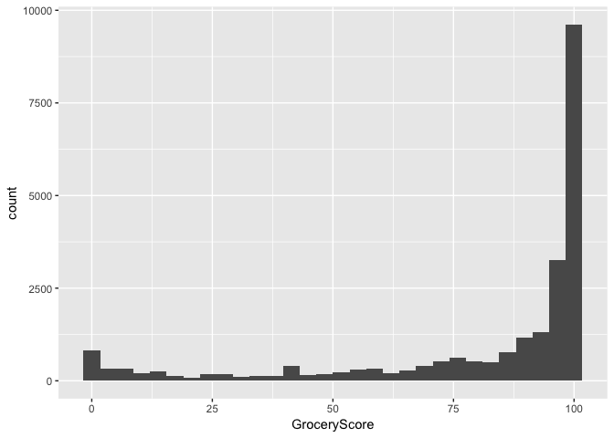

This Rmd file will be used as the file for my Thesis Analysis on causal mediation.

# Libraries

```r
library(tidyverse)
library(car)
library(foreign)
library(Hmisc)
library(knitr)
library(dplyr)
library(survival)
library(finalfit)
library(tableone)
library(lme4)
library(e1071)
library(mediation)
```

# Reading of Raw Survey Data

```r
ibiccs_readin <- read.csv("Database_recoded_2012-2014_weights_Walkscore_RTA.csv")
ibiccs_readin$TransitScore <- as.numeric(ibiccs_readin$TransitScore)
ibiccs_readin$BikeScore <- as.numeric(ibiccs_readin$BikeScore)
```

# Recode BMI

```r
## BMI
ibiccs_clean <- ibiccs_readin %>%
	mutate(bmi_category = case_when(
		bmi < 18.5 ~ "underweight",
		bmi >=30 & bmi <999 ~ "obese",
		bmi >=25 & bmi <30 ~ "overweight",
		bmi >=18.5 & bmi <25 ~ "normal weight",
		bmi == 9999 ~ "NA",
		TRUE ~ "other"
	))

table(ibiccs_clean$bmi, ibiccs_clean$bmi_category)
```

```
##        
##         normal weight obese other overweight underweight
##   17.5              0     0     0          0           2
##   17.51             0     0     0          0           2
##   17.54             0     0     0          0           4
##   17.56             0     0     0          0           3
##   17.57             0     0     0          0           5
##   17.58             0     0     0          0           6
##   17.59             0     0     0          0           1
##   17.63             0     0     0          0           4
##   17.64             0     0     0          0           2
##   17.65             0     0     0          0           1
##   17.68             0     0     0          0           3
##   17.7              0     0     0          0           2
##   17.71             0     0     0          0          12
##   17.72             0     0     0          0           8
##   17.74             0     0     0          0           4
##   17.75             0     0     0          0          22
##   17.76             0     0     0          0           4
##   17.77             0     0     0          0           1
##   17.79             0     0     0          0           2
##   17.81             0     0     0          0           2
##   17.85             0     0     0          0           7
##   17.87             0     0     0          0           2
##   17.89             0     0     0          0           2
##   17.91             0     0     0          0           1
##   17.92             0     0     0          0           4
##   17.94             0     0     0          0          18
##   17.95             0     0     0          0           6
##   17.96             0     0     0          0           3
##   17.97             0     0     0          0           3
##   17.98             0     0     0          0           1
##   18                0     0     0          0           3
##   18.01             0     0     0          0          15
##   18.02             0     0     0          0          25
##   18.07             0     0     0          0           5
##   18.08             0     0     0          0           9
##   18.11             0     0     0          0           3
##   18.13             0     0     0          0           8
##   18.14             0     0     0          0           5
##   18.16             0     0     0          0           3
##   18.17             0     0     0          0           2
##   18.18             0     0     0          0           4
##   18.19             0     0     0          0           5
##   18.21             0     0     0          0           1
##   18.22             0     0     0          0           1
##   18.24             0     0     0          0           1
##   18.25             0     0     0          0          21
##   18.26             0     0     0          0           2
##   18.27             0     0     0          0           2
##   18.29             0     0     0          0          31
##   18.3              0     0     0          0          33
##   18.31             0     0     0          0           7
##   18.33             0     0     0          0           3
##   18.34             0     0     0          0           7
##   18.35             0     0     0          0           2
##   18.36             0     0     0          0           3
##   18.37             0     0     0          0          11
##   18.38             0     0     0          0           1
##   18.4              0     0     0          0           2
##   18.42             0     0     0          0           3
##   18.44             0     0     0          0           1
##   18.45             0     0     0          0           1
##   18.46             0     0     0          0          23
##   18.47             0     0     0          0          10
##   18.48             0     0     0          0           3
##   18.51             2     0     0          0           0
##   18.52             5     0     0          0           0
##   18.54             9     0     0          0           0
##   18.55            22     0     0          0           0
##   18.56            30     0     0          0           0
##   18.58             1     0     0          0           0
##   18.59             1     0     0          0           0
##   18.6             27     0     0          0           0
##   18.61             1     0     0          0           0
##   18.62             4     0     0          0           0
##   18.64             8     0     0          0           0
##   18.65            15     0     0          0           0
##   18.66            12     0     0          0           0
##   18.68             2     0     0          0           0
##   18.69             1     0     0          0           0
##   18.7              2     0     0          0           0
##   18.71             4     0     0          0           0
##   18.72             2     0     0          0           0
##   18.73             4     0     0          0           0
##   18.74             4     0     0          0           0
##   18.75            13     0     0          0           0
##   18.78            14     0     0          0           0
##   18.79            24     0     0          0           0
##   18.8              7     0     0          0           0
##   18.81             1     0     0          0           0
##   18.82             1     0     0          0           0
##   18.83            10     0     0          0           0
##   18.84             5     0     0          0           0
##   18.85             1     0     0          0           0
##   18.87             4     0     0          0           0
##   18.88            55     0     0          0           0
##   18.89            15     0     0          0           0
##   18.9              2     0     0          0           0
##   18.91             1     0     0          0           0
##   18.92             2     0     0          0           0
##   18.93             1     0     0          0           0
##   18.94             7     0     0          0           0
##   18.95            11     0     0          0           0
##   18.96             1     0     0          0           0
##   18.97             5     0     0          0           0
##   18.98             1     0     0          0           0
##   18.99            24     0     0          0           0
##   19.01            36     0     0          0           0
##   19.02             3     0     0          0           0
##   19.03             1     0     0          0           0
##   19.05            17     0     0          0           0
##   19.06             1     0     0          0           0
##   19.08             5     0     0          0           0
##   19.09             1     0     0          0           0
##   19.1              1     0     0          0           0
##   19.11             9     0     0          0           0
##   19.13            10     0     0          0           0
##   19.14            51     0     0          0           0
##   19.16             8     0     0          0           0
##   19.18             1     0     0          0           0
##   19.19             4     0     0          0           0
##   19.2             40     0     0          0           0
##   19.21             1     0     0          0           0
##   19.22            15     0     0          0           0
##   19.23             4     0     0          0           0
##   19.25             2     0     0          0           0
##   19.26            10     0     0          0           0
##   19.27             7     0     0          0           0
##   19.28             1     0     0          0           0
##   19.3              6     0     0          0           0
##   19.31            11     0     0          0           0
##   19.33             3     0     0          0           0
##   19.37            74     0     0          0           0
##   19.38             6     0     0          0           0
##   19.39             5     0     0          0           0
##   19.4              5     0     0          0           0
##   19.41             1     0     0          0           0
##   19.42             5     0     0          0           0
##   19.44             3     0     0          0           0
##   19.46            12     0     0          0           0
##   19.47            13     0     0          0           0
##   19.48             3     0     0          0           0
##   19.49            53     0     0          0           0
##   19.5              1     0     0          0           0
##   19.53            59     0     0          0           0
##   19.55             1     0     0          0           0
##   19.57            22     0     0          0           0
##   19.58            67     0     0          0           0
##   19.59             2     0     0          0           0
##   19.6              2     0     0          0           0
##   19.61             3     0     0          0           0
##   19.63             1     0     0          0           0
##   19.64            18     0     0          0           0
##   19.65             6     0     0          0           0
##   19.66             5     0     0          0           0
##   19.67            12     0     0          0           0
##   19.68             2     0     0          0           0
##   19.69             8     0     0          0           0
##   19.71             1     0     0          0           0
##   19.73             6     0     0          0           0
##   19.74            49     0     0          0           0
##   19.75            18     0     0          0           0
##   19.77            59     0     0          0           0
##   19.78             1     0     0          0           0
##   19.79            17     0     0          0           0
##   19.8             13     0     0          0           0
##   19.81             4     0     0          0           0
##   19.82             1     0     0          0           0
##   19.83             2     0     0          0           0
##   19.84            37     0     0          0           0
##   19.85             9     0     0          0           0
##   19.86             1     0     0          0           0
##   19.88             1     0     0          0           0
##   19.89             6     0     0          0           0
##   19.9              7     0     0          0           0
##   19.91             6     0     0          0           0
##   19.92             8     0     0          0           0
##   19.93             1     0     0          0           0
##   19.94            34     0     0          0           0
##   19.95             2     0     0          0           0
##   19.96             2     0     0          0           0
##   19.97            62     0     0          0           0
##   19.99             8     0     0          0           0
##   20                7     0     0          0           0
##   20.01            11     0     0          0           0
##   20.02             6     0     0          0           0
##   20.03             6     0     0          0           0
##   20.05            15     0     0          0           0
##   20.06             5     0     0          0           0
##   20.07            13     0     0          0           0
##   20.08            17     0     0          0           0
##   20.09            37     0     0          0           0
##   20.11             2     0     0          0           0
##   20.12            72     0     0          0           0
##   20.14             3     0     0          0           0
##   20.16             5     0     0          0           0
##   20.17             1     0     0          0           0
##   20.18            84     0     0          0           0
##   20.19            10     0     0          0           0
##   20.2             20     0     0          0           0
##   20.22            32     0     0          0           0
##   20.23             3     0     0          0           0
##   20.24             2     0     0          0           0
##   20.25            18     0     0          0           0
##   20.27             1     0     0          0           0
##   20.28             2     0     0          0           0
##   20.29             3     0     0          0           0
##   20.3             19     0     0          0           0
##   20.31             5     0     0          0           0
##   20.32             1     0     0          0           0
##   20.33             1     0     0          0           0
##   20.34            38     0     0          0           0
##   20.35             1     0     0          0           0
##   20.36            93     0     0          0           0
##   20.37            82     0     0          0           0
##   20.38             9     0     0          0           0
##   20.39             1     0     0          0           0
##   20.4              4     0     0          0           0
##   20.41            13     0     0          0           0
##   20.42             1     0     0          0           0
##   20.43             5     0     0          0           0
##   20.45             4     0     0          0           0
##   20.47            13     0     0          0           0
##   20.48            19     0     0          0           0
##   20.5              9     0     0          0           0
##   20.51            21     0     0          0           0
##   20.52             5     0     0          0           0
##   20.53            49     0     0          0           0
##   20.54            13     0     0          0           0
##   20.55            15     0     0          0           0
##   20.56             2     0     0          0           0
##   20.57             3     0     0          0           0
##   20.58             2     0     0          0           0
##   20.6            119     0     0          0           0
##   20.61             3     0     0          0           0
##   20.62             5     0     0          0           0
##   20.63             6     0     0          0           0
##   20.64             3     0     0          0           0
##   20.66            20     0     0          0           0
##   20.67            59     0     0          0           0
##   20.68             7     0     0          0           0
##   20.69             4     0     0          0           0
##   20.7              8     0     0          0           0
##   20.71             1     0     0          0           0
##   20.72             7     0     0          0           0
##   20.73            12     0     0          0           0
##   20.74             2     0     0          0           0
##   20.75             5     0     0          0           0
##   20.76             8     0     0          0           0
##   20.77             3     0     0          0           0
##   20.78            44     0     0          0           0
##   20.8             96     0     0          0           0
##   20.81            34     0     0          0           0
##   20.82             8     0     0          0           0
##   20.83            24     0     0          0           0
##   20.85            18     0     0          0           0
##   20.87             1     0     0          0           0
##   20.89             1     0     0          0           0
##   20.9             24     0     0          0           0
##   20.91             4     0     0          0           0
##   20.92            21     0     0          0           0
##   20.93             4     0     0          0           0
##   20.94            19     0     0          0           0
##   20.95             2     0     0          0           0
##   20.96             4     0     0          0           0
##   20.97            16     0     0          0           0
##   20.98           111     0     0          0           0
##   20.99             9     0     0          0           0
##   21.01             1     0     0          0           0
##   21.02            20     0     0          0           0
##   21.03            69     0     0          0           0
##   21.06             1     0     0          0           0
##   21.08            11     0     0          0           0
##   21.09             8     0     0          0           0
##   21.1              2     0     0          0           0
##   21.11            31     0     0          0           0
##   21.12             3     0     0          0           0
##   21.13            12     0     0          0           0
##   21.14            89     0     0          0           0
##   21.16            16     0     0          0           0
##   21.18             8     0     0          0           0
##   21.19             4     0     0          0           0
##   21.2              2     0     0          0           0
##   21.21            10     0     0          0           0
##   21.22            16     0     0          0           0
##   21.23             2     0     0          0           0
##   21.24             5     0     0          0           0
##   21.25             5     0     0          0           0
##   21.26           106     0     0          0           0
##   21.27             1     0     0          0           0
##   21.28            16     0     0          0           0
##   21.29            84     0     0          0           0
##   21.3             25     0     0          0           0
##   21.31            16     0     0          0           0
##   21.34             9     0     0          0           0
##   21.35             5     0     0          0           0
##   21.37             2     0     0          0           0
##   21.38             1     0     0          0           0
##   21.4             13     0     0          0           0
##   21.41            61     0     0          0           0
##   21.42             1     0     0          0           0
##   21.43             7     0     0          0           0
##   21.44             2     0     0          0           0
##   21.45             7     0     0          0           0
##   21.46           111     0     0          0           0
##   21.47            22     0     0          0           0
##   21.48            50     0     0          0           0
##   21.5              2     0     0          0           0
##   21.51             3     0     0          0           0
##   21.52            69     0     0          0           0
##   21.53             4     0     0          0           0
##   21.54             6     0     0          0           0
##   21.55             2     0     0          0           0
##   21.56             9     0     0          0           0
##   21.57             4     0     0          0           0
##   21.58            22     0     0          0           0
##   21.59             3     0     0          0           0
##   21.6              6     0     0          0           0
##   21.61            30     0     0          0           0
##   21.62            16     0     0          0           0
##   21.63           136     0     0          0           0
##   21.64             2     0     0          0           0
##   21.66             3     0     0          0           0
##   21.67             2     0     0          0           0
##   21.68             1     0     0          0           0
##   21.7             48     0     0          0           0
##   21.71             8     0     0          0           0
##   21.72             7     0     0          0           0
##   21.73            32     0     0          0           0
##   21.74             7     0     0          0           0
##   21.75             1     0     0          0           0
##   21.76             5     0     0          0           0
##   21.77            27     0     0          0           0
##   21.79           114     0     0          0           0
##   21.8             27     0     0          0           0
##   21.81            13     0     0          0           0
##   21.83            17     0     0          0           0
##   21.86            10     0     0          0           0
##   21.87            11     0     0          0           0
##   21.88             1     0     0          0           0
##   21.89             4     0     0          0           0
##   21.9              5     0     0          0           0
##   21.91             8     0     0          0           0
##   21.92             5     0     0          0           0
##   21.93           109     0     0          0           0
##   21.94             6     0     0          0           0
##   21.95            98     0     0          0           0
##   21.96             1     0     0          0           0
##   21.97            65     0     0          0           0
##   21.99             2     0     0          0           0
##   22                3     0     0          0           0
##   22.01             2     0     0          0           0
##   22.03             2     0     0          0           0
##   22.04            12     0     0          0           0
##   22.05            85     0     0          0           0
##   22.06             1     0     0          0           0
##   22.07             2     0     0          0           0
##   22.08             3     0     0          0           0
##   22.1              7     0     0          0           0
##   22.11            20     0     0          0           0
##   22.12             1     0     0          0           0
##   22.13             5     0     0          0           0
##   22.14            92     0     0          0           0
##   22.15            71     0     0          0           0
##   22.16             2     0     0          0           0
##   22.18             3     0     0          0           0
##   22.2              8     0     0          0           0
##   22.21             3     0     0          0           0
##   22.22            14     0     0          0           0
##   22.24            65     0     0          0           0
##   22.25             1     0     0          0           0
##   22.26             7     0     0          0           0
##   22.27            10     0     0          0           0
##   22.28             1     0     0          0           0
##   22.3             22     0     0          0           0
##   22.31           141     0     0          0           0
##   22.32            51     0     0          0           0
##   22.34             3     0     0          0           0
##   22.35             9     0     0          0           0
##   22.37             2     0     0          0           0
##   22.38            55     0     0          0           0
##   22.39             1     0     0          0           0
##   22.4              8     0     0          0           0
##   22.41             1     0     0          0           0
##   22.42             5     0     0          0           0
##   22.43            25     0     0          0           0
##   22.44             5     0     0          0           0
##   22.45             8     0     0          0           0
##   22.46           141     0     0          0           0
##   22.47            20     0     0          0           0
##   22.48             6     0     0          0           0
##   22.49             4     0     0          0           0
##   22.5             45     0     0          0           0
##   22.51             2     0     0          0           0
##   22.52             5     0     0          0           0
##   22.53             6     0     0          0           0
##   22.55             5     0     0          0           0
##   22.58             1     0     0          0           0
##   22.59            13     0     0          0           0
##   22.6            116     0     0          0           0
##   22.62             2     0     0          0           0
##   22.63            10     0     0          0           0
##   22.65             5     0     0          0           0
##   22.66            21     0     0          0           0
##   22.67            66     0     0          0           0
##   22.68            12     0     0          0           0
##   22.7              1     0     0          0           0
##   22.71            80     0     0          0           0
##   22.72             3     0     0          0           0
##   22.73             6     0     0          0           0
##   22.74             3     0     0          0           0
##   22.75             2     0     0          0           0
##   22.76             3     0     0          0           0
##   22.77             5     0     0          0           0
##   22.78             4     0     0          0           0
##   22.79            12     0     0          0           0
##   22.8             13     0     0          0           0
##   22.81            99     0     0          0           0
##   22.82             2     0     0          0           0
##   22.83            14     0     0          0           0
##   22.84             3     0     0          0           0
##   22.85            12     0     0          0           0
##   22.86            75     0     0          0           0
##   22.87             6     0     0          0           0
##   22.88             3     0     0          0           0
##   22.89            66     0     0          0           0
##   22.91             4     0     0          0           0
##   22.92            16     0     0          0           0
##   22.95             1     0     0          0           0
##   22.96           112     0     0          0           0
##   22.97             1     0     0          0           0
##   22.98             5     0     0          0           0
##   22.99             5     0     0          0           0
##   23                9     0     0          0           0
##   23.01            46     0     0          0           0
##   23.02             9     0     0          0           0
##   23.03           100     0     0          0           0
##   23.04             2     0     0          0           0
##   23.05            27     0     0          0           0
##   23.06            48     0     0          0           0
##   23.08             9     0     0          0           0
##   23.09            29     0     0          0           0
##   23.1              7     0     0          0           0
##   23.11            42     0     0          0           0
##   23.12            12     0     0          0           0
##   23.13            14     0     0          0           0
##   23.14             1     0     0          0           0
##   23.15            12     0     0          0           0
##   23.17            93     0     0          0           0
##   23.18            20     0     0          0           0
##   23.19             1     0     0          0           0
##   23.21             5     0     0          0           0
##   23.22             4     0     0          0           0
##   23.23            17     0     0          0           0
##   23.24            16     0     0          0           0
##   23.25             1     0     0          0           0
##   23.26             7     0     0          0           0
##   23.27             1     0     0          0           0
##   23.29             4     0     0          0           0
##   23.3            128     0     0          0           0
##   23.31             3     0     0          0           0
##   23.32             5     0     0          0           0
##   23.33            21     0     0          0           0
##   23.34            17     0     0          0           0
##   23.36             2     0     0          0           0
##   23.37             5     0     0          0           0
##   23.38             9     0     0          0           0
##   23.39            14     0     0          0           0
##   23.4             91     0     0          0           0
##   23.41            23     0     0          0           0
##   23.42             9     0     0          0           0
##   23.43            15     0     0          0           0
##   23.44            54     0     0          0           0
##   23.45             2     0     0          0           0
##   23.46            13     0     0          0           0
##   23.48            14     0     0          0           0
##   23.49           109     0     0          0           0
##   23.5              1     0     0          0           0
##   23.51             3     0     0          0           0
##   23.52            13     0     0          0           0
##   23.53             7     0     0          0           0
##   23.54             5     0     0          0           0
##   23.55             2     0     0          0           0
##   23.56            18     0     0          0           0
##   23.57            84     0     0          0           0
##   23.58             1     0     0          0           0
##   23.59             3     0     0          0           0
##   23.6              6     0     0          0           0
##   23.62            33     0     0          0           0
##   23.63           105     0     0          0           0
##   23.65             3     0     0          0           0
##   23.66             1     0     0          0           0
##   23.67            88     0     0          0           0
##   23.68             3     0     0          0           0
##   23.69            15     0     0          0           0
##   23.7              3     0     0          0           0
##   23.71            64     0     0          0           0
##   23.72            14     0     0          0           0
##   23.73            84     0     0          0           0
##   23.74            11     0     0          0           0
##   23.75            72     0     0          0           0
##   23.77             1     0     0          0           0
##   23.78           102     0     0          0           0
##   23.79             1     0     0          0           0
##   23.8             11     0     0          0           0
##   23.81            17     0     0          0           0
##   23.82             5     0     0          0           0
##   23.83             5     0     0          0           0
##   23.84             3     0     0          0           0
##   23.85             6     0     0          0           0
##   23.86             8     0     0          0           0
##   23.87             9     0     0          0           0
##   23.88             8     0     0          0           0
##   23.89            17     0     0          0           0
##   23.9              1     0     0          0           0
##   23.91            78     0     0          0           0
##   23.92            12     0     0          0           0
##   23.94             5     0     0          0           0
##   23.95             3     0     0          0           0
##   23.96            17     0     0          0           0
##   23.98             1     0     0          0           0
##   23.99             9     0     0          0           0
##   24                7     0     0          0           0
##   24.01            12     0     0          0           0
##   24.02            20     0     0          0           0
##   24.03           120     0     0          0           0
##   24.04             3     0     0          0           0
##   24.05             5     0     0          0           0
##   24.06             1     0     0          0           0
##   24.07             7     0     0          0           0
##   24.09            10     0     0          0           0
##   24.1              1     0     0          0           0
##   24.11             8     0     0          0           0
##   24.12             3     0     0          0           0
##   24.13            77     0     0          0           0
##   24.14            29     0     0          0           0
##   24.15             1     0     0          0           0
##   24.16             4     0     0          0           0
##   24.17             4     0     0          0           0
##   24.18             4     0     0          0           0
##   24.19            15     0     0          0           0
##   24.2              5     0     0          0           0
##   24.21           136     0     0          0           0
##   24.22            19     0     0          0           0
##   24.23             1     0     0          0           0
##   24.24            11     0     0          0           0
##   24.25             5     0     0          0           0
##   24.27            10     0     0          0           0
##   24.28            99     0     0          0           0
##   24.3              2     0     0          0           0
##   24.31             4     0     0          0           0
##   24.33           109     0     0          0           0
##   24.34            18     0     0          0           0
##   24.36             1     0     0          0           0
##   24.37            87     0     0          0           0
##   24.38             3     0     0          0           0
##   24.39           132     0     0          0           0
##   24.41           222     0     0          0           0
##   24.42             1     0     0          0           0
##   24.43             3     0     0          0           0
##   24.44             2     0     0          0           0
##   24.45            14     0     0          0           0
##   24.46             5     0     0          0           0
##   24.47             1     0     0          0           0
##   24.48             3     0     0          0           0
##   24.49             7     0     0          0           0
##   24.5              2     0     0          0           0
##   24.51            15     0     0          0           0
##   24.52             4     0     0          0           0
##   24.53             6     0     0          0           0
##   24.54             5     0     0          0           0
##   24.55            10     0     0          0           0
##   24.56            37     0     0          0           0
##   24.57             1     0     0          0           0
##   24.58             3     0     0          0           0
##   24.59            10     0     0          0           0
##   24.6              4     0     0          0           0
##   24.61             5     0     0          0           0
##   24.62             6     0     0          0           0
##   24.63            31     0     0          0           0
##   24.64             1     0     0          0           0
##   24.65             7     0     0          0           0
##   24.66             3     0     0          0           0
##   24.67             8     0     0          0           0
##   24.68            15     0     0          0           0
##   24.69            94     0     0          0           0
##   24.72             7     0     0          0           0
##   24.73             1     0     0          0           0
##   24.74             1     0     0          0           0
##   24.75            13     0     0          0           0
##   24.77             3     0     0          0           0
##   24.78             8     0     0          0           0
##   24.8             90     0     0          0           0
##   24.81            19     0     0          0           0
##   24.82             7     0     0          0           0
##   24.83            18     0     0          0           0
##   24.85             1     0     0          0           0
##   24.86            12     0     0          0           0
##   24.87             2     0     0          0           0
##   24.89            86     0     0          0           0
##   24.9              9     0     0          0           0
##   24.91             8     0     0          0           0
##   24.92             1     0     0          0           0
##   24.93             2     0     0          0           0
##   24.94             6     0     0          0           0
##   24.95            11     0     0          0           0
##   24.96           120     0     0          0           0
##   24.97            14     0     0          0           0
##   24.98             4     0     0          0           0
##   24.99             3     0     0          0           0
##   25                0     0     0         15           0
##   25.01             0     0     0          2           0
##   25.02             0     0     0         65           0
##   25.03             0     0     0          1           0
##   25.04             0     0     0         14           0
##   25.06             0     0     0        130           0
##   25.07             0     0     0         36           0
##   25.08             0     0     0          2           0
##   25.09             0     0     0        157           0
##   25.1              0     0     0        145           0
##   25.11             0     0     0         69           0
##   25.13             0     0     0          3           0
##   25.14             0     0     0          7           0
##   25.15             0     0     0         10           0
##   25.16             0     0     0          2           0
##   25.18             0     0     0          8           0
##   25.19             0     0     0          3           0
##   25.2              0     0     0          3           0
##   25.22             0     0     0          1           0
##   25.23             0     0     0         11           0
##   25.24             0     0     0         31           0
##   25.25             0     0     0         17           0
##   25.26             0     0     0          1           0
##   25.27             0     0     0          2           0
##   25.28             0     0     0          1           0
##   25.29             0     0     0          9           0
##   25.31             0     0     0          5           0
##   25.32             0     0     0          5           0
##   25.33             0     0     0         11           0
##   25.34             0     0     0          4           0
##   25.35             0     0     0          3           0
##   25.36             0     0     0          4           0
##   25.37             0     0     0         11           0
##   25.38             0     0     0          9           0
##   25.39             0     0     0         48           0
##   25.4              0     0     0         22           0
##   25.41             0     0     0          4           0
##   25.42             0     0     0          6           0
##   25.43             0     0     0          2           0
##   25.44             0     0     0          1           0
##   25.46             0     0     0         11           0
##   25.47             0     0     0          3           0
##   25.48             0     0     0          2           0
##   25.5              0     0     0         20           0
##   25.51             0     0     0         36           0
##   25.52             0     0     0          5           0
##   25.53             0     0     0          4           0
##   25.54             0     0     0         30           0
##   25.55             0     0     0         10           0
##   25.56             0     0     0          9           0
##   25.58             0     0     0          6           0
##   25.59             0     0     0          2           0
##   25.61             0     0     0         77           0
##   25.62             0     0     0         12           0
##   25.63             0     0     0          8           0
##   25.65             0     0     0          1           0
##   25.66             0     0     0          9           0
##   25.68             0     0     0         42           0
##   25.69             0     0     0         70           0
##   25.7              0     0     0         11           0
##   25.71             0     0     0          8           0
##   25.72             0     0     0          1           0
##   25.73             0     0     0         21           0
##   25.75             0     0     0        119           0
##   25.76             0     0     0          2           0
##   25.77             0     0     0         63           0
##   25.78             0     0     0          4           0
##   25.79             0     0     0         51           0
##   25.8              0     0     0         63           0
##   25.82             0     0     0         90           0
##   25.83             0     0     0         98           0
##   25.84             0     0     0        125           0
##   25.85             0     0     0         93           0
##   25.86             0     0     0          4           0
##   25.88             0     0     0          2           0
##   25.89             0     0     0          5           0
##   25.9              0     0     0          3           0
##   25.91             0     0     0          1           0
##   25.92             0     0     0          5           0
##   25.93             0     0     0          6           0
##   25.94             0     0     0          9           0
##   25.95             0     0     0          8           0
##   25.96             0     0     0          4           0
##   25.97             0     0     0          8           0
##   25.98             0     0     0          2           0
##   25.99             0     0     0         10           0
##   26                0     0     0          7           0
##   26.01             0     0     0          1           0
##   26.04             0     0     0         10           0
##   26.05             0     0     0          4           0
##   26.07             0     0     0         10           0
##   26.08             0     0     0          5           0
##   26.09             0     0     0         11           0
##   26.11             0     0     0          6           0
##   26.12             0     0     0         10           0
##   26.13             0     0     0          4           0
##   26.14             0     0     0          5           0
##   26.15             0     0     0         31           0
##   26.16             0     0     0          7           0
##   26.17             0     0     0          9           0
##   26.18             0     0     0          2           0
##   26.19             0     0     0          8           0
##   26.21             0     0     0          1           0
##   26.22             0     0     0         20           0
##   26.23             0     0     0          4           0
##   26.24             0     0     0          4           0
##   26.25             0     0     0         14           0
##   26.26             0     0     0         20           0
##   26.29             0     0     0         17           0
##   26.3              0     0     0          9           0
##   26.31             0     0     0         19           0
##   26.32             0     0     0         13           0
##   26.33             0     0     0          1           0
##   26.34             0     0     0          5           0
##   26.35             0     0     0          1           0
##   26.36             0     0     0          6           0
##   26.37             0     0     0         21           0
##   26.39             0     0     0         46           0
##   26.4              0     0     0          2           0
##   26.41             0     0     0          1           0
##   26.42             0     0     0          1           0
##   26.43             0     0     0         15           0
##   26.45             0     0     0         88           0
##   26.46             0     0     0         11           0
##   26.47             0     0     0         12           0
##   26.48             0     0     0          1           0
##   26.49             0     0     0          1           0
##   26.5              0     0     0         51           0
##   26.51             0     0     0          1           0
##   26.52             0     0     0         44           0
##   26.54             0     0     0         76           0
##   26.56             0     0     0          4           0
##   26.57             0     0     0         76           0
##   26.58             0     0     0         98           0
##   26.59             0     0     0          2           0
##   26.6              0     0     0          1           0
##   26.61             0     0     0        128           0
##   26.62             0     0     0          2           0
##   26.63             0     0     0        231           0
##   26.64             0     0     0          3           0
##   26.65             0     0     0          2           0
##   26.66             0     0     0          6           0
##   26.68             0     0     0          9           0
##   26.69             0     0     0          7           0
##   26.7              0     0     0         11           0
##   26.71             0     0     0          2           0
##   26.72             0     0     0          3           0
##   26.73             0     0     0          3           0
##   26.75             0     0     0          2           0
##   26.76             0     0     0          4           0
##   26.78             0     0     0         19           0
##   26.79             0     0     0          5           0
##   26.81             0     0     0          1           0
##   26.82             0     0     0          1           0
##   26.83             0     0     0          8           0
##   26.84             0     0     0          1           0
##   26.85             0     0     0          6           0
##   26.86             0     0     0          1           0
##   26.87             0     0     0         10           0
##   26.88             0     0     0          7           0
##   26.89             0     0     0          9           0
##   26.9              0     0     0          2           0
##   26.91             0     0     0          8           0
##   26.92             0     0     0          2           0
##   26.93             0     0     0         13           0
##   26.94             0     0     0          6           0
##   26.95             0     0     0         11           0
##   26.96             0     0     0         32           0
##   26.97             0     0     0          5           0
##   26.98             0     0     0          2           0
##   26.99             0     0     0          3           0
##   27.01             0     0     0          2           0
##   27.02             0     0     0          6           0
##   27.04             0     0     0          2           0
##   27.05             0     0     0         17           0
##   27.06             0     0     0         15           0
##   27.07             0     0     0         14           0
##   27.09             0     0     0          1           0
##   27.1              0     0     0         10           0
##   27.12             0     0     0        131           0
##   27.13             0     0     0          3           0
##   27.14             0     0     0          3           0
##   27.15             0     0     0          3           0
##   27.16             0     0     0          4           0
##   27.17             0     0     0          9           0
##   27.18             0     0     0          1           0
##   27.2              0     0     0         31           0
##   27.21             0     0     0          3           0
##   27.22             0     0     0          8           0
##   27.25             0     0     0          8           0
##   27.26             0     0     0         77           0
##   27.27             0     0     0          8           0
##   27.28             0     0     0          6           0
##   27.29             0     0     0          6           0
##   27.31             0     0     0          3           0
##   27.32             0     0     0         45           0
##   27.34             0     0     0         36           0
##   27.35             0     0     0          3           0
##   27.36             0     0     0          2           0
##   27.37             0     0     0         80           0
##   27.39             0     0     0          6           0
##   27.4              0     0     0         14           0
##   27.41             0     0     0         46           0
##   27.44             0     0     0        133           0
##   27.46             0     0     0        144           0
##   27.47             0     0     0          2           0
##   27.48             0     0     0          9           0
##   27.49             0     0     0          1           0
##   27.5              0     0     0          7           0
##   27.51             0     0     0          4           0
##   27.52             0     0     0          1           0
##   27.53             0     0     0          2           0
##   27.54             0     0     0          1           0
##   27.55             0     0     0          3           0
##   27.56             0     0     0          3           0
##   27.57             0     0     0          5           0
##   27.59             0     0     0          1           0
##   27.6              0     0     0         22           0
##   27.61             0     0     0          4           0
##   27.62             0     0     0         14           0
##   27.63             0     0     0          6           0
##   27.64             0     0     0          4           0
##   27.67             0     0     0         12           0
##   27.68             0     0     0          3           0
##   27.69             0     0     0          5           0
##   27.7              0     0     0          1           0
##   27.71             0     0     0         19           0
##   27.72             0     0     0          5           0
##   27.73             0     0     0          6           0
##   27.74             0     0     0          1           0
##   27.75             0     0     0          3           0
##   27.76             0     0     0         21           0
##   27.78             0     0     0          6           0
##   27.79             0     0     0          6           0
##   27.8              0     0     0         34           0
##   27.81             0     0     0          7           0
##   27.82             0     0     0          6           0
##   27.84             0     0     0          7           0
##   27.86             0     0     0          1           0
##   27.87             0     0     0          4           0
##   27.88             0     0     0          6           0
##   27.89             0     0     0         62           0
##   27.91             0     0     0          4           0
##   27.92             0     0     0          2           0
##   27.93             0     0     0          3           0
##   27.94             0     0     0          1           0
##   27.96             0     0     0         11           0
##   27.97             0     0     0          2           0
##   27.98             0     0     0         41           0
##   27.99             0     0     0          5           0
##   28                0     0     0          9           0
##   28.01             0     0     0          3           0
##   28.03             0     0     0          2           0
##   28.04             0     0     0          2           0
##   28.06             0     0     0         68           0
##   28.07             0     0     0          3           0
##   28.08             0     0     0          5           0
##   28.09             0     0     0          2           0
##   28.1              0     0     0          1           0
##   28.11             0     0     0          1           0
##   28.12             0     0     0         16           0
##   28.13             0     0     0         47           0
##   28.15             0     0     0          4           0
##   28.16             0     0     0          1           0
##   28.17             0     0     0         11           0
##   28.19             0     0     0         88           0
##   28.21             0     0     0         11           0
##   28.22             0     0     0          1           0
##   28.23             0     0     0          3           0
##   28.24             0     0     0          1           0
##   28.25             0     0     0         87           0
##   28.27             0     0     0          1           0
##   28.28             0     0     0          7           0
##   28.29             0     0     0         51           0
##   28.3              0     0     0          1           0
##   28.31             0     0     0          4           0
##   28.32             0     0     0         51           0
##   28.34             0     0     0         78           0
##   28.35             0     0     0         33           0
##   28.36             0     0     0          1           0
##   28.37             0     0     0         15           0
##   28.38             0     0     0          3           0
##   28.4              0     0     0          3           0
##   28.41             0     0     0         10           0
##   28.43             0     0     0          2           0
##   28.44             0     0     0          1           0
##   28.45             0     0     0          1           0
##   28.46             0     0     0          1           0
##   28.47             0     0     0          6           0
##   28.48             0     0     0         46           0
##   28.49             0     0     0          3           0
##   28.5              0     0     0          6           0
##   28.52             0     0     0          2           0
##   28.53             0     0     0          5           0
##   28.55             0     0     0          5           0
##   28.57             0     0     0          7           0
##   28.59             0     0     0         30           0
##   28.6              0     0     0          6           0
##   28.62             0     0     0          8           0
##   28.63             0     0     0          4           0
##   28.65             0     0     0          5           0
##   28.66             0     0     0          5           0
##   28.67             0     0     0          4           0
##   28.68             0     0     0          1           0
##   28.7              0     0     0         81           0
##   28.71             0     0     0          3           0
##   28.72             0     0     0          3           0
##   28.73             0     0     0         13           0
##   28.74             0     0     0          6           0
##   28.75             0     0     0         16           0
##   28.76             0     0     0          2           0
##   28.78             0     0     0          2           0
##   28.79             0     0     0          3           0
##   28.8              0     0     0         32           0
##   28.82             0     0     0          1           0
##   28.84             0     0     0         10           0
##   28.85             0     0     0          1           0
##   28.87             0     0     0          4           0
##   28.88             0     0     0          1           0
##   28.89             0     0     0         78           0
##   28.9              0     0     0          8           0
##   28.91             0     0     0          1           0
##   28.93             0     0     0          1           0
##   28.94             0     0     0          1           0
##   28.95             0     0     0          2           0
##   28.97             0     0     0         28           0
##   28.98             0     0     0          5           0
##   29                0     0     0          2           0
##   29.01             0     0     0          7           0
##   29.02             0     0     0          2           0
##   29.03             0     0     0         19           0
##   29.04             0     0     0          2           0
##   29.05             0     0     0         88           0
##   29.07             0     0     0          1           0
##   29.08             0     0     0          1           0
##   29.09             0     0     0          1           0
##   29.1              0     0     0          8           0
##   29.11             0     0     0          1           0
##   29.12             0     0     0         36           0
##   29.13             0     0     0          3           0
##   29.14             0     0     0          1           0
##   29.15             0     0     0          2           0
##   29.16             0     0     0         18           0
##   29.18             0     0     0         65           0
##   29.19             0     0     0          4           0
##   29.2              0     0     0          1           0
##   29.21             0     0     0          6           0
##   29.22             0     0     0          2           0
##   29.23             0     0     0         28           0
##   29.24             0     0     0          5           0
##   29.26             0     0     0         40           0
##   29.27             0     0     0          1           0
##   29.29             0     0     0         92           0
##   29.3              0     0     0          3           0
##   29.32             0     0     0          1           0
##   29.35             0     0     0          4           0
##   29.36             0     0     0          1           0
##   29.37             0     0     0          8           0
##   29.38             0     0     0          8           0
##   29.39             0     0     0          1           0
##   29.4              0     0     0          2           0
##   29.41             0     0     0         26           0
##   29.42             0     0     0          1           0
##   29.43             0     0     0          3           0
##   29.44             0     0     0          4           0
##   29.45             0     0     0          2           0
##   29.49             0     0     0          1           0
##   29.5              0     0     0          3           0
##   29.52             0     0     0          4           0
##   29.53             0     0     0         73           0
##   29.54             0     0     0          3           0
##   29.55             0     0     0          1           0
##   29.57             0     0     0          3           0
##   29.58             0     0     0          2           0
##   29.6              0     0     0          4           0
##   29.62             0     0     0          7           0
##   29.63             0     0     0          5           0
##   29.64             0     0     0          1           0
##   29.65             0     0     0         26           0
##   29.67             0     0     0          2           0
##   29.68             0     0     0         15           0
##   29.69             0     0     0          3           0
##   29.7              0     0     0          5           0
##   29.71             0     0     0          2           0
##   29.74             0     0     0          1           0
##   29.75             0     0     0          1           0
##   29.76             0     0     0         48           0
##   29.79             0     0     0          2           0
##   29.8              0     0     0          4           0
##   29.81             0     0     0          1           0
##   29.82             0     0     0          3           0
##   29.83             0     0     0          2           0
##   29.84             0     0     0         57           0
##   29.85             0     0     0          3           0
##   29.86             0     0     0         25           0
##   29.87             0     0     0          3           0
##   29.88             0     0     0          1           0
##   29.9              0     0     0          5           0
##   29.91             0     0     0          1           0
##   29.92             0     0     0          1           0
##   29.94             0     0     0          2           0
##   29.95             0     0     0         56           0
##   29.98             0     0     0          2           0
##   29.99             0     0     0         19           0
##   30                0    13     0          0           0
##   30.02             0     4     0          0           0
##   30.04             0    50     0          0           0
##   30.05             0     1     0          0           0
##   30.07             0     2     0          0           0
##   30.08             0     4     0          0           0
##   30.11             0    43     0          0           0
##   30.12             0     4     0          0           0
##   30.13             0    54     0          0           0
##   30.14             0     2     0          0           0
##   30.17             0     9     0          0           0
##   30.18             0    29     0          0           0
##   30.21             0     2     0          0           0
##   30.23             0    29     0          0           0
##   30.24             0     4     0          0           0
##   30.25             0     4     0          0           0
##   30.27             0    24     0          0           0
##   30.28             0     4     0          0           0
##   30.29             0     3     0          0           0
##   30.3              0     7     0          0           0
##   30.31             0     2     0          0           0
##   30.34             0    21     0          0           0
##   30.36             0     6     0          0           0
##   30.37             0     3     0          0           0
##   30.38             0     4     0          0           0
##   30.4              0     1     0          0           0
##   30.41             0    74     0          0           0
##   30.42             0    13     0          0           0
##   30.43             0     7     0          0           0
##   30.45             0     2     0          0           0
##   30.46             0     1     0          0           0
##   30.47             0     5     0          0           0
##   30.5              0     2     0          0           0
##   30.51             0     3     0          0           0
##   30.52             0    39     0          0           0
##   30.54             0    17     0          0           0
##   30.55             0     4     0          0           0
##   30.56             0     3     0          0           0
##   30.59             0     2     0          0           0
##   30.61             0     1     0          0           0
##   30.62             0    12     0          0           0
##   30.65             0     4     0          0           0
##   30.66             0     2     0          0           0
##   30.67             0    38     0          0           0
##   30.68             0    43     0          0           0
##   30.69             0     1     0          0           0
##   30.7              0     1     0          0           0
##   30.71             0     4     0          0           0
##   30.72             0     3     0          0           0
##   30.73             0     9     0          0           0
##   30.74             0     1     0          0           0
##   30.75             0     4     0          0           0
##   30.78             0     2     0          0           0
##   30.79             0    26     0          0           0
##   30.8              0     3     0          0           0
##   30.81             0     9     0          0           0
##   30.82             0     2     0          0           0
##   30.83             0     4     0          0           0
##   30.85             0    23     0          0           0
##   30.86             0    16     0          0           0
##   30.87             0     1     0          0           0
##   30.88             0     1     0          0           0
##   30.9              0    54     0          0           0
##   30.91             0     3     0          0           0
##   30.95             0     4     0          0           0
##   30.96             0     2     0          0           0
##   30.99             0     9     0          0           0
##   31                0    35     0          0           0
##   31.01             0    21     0          0           0
##   31.02             0     2     0          0           0
##   31.04             0     3     0          0           0
##   31.05             0     3     0          0           0
##   31.07             0     2     0          0           0
##   31.08             0     1     0          0           0
##   31.09             0    30     0          0           0
##   31.12             0     1     0          0           0
##   31.14             0     4     0          0           0
##   31.15             0     1     0          0           0
##   31.16             0     1     0          0           0
##   31.17             0    11     0          0           0
##   31.18             0    12     0          0           0
##   31.19             0    23     0          0           0
##   31.2              0     1     0          0           0
##   31.21             0     1     0          0           0
##   31.22             0     1     0          0           0
##   31.24             0     5     0          0           0
##   31.25             0    35     0          0           0
##   31.28             0     3     0          0           0
##   31.29             0     1     0          0           0
##   31.31             0     5     0          0           0
##   31.32             0    58     0          0           0
##   31.33             0     1     0          0           0
##   31.35             0     6     0          0           0
##   31.36             0     1     0          0           0
##   31.38             0    15     0          0           0
##   31.4              0     2     0          0           0
##   31.41             0     2     0          0           0
##   31.42             0     1     0          0           0
##   31.45             0     2     0          0           0
##   31.46             0    13     0          0           0
##   31.47             0    15     0          0           0
##   31.48             0     2     0          0           0
##   31.5              0     1     0          0           0
##   31.51             0     2     0          0           0
##   31.52             0     2     0          0           0
##   31.53             0     4     0          0           0
##   31.55             0     1     0          0           0
##   31.57             0    39     0          0           0
##   31.58             0     5     0          0           0
##   31.59             0     1     0          0           0
##   31.6              0     2     0          0           0
##   31.62             0    37     0          0           0
##   31.63             0     5     0          0           0
##   31.64             0     4     0          0           0
##   31.65             0     3     0          0           0
##   31.66             0    20     0          0           0
##   31.67             0     1     0          0           0
##   31.69             0     1     0          0           0
##   31.71             0     3     0          0           0
##   31.72             0     1     0          0           0
##   31.74             0     7     0          0           0
##   31.75             0    32     0          0           0
##   31.78             0     2     0          0           0
##   31.79             0     2     0          0           0
##   31.8              0     5     0          0           0
##   31.82             0     1     0          0           0
##   31.83             0     1     0          0           0
##   31.84             0     1     0          0           0
##   31.85             0     1     0          0           0
##   31.86             0     1     0          0           0
##   31.87             0    18     0          0           0
##   31.89             0    39     0          0           0
##   31.91             0     1     0          0           0
##   31.92             0     2     0          0           0
##   31.93             0    24     0          0           0
##   31.95             0     5     0          0           0
##   31.96             0     4     0          0           0
##   31.99             0     2     0          0           0
##   32                0     3     0          0           0
##   32.01             0    16     0          0           0
##   32.02             0     3     0          0           0
##   32.06             0     1     0          0           0
##   32.08             0    21     0          0           0
##   32.1              0    17     0          0           0
##   32.11             0    10     0          0           0
##   32.12             0    15     0          0           0
##   32.14             0     2     0          0           0
##   32.17             0     1     0          0           0
##   32.22             0     2     0          0           0
##   32.23             0     1     0          0           0
##   32.24             0     1     0          0           0
##   32.26             0     2     0          0           0
##   32.27             0     2     0          0           0
##   32.28             0    89     0          0           0
##   32.29             0     5     0          0           0
##   32.32             0    12     0          0           0
##   32.36             0     2     0          0           0
##   32.38             0     1     0          0           0
##   32.41             0     2     0          0           0
##   32.42             0     1     0          0           0
##   32.43             0     1     0          0           0
##   32.44             0     4     0          0           0
##   32.45             0     8     0          0           0
##   32.49             0    33     0          0           0
##   32.5              0     7     0          0           0
##   32.54             0     1     0          0           0
##   32.55             0    17     0          0           0
##   32.56             0     7     0          0           0
##   32.58             0     1     0          0           0
##   32.6              0     5     0          0           0
##   32.61             0    36     0          0           0
##   32.62             0     3     0          0           0
##   32.64             0     1     0          0           0
##   32.65             0     3     0          0           0
##   32.66             0     1     0          0           0
##   32.69             0    17     0          0           0
##   32.71             0     1     0          0           0
##   32.73             0     2     0          0           0
##   32.74             0     7     0          0           0
##   32.77             0     5     0          0           0
##   32.78             0    12     0          0           0
##   32.8              0     1     0          0           0
##   32.81             0     1     0          0           0
##   32.84             0     2     0          0           0
##   32.85             0     1     0          0           0
##   32.86             0     1     0          0           0
##   32.87             0     3     0          0           0
##   32.88             0     1     0          0           0
##   32.89             0    24     0          0           0
##   32.9              0     1     0          0           0
##   32.91             0     2     0          0           0
##   32.92             0    24     0          0           0
##   32.93             0     2     0          0           0
##   32.95             0     7     0          0           0
##   32.96             0     2     0          0           0
##   32.98             0    21     0          0           0
##   32.99             0     1     0          0           0
##   33                0    24     0          0           0
##   33.02             0     1     0          0           0
##   33.03             0     1     0          0           0
##   33.05             0     2     0          0           0
##   33.07             0     5     0          0           0
##   33.08             0     1     0          0           0
##   33.09             0    11     0          0           0
##   33.11             0     2     0          0           0
##   33.12             0     9     0          0           0
##   33.13             0     2     0          0           0
##   33.14             0     1     0          0           0
##   33.19             0     4     0          0           0
##   33.2              0    14     0          0           0
##   33.21             0     1     0          0           0
##   33.23             0    21     0          0           0
##   33.25             0     2     0          0           0
##   33.28             0    49     0          0           0
##   33.29             0     4     0          0           0
##   33.3              0     1     0          0           0
##   33.31             0     1     0          0           0
##   33.32             0     2     0          0           0
##   33.33             0     3     0          0           0
##   33.36             0     1     0          0           0
##   33.38             0     8     0          0           0
##   33.43             0     1     0          0           0
##   33.44             0     1     0          0           0
##   33.45             0    25     0          0           0
##   33.46             0     1     0          0           0
##   33.47             0    26     0          0           0
##   33.48             0     4     0          0           0
##   33.49             0     1     0          0           0
##   33.52             0     5     0          0           0
##   33.57             0     1     0          0           0
##   33.58             0     1     0          0           0
##   33.59             0     3     0          0           0
##   33.61             0     2     0          0           0
##   33.63             0     2     0          0           0
##   33.64             0    12     0          0           0
##   33.66             0    17     0          0           0
##   33.67             0    11     0          0           0
##   33.68             0     1     0          0           0
##   33.72             0     8     0          0           0
##   33.73             0     1     0          0           0
##   33.75             0     7     0          0           0
##   33.76             0     1     0          0           0
##   33.77             0     1     0          0           0
##   33.79             0     1     0          0           0
##   33.8              0     4     0          0           0
##   33.81             0     2     0          0           0
##   33.82             0     1     0          0           0
##   33.84             0     7     0          0           0
##   33.86             0     1     0          0           0
##   33.87             0     1     0          0           0
##   33.89             0    15     0          0           0
##   33.91             0    29     0          0           0
##   33.93             0     1     0          0           0
##   33.96             0    13     0          0           0
##   33.97             0     2     0          0           0
##   33.99             0     4     0          0           0
##   34.01             0    12     0          0           0
##   34.02             0     7     0          0           0
##   34.03             0     1     0          0           0
##   34.04             0     1     0          0           0
##   34.06             0     5     0          0           0
##   34.08             0     4     0          0           0
##   34.11             0     4     0          0           0
##   34.14             0     2     0          0           0
##   34.15             0     1     0          0           0
##   34.16             0     2     0          0           0
##   34.17             0     6     0          0           0
##   34.18             0    12     0          0           0
##   34.21             0    11     0          0           0
##   34.22             0     4     0          0           0
##   34.27             0     2     0          0           0
##   34.28             0     1     0          0           0
##   34.3              0     5     0          0           0
##   34.31             0     1     0          0           0
##   34.33             0    38     0          0           0
##   34.34             0     3     0          0           0
##   34.36             0     2     0          0           0
##   34.37             0     3     0          0           0
##   34.38             0     1     0          0           0
##   34.39             0     3     0          0           0
##   34.4              0     1     0          0           0
##   34.41             0     2     0          0           0
##   34.44             0    24     0          0           0
##   34.45             0     4     0          0           0
##   34.46             0    23     0          0           0
##   34.48             0     1     0          0           0
##   34.5              0     1     0          0           0
##   34.52             0     1     0          0           0
##   34.53             0     3     0          0           0
##   34.54             0     3     0          0           0
##   34.56             0     1     0          0           0
##   34.57             0     5     0          0           0
##   34.58             0     5     0          0           0
##   34.6              0     3     0          0           0
##   34.61             0     3     0          0           0
##   34.67             0     6     0          0           0
##   34.68             0     1     0          0           0
##   34.69             0     1     0          0           0
##   34.7              0    20     0          0           0
##   34.72             0     4     0          0           0
##   34.74             0     1     0          0           0
##   34.75             0    11     0          0           0
##   34.77             0     1     0          0           0
##   34.78             0     1     0          0           0
##   34.8              0     1     0          0           0
##   34.81             0     2     0          0           0
##   34.85             0     2     0          0           0
##   34.87             0    18     0          0           0
##   34.88             0     1     0          0           0
##   34.9              0     5     0          0           0
##   34.93             0     2     0          0           0
##   34.95             0    14     0          0           0
##   34.96             0     2     0          0           0
##   34.97             0    19     0          0           0
##   34.98             0     1     0          0           0
##   34.99             0     2     0          0           0
##   35                0     2     0          0           0
##   35.02             0     1     0          0           0
##   35.05             0     2     0          0           0
##   35.08             0     1     0          0           0
##   35.11             0     3     0          0           0
##   35.12             0     1     0          0           0
##   35.13             0     1     0          0           0
##   35.15             0    17     0          0           0
##   35.16             0     1     0          0           0
##   35.19             0     4     0          0           0
##   35.24             0    12     0          0           0
##   35.26             0    12     0          0           0
##   35.28             0     4     0          0           0
##   35.29             0     1     0          0           0
##   35.3              0     1     0          0           0
##   35.31             0     5     0          0           0
##   35.33             0     3     0          0           0
##   35.35             0     1     0          0           0
##   35.36             0     3     0          0           0
##   35.4              0     1     0          0           0
##   35.43             0    22     0          0           0
##   35.44             0    16     0          0           0
##   35.48             0     2     0          0           0
##   35.49             0     1     0          0           0
##   35.5              0     1     0          0           0
##   35.51             0    19     0          0           0
##   35.52             0     1     0          0           0
##   35.54             0     2     0          0           0
##   35.55             0     1     0          0           0
##   35.56             0     6     0          0           0
##   35.57             0     1     0          0           0
##   35.58             0     7     0          0           0
##   35.59             0     1     0          0           0
##   35.61             0     2     0          0           0
##   35.62             0    10     0          0           0
##   35.67             0     8     0          0           0
##   35.71             0     3     0          0           0
##   35.73             0     9     0          0           0
##   35.74             0     8     0          0           0
##   35.75             0     1     0          0           0
##   35.78             0     4     0          0           0
##   35.8              0     1     0          0           0
##   35.81             0     1     0          0           0
##   35.82             0     3     0          0           0
##   35.83             0     3     0          0           0
##   35.85             0     1     0          0           0
##   35.87             0    20     0          0           0
##   35.88             0     3     0          0           0
##   35.89             0     1     0          0           0
##   35.9              0     5     0          0           0
##   35.93             0     2     0          0           0
##   35.94             0    11     0          0           0
##   35.95             0    18     0          0           0
##   35.98             0     2     0          0           0
##   35.99             0     1     0          0           0
##   36                0     1     0          0           0
##   36.01             0     1     0          0           0
##   36.02             0    14     0          0           0
##   36.03             0     2     0          0           0
##   36.04             0     3     0          0           0
##   36.05             0     6     0          0           0
##   36.11             0     1     0          0           0
##   36.13             0     1     0          0           0
##   36.15             0     1     0          0           0
##   36.18             0     6     0          0           0
##   36.19             0     2     0          0           0
##   36.2              0     1     0          0           0
##   36.21             0     3     0          0           0
##   36.22             0     1     0          0           0
##   36.25             0     3     0          0           0
##   36.26             0     7     0          0           0
##   36.28             0     7     0          0           0
##   36.29             0     3     0          0           0
##   36.31             0     4     0          0           0
##   36.32             0     6     0          0           0
##   36.33             0     1     0          0           0
##   36.35             0     1     0          0           0
##   36.36             0     4     0          0           0
##   36.38             0     1     0          0           0
##   36.39             0     3     0          0           0
##   36.48             0     1     0          0           0
##   36.49             0    17     0          0           0
##   36.52             0     1     0          0           0
##   36.56             0     2     0          0           0
##   36.58             0    23     0          0           0
##   36.59             0     4     0          0           0
##   36.6              0     2     0          0           0
##   36.61             0    13     0          0           0
##   36.62             0     6     0          0           0
##   36.65             0     1     0          0           0
##   36.68             0     1     0          0           0
##   36.69             0     9     0          0           0
##   36.73             0     1     0          0           0
##   36.78             0     2     0          0           0
##   36.8              0     2     0          0           0
##   36.81             0     4     0          0           0
##   36.82             0     1     0          0           0
##   36.84             0     1     0          0           0
##   36.87             0     7     0          0           0
##   36.88             0     1     0          0           0
##   36.9              0     8     0          0           0
##   36.91             0     2     0          0           0
##   36.92             0    16     0          0           0
##   36.93             0     1     0          0           0
##   36.94             0     5     0          0           0
##   36.95             0     1     0          0           0
##   36.96             0     8     0          0           0
##   37                0     1     0          0           0
##   37.01             0     2     0          0           0
##   37.03             0     1     0          0           0
##   37.08             0     1     0          0           0
##   37.09             0     5     0          0           0
##   37.1              0    10     0          0           0
##   37.11             0     7     0          0           0
##   37.12             0    13     0          0           0
##   37.18             0     1     0          0           0
##   37.2              0     4     0          0           0
##   37.22             0     2     0          0           0
##   37.23             0     3     0          0           0
##   37.25             0     9     0          0           0
##   37.28             0     1     0          0           0
##   37.3              0     6     0          0           0
##   37.31             0     9     0          0           0
##   37.36             0     6     0          0           0
##   37.37             0     6     0          0           0
##   37.38             0     2     0          0           0
##   37.41             0     3     0          0           0
##   37.42             0     2     0          0           0
##   37.44             0     7     0          0           0
##   37.45             0     1     0          0           0
##   37.46             0     1     0          0           0
##   37.49             0    10     0          0           0
##   37.5              0    10     0          0           0
##   37.54             0     1     0          0           0
##   37.57             0     1     0          0           0
##   37.59             0    11     0          0           0
##   37.6              0     2     0          0           0
##   37.61             0     4     0          0           0
##   37.64             0     1     0          0           0
##   37.65             0     1     0          0           0
##   37.66             0    12     0          0           0
##   37.68             0     2     0          0           0
##   37.71             0     1     0          0           0
##   37.73             0     2     0          0           0
##   37.75             0     1     0          0           0
##   37.76             0    19     0          0           0
##   37.77             0     1     0          0           0
##   37.79             0    11     0          0           0
##   37.8              0     2     0          0           0
##   37.83             0     1     0          0           0
##   37.84             0    13     0          0           0
##   37.86             0     1     0          0           0
##   37.87             0     1     0          0           0
##   37.88             0     1     0          0           0
##   37.89             0     6     0          0           0
##   37.91             0     3     0          0           0
##   37.93             0     5     0          0           0
##   37.95             0     3     0          0           0
##   37.96             0     8     0          0           0
##   37.97             0     8     0          0           0
##   37.98             0    14     0          0           0
##   38.01             0    19     0          0           0
##   38.02             0     1     0          0           0
##   38.04             0     2     0          0           0
##   38.06             0     4     0          0           0
##   38.07             0     1     0          0           0
##   38.08             0     2     0          0           0
##   38.09             0     7     0          0           0
##   38.1              0     1     0          0           0
##   38.11             0     1     0          0           0
##   38.14             0     1     0          0           0
##   38.17             0     1     0          0           0
##   38.21             0     3     0          0           0
##   38.22             0     4     0          0           0
##   38.24             0     1     0          0           0
##   38.25             0     1     0          0           0
##   38.26             0     1     0          0           0
##   38.27             0    17     0          0           0
##   38.28             0     4     0          0           0
##   38.31             0     3     0          0           0
##   38.34             0     1     0          0           0
##   38.35             0     3     0          0           0
##   38.37             0     3     0          0           0
##   38.39             0     4     0          0           0
##   38.41             0     4     0          0           0
##   38.42             0     1     0          0           0
##   38.43             0     6     0          0           0
##   38.44             0     2     0          0           0
##   38.45             0     1     0          0           0
##   38.52             0     9     0          0           0
##   38.53             0     1     0          0           0
##   38.58             0     1     0          0           0
##   38.59             0     1     0          0           0
##   38.61             0     1     0          0           0
##   38.62             0     4     0          0           0
##   38.65             0     4     0          0           0
##   38.66             0     1     0          0           0
##   38.67             0     1     0          0           0
##   38.69             0     2     0          0           0
##   38.73             0     2     0          0           0
##   38.74             0    18     0          0           0
##   38.75             0     1     0          0           0
##   38.77             0     2     0          0           0
##   38.79             0     2     0          0           0
##   38.82             0     1     0          0           0
##   38.91             0     1     0          0           0
##   38.92             0     1     0          0           0
##   38.95             0     1     0          0           0
##   38.97             0    14     0          0           0
##   39                0     1     0          0           0
##   39.05             0     5     0          0           0
##   39.06             0     7     0          0           0
##   39.08             0     1     0          0           0
##   39.11             0     1     0          0           0
##   39.13             0     5     0          0           0
##   39.14             0     2     0          0           0
##   39.16             0    16     0          0           0
##   39.2              0     1     0          0           0
##   39.22             0     1     0          0           0
##   39.25             0     1     0          0           0
##   39.27             0     1     0          0           0
##   39.28             0     1     0          0           0
##   39.32             0     5     0          0           0
##   39.33             0     4     0          0           0
##   39.36             0     1     0          0           0
##   39.38             0     1     0          0           0
##   39.45             0     1     0          0           0
##   39.46             0     2     0          0           0
##   39.48             0     9     0          0           0
##   39.49             0     1     0          0           0
##   39.53             0     8     0          0           0
##   39.54             0     1     0          0           0
##   39.58             0     4     0          0           0
##   39.6              0     2     0          0           0
##   39.67             0     1     0          0           0
##   39.68             0     5     0          0           0
##   39.75             0     5     0          0           0
##   39.77             0     2     0          0           0
##   39.8              0     4     0          0           0
##   39.84             0     1     0          0           0
##   39.86             0     1     0          0           0
##   39.87             0     8     0          0           0
##   39.89             0     1     0          0           0
##   39.94             0    16     0          0           0
##   40.03             0     1     0          0           0
##   40.09             0     3     0          0           0
##   40.14             0     2     0          0           0
##   40.17             0     2     0          0           0
##   40.18             0     6     0          0           0
##   40.19             0     1     0          0           0
##   40.21             0     1     0          0           0
##   40.24             0     4     0          0           0
##   40.25             0     1     0          0           0
##   40.27             0     1     0          0           0
##   40.29             0     1     0          0           0
##   40.31             0     1     0          0           0
##   40.34             0     4     0          0           0
##   40.35             0    19     0          0           0
##   40.37             0     1     0          0           0
##   40.39             0     1     0          0           0
##   40.41             0     2     0          0           0
##   40.42             0     1     0          0           0
##   40.44             0     1     0          0           0
##   40.45             0     3     0          0           0
##   40.49             0     1     0          0           0
```

# Recode Language

```r
table(ibiccs_clean$lang)
```

```
## 
##  Anglais Espagnol Franais 
##    22236       44     1621
```

```r
## Language
ibiccs_clean <- ibiccs_clean %>%
	mutate(language = case_when(
		lang == "Anglais" ~ "English",
		lang == "Espagnol" ~ "Fren/Span",
		lang == "Franais" ~ "Fren/Span"
	))
table(ibiccs_clean$lang, ibiccs_clean$language)
```

```
##           
##            English Fren/Span
##   Anglais    22236         0
##   Espagnol       0        44
##   Franais       0      1621
```

# Recode Gender

```r
table(ibiccs_clean$q54)
```

```
## 
## Femme Homme 
## 14042  9859
```

```r
#Gender
ibiccs_clean <- ibiccs_clean %>%
  mutate(gender = case_when(
    q54 == "Femme" ~ "Female",
    q54 == "Homme" ~ "Male"
  ))
table(ibiccs_clean$q54, ibiccs_clean$gender)
```

```
##        
##         Female  Male
##   Femme  14042     0
##   Homme      0  9859
```

# Recode Self-Rated Health

```r
table(ibiccs_clean$q2)
```

```
## 
##                            Bon                      Excellent 
##                           6725                           4803 
##                        Mauvais                          Moyen 
##                            489                           2104 
## Ne sais pas/Refuse de rpondre                       Trs bon 
##                             39                           9741
```

```r
ibiccs_clean <- ibiccs_clean %>%
  mutate(health = case_when(
    q2 == "Excellent" ~ "Excellent",
    q2 == "Trs bon" ~ "Excellent",
    q2 == "Bon" ~ "Good",
    q2 == "Moyen" ~ "Poor",
    q2 == "Mauvais" ~ "Poor"
  ))
table(ibiccs_clean$q2, ibiccs_clean$health)
```

```
##                                 
##                                  Excellent Good Poor
##   Bon                                    0 6725    0
##   Excellent                           4803    0    0
##   Mauvais                                0    0  489
##   Moyen                                  0    0 2104
##   Ne sais pas/Refuse de rpondre         0    0    0
##   Trs bon                            9741    0    0
```

# Recode Transportation

```r
table(ibiccs_clean$q13)
```

```
## 
##                               Autre (prcisez:) 
##                                              35 
##                                          Marche 
##                                            4484 
##                               Ne s'applique pas 
##                                              61 
##                                     Ne sais pas 
##                                              36 
##                                         Scooter 
##                                              21 
##                                            Taxi 
##                                             205 
##                             Transport en commun 
##                                            7886 
## Vhicule motoris (lou, emprunt, covoiturage) 
##                                            9768 
##                           Vlo en libre-service 
##                                             243 
##                                  Vlo personnel 
##                                             934 
##                             Voiture personnelle 
##                                             228
```

```r
ibiccs_clean <- ibiccs_clean %>%
  mutate(common_transportation = case_when(
    q13 == "Marche" ~ "Walking",
    q13 == "Vhicule motoris (lou, emprunt, covoiturage)" ~ "Car",
    q13 == "Voiture personnelle" ~ "Car",
    q13 == "Scooter" ~ "Other",
    q13 == "Taxi" ~ "Other",
    q13 == "Autre (prcisez:)" ~ "Other",
    q13 == "Transport en commun" ~ "Public Transportation",
    q13 == "Vlo en libre-service" ~ "Bicycle",
    q13 == "Vlo personnel" ~ "Bicycle"
  ))
table(ibiccs_clean$q13, ibiccs_clean$common_transportation)
```

```
##                                                  
##                                                   Bicycle  Car Other
##   Autre (prcisez:)                                     0    0    35
##   Marche                                                0    0     0
##   Ne s'applique pas                                     0    0     0
##   Ne sais pas                                           0    0     0
##   Scooter                                               0    0    21
##   Taxi                                                  0    0   205
##   Transport en commun                                   0    0     0
##   Vhicule motoris (lou, emprunt, covoiturage)       0 9768     0
##   Vlo en libre-service                               243    0     0
##   Vlo personnel                                      934    0     0
##   Voiture personnelle                                   0  228     0
##                                                  
##                                                   Public Transportation
##   Autre (prcisez:)                                                   0
##   Marche                                                              0
##   Ne s'applique pas                                                   0
##   Ne sais pas                                                         0
##   Scooter                                                             0
##   Taxi                                                                0
##   Transport en commun                                              7886
##   Vhicule motoris (lou, emprunt, covoiturage)                     0
##   Vlo en libre-service                                               0
##   Vlo personnel                                                      0
##   Voiture personnelle                                                 0
##                                                  
##                                                   Walking
##   Autre (prcisez:)                                     0
##   Marche                                             4484
##   Ne s'applique pas                                     0
##   Ne sais pas                                           0
##   Scooter                                               0
##   Taxi                                                  0
##   Transport en commun                                   0
##   Vhicule motoris (lou, emprunt, covoiturage)       0
##   Vlo en libre-service                                 0
##   Vlo personnel                                        0
##   Voiture personnelle                                   0
```

# Recode Physically Active (Y/N)

```r
table(ibiccs_clean$q14)
```

```
## 
## Ne sais pas/Ne s'applique pas                           Non 
##                           276                          4124 
##                           Oui            Refuse de rpondre 
##                         19471                            30
```

```r
ibiccs_clean <- ibiccs_clean %>%
  mutate(physically_active = case_when(
    q14 == "Oui" ~ "Yes",
    q14 == "Non" ~ "No"
  ))
table(ibiccs_clean$q14, ibiccs_clean$physically_active)
```

```
##                                
##                                    No   Yes
##   Ne sais pas/Ne s'applique pas     0     0
##   Non                            4124     0
##   Oui                               0 19471
##   Refuse de rpondre                0     0
```

# Recode Type of Physical Activity 

```r
# Code into Sedentary, Walking, Moderate, Vigorous Activity
table(ibiccs_clean$q18)
```

```
## 
##    1    2    3    4    5    6    7    8    9   10   11   12   13   14   15 
##  266  447   49   97  243  508  976   52  204   78  291   10   53  332  662 
##   16   17   18   19   20   21   22   23   24   25   26   27   28   29   30 
##   51   31  561  101  181    8  254  102   29   24   13   17  649    5   30 
##   31   32   33   34   35   36   37   38   39   40   41   42   43   44   45 
##  206    6   55  254   22  229  920   24   17   44    4    9   11   46    1 
##   46   47   48   49   50   51   52   53   54   55   56   57   58   59   60 
##   12    8   15   16    5  139   58   23  266    3    5  355  225   55   80 
##   61   62   63   64   65   66   67   68   69   70   71   96   97   98   99 
##  145   30   75 3243    8 1203   20  862   34   52   17  544 3167  594   40
```

```r
  ibiccs_clean <- ibiccs_clean %>%
    mutate(pa_level = case_when(
      q15 == 1 ~ "Low",
      q15 == 2 ~ "Moderate",
      q15 == 3 ~ "Low",
      q15 == 4 ~ "Moderate",
      q15 == 5 ~ "Vigorous",
      q15 == 6 ~ "Moderate",
      q15 == 7 ~ "Moderate",
      q15 == 8 ~ "Low",
      q15 == 9 ~ "Low",
      q15 == 10 ~ "Vigorous",
      q15 == 11 ~ "Vigorous",
      q15 == 12 ~ "Moderate",
      q15 == 13 ~ "Low",
      q15 == 14 ~ "Vigorous",
      q15 == 15 ~ "Vigorous",
      q15 == 16 ~ "Sedentary",
      q15 == 17 ~ "Low",
      q15 == 18 ~ "Moderate",
      q15 == 19 ~ "Low",
      q15 == 20 ~ "Moderate",
      q15 == 21 ~ "Moderate",
      q15 == 22 ~ "Vigorous",
      q15 == 23 ~ "Vigorous",
      q15 == 24 ~ "Low",
      q15 == 25 ~ "Low",
      q15 == 26 ~ "Low",
      q15 == 27 ~ "Moderate",
      q15 == 28 ~ "Vigorous",
      q15 == 29 ~ "Vigorous",
      q15 == 30 ~ "Vigorous",
      q15 == 31 ~ "Low",
      q15 == 32 ~ "Moderate",
      q15 == 33 ~ "Moderate",
      q15 == 34 ~ "Moderate",
      q15 == 35 ~ "Moderate",
      q15 == 36 ~ "Moderate",
      q15 == 37 ~ "Vigorous",
      q15 == 38 ~ "Vigorous",
      q15 == 39 ~ "Vigorous",
      q15 == 40 ~ "Vigorous",
      q15 == 41 ~ "Vigorous",
      q15 == 42 ~ "Moderate",
      q15 == 43 ~ "Moderate",
      q15 == 44 ~ "Vigorous",
      q15 == 45 ~ "Low",
      q15 == 46 ~ "Moderate",
      q15 == 47 ~ "Moderate",
      q15 == 48 ~ "Vigorous",
      q15 == 49 ~ "Moderate",
      q15 == 50 ~ "Moderate",
      q15 == 51 ~ "Vigorous",
      q15 == 52 ~ "Vigorous",
      q15 == 53 ~ "Vigorous",
      q15 == 54 ~ "Moderate",
      q15 == 55 ~ "Low",
      q15 == 56 ~ "Vigorous",
      q15 == 57 ~ "Moderate",
      q15 == 58 ~ "Vigorous",
      q15 == 59 ~ "Moderate",
      q15 == 60 ~ "Vigorous",
      q15 == 61 ~ "Vigorous",
      q15 == 62 ~ "Vigorous",
      q15 == 63 ~ "Vigorous",
      q15 == 64 ~ "Moderate",
      q15 == 65 ~ "Moderate",
      q15 == 66 ~ "Vigorous",
      q15 == 67 ~ "Vigorous",
      q15 == 68 ~ "Low",
      q15 == 69 ~ "Moderate",
      q15 == 96 ~ "NA",
      q15 == 97 ~ "Sedentary",
      q15 == 98 ~ "NA",
      q15 == 99 ~ "NA",
      TRUE ~ "NA"
    ))
table(ibiccs_clean$q15, ibiccs_clean$pa_level)
```

```
##     
##       Low Moderate   NA Sedentary Vigorous
##   1   157        0    0         0        0
##   2     0      629    0         0        0
##   3    47        0    0         0        0
##   4     0       81    0         0        0
##   5     0        0    0         0      288
##   6     0      436    0         0        0
##   7     0     1044    0         0        0
##   8    26        0    0         0        0
##   9   131        0    0         0        0
##   10    0        0    0         0       74
##   11    0        0    0         0      179
##   12    0       12    0         0        0
##   13   33        0    0         0        0
##   14    0        0    0         0      316
##   15    0        0    0         0      828
##   16    0        0    0        30        0
##   17   27        0    0         0        0
##   18    0      357    0         0        0
##   19  122        0    0         0        0
##   20    0      174    0         0        0
##   21    0        9    0         0        0
##   22    0        0    0         0      156
##   23    0        0    0         0      182
##   24   29        0    0         0        0
##   25   27        0    0         0        0
##   26    8        0    0         0        0
##   27    0       14    0         0        0
##   28    0        0    0         0      852
##   29    0        0    0         0        2
##   30    0        0    0         0       23
##   31   92        0    0         0        0
##   32    0        3    0         0        0
##   33    0       30    0         0        0
##   34    0      188    0         0        0
##   35    0       15    0         0        0
##   36    0       93    0         0        0
##   37    0        0    0         0     1555
##   38    0        0    0         0       25
##   39    0        0    0         0        8
##   40    0        0    0         0       34
##   41    0        0    0         0       15
##   42    0       18    0         0        0
##   43    0       13    0         0        0
##   44    0        0    0         0       56
##   46    0        1    0         0        0
##   47    0        3    0         0        0
##   48    0        0    0         0       11
##   49    0       11    0         0        0
##   50    0        4    0         0        0
##   51    0        0    0         0      167
##   52    0        0    0         0       56
##   53    0        0    0         0       25
##   54    0      142    0         0        0
##   55    8        0    0         0        0
##   56    0        0    0         0       10
##   57    0      300    0         0        0
##   58    0        0    0         0      199
##   59    0       28    0         0        0
##   60    0        0    0         0       60
##   61    0        0    0         0      179
##   62    0        0    0         0       28
##   63    0        0    0         0       98
##   64    0     7090    0         0        0
##   65    0        2    0         0        0
##   66    0        0    0         0     1165
##   67    0        0    0         0       13
##   68  840        0    0         0        0
##   69    0       74    0         0        0
##   70    0        0   65         0        0
##   71    0        0   21         0        0
##   96    0        0  362         0        0
##   98    0        0   54         0        0
##   99    0        0   17         0        0
```

# Recode Days Per Week Spent Travelling via Car

```r
table(ibiccs_clean$q21)
```

```
## 
##    0    1    2    3    4    5    6    7   98   99 
## 2785 2527 2631 2070 1648 3136 2019 4925 2037  123
```

```r
ibiccs_clean <- ibiccs_clean %>%
  mutate(day_per_week_motor_vehicle = case_when(
    q21 == 0 ~ 0,
    q21 == 1 ~ 1,
    q21 == 2 ~ 2,
    q21 == 3 ~ 3,
    q21 == 4 ~ 4,
    q21 == 5 ~ 5,
    q21 == 6 ~ 6,
    q21 == 7 ~ 7,
    q21 == 98 ~ NA_real_,
    q21 == 99 ~ NA_real_
  ))
table(ibiccs_clean$day_per_week_motor_vehicle)
```

```
## 
##    0    1    2    3    4    5    6    7 
## 2785 2527 2631 2070 1648 3136 2019 4925
```

# Recode Days Per Week Spent Travelling via Public Transport

```r
table(ibiccs_clean$q23)
```

```
## 
##    0    1    2    3    4    5    6    7    8    9 
## 6169 2993 2167 1598 1339 3617 1482 1583 2726  227
```

```r
ibiccs_clean <- ibiccs_clean %>%
  mutate(day_per_week_public_transit = case_when(
    q23 == 0 ~ 0,
    q23 == 1 ~ 1,
    q23 == 2 ~ 2,
    q23 == 3 ~ 3,
    q23 == 4 ~ 4,
    q23 == 5 ~ 5,
    q23 == 6 ~ 6,
    q23 == 7 ~ 7,
    q23 == 8 ~ NA_real_,
    q23 == 9 ~ NA_real_
  ))

table(ibiccs_clean$q23, ibiccs_clean$day_per_week_public_transit)
```

```
##    
##        0    1    2    3    4    5    6    7
##   0 6169    0    0    0    0    0    0    0
##   1    0 2993    0    0    0    0    0    0
##   2    0    0 2167    0    0    0    0    0
##   3    0    0    0 1598    0    0    0    0
##   4    0    0    0    0 1339    0    0    0
##   5    0    0    0    0    0 3617    0    0
##   6    0    0    0    0    0    0 1482    0
##   7    0    0    0    0    0    0    0 1583
##   8    0    0    0    0    0    0    0    0
##   9    0    0    0    0    0    0    0    0
```

# Recode Days Per Week Spent Travelling via Walking

```r
table(ibiccs_clean$q25)
```

```
## 
##    0    1    2    3    4    5    6    7    8    9 
## 2115 1841 2361 2245 1831 3994 1711 5436 2149  218
```

```r
ibiccs_clean <- ibiccs_clean %>%
  mutate(day_per_week_walking = case_when(
    q25 == 0 ~ 0,
    q25 == 1 ~ 1,
    q25 == 2 ~ 2,
    q25 == 3 ~ 3,
    q25 == 4 ~ 4,
    q25 == 5 ~ 5,
    q25 == 6 ~ 6,
    q25 == 7 ~ 7,
    q25 == 8 ~ NA_real_,
    q25 == 9 ~ NA_real_
  ))

table(ibiccs_clean$q25, ibiccs_clean$day_per_week_walking)
```

```
##    
##        0    1    2    3    4    5    6    7
##   0 2115    0    0    0    0    0    0    0
##   1    0 1841    0    0    0    0    0    0
##   2    0    0 2361    0    0    0    0    0
##   3    0    0    0 2245    0    0    0    0
##   4    0    0    0    0 1831    0    0    0
##   5    0    0    0    0    0 3994    0    0
##   6    0    0    0    0    0    0 1711    0
##   7    0    0    0    0    0    0    0 5436
##   8    0    0    0    0    0    0    0    0
##   9    0    0    0    0    0    0    0    0
```

# Recode Days Per Week Spent Travelling via Bike

```r
table(ibiccs_clean$q27)
```

```
## 
##     0     1     2     3     4     5     6     7    98    99 
## 12010  1793  1185   741   462   632   215   294  6395   174
```

```r
ibiccs_clean <- ibiccs_clean %>%
  mutate(day_per_week_bike = case_when(
    q27 == 0 ~ 0,
    q27 == 1 ~ 1,
    q27 == 2 ~ 2,
    q27 == 3 ~ 3,
    q27 == 4 ~ 4,
    q27 == 5 ~ 5,
    q27 == 6 ~ 6,
    q27 == 7 ~ 7,
    q27 == 98 ~ NA_real_,
    q27 == 99 ~ NA_real_
  ))

table(ibiccs_clean$q27, ibiccs_clean$day_per_week_bike)
```

```
##     
##          0     1     2     3     4     5     6     7
##   0  12010     0     0     0     0     0     0     0
##   1      0  1793     0     0     0     0     0     0
##   2      0     0  1185     0     0     0     0     0
##   3      0     0     0   741     0     0     0     0
##   4      0     0     0     0   462     0     0     0
##   5      0     0     0     0     0   632     0     0
##   6      0     0     0     0     0     0   215     0
##   7      0     0     0     0     0     0     0   294
##   98     0     0     0     0     0     0     0     0
##   99     0     0     0     0     0     0     0     0
```

# Recode Age

```r
summary(ibiccs_clean$q42)
```

```
##    Min. 1st Qu.  Median    Mean 3rd Qu.    Max. 
##    18.0    31.0    41.0    42.6    53.0    94.0
```

```r
#CCHS/STATCAN or continuous
```

# Recode Marital Status

```r
table(ibiccs_clean$q44)
```

```
## 
##               Clibatiare               Divorc (e) 
##                      9452                      1854 
##                 En couple Mari(e)/Conjoint de fait 
##                        79                     11287 
##        Refuse de rpondre                Spar (e) 
##                       291                       460 
##                 Veuf (ve) 
##                       478
```

```r
ibiccs_clean <- ibiccs_clean %>%
  mutate(marital_status = case_when(
    q44 == "Clibatiare" ~ "Single",
    q44 == "Divorc(e)" ~ "Divorced/Separated/Widowed",
    q44 == "En couple" ~ "Relationship/Married/Common-Law",
    q44 == "Mari(e)/Conjoint de fait" ~ "Relationship/Married/Common-Law",
    q44 == "Spar(e)" ~ "Divorced/Separated/Widowed",
    q44 == "Veuf(ve)" ~ "Divorced/Separated/Widowed"
  ))
table(ibiccs_clean$q44, ibiccs_clean$marital_status)
```

```
##                            
##                             Relationship/Married/Common-Law Single
##   Clibatiare                                             0   9452
##   Divorc (e)                                             0      0
##   En couple                                              79      0
##   Mari(e)/Conjoint de fait                           11287      0
##   Refuse de rpondre                                      0      0
##   Spar (e)                                              0      0
##   Veuf (ve)                                               0      0
```

# Recode Number of Children in Home

```r
table(ibiccs_clean$q45)
```

```
## 
##     1     2     3     4     5     6     7     8     9 
##  2915  1863   471   119    40    18     9 18191   275
```

```r
ibiccs_clean <- ibiccs_clean %>%
  mutate(children_household = case_when(
    q45 == 1 ~ 1,
    q45 == 2 ~ 2,
    q45 == 3 ~ 3,
    q45 == 4 ~ 3,
    q45 == 5 ~ 3,
    q45 == 6 ~ 3,
    q45 == 7 ~ 3,
    q45 == 8 ~ 0,
    q45 == 9 ~ NA_real_
  ))
table(ibiccs_clean$q45, ibiccs_clean$children_household)
```

```
##    
##         0     1     2     3
##   1     0  2915     0     0
##   2     0     0  1863     0
##   3     0     0     0   471
##   4     0     0     0   119
##   5     0     0     0    40
##   6     0     0     0    18
##   7     0     0     0     9
##   8 18191     0     0     0
##   9     0     0     0     0
```

# Recode Months in Current Home?

```r
summary(ibiccs_clean$q46b)
```

```
##    Min. 1st Qu.  Median    Mean 3rd Qu.    Max.    NA's 
##       0       3       5       5       6      81   15358
```

# Recode Ethnicity

```r
table(ibiccs_clean$q47)
```

```
## 
## Amrindien des tats-Unis / Autochtone d'Amrique 
##                                                79 
##             Arabe (Moyen-Orient, Afrique du Nord) 
##                                               135 
##                Asiatique / insulaire du Pacifique 
##                                              2661 
##                                             Autre 
##                                               129 
##                            Blanc(che) / Caucasien 
##                                             17154 
##                 Hispanique / Latino / Espagnol(e) 
##                                               933 
##                              Indien / Pakistanais 
##                                               330 
##                        Je prfre ne pas rpondre 
##                                               639 
##                                            Jewish 
##                                                16 
##                    Mixed / Mixed race / Bi-racial 
##                                               171 
##         Noir(e) / Africain(e) / Afro-Amricain(e) 
##                                              1654
```

```r
ibiccs_clean <- ibiccs_clean %>%
  mutate(ethnicity = case_when(
    q47 == "Amrindien des tats-Unis / Autochtone d'Amrique" ~ "Native American",
    q47 == "Arabe (Moyen-Orient, Afrique du Nord)" ~ "Other",
    q47 == "Asiatique / insulaire du Pacifique" ~ "Asian",
    q47 == "Autre" ~ "Other",
    q47 == "Blanc(che) / Caucasien" ~ "Causcasian",
    q47 == "Hispanique / Latino / Espagnol(e)" ~ "Hispanic",
    q47 == "Indien / Pakistanais" ~ "Other",
    q47 == "Jewish" ~ "Other",
    q47 == "Mixed / Mixed race / Bi-racial" ~ "Other",
    q47 == "Noir(e) / Africain(e) / Afro-Amricain(e)" ~ "African American"
  ))
table(ibiccs_clean$q47, ibiccs_clean$ethnicity)
```

```
##                                                    
##                                                     African American Asian
##   Amrindien des tats-Unis / Autochtone d'Amrique                0     0
##   Arabe (Moyen-Orient, Afrique du Nord)                            0     0
##   Asiatique / insulaire du Pacifique                               0  2661
##   Autre                                                            0     0
##   Blanc(che) / Caucasien                                           0     0
##   Hispanique / Latino / Espagnol(e)                                0     0
##   Indien / Pakistanais                                             0     0
##   Je prfre ne pas rpondre                                       0     0
##   Jewish                                                           0     0
##   Mixed / Mixed race / Bi-racial                                   0     0
##   Noir(e) / Africain(e) / Afro-Amricain(e)                     1654     0
##                                                    
##                                                     Causcasian Hispanic
##   Amrindien des tats-Unis / Autochtone d'Amrique          0        0
##   Arabe (Moyen-Orient, Afrique du Nord)                      0        0
##   Asiatique / insulaire du Pacifique                         0        0
##   Autre                                                      0        0
##   Blanc(che) / Caucasien                                 17154        0
##   Hispanique / Latino / Espagnol(e)                          0      933
##   Indien / Pakistanais                                       0        0
##   Je prfre ne pas rpondre                                 0        0
##   Jewish                                                     0        0
##   Mixed / Mixed race / Bi-racial                             0        0
##   Noir(e) / Africain(e) / Afro-Amricain(e)                  0        0
##                                                    
##                                                     Native American Other
##   Amrindien des tats-Unis / Autochtone d'Amrique              79     0
##   Arabe (Moyen-Orient, Afrique du Nord)                           0   135
##   Asiatique / insulaire du Pacifique                              0     0
##   Autre                                                           0   129
##   Blanc(che) / Caucasien                                          0     0
##   Hispanique / Latino / Espagnol(e)                               0     0
##   Indien / Pakistanais                                            0   330
##   Je prfre ne pas rpondre                                      0     0
##   Jewish                                                          0    16
##   Mixed / Mixed race / Bi-racial                                  0   171
##   Noir(e) / Africain(e) / Afro-Amricain(e)                       0     0
```

# Recode Country Born

```r
table(ibiccs_clean$q48)
```

```
## 
##     1     2     3     4     5     6     7     8     9    10    11    12 
##  7171 13175   246    11    11    20    29    49    20    28    14    17 
##    13    14    15    16    17    18    19    20    21    22    23    24 
##    15    12   109   153   104   231   166    39     7    22    77    43 
##    25    26    27    28    29    30    31    32    33    34    35    36 
##    73    28    21    57    27    18    93    63    44    48    66    33 
##    37    38    39    40    41    42    43    44    45    46    47    48 
##    33    23    25    24   159    51    27    43     8    15     4    40 
##    49    50    51    52    53    54    55    56    57    58    59    60 
##     5    26    14    11    20    11    13    34     3    18    13    13 
##    61    62    63    64    65    66    67    68    69    70    71    72 
##    12     9    33    24    13    15    20     9     6    13    10     3 
##    73    74    75    76    77    78    79    80    81    96    99 
##    16     8     4     5    19    12     6     9    13   196   473
```

```r
ibiccs_clean <- ibiccs_clean %>%
  mutate(country_born = case_when(
    q48 == 1 ~ "Canada",
    q48 == 2 ~ "United States",
    q48 >= 3 ~ "Other", 
    q48 <= 81 ~ "Other",
    q48 == 96 ~ "Other"
  ))
table(ibiccs_clean$q48, ibiccs_clean$country_born)
```

```
##     
##      Canada Other United States
##   1    7171     0             0
##   2       0     0         13175
##   3       0   246             0
##   4       0    11             0
##   5       0    11             0
##   6       0    20             0
##   7       0    29             0
##   8       0    49             0
##   9       0    20             0
##   10      0    28             0
##   11      0    14             0
##   12      0    17             0
##   13      0    15             0
##   14      0    12             0
##   15      0   109             0
##   16      0   153             0
##   17      0   104             0
##   18      0   231             0
##   19      0   166             0
##   20      0    39             0
##   21      0     7             0
##   22      0    22             0
##   23      0    77             0
##   24      0    43             0
##   25      0    73             0
##   26      0    28             0
##   27      0    21             0
##   28      0    57             0
##   29      0    27             0
##   30      0    18             0
##   31      0    93             0
##   32      0    63             0
##   33      0    44             0
##   34      0    48             0
##   35      0    66             0
##   36      0    33             0
##   37      0    33             0
##   38      0    23             0
##   39      0    25             0
##   40      0    24             0
##   41      0   159             0
##   42      0    51             0
##   43      0    27             0
##   44      0    43             0
##   45      0     8             0
##   46      0    15             0
##   47      0     4             0
##   48      0    40             0
##   49      0     5             0
##   50      0    26             0
##   51      0    14             0
##   52      0    11             0
##   53      0    20             0
##   54      0    11             0
##   55      0    13             0
##   56      0    34             0
##   57      0     3             0
##   58      0    18             0
##   59      0    13             0
##   60      0    13             0
##   61      0    12             0
##   62      0     9             0
##   63      0    33             0
##   64      0    24             0
##   65      0    13             0
##   66      0    15             0
##   67      0    20             0
##   68      0     9             0
##   69      0     6             0
##   70      0    13             0
##   71      0    10             0
##   72      0     3             0
##   73      0    16             0
##   74      0     8             0
##   75      0     4             0
##   76      0     5             0
##   77      0    19             0
##   78      0    12             0
##   79      0     6             0
##   80      0     9             0
##   81      0    13             0
##   96      0   196             0
##   99      0   473             0
```

# Recode Motor Vehicle Access

```r
table(ibiccs_clean$q50)
```

```
## 
## Ne sais pas/Ne s'applique pas                           Non 
##                           230                          6295 
##                           Oui 
##                         17376
```

```r
ibiccs_clean <- ibiccs_clean %>%
  mutate(motor_vehicle_access = case_when(
    q50 == "Non" ~ "No",
    q50 == "Oui" ~ "Yes"
  ))
table(ibiccs_clean$q50, ibiccs_clean$motor_vehicle_access)
```

```
##                                
##                                    No   Yes
##   Ne sais pas/Ne s'applique pas     0     0
##   Non                            6295     0
##   Oui                               0 17376
```

# Recode Education Level

```r
table(ibiccs_clean$q51)
```

```
## 
##                  Aucun grade, certificat ou diplme 
##                                                  32 
##                                   Autre (prcisez): 
##                                                  81 
##                                        Baccalaurat 
##                                                8638 
##                                               Cgep 
##                                                3197 
## Certificat d'cole de mtier, certificat ou diplme 
##                                                2559 
##         Diplme d'tudes secondaire ou l'quivalent 
##                                                2471 
##     Diplme universitaire suprieur au baccalaurat 
##                                                6655 
##                                      cole primaire 
##                                                  88 
##                                  Refuse de rpondre 
##                                                 180
```

```r
ibiccs_clean <- ibiccs_clean %>%
  mutate(education = case_when(
    q51 == "Aucun grade, certificat ou diplme" ~ "High School/Lower",
    q51 == "Baccalaurat" ~ "Baccalaureate",
    q51 == "Cgep" ~ "Cgep",
    q51 == "Certificat d'cole de mtier, certificat ou diplme" ~ "Certificate/Diploma",
    q51 == "Diplme d'tudes secondaire ou l'quivalent" ~ "High School/Lower",
    q51 == "Diplme universitaire suprieur au baccalaurat" ~ "Graduate School",
    q51 == "cole primaire" ~ "High School/Lower"
  ))
table(ibiccs_clean$q51, ibiccs_clean$education)
```

```
##                                                      
##                                                       Baccalaureate Cgep
##   Aucun grade, certificat ou diplme                              0     0
##   Autre (prcisez):                                               0     0
##   Baccalaurat                                                 8638     0
##   Cgep                                                           0  3197
##   Certificat d'cole de mtier, certificat ou diplme             0     0
##   Diplme d'tudes secondaire ou l'quivalent                     0     0
##   Diplme universitaire suprieur au baccalaurat                 0     0
##   cole primaire                                                  0     0
##   Refuse de rpondre                                              0     0
##                                                      
##                                                       Certificate/Diploma
##   Aucun grade, certificat ou diplme                                    0
##   Autre (prcisez):                                                     0
##   Baccalaurat                                                          0
##   Cgep                                                                 0
##   Certificat d'cole de mtier, certificat ou diplme                2559
##   Diplme d'tudes secondaire ou l'quivalent                           0
##   Diplme universitaire suprieur au baccalaurat                       0
##   cole primaire                                                        0
##   Refuse de rpondre                                                    0
##                                                      
##                                                       Graduate School
##   Aucun grade, certificat ou diplme                                0
##   Autre (prcisez):                                                 0
##   Baccalaurat                                                      0
##   Cgep                                                             0
##   Certificat d'cole de mtier, certificat ou diplme               0
##   Diplme d'tudes secondaire ou l'quivalent                       0
##   Diplme universitaire suprieur au baccalaurat                6655
##   cole primaire                                                    0
##   Refuse de rpondre                                                0
##                                                      
##                                                       High School/Lower
##   Aucun grade, certificat ou diplme                                 32
##   Autre (prcisez):                                                   0
##   Baccalaurat                                                        0
##   Cgep                                                               0
##   Certificat d'cole de mtier, certificat ou diplme                 0
##   Diplme d'tudes secondaire ou l'quivalent                      2471
##   Diplme universitaire suprieur au baccalaurat                     0
##   cole primaire                                                     88
##   Refuse de rpondre                                                  0
```

# Recode Occupation Status

```r
table(ibiccs_clean$Q52_occupational_status_category)
```

```
## 
##                  Disability  Full time or Self-employed 
##                         453                       15373 
## Homemaker or parental leave                   Part time 
##                         983                        1899 
##                     Retired                     Student 
##                        2434                        1586 
##     Unemployed seeking work 
##                         977
```

```r
ibiccs_clean <- ibiccs_clean %>%
  mutate(occupation_status = case_when(
    Q52_occupational_status_category == "Disability" ~ "Unemployed",
    Q52_occupational_status_category == "Full time or Self-employed" ~ "Employed",
    Q52_occupational_status_category == "Homemaker or parental leave" ~ "Unemployed",
    Q52_occupational_status_category == "Part time" ~ "Employed",
    Q52_occupational_status_category == "Retired" ~ "Unemployed",
    Q52_occupational_status_category == "Student" ~ "Student",
    Q52_occupational_status_category == "Unemployed seeking work" ~ "Unemployed"
  ))
table(ibiccs_clean$Q52_occupational_status_category, ibiccs_clean$occupation_status)
```

```
##                              
##                               Employed Student Unemployed
##   Disability                         0       0        453
##   Full time or Self-employed     15373       0          0
##   Homemaker or parental leave        0       0        983
##   Part time                       1899       0          0
##   Retired                            0       0       2434
##   Student                            0    1586          0
##   Unemployed seeking work            0       0        977
```

# Recode Household Income

```r
table(ibiccs_clean$q53)
```

```
## 
##   Entre 10000 $ and 19999 $ par anne 
##                                  1084 
## Entre 100000 $ and 149999 $ par anne 
##                                  3490 
## Entre 150000 $ and 199999 $ par anne 
##                                  1296 
##   Entre 20000 $ and 34999 $ par anne 
##                                  2061 
##   Entre 35000 $ and 49999 $ par anne 
##                                  2700 
##   Entre 50000 $ and 74999 $ par anne 
##                                  4396 
##   Entre 75000 $ and 99999 $ par anne 
##                                  3425 
##            Moins de 10000 $ par anne 
##                                  1366 
##            Plus de 200000 $ par anne 
##                                  1104 
##                    Refuse de rpondre 
##                                  2979
```

```r
ibiccs_clean <- ibiccs_clean %>%
  mutate(household_income = case_when(
    q53 == "Moins de 10000 $ par anne" ~ "$0-$19999",
    q53 == "Entre 10000 $ and 19999 $ par anne" ~ "$0-$19999",
    q53 == "Entre 20000 $ and 34999 $ par anne" ~ "$20000-$49999",
    q53 == "Entre 35000 $ and 49999 $ par anne" ~ "$20000-$49999",
    q53 == "Entre 50000 $ and 74999 $ par anne" ~ "$50000-$74999",
    q53 == "Entre 75000 $ and 99999 $ par anne" ~ "$75000-$99999",
    q53 == "Entre 100000 $ and 149999 $ par anne" ~ "$100000-149999",
    q53 == "Entre 150000 $ and 199999 $ par anne" ~ "$150000+",
    q53 == "Plus de 200000 $ par anne" ~ "$150000+",
    q53 == "Refuse de rpondre" ~ "Missing"
  ))
table(ibiccs_clean$q53, ibiccs_clean$household_income)
```

```
##                                        
##                                         $0-$19999 $100000-149999 $150000+
##   Entre 10000 $ and 19999 $ par anne        1084              0        0
##   Entre 100000 $ and 149999 $ par anne         0           3490        0
##   Entre 150000 $ and 199999 $ par anne         0              0     1296
##   Entre 20000 $ and 34999 $ par anne           0              0        0
##   Entre 35000 $ and 49999 $ par anne           0              0        0
##   Entre 50000 $ and 74999 $ par anne           0              0        0
##   Entre 75000 $ and 99999 $ par anne           0              0        0
##   Moins de 10000 $ par anne                 1366              0        0
##   Plus de 200000 $ par anne                    0              0     1104
##   Refuse de rpondre                            0              0        0
##                                        
##                                         $20000-$49999 $50000-$74999
##   Entre 10000 $ and 19999 $ par anne               0             0
##   Entre 100000 $ and 149999 $ par anne             0             0
##   Entre 150000 $ and 199999 $ par anne             0             0
##   Entre 20000 $ and 34999 $ par anne            2061             0
##   Entre 35000 $ and 49999 $ par anne            2700             0
##   Entre 50000 $ and 74999 $ par anne               0          4396
##   Entre 75000 $ and 99999 $ par anne               0             0
##   Moins de 10000 $ par anne                        0             0
##   Plus de 200000 $ par anne                        0             0
##   Refuse de rpondre                                0             0
##                                        
##                                         $75000-$99999 Missing
##   Entre 10000 $ and 19999 $ par anne               0       0
##   Entre 100000 $ and 149999 $ par anne             0       0
##   Entre 150000 $ and 199999 $ par anne             0       0
##   Entre 20000 $ and 34999 $ par anne               0       0
##   Entre 35000 $ and 49999 $ par anne               0       0
##   Entre 50000 $ and 74999 $ par anne               0       0
##   Entre 75000 $ and 99999 $ par anne            3425       0
##   Moins de 10000 $ par anne                        0       0
##   Plus de 200000 $ par anne                        0       0
##   Refuse de rpondre                                0    2979
```

# Filtering Out Cities

```r
Boston <- filter(ibiccs_clean, ville == "Boston")
Chicago <- filter(ibiccs_clean, ville == "Chicago")
Detroit <- filter(ibiccs_clean, ville == "Dtroit")
NewYork <- filter(ibiccs_clean, ville == "New-York")
Philadelphia <- filter(ibiccs_clean, ville == "Philadelphie")
Montreal <- filter(ibiccs_clean, ville == "Montral")
Toronto <- filter(ibiccs_clean, ville == "Toronto")
Vancouver <- filter(ibiccs_clean, ville == "Vancouver")
```

# Filtering Out Variables in Clean Data & Filtering Cities

```r
vars_clean <- c('language', 'ville', 'gender', 'health', 'common_transportation', 'physically_active', 'pa_level', 'day_per_week_motor_vehicle', 'day_per_week_public_transit', 'day_per_week_walking', 'day_per_week_bike', 'q42', 'marital_status', 'children_household', 'ethnicity', 'country_born', 'motor_vehicle_access', 'education', 'occupation_status', 'household_income', 'bmi', 'bmi_category', 'WalkScore', 'WalkScoreLabel', 'TransitScore', 'TransitScoreLabel', 'BikeScore', 'BikeScoreLabel', 'DiningandDrinkingScore', 'GroceryScore')

ibiccs <- dplyr::select(ibiccs_clean, vars_clean)
Boston <- dplyr::select(Boston, vars_clean)
Chicago <- dplyr::select(Chicago, vars_clean)
Detroit <- dplyr::select(Detroit, vars_clean)
NewYork <- dplyr::select(NewYork, vars_clean)
Philadelphia <- dplyr::select(Philadelphia, vars_clean)
Montreal <- dplyr::select(Montreal, vars_clean)
Toronto <- dplyr::select(Toronto, vars_clean)
Vancouver <- dplyr::select(Vancouver, vars_clean)
city <- rbind(Philadelphia, NewYork, Detroit, Chicago, Boston, Montreal, Toronto, Vancouver)
```

#Tables for Each City and Combined

```r
vars <- c('language', 'ville', 'gender', 'health', 'common_transportation', 'physically_active', 'pa_level', 'day_per_week_motor_vehicle', 'day_per_week_public_transit', 'day_per_week_walking', 'day_per_week_bike', 'q42', 'marital_status', 'children_household', 'ethnicity', 'country_born', 'motor_vehicle_access', 'education', 'occupation_status', 'household_income', 'bmi', 'bmi_category', 'WalkScore', 'WalkScoreLabel', 'TransitScore', 'TransitScoreLabel', 'BikeScore', 'BikeScoreLabel', 'DiningandDrinkingScore', 'GroceryScore')
CreateTableOne(vars = vars, strata = "ville", data = ibiccs)
```

```
##                                          Stratified by ville
##                                           Boston          Chicago       
##   n                                         1977           4085         
##   language = Fren/Span (%)                     3 (  0.2)     20 (  0.5) 
##   ville (%)                                                             
##      Boston                                 1977 (100.0)      0 (  0.0) 
##      Chicago                                   0 (  0.0)   4085 (100.0) 
##      Dtroit                                   0 (  0.0)      0 (  0.0) 
##      Montral                                  0 (  0.0)      0 (  0.0) 
##      New-York                                  0 (  0.0)      0 (  0.0) 
##      Philadelphie                              0 (  0.0)      0 (  0.0) 
##      Toronto                                   0 (  0.0)      0 (  0.0) 
##      Vancouver                                 0 (  0.0)      0 (  0.0) 
##   gender = Male (%)                          694 ( 35.1)   1628 ( 39.9) 
##   health (%)                                                            
##      Excellent                              1285 ( 65.2)   2559 ( 62.8) 
##      Good                                    521 ( 26.4)   1105 ( 27.1) 
##      Poor                                    166 (  8.4)    412 ( 10.1) 
##   common_transportation (%)                                             
##      Bicycle                                 104 (  5.3)    170 (  4.2) 
##      Car                                     685 ( 34.7)   1803 ( 44.3) 
##      Other                                    16 (  0.8)     48 (  1.2) 
##      Public Transportation                   669 ( 33.9)   1473 ( 36.2) 
##      Walking                                 500 ( 25.3)    576 ( 14.2) 
##   physically_active = Yes (%)               1703 ( 87.0)   3418 ( 84.5) 
##   pa_level (%)                                                          
##      Low                                     132 (  6.7)    285 (  7.0) 
##      Moderate                                837 ( 42.3)   1712 ( 41.9) 
##      NA                                      317 ( 16.0)    743 ( 18.2) 
##      Sedentary                                 2 (  0.1)      4 (  0.1) 
##      Vigorous                                689 ( 34.9)   1341 ( 32.8) 
##   day_per_week_motor_vehicle (mean (SD))    3.68 (2.47)    4.08 (2.35)  
##   day_per_week_public_transit (mean (SD))   2.95 (2.37)    2.77 (2.36)  
##   day_per_week_walking (mean (SD))          4.62 (2.25)    4.10 (2.30)  
##   day_per_week_bike (mean (SD))             0.87 (1.74)    0.84 (1.58)  
##   q42 (mean (SD))                          37.21 (13.86)  39.59 (12.73) 
##   marital_status = Single (%)               1025 ( 57.8)   1844 ( 50.5) 
##   children_household (mean (SD))            0.25 (0.62)    0.37 (0.77)  
##   ethnicity (%)                                                         
##      African American                        110 (  5.7)    449 ( 11.2) 
##      Asian                                   218 ( 11.3)    313 (  7.8) 
##      Causcasian                             1480 ( 76.6)   2863 ( 71.5) 
##      Hispanic                                 67 (  3.5)    300 (  7.5) 
##      Native American                           7 (  0.4)      8 (  0.2) 
##      Other                                    49 (  2.5)     72 (  1.8) 
##   country_born (%)                                                      
##      Canada                                   21 (  1.1)     31 (  0.8) 
##      Other                                   220 ( 11.1)    342 (  8.4) 
##      United States                          1736 ( 87.8)   3712 ( 90.9) 
##   motor_vehicle_access = Yes (%)            1442 ( 73.5)   3266 ( 80.5) 
##   education (%)                                                         
##      Baccalaureate                           757 ( 38.6)   1624 ( 40.1) 
##      Cgep                                   231 ( 11.8)    495 ( 12.2) 
##      Certificate/Diploma                      65 (  3.3)    293 (  7.2) 
##      Graduate School                         774 ( 39.5)   1320 ( 32.6) 
##      High School/Lower                       132 (  6.7)    317 (  7.8) 
##   occupation_status (%)                                                 
##      Employed                               1442 ( 73.5)   3160 ( 78.0) 
##      Student                                 272 ( 13.9)    271 (  6.7) 
##      Unemployed                              249 ( 12.7)    622 ( 15.3) 
##   household_income (%)                                                  
##      $0-$19999                               210 ( 10.6)    436 ( 10.7) 
##      $100000-149999                          304 ( 15.4)    617 ( 15.1) 
##      $150000+                                232 ( 11.7)    438 ( 10.7) 
##      $20000-$49999                           389 ( 19.7)    812 ( 19.9) 
##      $50000-$74999                           342 ( 17.3)    799 ( 19.6) 
##      $75000-$99999                           275 ( 13.9)    604 ( 14.8) 
##      Missing                                 225 ( 11.4)    379 (  9.3) 
##   bmi (mean (SD))                          25.06 (4.59)   25.89 (4.86)  
##   bmi_category (%)                                                      
##      normal weight                           982 ( 49.7)   1745 ( 42.7) 
##      obese                                   248 ( 12.5)    698 ( 17.1) 
##      other                                   192 (  9.7)    438 ( 10.7) 
##      overweight                              511 ( 25.8)   1139 ( 27.9) 
##      underweight                              44 (  2.2)     65 (  1.6) 
##   WalkScore (mean (SD))                    86.19 (17.12)  80.36 (17.45) 
##   WalkScoreLabel (%)                                                    
##                                               38 (  1.9)     51 (  1.2) 
##      Car-Dependent                            96 (  4.9)    274 (  6.7) 
##      Somewhat Walkable                        85 (  4.3)    510 ( 12.5) 
##      Very Walkable                           598 ( 30.2)   1680 ( 41.1) 
##      Walker's Paradise                      1160 ( 58.7)   1570 ( 38.4) 
##   TransitScore (mean (SD))                 73.62 (16.68)  77.05 (11.31) 
##   TransitScoreLabel (%)                                                 
##                                             1694 ( 85.7)   3713 ( 90.9) 
##      Excellent Transit                       201 ( 10.2)    277 (  6.8) 
##      Good Transit                             64 (  3.2)     82 (  2.0) 
##      Minimal Transit                           0 (  0.0)      0 (  0.0) 
##      Rider's Paradise                         16 (  0.8)     13 (  0.3) 
##      Some Transit                              2 (  0.1)      0 (  0.0) 
##   BikeScore (mean (SD))                   106.50 (32.02)  87.29 (29.96) 
##   BikeScoreLabel (%)                                                    
##                                              598 ( 30.2)    558 ( 13.7) 
##      Bikeable                                475 ( 24.0)   1113 ( 27.2) 
##      Biker's Paradise                        323 ( 16.3)      0 (  0.0) 
##      Somewhat Bikeable                        26 (  1.3)    264 (  6.5) 
##      Very Bikeable                           555 ( 28.1)   2150 ( 52.6) 
##   DiningandDrinkingScore (mean (SD))       86.12 (17.23)  82.41 (18.59) 
##   GroceryScore (mean (SD))                 88.94 (21.26)  78.71 (28.21) 
##                                          Stratified by ville
##                                           Dtroit         Montral      
##   n                                         3077           2678         
##   language = Fren/Span (%)                     3 (  0.1)   1617 ( 60.4) 
##   ville (%)                                                             
##      Boston                                    0 (  0.0)      0 (  0.0) 
##      Chicago                                   0 (  0.0)      0 (  0.0) 
##      Dtroit                                3077 (100.0)      0 (  0.0) 
##      Montral                                  0 (  0.0)   2678 (100.0) 
##      New-York                                  0 (  0.0)      0 (  0.0) 
##      Philadelphie                              0 (  0.0)      0 (  0.0) 
##      Toronto                                   0 (  0.0)      0 (  0.0) 
##      Vancouver                                 0 (  0.0)      0 (  0.0) 
##   gender = Male (%)                         1134 ( 36.9)   1159 ( 43.3) 
##   health (%)                                                            
##      Excellent                              1758 ( 57.2)   1501 ( 56.1) 
##      Good                                    928 ( 30.2)    791 ( 29.6) 
##      Poor                                    390 ( 12.7)    383 ( 14.3) 
##   common_transportation (%)                                             
##      Bicycle                                  75 (  2.5)    207 (  7.8) 
##      Car                                    2718 ( 89.2)    914 ( 34.3) 
##      Other                                    11 (  0.4)     29 (  1.1) 
##      Public Transportation                   105 (  3.4)   1019 ( 38.3) 
##      Walking                                 139 (  4.6)    492 ( 18.5) 
##   physically_active = Yes (%)               2355 ( 77.6)   2107 ( 80.0) 
##   pa_level (%)                                                          
##      Low                                     242 (  7.9)    160 (  6.0) 
##      Moderate                               1246 ( 40.5)   1335 ( 49.9) 
##      NA                                      776 ( 25.2)    647 ( 24.2) 
##      Sedentary                                11 (  0.4)      3 (  0.1) 
##      Vigorous                                802 ( 26.1)    533 ( 19.9) 
##   day_per_week_motor_vehicle (mean (SD))    5.75 (1.74)    3.24 (2.47)  
##   day_per_week_public_transit (mean (SD))   0.58 (1.55)    2.63 (2.39)  
##   day_per_week_walking (mean (SD))          2.32 (2.37)    3.96 (2.32)  
##   day_per_week_bike (mean (SD))             0.65 (1.43)    0.89 (1.67)  
##   q42 (mean (SD))                          41.11 (12.74)  47.02 (14.17) 
##   marital_status = Single (%)                988 ( 36.6)    906 ( 40.5) 
##   children_household (mean (SD))            0.60 (0.92)    0.31 (0.68)  
##   ethnicity (%)                                                         
##      African American                        361 ( 11.9)     52 (  2.0) 
##      Asian                                   123 (  4.1)    104 (  4.0) 
##      Causcasian                             2422 ( 80.0)   2301 ( 88.1) 
##      Hispanic                                 44 (  1.5)     50 (  1.9) 
##      Native American                          15 (  0.5)      8 (  0.3) 
##      Other                                    61 (  2.0)     97 (  3.7) 
##   country_born (%)                                                      
##      Canada                                   38 (  1.2)   2144 ( 80.1) 
##      Other                                   172 (  5.6)    500 ( 18.7) 
##      United States                          2867 ( 93.2)     34 (  1.3) 
##   motor_vehicle_access = Yes (%)            2936 ( 96.0)   1821 ( 68.5) 
##   education (%)                                                         
##      Baccalaureate                           951 ( 31.2)    788 ( 29.8) 
##      Cgep                                   506 ( 16.6)    528 ( 19.9) 
##      Certificate/Diploma                     444 ( 14.6)    330 ( 12.5) 
##      Graduate School                         736 ( 24.1)    581 ( 21.9) 
##      High School/Lower                       411 ( 13.5)    421 ( 15.9) 
##   occupation_status (%)                                                 
##      Employed                               2152 ( 70.4)   1750 ( 65.8) 
##      Student                                 243 (  7.9)    141 (  5.3) 
##      Unemployed                              663 ( 21.7)    769 ( 28.9) 
##   household_income (%)                                                  
##      $0-$19999                               412 ( 13.4)    286 ( 10.7) 
##      $100000-149999                          443 ( 14.4)    271 ( 10.1) 
##      $150000+                                193 (  6.3)    148 (  5.5) 
##      $20000-$49999                           666 ( 21.6)    731 ( 27.3) 
##      $50000-$74999                           536 ( 17.4)    523 ( 19.5) 
##      $75000-$99999                           461 ( 15.0)    365 ( 13.6) 
##      Missing                                 366 ( 11.9)    354 ( 13.2) 
##   bmi (mean (SD))                          26.75 (5.11)   25.88 (4.65)  
##   bmi_category (%)                                                      
##      normal weight                          1073 ( 34.9)   1122 ( 41.9) 
##      obese                                   661 ( 21.5)    454 ( 17.0) 
##      other                                   439 ( 14.3)    321 ( 12.0) 
##      overweight                              864 ( 28.1)    746 ( 27.9) 
##      underweight                              40 (  1.3)     35 (  1.3) 
##   WalkScore (mean (SD))                    36.05 (24.44)  81.88 (16.05) 
##   WalkScoreLabel (%)                                                    
##                                               27 (  0.9)     28 (  1.0) 
##      Car-Dependent                          2094 ( 68.1)    135 (  5.0) 
##      Somewhat Walkable                       733 ( 23.8)    303 ( 11.3) 
##      Very Walkable                           175 (  5.7)   1117 ( 41.7) 
##      Walker's Paradise                        48 (  1.6)   1095 ( 40.9) 
##   TransitScore (mean (SD))                 79.31 (7.37)   13.38 (18.57) 
##   TransitScoreLabel (%)                                                 
##                                             3077 (100.0)     45 (  1.7) 
##      Excellent Transit                         0 (  0.0)     71 (  2.7) 
##      Good Transit                              0 (  0.0)    485 ( 18.1) 
##      Minimal Transit                           0 (  0.0)     43 (  1.6) 
##      Rider's Paradise                          0 (  0.0)   1911 ( 71.4) 
##      Some Transit                              0 (  0.0)    123 (  4.6) 
##   BikeScore (mean (SD))                   133.74 (18.39)  86.99 (43.07) 
##   BikeScoreLabel (%)                                                    
##                                             2898 ( 94.2)    624 ( 23.3) 
##      Bikeable                                 90 (  2.9)    719 ( 26.8) 
##      Biker's Paradise                         40 (  1.3)    496 ( 18.5) 
##      Somewhat Bikeable                         1 (  0.0)     83 (  3.1) 
##      Very Bikeable                            48 (  1.6)    756 ( 28.2) 
##   DiningandDrinkingScore (mean (SD))       40.56 (26.92)  82.34 (17.58) 
##   GroceryScore (mean (SD))                 38.81 (34.49)  89.47 (17.42) 
##                                          Stratified by ville
##                                           New-York       Philadelphie   
##   n                                        3824            1478         
##   language = Fren/Span (%)                   16 (  0.4)       3 (  0.2) 
##   ville (%)                                                             
##      Boston                                   0 (  0.0)       0 (  0.0) 
##      Chicago                                  0 (  0.0)       0 (  0.0) 
##      Dtroit                                  0 (  0.0)       0 (  0.0) 
##      Montral                                 0 (  0.0)       0 (  0.0) 
##      New-York                              3824 (100.0)       0 (  0.0) 
##      Philadelphie                             0 (  0.0)    1478 (100.0) 
##      Toronto                                  0 (  0.0)       0 (  0.0) 
##      Vancouver                                0 (  0.0)       0 (  0.0) 
##   gender = Male (%)                        1593 ( 41.7)     536 ( 36.3) 
##   health (%)                                                            
##      Excellent                             2537 ( 66.4)     928 ( 62.9) 
##      Good                                   986 ( 25.8)     404 ( 27.4) 
##      Poor                                   295 (  7.7)     144 (  9.8) 
##   common_transportation (%)                                             
##      Bicycle                                184 (  4.8)      87 (  5.9) 
##      Car                                    360 (  9.4)     606 ( 41.1) 
##      Other                                   83 (  2.2)      17 (  1.2) 
##      Public Transportation                 2207 ( 57.9)     321 ( 21.8) 
##      Walking                                978 ( 25.7)     443 ( 30.1) 
##   physically_active = Yes (%)              3088 ( 82.0)    1193 ( 81.5) 
##   pa_level (%)                                                          
##      Low                                    236 (  6.2)      99 (  6.7) 
##      Moderate                              1578 ( 41.3)     627 ( 42.4) 
##      NA                                     809 ( 21.2)     312 ( 21.1) 
##      Sedentary                                2 (  0.1)       0 (  0.0) 
##      Vigorous                              1199 ( 31.4)     440 ( 29.8) 
##   day_per_week_motor_vehicle (mean (SD))   2.26 (2.21)     3.85 (2.41)  
##   day_per_week_public_transit (mean (SD))  4.17 (2.16)     2.32 (2.22)  
##   day_per_week_walking (mean (SD))         5.15 (2.00)     4.32 (2.31)  
##   day_per_week_bike (mean (SD))            0.89 (1.63)     0.98 (1.76)  
##   q42 (mean (SD))                         39.74 (13.55)   39.19 (13.51) 
##   marital_status = Single (%)              1879 ( 54.7)     729 ( 55.6) 
##   children_household (mean (SD))           0.33 (0.70)     0.38 (0.77)  
##   ethnicity (%)                                                         
##      African American                       336 (  9.0)     231 ( 15.9) 
##      Asian                                  483 ( 13.0)     128 (  8.8) 
##      Causcasian                            2493 ( 66.9)     999 ( 68.6) 
##      Hispanic                               317 (  8.5)      60 (  4.1) 
##      Native American                          9 (  0.2)       0 (  0.0) 
##      Other                                   90 (  2.4)      38 (  2.6) 
##   country_born (%)                                                      
##      Canada                                  50 (  1.3)       7 (  0.5) 
##      Other                                  497 ( 13.0)      94 (  6.4) 
##      United States                         3277 ( 85.7)    1377 ( 93.2) 
##   motor_vehicle_access = Yes (%)           1671 ( 44.2)    1109 ( 75.9) 
##   education (%)                                                         
##      Baccalaureate                         1589 ( 41.8)     509 ( 34.9) 
##      Cgep                                  466 ( 12.3)     206 ( 14.1) 
##      Certificate/Diploma                    168 (  4.4)      86 (  5.9) 
##      Graduate School                       1284 ( 33.8)     447 ( 30.6) 
##      High School/Lower                      294 (  7.7)     212 ( 14.5) 
##   occupation_status (%)                                                 
##      Employed                              2943 ( 77.7)    1049 ( 71.3) 
##      Student                                270 (  7.1)     172 ( 11.7) 
##      Unemployed                             574 ( 15.2)     251 ( 17.1) 
##   household_income (%)                                                  
##      $0-$19999                              397 ( 10.4)     227 ( 15.4) 
##      $100000-149999                         631 ( 16.5)     182 ( 12.3) 
##      $150000+                               598 ( 15.6)     124 (  8.4) 
##      $20000-$49999                          605 ( 15.8)     335 ( 22.7) 
##      $50000-$74999                          611 ( 16.0)     301 ( 20.4) 
##      $75000-$99999                          545 ( 14.3)     182 ( 12.3) 
##      Missing                                437 ( 11.4)     127 (  8.6) 
##   bmi (mean (SD))                         25.05 (4.52)    26.02 (4.97)  
##   bmi_category (%)                                                      
##      normal weight                         1841 ( 48.1)     618 ( 41.8) 
##      obese                                  490 ( 12.8)     273 ( 18.5) 
##      other                                  450 ( 11.8)     164 ( 11.1) 
##      overweight                             971 ( 25.4)     404 ( 27.3) 
##      underweight                             72 (  1.9)      19 (  1.3) 
##   WalkScore (mean (SD))                   95.88 (11.04)   86.27 (17.72) 
##   WalkScoreLabel (%)                                                    
##                                              65 (  1.7)      22 (  1.5) 
##      Car-Dependent                           61 (  1.6)      83 (  5.6) 
##      Somewhat Walkable                       33 (  0.9)      96 (  6.5) 
##      Very Walkable                          169 (  4.4)     244 ( 16.5) 
##      Walker's Paradise                     3496 ( 91.4)    1033 ( 69.9) 
##   TransitScore (mean (SD))                71.19 (24.19)   73.31 (21.71) 
##   TransitScoreLabel (%)                                                 
##                                            3394 ( 88.8)    1371 ( 92.8) 
##      Excellent Transit                       34 (  0.9)       0 (  0.0) 
##      Good Transit                             7 (  0.2)       2 (  0.1) 
##      Minimal Transit                          0 (  0.0)       0 (  0.0) 
##      Rider's Paradise                       389 ( 10.2)     105 (  7.1) 
##      Some Transit                             0 (  0.0)       0 (  0.0) 
##   BikeScore (mean (SD))                   90.15 (24.92)  106.32 (30.52) 
##   BikeScoreLabel (%)                                                    
##                                             178 (  4.7)     148 ( 10.0) 
##      Bikeable                              1137 ( 29.7)     236 ( 16.0) 
##      Biker's Paradise                       145 (  3.8)     594 ( 40.2) 
##      Somewhat Bikeable                       71 (  1.9)      38 (  2.6) 
##      Very Bikeable                         2293 ( 60.0)     462 ( 31.3) 
##   DiningandDrinkingScore (mean (SD))      96.05 (11.20)   87.70 (16.44) 
##   GroceryScore (mean (SD))                97.91 (11.21)   90.43 (22.07) 
##                                          Stratified by ville
##                                           Toronto        Vancouver     
##   n                                        4264           2518         
##   language = Fren/Span (%)                    3 (  0.1)      0 (  0.0) 
##   ville (%)                                                            
##      Boston                                   0 (  0.0)      0 (  0.0) 
##      Chicago                                  0 (  0.0)      0 (  0.0) 
##      Dtroit                                  0 (  0.0)      0 (  0.0) 
##      Montral                                 0 (  0.0)      0 (  0.0) 
##      New-York                                 0 (  0.0)      0 (  0.0) 
##      Philadelphie                             0 (  0.0)      0 (  0.0) 
##      Toronto                               4264 (100.0)      0 (  0.0) 
##      Vancouver                                0 (  0.0)   2518 (100.0) 
##   gender = Male (%)                        1984 ( 46.5)   1131 ( 44.9) 
##   health (%)                                                           
##      Excellent                             2572 ( 60.4)   1404 ( 55.9) 
##      Good                                  1220 ( 28.7)    770 ( 30.6) 
##      Poor                                   464 ( 10.9)    339 ( 13.5) 
##   common_transportation (%)                                            
##      Bicycle                                231 (  5.4)    119 (  4.7) 
##      Car                                   1665 ( 39.2)   1245 ( 49.5) 
##      Other                                   42 (  1.0)     15 (  0.6) 
##      Public Transportation                 1459 ( 34.3)    633 ( 25.2) 
##      Walking                                853 ( 20.1)    503 ( 20.0) 
##   physically_active = Yes (%)              3493 ( 83.0)   2114 ( 85.0) 
##   pa_level (%)                                                         
##      Low                                    256 (  6.0)    137 (  5.4) 
##      Moderate                              2131 ( 50.0)   1305 ( 51.8) 
##      NA                                     871 ( 20.4)    474 ( 18.8) 
##      Sedentary                                3 (  0.1)      5 (  0.2) 
##      Vigorous                              1003 ( 23.5)    597 ( 23.7) 
##   day_per_week_motor_vehicle (mean (SD))   3.66 (2.41)    4.05 (2.32)  
##   day_per_week_public_transit (mean (SD))  2.68 (2.27)    2.22 (2.23)  
##   day_per_week_walking (mean (SD))         4.19 (2.25)    4.22 (2.26)  
##   day_per_week_bike (mean (SD))            0.95 (1.73)    0.78 (1.53)  
##   q42 (mean (SD))                         46.98 (14.52)  47.49 (14.51) 
##   marital_status = Single (%)              1345 ( 37.6)    736 ( 34.4) 
##   children_household (mean (SD))           0.31 (0.68)    0.36 (0.72)  
##   ethnicity (%)                                                        
##      African American                        96 (  2.3)     19 (  0.8) 
##      Asian                                  572 ( 14.0)    720 ( 29.9) 
##      Causcasian                            3065 ( 74.8)   1531 ( 63.6) 
##      Hispanic                                71 (  1.7)     24 (  1.0) 
##      Native American                         14 (  0.3)     18 (  0.7) 
##      Other                                  279 (  6.8)     95 (  3.9) 
##   country_born (%)                                                     
##      Canada                                3058 ( 71.7)   1822 ( 72.4) 
##      Other                                 1100 ( 25.8)    630 ( 25.0) 
##      United States                          106 (  2.5)     66 (  2.6) 
##   motor_vehicle_access = Yes (%)           3057 ( 72.7)   2074 ( 83.1) 
##   education (%)                                                        
##      Baccalaureate                         1543 ( 36.6)    877 ( 35.7) 
##      Cgep                                  451 ( 10.7)    314 ( 12.8) 
##      Certificate/Diploma                    746 ( 17.7)    427 ( 17.4) 
##      Graduate School                        995 ( 23.6)    518 ( 21.1) 
##      High School/Lower                      481 ( 11.4)    323 ( 13.1) 
##   occupation_status (%)                                                
##      Employed                              3051 ( 72.2)   1725 ( 69.4) 
##      Student                                134 (  3.2)     83 (  3.3) 
##      Unemployed                            1040 ( 24.6)    679 ( 27.3) 
##   household_income (%)                                                 
##      $0-$19999                              301 (  7.1)    181 (  7.2) 
##      $100000-149999                         673 ( 15.8)    369 ( 14.7) 
##      $150000+                               463 ( 10.9)    204 (  8.1) 
##      $20000-$49999                          768 ( 18.0)    455 ( 18.1) 
##      $50000-$74999                          780 ( 18.3)    504 ( 20.0) 
##      $75000-$99999                          619 ( 14.5)    374 ( 14.9) 
##      Missing                                660 ( 15.5)    431 ( 17.1) 
##   bmi (mean (SD))                         25.60 (4.46)   24.87 (4.27)  
##   bmi_category (%)                                                     
##      normal weight                         1843 ( 43.2)   1213 ( 48.2) 
##      obese                                  586 ( 13.7)    262 ( 10.4) 
##      other                                  498 ( 11.7)    239 (  9.5) 
##      overweight                            1276 ( 29.9)    747 ( 29.7) 
##      underweight                             61 (  1.4)     57 (  2.3) 
##   WalkScore (mean (SD))                   79.56 (18.77)  78.79 (19.52) 
##   WalkScoreLabel (%)                                                   
##                                              26 (  0.6)     27 (  1.1) 
##      Car-Dependent                          351 (  8.2)    243 (  9.7) 
##      Somewhat Walkable                      700 ( 16.4)    403 ( 16.0) 
##      Very Walkable                         1467 ( 34.4)    869 ( 34.5) 
##      Walker's Paradise                     1720 ( 40.3)    976 ( 38.8) 
##   TransitScore (mean (SD))                48.42 (25.00)  45.29 (19.95) 
##   TransitScoreLabel (%)                                                
##                                              33 (  0.8)     88 (  3.5) 
##      Excellent Transit                     1547 ( 36.3)   1035 ( 41.1) 
##      Good Transit                           939 ( 22.0)    865 ( 34.4) 
##      Minimal Transit                         34 (  0.8)      5 (  0.2) 
##      Rider's Paradise                      1671 ( 39.2)    371 ( 14.7) 
##      Some Transit                            40 (  0.9)    154 (  6.1) 
##   BikeScore (mean (SD))                   70.90 (30.62)  92.61 (36.44) 
##   BikeScoreLabel (%)                                                   
##                                             120 (  2.8)    512 ( 20.3) 
##      Bikeable                              2214 ( 51.9)    745 ( 29.6) 
##      Biker's Paradise                       431 ( 10.1)    422 ( 16.8) 
##      Somewhat Bikeable                      500 ( 11.7)    179 (  7.1) 
##      Very Bikeable                          999 ( 23.4)    660 ( 26.2) 
##   DiningandDrinkingScore (mean (SD))      81.64 (19.10)  81.17 (19.59) 
##   GroceryScore (mean (SD))                82.99 (23.65)  84.45 (22.22) 
##                                          Stratified by ville
##                                           p      test
##   n                                                  
##   language = Fren/Span (%)                <0.001     
##   ville (%)                               <0.001     
##      Boston                                          
##      Chicago                                         
##      Dtroit                                         
##      Montral                                        
##      New-York                                        
##      Philadelphie                                    
##      Toronto                                         
##      Vancouver                                       
##   gender = Male (%)                       <0.001     
##   health (%)                              <0.001     
##      Excellent                                       
##      Good                                            
##      Poor                                            
##   common_transportation (%)               <0.001     
##      Bicycle                                         
##      Car                                             
##      Other                                           
##      Public Transportation                           
##      Walking                                         
##   physically_active = Yes (%)             <0.001     
##   pa_level (%)                            <0.001     
##      Low                                             
##      Moderate                                        
##      NA                                              
##      Sedentary                                       
##      Vigorous                                        
##   day_per_week_motor_vehicle (mean (SD))  <0.001     
##   day_per_week_public_transit (mean (SD)) <0.001     
##   day_per_week_walking (mean (SD))        <0.001     
##   day_per_week_bike (mean (SD))           <0.001     
##   q42 (mean (SD))                         <0.001     
##   marital_status = Single (%)             <0.001     
##   children_household (mean (SD))          <0.001     
##   ethnicity (%)                           <0.001     
##      African American                                
##      Asian                                           
##      Causcasian                                      
##      Hispanic                                        
##      Native American                                 
##      Other                                           
##   country_born (%)                        <0.001     
##      Canada                                          
##      Other                                           
##      United States                                   
##   motor_vehicle_access = Yes (%)          <0.001     
##   education (%)                           <0.001     
##      Baccalaureate                                   
##      Cgep                                           
##      Certificate/Diploma                             
##      Graduate School                                 
##      High School/Lower                               
##   occupation_status (%)                   <0.001     
##      Employed                                        
##      Student                                         
##      Unemployed                                      
##   household_income (%)                    <0.001     
##      $0-$19999                                       
##      $100000-149999                                  
##      $150000+                                        
##      $20000-$49999                                   
##      $50000-$74999                                   
##      $75000-$99999                                   
##      Missing                                         
##   bmi (mean (SD))                         <0.001     
##   bmi_category (%)                        <0.001     
##      normal weight                                   
##      obese                                           
##      other                                           
##      overweight                                      
##      underweight                                     
##   WalkScore (mean (SD))                   <0.001     
##   WalkScoreLabel (%)                      <0.001     
##                                                      
##      Car-Dependent                                   
##      Somewhat Walkable                               
##      Very Walkable                                   
##      Walker's Paradise                               
##   TransitScore (mean (SD))                <0.001     
##   TransitScoreLabel (%)                   <0.001     
##                                                      
##      Excellent Transit                               
##      Good Transit                                    
##      Minimal Transit                                 
##      Rider's Paradise                                
##      Some Transit                                    
##   BikeScore (mean (SD))                   <0.001     
##   BikeScoreLabel (%)                      <0.001     
##                                                      
##      Bikeable                                        
##      Biker's Paradise                                
##      Somewhat Bikeable                               
##      Very Bikeable                                   
##   DiningandDrinkingScore (mean (SD))      <0.001     
##   GroceryScore (mean (SD))                <0.001
```

# Table of Cities Combined

```r
vars <- c('language', 'ville', 'gender', 'health', 'common_transportation', 'physically_active', 'pa_level', 'day_per_week_motor_vehicle', 'day_per_week_public_transit', 'day_per_week_walking', 'day_per_week_bike', 'q42', 'marital_status', 'children_household', 'ethnicity', 'country_born', 'motor_vehicle_access', 'education', 'occupation_status', 'household_income', 'bmi', 'bmi_category', 'WalkScore', 'WalkScoreLabel', 'TransitScore', 'TransitScoreLabel', 'BikeScore', 'BikeScoreLabel', 'DiningandDrinkingScore', 'GroceryScore')
CreateTableOne(vars = vars, data = ibiccs)
```

```
##                                          
##                                           Overall      
##   n                                       23901        
##   language = Fren/Span (%)                 1665 ( 7.0) 
##   ville (%)                                            
##      Boston                                1977 ( 8.3) 
##      Chicago                               4085 (17.1) 
##      Dtroit                               3077 (12.9) 
##      Montral                              2678 (11.2) 
##      New-York                              3824 (16.0) 
##      Philadelphie                          1478 ( 6.2) 
##      Toronto                               4264 (17.8) 
##      Vancouver                             2518 (10.5) 
##   gender = Male (%)                        9859 (41.2) 
##   health (%)                                           
##      Excellent                            14544 (61.0) 
##      Good                                  6725 (28.2) 
##      Poor                                  2593 (10.9) 
##   common_transportation (%)                            
##      Bicycle                               1177 ( 4.9) 
##      Car                                   9996 (42.0) 
##      Other                                  261 ( 1.1) 
##      Public Transportation                 7886 (33.1) 
##      Walking                               4484 (18.8) 
##   physically_active = Yes (%)             19471 (82.5) 
##   pa_level (%)                                         
##      Low                                   1547 ( 6.5) 
##      Moderate                             10771 (45.1) 
##      NA                                    4949 (20.7) 
##      Sedentary                               30 ( 0.1) 
##      Vigorous                              6604 (27.6) 
##   day_per_week_motor_vehicle (mean (SD))   3.81 (2.49) 
##   day_per_week_public_transit (mean (SD))  2.65 (2.41) 
##   day_per_week_walking (mean (SD))         4.13 (2.38) 
##   day_per_week_bike (mean (SD))            0.85 (1.63) 
##   q42 (mean (SD))                         42.57 (14.20)
##   marital_status = Single (%)              9452 (45.4) 
##   children_household (mean (SD))           0.36 (0.75) 
##   ethnicity (%)                                        
##      African American                      1654 ( 7.1) 
##      Asian                                 2661 (11.4) 
##      Causcasian                           17154 (73.7) 
##      Hispanic                               933 ( 4.0) 
##      Native American                         79 ( 0.3) 
##      Other                                  781 ( 3.4) 
##   country_born (%)                                     
##      Canada                                7171 (30.0) 
##      Other                                 3555 (14.9) 
##      United States                        13175 (55.1) 
##   motor_vehicle_access = Yes (%)          17376 (73.4) 
##   education (%)                                        
##      Baccalaureate                         8638 (36.5) 
##      Cgep                                 3197 (13.5) 
##      Certificate/Diploma                   2559 (10.8) 
##      Graduate School                       6655 (28.2) 
##      High School/Lower                     2591 (11.0) 
##   occupation_status (%)                                
##      Employed                             17272 (72.9) 
##      Student                               1586 ( 6.7) 
##      Unemployed                            4847 (20.4) 
##   household_income (%)                                 
##      $0-$19999                             2450 (10.3) 
##      $100000-149999                        3490 (14.6) 
##      $150000+                              2400 (10.0) 
##      $20000-$49999                         4761 (19.9) 
##      $50000-$74999                         4396 (18.4) 
##      $75000-$99999                         3425 (14.3) 
##      Missing                               2979 (12.5) 
##   bmi (mean (SD))                         25.64 (4.70) 
##   bmi_category (%)                                     
##      normal weight                        10437 (43.7) 
##      obese                                 3672 (15.4) 
##      other                                 2741 (11.5) 
##      overweight                            6658 (27.9) 
##      underweight                            393 ( 1.6) 
##   WalkScore (mean (SD))                   77.81 (24.80)
##   WalkScoreLabel (%)                                   
##                                             284 ( 1.2) 
##      Car-Dependent                         3337 (14.0) 
##      Somewhat Walkable                     2863 (12.0) 
##      Very Walkable                         6319 (26.4) 
##      Walker's Paradise                    11098 (46.4) 
##   TransitScore (mean (SD))                60.30 (28.30)
##   TransitScoreLabel (%)                                
##                                           13415 (56.1) 
##      Excellent Transit                     3165 (13.2) 
##      Good Transit                          2444 (10.2) 
##      Minimal Transit                         82 ( 0.3) 
##      Rider's Paradise                      4476 (18.7) 
##      Some Transit                           319 ( 1.3) 
##   BikeScore (mean (SD))                   94.10 (35.92)
##   BikeScoreLabel (%)                                   
##                                            5636 (23.6) 
##      Bikeable                              6729 (28.2) 
##      Biker's Paradise                      2451 (10.3) 
##      Somewhat Bikeable                     1162 ( 4.9) 
##      Very Bikeable                         7923 (33.1) 
##   DiningandDrinkingScore (mean (SD))      79.53 (24.59)
##   GroceryScore (mean (SD))                80.76 (29.33)
```

# Histogram of BMI

```r
hist_bmi <- ggplot(city, aes(bmi)) + 
  geom_histogram()
plot(hist_bmi)
```

```
## `stat_bin()` using `bins = 30`. Pick better value with `binwidth`.
```

<!-- -->

```r
hist_bmi_city <- ggplot(city, aes(bmi)) + 
  geom_density(aes(group = ville, colour = ville)) +
  theme_minimal()
plot(hist_bmi_city)
```

<!-- -->

# Histogram of WalkScore

```r
hist_walkscore <- ggplot(city, aes(WalkScore)) + 
  geom_histogram()
plot(hist_walkscore)
```

```
## `stat_bin()` using `bins = 30`. Pick better value with `binwidth`.
```

<!-- -->

```r
hist_walkscore_city <- ggplot(city, aes(WalkScore)) + 
  geom_density(aes(group = ville, colour = ville)) +
  theme_minimal()
plot(hist_walkscore_city)
```

<!-- -->

# Histogram of TransitScore

```r
hist_trasnsitscore <- ggplot(city, aes(TransitScore)) + 
  geom_histogram()
plot(hist_trasnsitscore)
```

```
## `stat_bin()` using `bins = 30`. Pick better value with `binwidth`.
```

<!-- -->

```r
hist_trasnsitscore_city <- ggplot(city, aes(TransitScore)) + 
  geom_density(aes(group = ville, colour = ville)) +
  theme_minimal()
plot(hist_trasnsitscore_city)
```

<!-- -->

# Histogram of GroceryScore

```r
hist_groceryscore <- ggplot(city, aes(GroceryScore)) + 
  geom_histogram()
plot(hist_groceryscore)
```

```
## `stat_bin()` using `bins = 30`. Pick better value with `binwidth`.
```

<!-- -->

```r
hist_groceryscore_city <- ggplot(city, aes(GroceryScore)) + 
  geom_density(aes(group = ville, colour = ville)) +
  theme_minimal()
plot(hist_groceryscore_city)
```

<!-- -->

# Histogram of DiningAndDrinkingScore

```r
hist_diningdrinkingscore <- ggplot(city, aes(DiningandDrinkingScore)) + 
  geom_histogram()
plot(hist_diningdrinkingscore)
```

```
## `stat_bin()` using `bins = 30`. Pick better value with `binwidth`.
```

<!-- -->

```r
hist_diningdrinkingscore_city <- ggplot(city, aes(DiningandDrinkingScore)) + 
  geom_density(aes(group = ville, colour = ville)) +
  theme_minimal()
plot(hist_diningdrinkingscore_city)
```

<!-- -->

# Linear Regression

```r
explanatory <- c('language', 'ville', 'gender', 'health', 'physically_active', 'q42', 'marital_status', 'country_born', 'motor_vehicle_access', 'occupation_status', 'bmi_category', 'WalkScore', 'TransitScore', 'BikeScore', 'DiningandDrinkingScore', 'GroceryScore', 'day_per_week_motor_vehicle', 'day_per_week_public_transit', 'day_per_week_walking', 'day_per_week_bike', 'children_household')
dependent <- "bmi"
ibiccs %>%
  finalfit.lm(dependent, explanatory, na.rm = TRUE)
```

```
##                 Dependent: bmi                                  Mean (sd)
## 25                    language                         English 25.6 (4.7)
## 26                                                   Fren/Span 26.0 (4.8)
## 38                       ville                          Boston 25.1 (4.6)
## 39                                                     Chicago 25.9 (4.9)
## 40                                                     Dtroit 26.7 (5.1)
## 41                                                    Montral 25.9 (4.7)
## 42                                                    New-York 25.0 (4.5)
## 43                                                Philadelphie 26.0 (5.0)
## 44                                                     Toronto 25.6 (4.5)
## 45                                                   Vancouver 24.9 (4.3)
## 19                      gender                          Female 25.0 (4.9)
## 20                                                        Male 26.4 (4.3)
## 22                      health                       Excellent 24.7 (4.1)
## 23                                                        Good 26.8 (5.0)
## 24                                                        Poor 28.4 (5.6)
## 34           physically_active                              No 26.7 (5.3)
## 35                                                         Yes 25.4 (4.5)
## 36                         q42                         [18,94] 25.6 (4.7)
## 27              marital_status Relationship/Married/Common-Law 25.8 (4.6)
## 28                                                      Single 25.2 (4.8)
## 11                country_born                          Canada 25.7 (4.6)
## 12                                                       Other 24.8 (4.3)
## 13                                               United States 25.9 (4.9)
## 29        motor_vehicle_access                              No 25.2 (4.8)
## 30                                                         Yes 25.8 (4.7)
## 31           occupation_status                        Employed 25.6 (4.6)
## 32                                                     Student 24.2 (4.8)
## 33                                                  Unemployed 26.4 (4.9)
## 2                 bmi_category                   normal weight 22.2 (1.7)
## 3                                                        obese 33.6 (2.8)
## 4                                                   overweight 27.1 (1.4)
## 5                                                  underweight 18.1 (0.3)
## 46                   WalkScore                         [0,100] 25.6 (4.7)
## 37                TransitScore                          [1,80] 25.6 (4.7)
## 1                    BikeScore                         [1,138] 25.6 (4.7)
## 18      DiningandDrinkingScore                         [0,100] 25.6 (4.7)
## 21                GroceryScore                         [0,100] 25.6 (4.7)
## 15  day_per_week_motor_vehicle                           [0,7] 25.6 (4.7)
## 16 day_per_week_public_transit                           [0,7] 25.6 (4.7)
## 17        day_per_week_walking                           [0,7] 25.6 (4.7)
## 14           day_per_week_bike                           [0,7] 25.6 (4.6)
## 7           children_household                               0 25.5 (4.7)
## 8                                                            1 25.9 (4.8)
## 9                                                            2 26.1 (4.7)
## 10                                                           3 26.9 (5.2)
## 6                         <NA>                            <NA>       <NA>
##          Coefficient (univariable)     Coefficient (multivariable)
## 25                               -                               -
## 26    0.43 (0.18 to 0.69, p=0.001)  -0.11 (-0.31 to 0.08, p=0.249)
## 38                               -                               -
## 39    0.83 (0.57 to 1.10, p<0.001)   0.08 (-0.06 to 0.21, p=0.252)
## 40    1.69 (1.41 to 1.97, p<0.001)   0.06 (-0.12 to 0.23, p=0.532)
## 41    0.82 (0.53 to 1.11, p<0.001)   0.03 (-0.23 to 0.29, p=0.795)
## 42  -0.01 (-0.28 to 0.26, p=0.937)  -0.11 (-0.25 to 0.03, p=0.127)
## 43    0.96 (0.63 to 1.29, p<0.001)  -0.03 (-0.20 to 0.13, p=0.708)
## 44    0.54 (0.28 to 0.81, p<0.001)  -0.01 (-0.21 to 0.19, p=0.939)
## 45  -0.18 (-0.47 to 0.11, p=0.213) -0.21 (-0.42 to -0.01, p=0.043)
## 19                               -                               -
## 20    1.39 (1.26 to 1.52, p<0.001)    0.26 (0.19 to 0.33, p<0.001)
## 22                               -                               -
## 23    2.05 (1.91 to 2.19, p<0.001)    0.29 (0.21 to 0.36, p<0.001)
## 24    3.66 (3.45 to 3.87, p<0.001)    0.53 (0.40 to 0.66, p<0.001)
## 34                               -                               -
## 35 -1.27 (-1.44 to -1.10, p<0.001)  -0.04 (-0.13 to 0.06, p=0.448)
## 36    0.06 (0.05 to 0.06, p<0.001)    0.01 (0.01 to 0.01, p<0.001)
## 27                               -                               -
## 28 -0.57 (-0.71 to -0.44, p<0.001)   0.02 (-0.05 to 0.10, p=0.560)
## 11                               -                               -
## 12 -0.91 (-1.11 to -0.71, p<0.001) -0.17 (-0.29 to -0.05, p=0.006)
## 13    0.18 (0.04 to 0.33, p=0.012)   0.02 (-0.14 to 0.18, p=0.839)
## 29                               -                               -
## 30    0.63 (0.48 to 0.77, p<0.001)  -0.03 (-0.12 to 0.07, p=0.594)
## 31                               -                               -
## 32 -1.32 (-1.57 to -1.06, p<0.001)   0.01 (-0.12 to 0.14, p=0.908)
## 33    0.90 (0.74 to 1.06, p<0.001)  -0.06 (-0.16 to 0.03, p=0.205)
## 2                                -                               -
## 3  11.44 (11.37 to 11.51, p<0.001) 11.14 (11.04 to 11.23, p<0.001)
## 4     4.89 (4.83 to 4.95, p<0.001)    4.69 (4.61 to 4.77, p<0.001)
## 5  -4.11 (-4.30 to -3.92, p<0.001) -3.99 (-4.24 to -3.75, p<0.001)
## 46 -0.02 (-0.02 to -0.02, p<0.001)   0.00 (-0.00 to 0.01, p=0.456)
## 37    0.01 (0.00 to 0.01, p<0.001)   0.00 (-0.00 to 0.00, p=0.587)
## 1     0.00 (0.00 to 0.00, p=0.035)  -0.00 (-0.00 to 0.00, p=0.099)
## 18 -0.02 (-0.02 to -0.02, p<0.001) -0.01 (-0.01 to -0.00, p=0.047)
## 21 -0.01 (-0.01 to -0.01, p<0.001)   0.00 (-0.00 to 0.00, p=0.259)
## 15    0.21 (0.19 to 0.24, p<0.001)   0.01 (-0.00 to 0.03, p=0.136)
## 16 -0.18 (-0.21 to -0.15, p<0.001)   0.01 (-0.01 to 0.02, p=0.421)
## 17 -0.25 (-0.27 to -0.22, p<0.001) -0.02 (-0.03 to -0.00, p=0.042)
## 14 -0.15 (-0.19 to -0.10, p<0.001)  -0.01 (-0.03 to 0.01, p=0.262)
## 7                                -                               -
## 8                                -                               -
## 9                                -                               -
## 10                               -                               -
## 6     0.36 (0.27 to 0.44, p<0.001)    0.08 (0.04 to 0.13, p<0.001)
```

```r
# Regressions for variables that won't run in explanatory
educ_reg <- lm(bmi ~ factor(education), data = ibiccs)
summary(educ_reg)
```

```
## 
## Call:
## lm(formula = bmi ~ factor(education), data = ibiccs)
## 
## Residuals:
##    Min     1Q Median     3Q    Max 
## -9.275 -3.438 -0.801  2.539 15.409 
## 
## Coefficients:
##                                      Estimate Std. Error t value Pr(>|t|)
## (Intercept)                           25.2285     0.0525  480.19   <2e-16
## factor(education)Cgep                 1.1505     0.1024   11.23   <2e-16
## factor(education)Certificate/Diploma   1.3631     0.1126   12.10   <2e-16
## factor(education)Graduate School      -0.1476     0.0794   -1.86    0.063
## factor(education)High School/Lower     1.6166     0.1153   14.03   <2e-16
##                                         
## (Intercept)                          ***
## factor(education)Cgep               ***
## factor(education)Certificate/Diploma ***
## factor(education)Graduate School     .  
## factor(education)High School/Lower   ***
## ---
## Signif. codes:  0 '***' 0.001 '**' 0.01 '*' 0.05 '.' 0.1 ' ' 1
## 
## Residual standard error: 4.65 on 21002 degrees of freedom
##   (2894 observations deleted due to missingness)
## Multiple R-squared:  0.021,	Adjusted R-squared:  0.0208 
## F-statistic:  112 on 4 and 21002 DF,  p-value: <2e-16
```

```r
confint(educ_reg)
```

```
##                                        2.5 %    97.5 %
## (Intercept)                          25.1255 25.331477
## factor(education)Cgep                0.9497  1.351290
## factor(education)Certificate/Diploma  1.1424  1.583923
## factor(education)Graduate School     -0.3032  0.007946
## factor(education)High School/Lower    1.3907  1.842495
```

```r
tran_reg <- lm(bmi ~ factor(common_transportation), data = ibiccs)
summary(tran_reg)
```

```
## 
## Call:
## lm(formula = bmi ~ factor(common_transportation), data = ibiccs)
## 
## Residuals:
##    Min     1Q Median     3Q    Max 
## -8.876 -3.374 -0.764  2.619 15.631 
## 
## Coefficients:
##                                                    Estimate Std. Error
## (Intercept)                                          24.556      0.147
## factor(common_transportation)Car                      1.860      0.155
## factor(common_transportation)Other                    1.723      0.374
## factor(common_transportation)Public Transportation    0.768      0.158
## factor(common_transportation)Walking                  0.163      0.164
##                                                    t value  Pr(>|t|)    
## (Intercept)                                         166.62   < 2e-16 ***
## factor(common_transportation)Car                     11.97   < 2e-16 ***
## factor(common_transportation)Other                    4.61 0.0000041 ***
## factor(common_transportation)Public Transportation    4.87 0.0000011 ***
## factor(common_transportation)Walking                  0.99      0.32    
## ---
## Signif. codes:  0 '***' 0.001 '**' 0.01 '*' 0.05 '.' 0.1 ' ' 1
## 
## Residual standard error: 4.65 on 21113 degrees of freedom
##   (2783 observations deleted due to missingness)
## Multiple R-squared:  0.023,	Adjusted R-squared:  0.0228 
## F-statistic:  124 on 4 and 21113 DF,  p-value: <2e-16
```

```r
confint(tran_reg)
```

```
##                                                      2.5 %  97.5 %
## (Intercept)                                        24.2673 24.8451
## factor(common_transportation)Car                    1.5556  2.1650
## factor(common_transportation)Other                  0.9900  2.4565
## factor(common_transportation)Public Transportation  0.4589  1.0764
## factor(common_transportation)Walking               -0.1590  0.4854
```

```r
income_reg <- lm(bmi ~ factor(household_income), data = ibiccs)
summary(income_reg)
```

```
## 
## Call:
## lm(formula = bmi ~ factor(household_income), data = ibiccs)
## 
## Residuals:
##    Min     1Q Median     3Q    Max 
## -8.774 -3.478 -0.798  2.612 15.506 
## 
## Coefficients:
##                                        Estimate Std. Error t value
## (Intercept)                              26.334      0.106  249.52
## factor(household_income)$100000-149999   -0.706      0.134   -5.28
## factor(household_income)$150000+         -0.992      0.144   -6.87
## factor(household_income)$20000-$49999    -0.431      0.128   -3.37
## factor(household_income)$50000-$74999    -0.697      0.129   -5.40
## factor(household_income)$75000-$99999    -0.692      0.135   -5.15
## factor(household_income)Missing          -1.470      0.144  -10.24
##                                        Pr(>|t|)    
## (Intercept)                             < 2e-16 ***
## factor(household_income)$100000-149999  1.3e-07 ***
## factor(household_income)$150000+        6.5e-12 ***
## factor(household_income)$20000-$49999   0.00076 ***
## factor(household_income)$50000-$74999   6.9e-08 ***
## factor(household_income)$75000-$99999   2.7e-07 ***
## factor(household_income)Missing         < 2e-16 ***
## ---
## Signif. codes:  0 '***' 0.001 '**' 0.01 '*' 0.05 '.' 0.1 ' ' 1
## 
## Residual standard error: 4.69 on 21153 degrees of freedom
##   (2741 observations deleted due to missingness)
## Multiple R-squared:  0.00606,	Adjusted R-squared:  0.00578 
## F-statistic: 21.5 on 6 and 21153 DF,  p-value: <2e-16
```

```r
confint(income_reg)
```

```
##                                          2.5 %  97.5 %
## (Intercept)                            26.1275 26.5412
## factor(household_income)$100000-149999 -0.9682 -0.4440
## factor(household_income)$150000+       -1.2744 -0.7087
## factor(household_income)$20000-$49999  -0.6817 -0.1800
## factor(household_income)$50000-$74999  -0.9496 -0.4435
## factor(household_income)$75000-$99999  -0.9561 -0.4287
## factor(household_income)Missing        -1.7516 -1.1886
```

```r
ethn_reg <- lm(bmi ~ factor(ethnicity), data = ibiccs)
summary(ethn_reg)
```

```
## 
## Call:
## lm(formula = bmi ~ factor(ethnicity), data = ibiccs)
## 
## Residuals:
##     Min      1Q  Median      3Q     Max 
## -10.008  -3.398  -0.758   2.542  16.259 
## 
## Coefficients:
##                                  Estimate Std. Error t value Pr(>|t|)    
## (Intercept)                        27.748      0.127  218.21  < 2e-16 ***
## factor(ethnicity)Asian             -4.067      0.158  -25.76  < 2e-16 ***
## factor(ethnicity)Causcasian        -1.970      0.132  -14.87  < 2e-16 ***
## factor(ethnicity)Hispanic          -1.539      0.212   -7.26  4.1e-13 ***
## factor(ethnicity)Native American   -2.131      0.606   -3.52  0.00044 ***
## factor(ethnicity)Other             -2.458      0.217  -11.32  < 2e-16 ***
## ---
## Signif. codes:  0 '***' 0.001 '**' 0.01 '*' 0.05 '.' 0.1 ' ' 1
## 
## Residual standard error: 4.63 on 20730 degrees of freedom
##   (3165 observations deleted due to missingness)
## Multiple R-squared:  0.0345,	Adjusted R-squared:  0.0343 
## F-statistic:  148 on 5 and 20730 DF,  p-value: <2e-16
```

```r
confint(ethn_reg)
```

```
##                                   2.5 %  97.5 %
## (Intercept)                      27.498 27.9968
## factor(ethnicity)Asian           -4.376 -3.7575
## factor(ethnicity)Causcasian      -2.230 -1.7103
## factor(ethnicity)Hispanic        -1.955 -1.1232
## factor(ethnicity)Native American -3.319 -0.9437
## factor(ethnicity)Other           -2.883 -2.0325
```

```r
pa_lvl_reg <- lm(bmi ~ factor(pa_level), data = ibiccs)
summary(pa_lvl_reg)
```

```
## 
## Call:
## lm(formula = bmi ~ factor(pa_level), data = ibiccs)
## 
## Residuals:
##    Min     1Q Median     3Q    Max 
##  -9.03  -3.42  -0.75   2.54  15.61 
## 
## Coefficients:
##                           Estimate Std. Error t value Pr(>|t|)    
## (Intercept)                 25.030      0.127  197.34  < 2e-16 ***
## factor(pa_level)Moderate     0.780      0.135    5.76  8.5e-09 ***
## factor(pa_level)NA           1.562      0.147   10.63  < 2e-16 ***
## factor(pa_level)Sedentary    2.593      0.923    2.81    0.005 ** 
## factor(pa_level)Vigorous    -0.153      0.140   -1.09    0.274    
## ---
## Signif. codes:  0 '***' 0.001 '**' 0.01 '*' 0.05 '.' 0.1 ' ' 1
## 
## Residual standard error: 4.66 on 21155 degrees of freedom
##   (2741 observations deleted due to missingness)
## Multiple R-squared:  0.0172,	Adjusted R-squared:  0.017 
## F-statistic: 92.4 on 4 and 21155 DF,  p-value: <2e-16
```

```r
confint(pa_lvl_reg)
```

```
##                             2.5 %  97.5 %
## (Intercept)               24.7818 25.2790
## factor(pa_level)Moderate   0.5147  1.0454
## factor(pa_level)NA         1.2743  1.8504
## factor(pa_level)Sedentary  0.7835  4.4034
## factor(pa_level)Vigorous  -0.4279  0.1214
```
Interpretation: What covariates are we keeping?
'language', 'ville', 'gender', 'health', 'physically_active', 'q42', 'marital_status', 'country_born', 'motor_vehicle_access', 'occupation_status', 'bmi_category', 'WalkScore', 'DiningandDrinkingScore', 'GroceryScore', 'day_per_week_motor_vehicle', 'day_per_week_public_transit', 'day_per_week_walking', 'day_per_week_bike', 'children_household', 'education', 'common_transportation', 'household_income', 'ethnicity', 'pa_level'

# Linear Regression

```r
lm1 <- lm(bmi ~ WalkScore + DiningandDrinkingScore + GroceryScore + factor(ville), data = ibiccs)
summary(lm1)
```

```
## 
## Call:
## lm(formula = bmi ~ WalkScore + DiningandDrinkingScore + GroceryScore + 
##     factor(ville), data = ibiccs)
## 
## Residuals:
##    Min     1Q Median     3Q    Max 
## -9.983 -3.455 -0.787  2.590 15.602 
## 
## Coefficients:
##                           Estimate Std. Error t value Pr(>|t|)    
## (Intercept)               26.29791    0.19130  137.47  < 2e-16 ***
## WalkScore                 -0.01675    0.00756   -2.22  0.02662 *  
## DiningandDrinkingScore    -0.01317    0.00580   -2.27  0.02325 *  
## GroceryScore               0.01474    0.00265    5.57  2.6e-08 ***
## factor(ville)Chicago       0.88916    0.13675    6.50  8.1e-11 ***
## factor(ville)Dtroit       1.00145    0.17314    5.78  7.4e-09 ***
## factor(ville)Montral      0.71927    0.14821    4.85  1.2e-06 ***
## factor(ville)New-York      0.16378    0.13874    1.18  0.23780    
## factor(ville)Philadelphie  1.00341    0.17099    5.87  4.5e-09 ***
## factor(ville)Toronto       0.48620    0.13599    3.58  0.00035 ***
## factor(ville)Vancouver    -0.26448    0.15016   -1.76  0.07820 .  
## ---
## Signif. codes:  0 '***' 0.001 '**' 0.01 '*' 0.05 '.' 0.1 ' ' 1
## 
## Residual standard error: 4.66 on 20911 degrees of freedom
##   (2979 observations deleted due to missingness)
## Multiple R-squared:  0.0201,	Adjusted R-squared:  0.0197 
## F-statistic:   43 on 10 and 20911 DF,  p-value: <2e-16
```

```r
confint(lm1)
```

```
##                               2.5 %    97.5 %
## (Intercept)               25.922939 26.672884
## WalkScore                 -0.031561 -0.001943
## DiningandDrinkingScore    -0.024546 -0.001795
## GroceryScore               0.009547  0.019924
## factor(ville)Chicago       0.621122  1.157201
## factor(ville)Dtroit       0.662073  1.340821
## factor(ville)Montral      0.428758  1.009773
## factor(ville)New-York     -0.108149  0.435718
## factor(ville)Philadelphie  0.668248  1.338564
## factor(ville)Toronto       0.219654  0.752745
## factor(ville)Vancouver    -0.558809  0.029848
```

```r
lm2 <- lm(bmi ~ WalkScore + DiningandDrinkingScore + GroceryScore + factor(ville) + education + occupation_status + household_income, data = ibiccs)
summary(lm2)
```

```
## 
## Call:
## lm(formula = bmi ~ WalkScore + DiningandDrinkingScore + GroceryScore + 
##     factor(ville) + education + occupation_status + household_income, 
##     data = ibiccs)
## 
## Residuals:
##     Min      1Q  Median      3Q     Max 
## -10.663  -3.326  -0.722   2.529  16.727 
## 
## Coefficients:
##                                Estimate Std. Error t value Pr(>|t|)    
## (Intercept)                    26.23098    0.22717  115.47  < 2e-16 ***
## WalkScore                      -0.01010    0.00750   -1.35  0.17847    
## DiningandDrinkingScore         -0.01151    0.00575   -2.00  0.04538 *  
## GroceryScore                    0.01158    0.00263    4.40  1.1e-05 ***
## factor(ville)Chicago            0.66696    0.13556    4.92  8.7e-07 ***
## factor(ville)Dtroit            0.79914    0.17164    4.66  3.2e-06 ***
## factor(ville)Montral           0.16908    0.14867    1.14  0.25545    
## factor(ville)New-York          -0.07562    0.13766   -0.55  0.58280    
## factor(ville)Philadelphie       0.75699    0.16953    4.47  8.0e-06 ***
## factor(ville)Toronto            0.04395    0.13656    0.32  0.74758    
## factor(ville)Vancouver         -0.72049    0.15111   -4.77  1.9e-06 ***
## educationCgep                  1.19239    0.10428   11.43  < 2e-16 ***
## educationCertificate/Diploma    1.20683    0.11517   10.48  < 2e-16 ***
## educationGraduate School       -0.15232    0.07949   -1.92  0.05535 .  
## educationHigh School/Lower      1.34033    0.11986   11.18  < 2e-16 ***
## occupation_statusStudent       -1.73627    0.13597  -12.77  < 2e-16 ***
## occupation_statusUnemployed     0.61166    0.08442    7.25  4.5e-13 ***
## household_income$100000-149999 -0.25347    0.13877   -1.83  0.06778 .  
## household_income$150000+       -0.32919    0.15084   -2.18  0.02909 *  
## household_income$20000-$49999  -0.32761    0.12850   -2.55  0.01080 *  
## household_income$50000-$74999  -0.46056    0.13210   -3.49  0.00049 ***
## household_income$75000-$99999  -0.35564    0.13839   -2.57  0.01018 *  
## household_incomeMissing        -1.11840    0.14647   -7.64  2.3e-14 ***
## ---
## Signif. codes:  0 '***' 0.001 '**' 0.01 '*' 0.05 '.' 0.1 ' ' 1
## 
## Residual standard error: 4.58 on 20673 degrees of freedom
##   (3205 observations deleted due to missingness)
## Multiple R-squared:  0.0514,	Adjusted R-squared:  0.0504 
## F-statistic:   51 on 22 and 20673 DF,  p-value: <2e-16
```

```r
confint(lm2)
```

```
##                                    2.5 %    97.5 %
## (Intercept)                    25.785712 26.676251
## WalkScore                      -0.024806  0.004612
## DiningandDrinkingScore         -0.022787 -0.000237
## GroceryScore                    0.006425  0.016739
## factor(ville)Chicago            0.401249  0.932665
## factor(ville)Dtroit            0.462718  1.135564
## factor(ville)Montral          -0.122336  0.460491
## factor(ville)New-York          -0.345455  0.194213
## factor(ville)Philadelphie       0.424699  1.089280
## factor(ville)Toronto           -0.223718  0.311618
## factor(ville)Vancouver         -1.016686 -0.424293
## educationCgep                  0.987993  1.396787
## educationCertificate/Diploma    0.981093  1.432563
## educationGraduate School       -0.308129  0.003484
## educationHigh School/Lower      1.105401  1.575259
## occupation_statusStudent       -2.002792 -1.469752
## occupation_statusUnemployed     0.446196  0.777125
## household_income$100000-149999 -0.525481  0.018533
## household_income$150000+       -0.624846 -0.033528
## household_income$20000-$49999  -0.579480 -0.075731
## household_income$50000-$74999  -0.719495 -0.201624
## household_income$75000-$99999  -0.626895 -0.084393
## household_incomeMissing        -1.405490 -0.831303
```

```r
lm3 <- lm(bmi ~ WalkScore + DiningandDrinkingScore + GroceryScore + factor(ville) + education + occupation_status + household_income + language + gender + marital_status + ethnicity, data = ibiccs)
summary(lm3)
```

```
## 
## Call:
## lm(formula = bmi ~ WalkScore + DiningandDrinkingScore + GroceryScore + 
##     factor(ville) + education + occupation_status + household_income + 
##     language + gender + marital_status + ethnicity, data = ibiccs)
## 
## Residuals:
##     Min      1Q  Median      3Q     Max 
## -11.030  -3.131  -0.825   2.356  17.164 
## 
## Coefficients:
##                                Estimate Std. Error t value Pr(>|t|)    
## (Intercept)                    27.49212    0.27798   98.90  < 2e-16 ***
## WalkScore                      -0.01670    0.00793   -2.11  0.03520 *  
## DiningandDrinkingScore         -0.00297    0.00609   -0.49  0.62572    
## GroceryScore                    0.01113    0.00275    4.05  5.2e-05 ***
## factor(ville)Chicago            0.49300    0.14094    3.50  0.00047 ***
## factor(ville)Dtroit            0.61796    0.18022    3.43  0.00061 ***
## factor(ville)Montral           0.02231    0.19880    0.11  0.91063    
## factor(ville)New-York          -0.14696    0.14258   -1.03  0.30271    
## factor(ville)Philadelphie       0.57563    0.17593    3.27  0.00107 ** 
## factor(ville)Toronto            0.07911    0.14440    0.55  0.58382    
## factor(ville)Vancouver         -0.49904    0.16155   -3.09  0.00201 ** 
## educationCgep                  0.95310    0.11195    8.51  < 2e-16 ***
## educationCertificate/Diploma    0.98742    0.12373    7.98  1.5e-15 ***
## educationGraduate School       -0.17659    0.08250   -2.14  0.03233 *  
## educationHigh School/Lower      0.97029    0.13012    7.46  9.2e-14 ***
## occupation_statusStudent       -1.27105    0.13969   -9.10  < 2e-16 ***
## occupation_statusUnemployed     0.54807    0.09247    5.93  3.1e-09 ***
## household_income$100000-149999 -0.41862    0.15053   -2.78  0.00543 ** 
## household_income$150000+       -0.53504    0.16369   -3.27  0.00108 ** 
## household_income$20000-$49999  -0.27682    0.13835   -2.00  0.04542 *  
## household_income$50000-$74999  -0.45072    0.14156   -3.18  0.00146 ** 
## household_income$75000-$99999  -0.39196    0.14898   -2.63  0.00852 ** 
## household_incomeMissing        -0.93286    0.16100   -5.79  7.0e-09 ***
## languageFren/Span               0.04694    0.20379    0.23  0.81784    
## genderMale                      1.45223    0.06860   21.17  < 2e-16 ***
## marital_statusSingle           -0.33939    0.07660   -4.43  9.5e-06 ***
## ethnicityAsian                 -3.22416    0.17423  -18.51  < 2e-16 ***
## ethnicityCauscasian            -1.66174    0.14734  -11.28  < 2e-16 ***
## ethnicityHispanic              -1.22352    0.22453   -5.45  5.1e-08 ***
## ethnicityNative American       -1.73280    0.64279   -2.70  0.00703 ** 
## ethnicityOther                 -2.01699    0.23343   -8.64  < 2e-16 ***
## ---
## Signif. codes:  0 '***' 0.001 '**' 0.01 '*' 0.05 '.' 0.1 ' ' 1
## 
## Residual standard error: 4.47 on 17818 degrees of freedom
##   (6052 observations deleted due to missingness)
## Multiple R-squared:  0.0929,	Adjusted R-squared:  0.0914 
## F-statistic: 60.9 on 30 and 17818 DF,  p-value: <2e-16
```

```r
confint(lm3)
```

```
##                                    2.5 %    97.5 %
## (Intercept)                    26.947261 28.036987
## WalkScore                      -0.032249 -0.001159
## DiningandDrinkingScore         -0.014916  0.008972
## GroceryScore                    0.005737  0.016523
## factor(ville)Chicago            0.216752  0.769251
## factor(ville)Dtroit            0.264712  0.971210
## factor(ville)Montral          -0.367358  0.411988
## factor(ville)New-York          -0.426434  0.132520
## factor(ville)Philadelphie       0.230797  0.920473
## factor(ville)Toronto           -0.203937  0.362149
## factor(ville)Vancouver         -0.815690 -0.182399
## educationCgep                  0.733668  1.172525
## educationCertificate/Diploma    0.744894  1.229940
## educationGraduate School       -0.338306 -0.014880
## educationHigh School/Lower      0.715256  1.225332
## occupation_statusStudent       -1.544851 -0.997252
## occupation_statusUnemployed     0.366822  0.729316
## household_income$100000-149999 -0.713665 -0.123567
## household_income$150000+       -0.855899 -0.214190
## household_income$20000-$49999  -0.548000 -0.005642
## household_income$50000-$74999  -0.728186 -0.173253
## household_income$75000-$99999  -0.683976 -0.099936
## household_incomeMissing        -1.248439 -0.617283
## languageFren/Span              -0.352507  0.446380
## genderMale                      1.317777  1.586692
## marital_statusSingle           -0.489532 -0.189245
## ethnicityAsian                 -3.565662 -2.882651
## ethnicityCauscasian            -1.950547 -1.372938
## ethnicityHispanic              -1.663618 -0.783430
## ethnicityNative American       -2.992721 -0.472877
## ethnicityOther                 -2.474537 -1.559442
```

# Scatter Plots for BMI & Variables

```r
#BMI & WalkScore
ggplot(ibiccs, aes(x = bmi, y = WalkScore)) + 
  geom_point() + 
  facet_wrap(~ ville)
```

<!-- -->

# Complete cases 

```r
ibiccs_cc <- ibiccs %>% 
              drop_na("bmi", "GroceryScore", "WalkScore", "DiningandDrinkingScore")
```
We remove missing data for all variables. We go from 23901 observations to 20922 observations. 

# Causal Mediation
# GroceryScore

```r
med.fit <- glm(GroceryScore ~ WalkScore, family = gaussian(link = "identity"), data = ibiccs_cc) 
summary(med.fit)
```

```
## 
## Call:
## glm(formula = GroceryScore ~ WalkScore, family = gaussian(link = "identity"), 
##     data = ibiccs_cc)
## 
## Deviance Residuals: 
##    Min      1Q  Median      3Q     Max  
## -66.59   -3.83   -0.08    5.60   63.41  
## 
## Coefficients:
##             Estimate Std. Error t value Pr(>|t|)    
## (Intercept) -0.96590    0.30735   -3.14   0.0017 ** 
## WalkScore    1.04793    0.00375  279.45   <2e-16 ***
## ---
## Signif. codes:  0 '***' 0.001 '**' 0.01 '*' 0.05 '.' 0.1 ' ' 1
## 
## (Dispersion parameter for gaussian family taken to be 180.5)
## 
##     Null deviance: 17875112  on 20921  degrees of freedom
## Residual deviance:  3776883  on 20920  degrees of freedom
## AIC: 168088
## 
## Number of Fisher Scoring iterations: 2
```

```r
out.fit <- glm(bmi ~ WalkScore * GroceryScore, family = gaussian(link = "identity"), data = ibiccs_cc)
summary(out.fit)
```

```
## 
## Call:
## glm(formula = bmi ~ WalkScore * GroceryScore, family = gaussian(link = "identity"), 
##     data = ibiccs_cc)
## 
## Deviance Residuals: 
##    Min      1Q  Median      3Q     Max  
## -9.844  -3.458  -0.797   2.567  15.301  
## 
## Coefficients:
##                          Estimate Std. Error t value Pr(>|t|)    
## (Intercept)            26.5684245  0.1547173  171.72  < 2e-16 ***
## WalkScore              -0.0202338  0.0040430   -5.00  5.6e-07 ***
## GroceryScore            0.0290941  0.0033992    8.56  < 2e-16 ***
## WalkScore:GroceryScore -0.0002451  0.0000442   -5.55  2.9e-08 ***
## ---
## Signif. codes:  0 '***' 0.001 '**' 0.01 '*' 0.05 '.' 0.1 ' ' 1
## 
## (Dispersion parameter for gaussian family taken to be 21.83)
## 
##     Null deviance: 463192  on 20921  degrees of freedom
## Residual deviance: 456602  on 20918  degrees of freedom
## AIC: 123887
## 
## Number of Fisher Scoring iterations: 2
```

```r
med.out <- mediate(med.fit, out.fit, treat = "WalkScore", mediator = "GroceryScore", sims = 100) 
summary(med.out)
```

```
## 
## Causal Mediation Analysis 
## 
## Quasi-Bayesian Confidence Intervals
## 
##                            Estimate 95% CI Lower 95% CI Upper p-value    
## ACME (control)             0.030430     0.023467         0.04  <2e-16 ***
## ACME (treated)             0.030176     0.023289         0.04  <2e-16 ***
## ADE (control)             -0.020106    -0.027154        -0.01  <2e-16 ***
## ADE (treated)             -0.020361    -0.027354        -0.01  <2e-16 ***
## Total Effect               0.010069    -0.000585         0.02     0.1 .  
## Prop. Mediated (control)   3.010521   -25.158066        26.27     0.1 .  
## Prop. Mediated (treated)   2.984668   -24.982657        26.10     0.1 .  
## ACME (average)             0.030303     0.023379         0.04  <2e-16 ***
## ADE (average)             -0.020234    -0.027254        -0.01  <2e-16 ***
## Prop. Mediated (average)   2.997595   -25.070361        26.19     0.1 .  
## ---
## Signif. codes:  0 '***' 0.001 '**' 0.01 '*' 0.05 '.' 0.1 ' ' 1
## 
## Sample Size Used: 20922 
## 
## 
## Simulations: 100
```

# Step 2: Add all covariates *Focus*

```r
med.fit <- glm(GroceryScore ~ WalkScore + language + ville + gender + health + physically_active + q42 + marital_status + country_born + motor_vehicle_access + day_per_week_motor_vehicle + day_per_week_public_transit + day_per_week_walking + day_per_week_bike + children_household + common_transportation + ethnicity + pa_level, family = gaussian(link = "identity"), data = ibiccs_cc) 
summary(med.fit)
```

```
## 
## Call:
## glm(formula = GroceryScore ~ WalkScore + language + ville + gender + 
##     health + physically_active + q42 + marital_status + country_born + 
##     motor_vehicle_access + day_per_week_motor_vehicle + day_per_week_public_transit + 
##     day_per_week_walking + day_per_week_bike + children_household + 
##     common_transportation + ethnicity + pa_level, family = gaussian(link = "identity"), 
##     data = ibiccs_cc)
## 
## Deviance Residuals: 
##    Min      1Q  Median      3Q     Max  
## -62.40   -4.19    0.00    5.81   64.86  
## 
## Coefficients:
##                                            Estimate Std. Error t value
## (Intercept)                                -0.83116    1.69687   -0.49
## WalkScore                                   1.10940    0.00716  155.03
## languageFren/Span                           0.52649    0.72621    0.72
## villeChicago                               -5.29509    0.48610  -10.89
## villeDtroit                                4.23361    0.63247    6.69
## villeMontral                               3.86228    0.86734    4.45
## villeNew-York                              -1.41316    0.51061   -2.77
## villePhiladelphie                           0.68530    0.61588    1.11
## villeToronto                                0.40173    0.70575    0.57
## villeVancouver                              1.98580    0.74018    2.68
## genderMale                                  0.04961    0.25044    0.20
## healthGood                                  0.79472    0.27959    2.84
## healthPoor                                  1.36752    0.46281    2.95
## physically_activeYes                       -1.59521    0.88648   -1.80
## q42                                        -0.00290    0.01056   -0.28
## marital_statusSingle                        0.38977    0.28258    1.38
## country_bornOther                          -0.90594    0.46551   -1.95
## country_bornUnited States                  -1.25923    0.60215   -2.09
## motor_vehicle_accessYes                     0.52836    0.34914    1.51
## day_per_week_motor_vehicle                  0.16606    0.06927    2.40
## day_per_week_public_transit                 0.03186    0.07874    0.40
## day_per_week_walking                       -0.16480    0.06034   -2.73
## day_per_week_bike                           0.11690    0.09301    1.26
## children_household                          0.60429    0.17544    3.44
## common_transportationCar                   -0.21353    0.68109   -0.31
## common_transportationOther                 -0.02027    1.50221   -0.01
## common_transportationPublic Transportation -0.55466    0.66833   -0.83
## common_transportationWalking               -0.83252    0.65881   -1.26
## ethnicityAsian                             -3.66591    0.65739   -5.58
## ethnicityCauscasian                        -4.15832    0.54919   -7.57
## ethnicityHispanic                          -2.06389    0.83904   -2.46
## ethnicityNative American                   -0.87895    2.26222   -0.39
## ethnicityOther                             -4.26548    0.88124   -4.84
## pa_levelModerate                            0.22798    0.49888    0.46
## pa_levelNA                                 -0.76374    0.94677   -0.81
## pa_levelSedentary                           1.76058    3.55312    0.50
## pa_levelVigorous                           -0.28435    0.51037   -0.56
##                                            Pr(>|t|)    
## (Intercept)                                 0.62427    
## WalkScore                                   < 2e-16 ***
## languageFren/Span                           0.46847    
## villeChicago                                < 2e-16 ***
## villeDtroit                                2.3e-11 ***
## villeMontral                               8.5e-06 ***
## villeNew-York                               0.00566 ** 
## villePhiladelphie                           0.26585    
## villeToronto                                0.56922    
## villeVancouver                              0.00731 ** 
## genderMale                                  0.84298    
## healthGood                                  0.00448 ** 
## healthPoor                                  0.00313 ** 
## physically_activeYes                        0.07197 .  
## q42                                         0.78325    
## marital_statusSingle                        0.16782    
## country_bornOther                           0.05167 .  
## country_bornUnited States                   0.03653 *  
## motor_vehicle_accessYes                     0.13022    
## day_per_week_motor_vehicle                  0.01653 *  
## day_per_week_public_transit                 0.68578    
## day_per_week_walking                        0.00632 ** 
## day_per_week_bike                           0.20882    
## children_household                          0.00057 ***
## common_transportationCar                    0.75389    
## common_transportationOther                  0.98924    
## common_transportationPublic Transportation  0.40660    
## common_transportationWalking                0.20637    
## ethnicityAsian                              2.5e-08 ***
## ethnicityCauscasian                         3.9e-14 ***
## ethnicityHispanic                           0.01391 *  
## ethnicityNative American                    0.69763    
## ethnicityOther                              1.3e-06 ***
## pa_levelModerate                            0.64770    
## pa_levelNA                                  0.41987    
## pa_levelSedentary                           0.62025    
## pa_levelVigorous                            0.57744    
## ---
## Signif. codes:  0 '***' 0.001 '**' 0.01 '*' 0.05 '.' 0.1 ' ' 1
## 
## (Dispersion parameter for gaussian family taken to be 173)
## 
##     Null deviance: 10492284  on 12196  degrees of freedom
## Residual deviance:  2103365  on 12160  degrees of freedom
##   (8725 observations deleted due to missingness)
## AIC: 97505
## 
## Number of Fisher Scoring iterations: 2
```

```r
out.fit <- glm(bmi ~ WalkScore * GroceryScore + language + ville + gender + health + physically_active + q42 + marital_status + country_born + motor_vehicle_access + day_per_week_motor_vehicle + day_per_week_public_transit + day_per_week_walking + day_per_week_bike + children_household + common_transportation + ethnicity + pa_level, family = gaussian(link = "identity"), data = ibiccs_cc)
summary(out.fit)
```

```
## 
## Call:
## glm(formula = bmi ~ WalkScore * GroceryScore + language + ville + 
##     gender + health + physically_active + q42 + marital_status + 
##     country_born + motor_vehicle_access + day_per_week_motor_vehicle + 
##     day_per_week_public_transit + day_per_week_walking + day_per_week_bike + 
##     children_household + common_transportation + ethnicity + 
##     pa_level, family = gaussian(link = "identity"), data = ibiccs_cc)
## 
## Deviance Residuals: 
##     Min       1Q   Median       3Q      Max  
## -12.021   -2.873   -0.602    2.146   16.948  
## 
## Coefficients:
##                                              Estimate Std. Error t value
## (Intercept)                                23.3191397  0.5547991   42.03
## WalkScore                                  -0.0094247  0.0051696   -1.82
## GroceryScore                                0.0180647  0.0042925    4.21
## languageFren/Span                           0.5137846  0.2315048    2.22
## villeChicago                                0.3312108  0.1568371    2.11
## villeDtroit                                0.1864992  0.2020907    0.92
## villeMontral                              -0.8868575  0.2769396   -3.20
## villeNew-York                              -0.0695219  0.1640044   -0.42
## villePhiladelphie                           0.4434373  0.1964315    2.26
## villeToronto                               -0.4463161  0.2254151   -1.98
## villeVancouver                             -1.0359852  0.2364088   -4.38
## genderMale                                  1.3578592  0.0798521   17.00
## healthGood                                  1.9245393  0.0891541   21.59
## healthPoor                                  3.4133694  0.1475932   23.13
## physically_activeYes                       -0.1786247  0.2826223   -0.63
## q42                                         0.0523295  0.0033658   15.55
## marital_statusSingle                        0.1794233  0.0900905    1.99
## country_bornOther                          -0.7122731  0.1484137   -4.80
## country_bornUnited States                  -0.2500897  0.1919827   -1.30
## motor_vehicle_accessYes                    -0.1857094  0.1114181   -1.67
## day_per_week_motor_vehicle                  0.0684509  0.0221055    3.10
## day_per_week_public_transit                -0.0194369  0.0251003   -0.77
## day_per_week_walking                       -0.0679699  0.0192463   -3.53
## day_per_week_bike                          -0.0422229  0.0296510   -1.42
## children_household                          0.3240516  0.0559586    5.79
## common_transportationCar                    0.5923222  0.2171838    2.73
## common_transportationOther                  0.3741558  0.4788680    0.78
## common_transportationPublic Transportation  0.5505171  0.2130532    2.58
## common_transportationWalking                0.1363804  0.2100912    0.65
## ethnicityAsian                             -2.8861691  0.2099893  -13.74
## ethnicityCauscasian                        -1.4682342  0.1757179   -8.36
## ethnicityHispanic                          -0.6648122  0.2676684   -2.48
## ethnicityNative American                   -1.5334660  0.7213795   -2.13
## ethnicityOther                             -1.5433628  0.2812855   -5.49
## pa_levelModerate                            0.4093980  0.1590288    2.57
## pa_levelNA                                  0.4741350  0.3018110    1.57
## pa_levelSedentary                           1.4277091  1.1326838    1.26
## pa_levelVigorous                            0.0133552  0.1626979    0.08
## WalkScore:GroceryScore                     -0.0001037  0.0000561   -1.85
##                                            Pr(>|t|)    
## (Intercept)                                 < 2e-16 ***
## WalkScore                                   0.06831 .  
## GroceryScore                                2.6e-05 ***
## languageFren/Span                           0.02648 *  
## villeChicago                                0.03472 *  
## villeDtroit                                0.35610    
## villeMontral                               0.00137 ** 
## villeNew-York                               0.67164    
## villePhiladelphie                           0.02400 *  
## villeToronto                                0.04773 *  
## villeVancouver                              1.2e-05 ***
## genderMale                                  < 2e-16 ***
## healthGood                                  < 2e-16 ***
## healthPoor                                  < 2e-16 ***
## physically_activeYes                        0.52738    
## q42                                         < 2e-16 ***
## marital_statusSingle                        0.04644 *  
## country_bornOther                           1.6e-06 ***
## country_bornUnited States                   0.19271    
## motor_vehicle_accessYes                     0.09558 .  
## day_per_week_motor_vehicle                  0.00196 ** 
## day_per_week_public_transit                 0.43873    
## day_per_week_walking                        0.00041 ***
## day_per_week_bike                           0.15447    
## children_household                          7.2e-09 ***
## common_transportationCar                    0.00639 ** 
## common_transportationOther                  0.43462    
## common_transportationPublic Transportation  0.00978 ** 
## common_transportationWalking                0.51625    
## ethnicityAsian                              < 2e-16 ***
## ethnicityCauscasian                         < 2e-16 ***
## ethnicityHispanic                           0.01302 *  
## ethnicityNative American                    0.03354 *  
## ethnicityOther                              4.2e-08 ***
## pa_levelModerate                            0.01005 *  
## pa_levelNA                                  0.11622    
## pa_levelSedentary                           0.20753    
## pa_levelVigorous                            0.93458    
## WalkScore:GroceryScore                      0.06438 .  
## ---
## Signif. codes:  0 '***' 0.001 '**' 0.01 '*' 0.05 '.' 0.1 ' ' 1
## 
## (Dispersion parameter for gaussian family taken to be 17.58)
## 
##     Null deviance: 260297  on 12196  degrees of freedom
## Residual deviance: 213692  on 12158  degrees of freedom
##   (8725 observations deleted due to missingness)
## AIC: 69618
## 
## Number of Fisher Scoring iterations: 2
```

```r
med.out <- mediate(med.fit, out.fit, treat = "WalkScore", mediator = "GroceryScore", sims = 100) 
summary(med.out)
```

```
## 
## Causal Mediation Analysis 
## 
## Quasi-Bayesian Confidence Intervals
## 
##                          Estimate 95% CI Lower 95% CI Upper p-value    
## ACME (control)            0.02040      0.01310         0.03  <2e-16 ***
## ACME (treated)            0.02029      0.01301         0.03  <2e-16 ***
## ADE (control)            -0.00950     -0.02083         0.00    0.08 .  
## ADE (treated)            -0.00961     -0.02085         0.00    0.08 .  
## Total Effect              0.01079     -0.00249         0.02    0.10 .  
## Prop. Mediated (control)  1.69299     -3.74237         9.23    0.10 .  
## Prop. Mediated (treated)  1.68300     -3.74611         9.20    0.10 .  
## ACME (average)            0.02034      0.01306         0.03  <2e-16 ***
## ADE (average)            -0.00956     -0.02084         0.00    0.08 .  
## Prop. Mediated (average)  1.68800     -3.74424         9.21    0.10 .  
## ---
## Signif. codes:  0 '***' 0.001 '**' 0.01 '*' 0.05 '.' 0.1 ' ' 1
## 
## Sample Size Used: 12197 
## 
## 
## Simulations: 100
```
Interpretation:
Total: 1-unit change in WalkScore results in a .01 (-0.002-0.02) increase in BMI when GroceryScore is included.
ADE: 1-unit change in WalkScore results in a .008 (-0.01-0.00) decrease in BMI when GroceryScore is fixed.
ACME: 1-unit change in GroceryScore results in .01 (0.01-0.03) increase in BMI when WalkScore is fixed.
Prop. 1.53 (-5.14-16.61)

## DiningandDrinkingScore

```r
med.fit <- glm(DiningandDrinkingScore ~ WalkScore, family = gaussian(link = "identity"), data = ibiccs_cc) 
summary(med.fit)
```

```
## 
## Call:
## glm(formula = DiningandDrinkingScore ~ WalkScore, family = gaussian(link = "identity"), 
##     data = ibiccs_cc)
## 
## Deviance Residuals: 
##    Min      1Q  Median      3Q     Max  
## -46.43   -2.30   -0.15    2.20   51.14  
## 
## Coefficients:
##             Estimate Std. Error t value Pr(>|t|)    
## (Intercept)  4.69628    0.13849    33.9   <2e-16 ***
## WalkScore    0.96181    0.00169   569.2   <2e-16 ***
## ---
## Signif. codes:  0 '***' 0.001 '**' 0.01 '*' 0.05 '.' 0.1 ' ' 1
## 
## (Dispersion parameter for gaussian family taken to be 36.66)
## 
##     Null deviance: 12643236  on 20921  degrees of freedom
## Residual deviance:   766854  on 20920  degrees of freedom
## AIC: 134731
## 
## Number of Fisher Scoring iterations: 2
```

```r
out.fit <- glm(bmi ~ WalkScore * DiningandDrinkingScore, family = gaussian(link = "identity"), data = ibiccs_cc)
summary(out.fit)
```

```
## 
## Call:
## glm(formula = bmi ~ WalkScore * DiningandDrinkingScore, family = gaussian(link = "identity"), 
##     data = ibiccs_cc)
## 
## Deviance Residuals: 
##    Min      1Q  Median      3Q     Max  
## -9.052  -3.437  -0.773   2.539  15.392  
## 
## Coefficients:
##                                    Estimate Std. Error t value Pr(>|t|)
## (Intercept)                      25.9238288  0.1673918  154.87  < 2e-16
## WalkScore                         0.0407126  0.0064922    6.27  3.7e-10
## DiningandDrinkingScore           -0.0001460  0.0056775   -0.03     0.98
## WalkScore:DiningandDrinkingScore -0.0005065  0.0000475  -10.66  < 2e-16
##                                     
## (Intercept)                      ***
## WalkScore                        ***
## DiningandDrinkingScore              
## WalkScore:DiningandDrinkingScore ***
## ---
## Signif. codes:  0 '***' 0.001 '**' 0.01 '*' 0.05 '.' 0.1 ' ' 1
## 
## (Dispersion parameter for gaussian family taken to be 21.77)
## 
##     Null deviance: 463192  on 20921  degrees of freedom
## Residual deviance: 455398  on 20918  degrees of freedom
## AIC: 123832
## 
## Number of Fisher Scoring iterations: 2
```

```r
med.out <- mediate(med.fit, out.fit, treat = "WalkScore", mediator = "DiningandDrinkingScore", sims = 100) 
summary(med.out)
```

```
## 
## Causal Mediation Analysis 
## 
## Quasi-Bayesian Confidence Intervals
## 
##                          Estimate 95% CI Lower 95% CI Upper p-value    
## ACME (control)           -0.00135     -0.01049         0.01    0.82    
## ACME (treated)           -0.00183     -0.01095         0.01    0.72    
## ADE (control)             0.03888      0.02809         0.05  <2e-16 ***
## ADE (treated)             0.03840      0.02764         0.05  <2e-16 ***
## Total Effect              0.03705      0.02519         0.05  <2e-16 ***
## Prop. Mediated (control) -0.05054     -0.33631         0.24    0.82    
## Prop. Mediated (treated) -0.06271     -0.34985         0.23    0.72    
## ACME (average)           -0.00159     -0.01072         0.01    0.80    
## ADE (average)             0.03864      0.02786         0.05  <2e-16 ***
## Prop. Mediated (average) -0.05662     -0.34308         0.23    0.80    
## ---
## Signif. codes:  0 '***' 0.001 '**' 0.01 '*' 0.05 '.' 0.1 ' ' 1
## 
## Sample Size Used: 20922 
## 
## 
## Simulations: 100
```

# Step 2: Add all covariates *Focus*

```r
med.fit <- glm(DiningandDrinkingScore ~ WalkScore + language + ville + gender + health + physically_active + q42 + marital_status + country_born + motor_vehicle_access + day_per_week_motor_vehicle + day_per_week_public_transit + day_per_week_walking + day_per_week_bike + children_household + common_transportation + ethnicity + pa_level, family = gaussian(link = "identity"), data = ibiccs_cc) 
summary(med.fit)
```

```
## 
## Call:
## glm(formula = DiningandDrinkingScore ~ WalkScore + language + 
##     ville + gender + health + physically_active + q42 + marital_status + 
##     country_born + motor_vehicle_access + day_per_week_motor_vehicle + 
##     day_per_week_public_transit + day_per_week_walking + day_per_week_bike + 
##     children_household + common_transportation + ethnicity + 
##     pa_level, family = gaussian(link = "identity"), data = ibiccs_cc)
## 
## Deviance Residuals: 
##    Min      1Q  Median      3Q     Max  
## -43.50   -2.21   -0.30    1.95   49.61  
## 
## Coefficients:
##                                              Estimate Std. Error t value
## (Intercept)                                -0.5681252  0.7534515   -0.75
## WalkScore                                   0.9912688  0.0031774  311.97
## languageFren/Span                          -0.1913343  0.3224545   -0.59
## villeChicago                                2.3984145  0.2158418   11.11
## villeDtroit                                4.4515687  0.2808315   15.85
## villeMontral                               0.7766596  0.3851200    2.02
## villeNew-York                               0.1899650  0.2267253    0.84
## villePhiladelphie                           1.4963460  0.2734644    5.47
## villeToronto                                2.2075027  0.3133720    7.04
## villeVancouver                              2.3605790  0.3286608    7.18
## genderMale                                 -0.0586268  0.1112016   -0.53
## healthGood                                 -0.1100700  0.1241459   -0.89
## healthPoor                                  0.2849588  0.2055012    1.39
## physically_activeYes                        0.0657661  0.3936218    0.17
## q42                                        -0.0244272  0.0046880   -5.21
## marital_statusSingle                       -0.2057297  0.1254734   -1.64
## country_bornOther                           0.4942633  0.2067005    2.39
## country_bornUnited States                   0.3355305  0.2673710    1.25
## motor_vehicle_accessYes                    -0.1336524  0.1550265   -0.86
## day_per_week_motor_vehicle                 -0.0302666  0.0307576   -0.98
## day_per_week_public_transit                -0.0239664  0.0349610   -0.69
## day_per_week_walking                       -0.0087843  0.0267916   -0.33
## day_per_week_bike                          -0.0000455  0.0412973    0.00
## children_household                         -0.2981038  0.0779004   -3.83
## common_transportationCar                    0.0051376  0.3024209    0.02
## common_transportationOther                 -0.1442109  0.6670207   -0.22
## common_transportationPublic Transportation  0.3597250  0.2967540    1.21
## common_transportationWalking                0.0206402  0.2925292    0.07
## ethnicityAsian                              2.6952138  0.2918957    9.23
## ethnicityCauscasian                         2.4306722  0.2438549    9.97
## ethnicityHispanic                           1.9397236  0.3725570    5.21
## ethnicityNative American                    3.4877792  1.0044836    3.47
## ethnicityOther                              2.7113451  0.3912916    6.93
## pa_levelModerate                           -0.0820467  0.2215171   -0.37
## pa_levelNA                                 -0.0062139  0.4203902   -0.01
## pa_levelSedentary                          -0.5839433  1.5776758   -0.37
## pa_levelVigorous                            0.0180157  0.2266157    0.08
##                                            Pr(>|t|)    
## (Intercept)                                 0.45085    
## WalkScore                                   < 2e-16 ***
## languageFren/Span                           0.55295    
## villeChicago                                < 2e-16 ***
## villeDtroit                                < 2e-16 ***
## villeMontral                               0.04375 *  
## villeNew-York                               0.40212    
## villePhiladelphie                           4.5e-08 ***
## villeToronto                                2.0e-12 ***
## villeVancouver                              7.2e-13 ***
## genderMale                                  0.59806    
## healthGood                                  0.37530    
## healthPoor                                  0.16557    
## physically_activeYes                        0.86731    
## q42                                         1.9e-07 ***
## marital_statusSingle                        0.10111    
## country_bornOther                           0.01681 *  
## country_bornUnited States                   0.20953    
## motor_vehicle_accessYes                     0.38864    
## day_per_week_motor_vehicle                  0.32512    
## day_per_week_public_transit                 0.49303    
## day_per_week_walking                        0.74301    
## day_per_week_bike                           0.99912    
## children_household                          0.00013 ***
## common_transportationCar                    0.98645    
## common_transportationOther                  0.82883    
## common_transportationPublic Transportation  0.22546    
## common_transportationWalking                0.94375    
## ethnicityAsian                              < 2e-16 ***
## ethnicityCauscasian                         < 2e-16 ***
## ethnicityHispanic                           2.0e-07 ***
## ethnicityNative American                    0.00052 ***
## ethnicityOther                              4.4e-12 ***
## pa_levelModerate                            0.71110    
## pa_levelNA                                  0.98821    
## pa_levelSedentary                           0.71129    
## pa_levelVigorous                            0.93664    
## ---
## Signif. codes:  0 '***' 0.001 '**' 0.01 '*' 0.05 '.' 0.1 ' ' 1
## 
## (Dispersion parameter for gaussian family taken to be 34.1)
## 
##     Null deviance: 7433914  on 12196  degrees of freedom
## Residual deviance:  414696  on 12160  degrees of freedom
##   (8725 observations deleted due to missingness)
## AIC: 77701
## 
## Number of Fisher Scoring iterations: 2
```

```r
out.fit <- glm(bmi ~ WalkScore * DiningandDrinkingScore + language + ville + gender + health + physically_active + q42 + marital_status + country_born + motor_vehicle_access + day_per_week_motor_vehicle + day_per_week_public_transit + day_per_week_walking + day_per_week_bike + children_household + common_transportation + ethnicity + pa_level, family = gaussian(link = "identity"), data = ibiccs_cc)
summary(out.fit)
```

```
## 
## Call:
## glm(formula = bmi ~ WalkScore * DiningandDrinkingScore + language + 
##     ville + gender + health + physically_active + q42 + marital_status + 
##     country_born + motor_vehicle_access + day_per_week_motor_vehicle + 
##     day_per_week_public_transit + day_per_week_walking + day_per_week_bike + 
##     children_household + common_transportation + ethnicity + 
##     pa_level, family = gaussian(link = "identity"), data = ibiccs_cc)
## 
## Deviance Residuals: 
##     Min       1Q   Median       3Q      Max  
## -11.898   -2.883   -0.592    2.130   16.783  
## 
## Coefficients:
##                                              Estimate Std. Error t value
## (Intercept)                                22.9109104  0.5658994   40.49
## WalkScore                                   0.0237793  0.0083836    2.84
## DiningandDrinkingScore                      0.0015908  0.0069773    0.23
## languageFren/Span                           0.5094204  0.2315748    2.20
## villeChicago                                0.3009267  0.1558585    1.93
## villeDtroit                                0.3392861  0.2048101    1.66
## villeMontral                              -0.8509818  0.2767794   -3.07
## villeNew-York                              -0.0326460  0.1645332   -0.20
## villePhiladelphie                           0.4813549  0.1967661    2.45
## villeToronto                               -0.4296363  0.2256387   -1.90
## villeVancouver                             -0.9914874  0.2365836   -4.19
## genderMale                                  1.3603790  0.0798659   17.03
## healthGood                                  1.9303521  0.0891523   21.65
## healthPoor                                  3.4214110  0.1476242   23.18
## physically_activeYes                       -0.1906646  0.2826593   -0.67
## q42                                         0.0518751  0.0033710   15.39
## marital_statusSingle                        0.1785874  0.0901224    1.98
## country_bornOther                          -0.7145189  0.1484658   -4.81
## country_bornUnited States                  -0.2587111  0.1920047   -1.35
## motor_vehicle_accessYes                    -0.1937965  0.1114894   -1.74
## day_per_week_motor_vehicle                  0.0674272  0.0221199    3.05
## day_per_week_public_transit                -0.0194068  0.0251056   -0.77
## day_per_week_walking                       -0.0675785  0.0192598   -3.51
## day_per_week_bike                          -0.0423570  0.0296599   -1.43
## children_household                          0.3240158  0.0559998    5.79
## common_transportationCar                    0.5748366  0.2172655    2.65
## common_transportationOther                  0.3858491  0.4789971    0.81
## common_transportationPublic Transportation  0.5463178  0.2131051    2.56
## common_transportationWalking                0.1423784  0.2101714    0.68
## ethnicityAsian                             -2.8523680  0.2112361  -13.50
## ethnicityCauscasian                        -1.4388145  0.1770523   -8.13
## ethnicityHispanic                          -0.6304872  0.2683062   -2.35
## ethnicityNative American                   -1.4352216  0.7223243   -1.99
## ethnicityOther                             -1.5222190  0.2820840   -5.40
## pa_levelModerate                            0.4099694  0.1590663    2.58
## pa_levelNA                                  0.4720301  0.3018820    1.56
## pa_levelSedentary                           1.4411182  1.1329073    1.27
## pa_levelVigorous                            0.0168277  0.1627471    0.10
## WalkScore:DiningandDrinkingScore           -0.0002328  0.0000621   -3.75
##                                            Pr(>|t|)    
## (Intercept)                                 < 2e-16 ***
## WalkScore                                   0.00457 ** 
## DiningandDrinkingScore                      0.81965    
## languageFren/Span                           0.02784 *  
## villeChicago                                0.05353 .  
## villeDtroit                                0.09763 .  
## villeMontral                               0.00211 ** 
## villeNew-York                               0.84272    
## villePhiladelphie                           0.01445 *  
## villeToronto                                0.05692 .  
## villeVancouver                              2.8e-05 ***
## genderMale                                  < 2e-16 ***
## healthGood                                  < 2e-16 ***
## healthPoor                                  < 2e-16 ***
## physically_activeYes                        0.49998    
## q42                                         < 2e-16 ***
## marital_statusSingle                        0.04755 *  
## country_bornOther                           1.5e-06 ***
## country_bornUnited States                   0.17787    
## motor_vehicle_accessYes                     0.08219 .  
## day_per_week_motor_vehicle                  0.00231 ** 
## day_per_week_public_transit                 0.43953    
## day_per_week_walking                        0.00045 ***
## day_per_week_bike                           0.15329    
## children_household                          7.4e-09 ***
## common_transportationCar                    0.00816 ** 
## common_transportationOther                  0.42053    
## common_transportationPublic Transportation  0.01037 *  
## common_transportationWalking                0.49814    
## ethnicityAsian                              < 2e-16 ***
## ethnicityCauscasian                         4.8e-16 ***
## ethnicityHispanic                           0.01880 *  
## ethnicityNative American                    0.04695 *  
## ethnicityOther                              6.9e-08 ***
## pa_levelModerate                            0.00997 ** 
## pa_levelNA                                  0.11793    
## pa_levelSedentary                           0.20338    
## pa_levelVigorous                            0.91765    
## WalkScore:DiningandDrinkingScore            0.00018 ***
## ---
## Signif. codes:  0 '***' 0.001 '**' 0.01 '*' 0.05 '.' 0.1 ' ' 1
## 
## (Dispersion parameter for gaussian family taken to be 17.58)
## 
##     Null deviance: 260297  on 12196  degrees of freedom
## Residual deviance: 213793  on 12158  degrees of freedom
##   (8725 observations deleted due to missingness)
## AIC: 69624
## 
## Number of Fisher Scoring iterations: 2
```

```r
med.out <- mediate(med.fit, out.fit, treat = "WalkScore", mediator = "DiningandDrinkingScore", sims = 100) 
summary(med.out)
```

```
## 
## Causal Mediation Analysis 
## 
## Quasi-Bayesian Confidence Intervals
## 
##                          Estimate 95% CI Lower 95% CI Upper p-value    
## ACME (control)            0.00203     -0.01039         0.01    0.80    
## ACME (treated)            0.00180     -0.01060         0.01    0.80    
## ADE (control)             0.02294      0.00936         0.04    0.02 *  
## ADE (treated)             0.02271      0.00922         0.04    0.02 *  
## Total Effect              0.02474      0.01183         0.04  <2e-16 ***
## Prop. Mediated (control)  0.09695     -0.52342         0.58    0.80    
## Prop. Mediated (treated)  0.08716     -0.53319         0.57    0.80    
## ACME (average)            0.00191     -0.01049         0.01    0.80    
## ADE (average)             0.02282      0.00929         0.04    0.02 *  
## Prop. Mediated (average)  0.09206     -0.52831         0.58    0.80    
## ---
## Signif. codes:  0 '***' 0.001 '**' 0.01 '*' 0.05 '.' 0.1 ' ' 1
## 
## Sample Size Used: 12197 
## 
## 
## Simulations: 100
```
Interpretation:
Total: 1-unit change in WalkScore results in a .02 (0.01-0.04) increase in BMI when DiningandDrinkingScore is included.
ADE: 1-unit change in WalkScore results in a .02 (0.005-0.04) increase in BMI when DiningandDrinkingScore is fixed.
ACME: 1-unit change in DiningandDrinkingScore results in .001 (-0.01-0.01) increase in BMI when WalkScore is fixed.
Prop: 0.06 (-0.72-0.63)

### List of next steps
- Add in the city level model with glmer and interpretation
- Income stratified model
    - Rerun the model for categories of income
    - Create a new dataframe with only one level of income
    

```
# Area-Level Analysis
med.fit <- lm(smorale ~ free + #area-covariates, data = school)

out.fit <- lmer(late ~ free + smorale + #area-covariates + #covariates + (1 | SCH_ID), data = student)
  
med.out <- mediate(med.fit, out.fit, treat = "free", mediator = "smorale", 
  + control.value = 3, treat.value = 4, sims = 100) 
summary(med.out)
```
